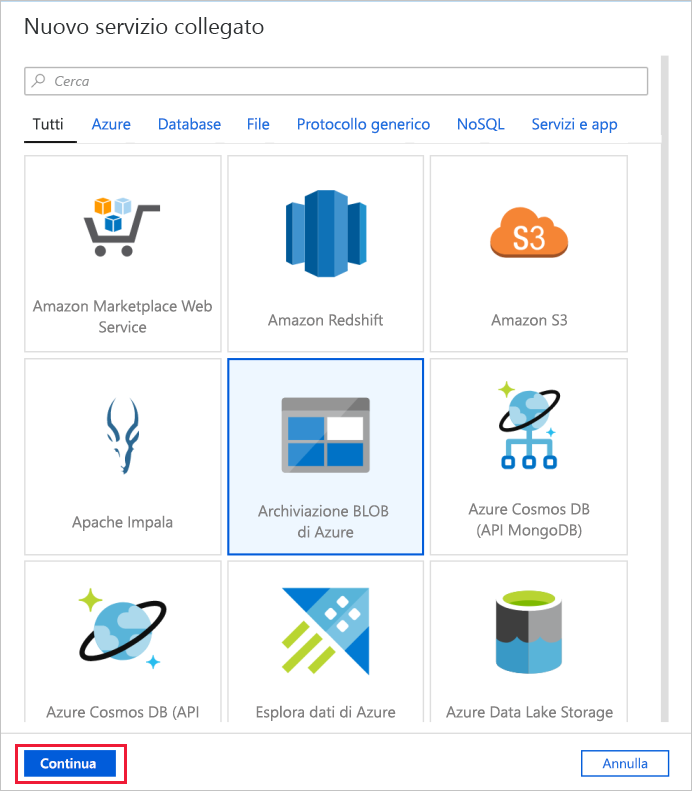
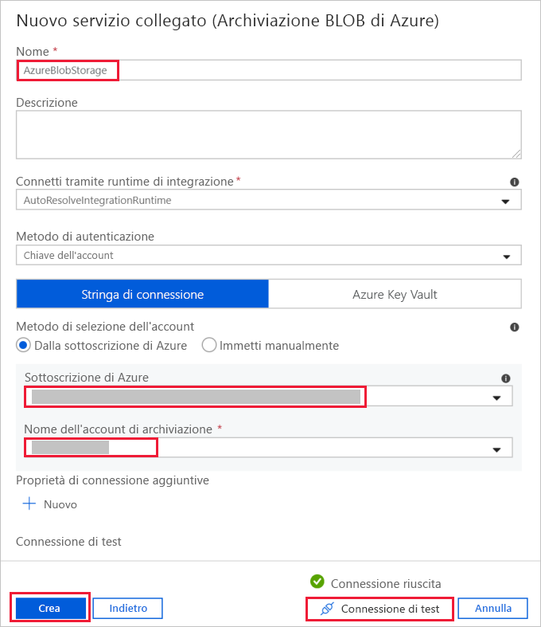
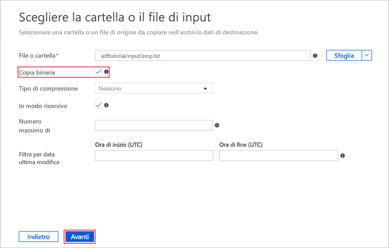
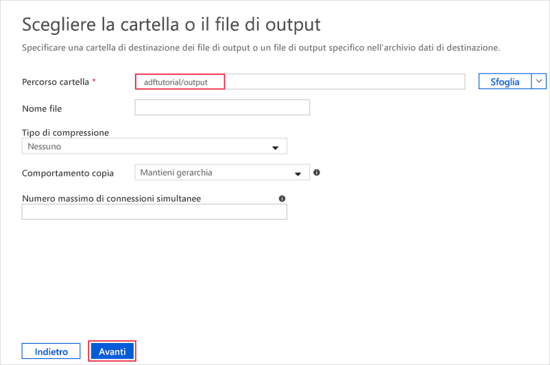

# Guida introduttiva: Usare lo strumento Copia dati per copiare i dati

> [!div class="op_single_selector" title1="Select the version of Data Factory service that you are using:"]
> * [Versione 1](v1/data-factory-copy-data-from-azure-blob-storage-to-sql-database.md)
> * [Versione corrente](quickstart-create-data-factory-copy-data-tool.md)

In questa guida introduttiva si userà il portale di Azure per creare una data factory. Viene quindi usato lo strumento Copia dati per creare una pipeline che copia i dati da una cartella dell'archivio BLOB di Azure a un'altra cartella. 

> [!NOTE]
> Se non si ha familiarità con Azure Data Factory, vedere [Introduzione ad Azure Data Factory](data-factory-introduction.md) prima di seguire la guida introduttiva. 

[!INCLUDE [data-factory-quickstart-prerequisites](../../includes/data-factory-quickstart-prerequisites.md)] 

## Creare una data factory

1. Scegliere **Nuovo** dal menu a sinistra, selezionare **Dati e analisi** e quindi selezionare **Data Factory**. 
   
   
1. Nella pagina **Nuova data factory** immettere **ADFTutorialDataFactory** per **Nome**. 
      
   
 
   Il nome della data factory di Azure deve essere *univoco a livello globale*. Se viene visualizzato l'errore seguente, modificare il nome della data factory, ad esempio, **&lt;nomeutente&gt;ADFTutorialDataFactory**, e provare di nuovo a crearla. Per le regole di denominazione per gli elementi di Data Factory, vedere l'articolo [Data Factory - Regole di denominazione](naming-rules.md).
  
   
1. Per **Sottoscrizione** selezionare la sottoscrizione di Azure in cui creare la data factory. 
1. In **Gruppo di risorse** eseguire una di queste operazioni:
     
   - Selezionare **Usa esistente**e scegliere un gruppo di risorse esistente dall'elenco. 
   - Selezionare **Crea nuovo**e immettere un nome per il gruppo di risorse.   
         
   Per informazioni sui gruppi di risorse, vedere l'articolo relativo all'[uso di gruppi di risorse per la gestione delle risorse di Azure](../azure-resource-manager/resource-group-overview.md).  
1. Per **Versione** selezionare **V2**.
1. Per **Località** selezionare la località per la data factory. 

   L'elenco mostra solo le località supportate da Data Factory e in cui verranno archiviati i metadati di Azure Data Factory. Si noti che gli archivi dati associati (ad esempio, Archiviazione di Azure e il database SQL di Azure) e le risorse di calcolo (ad esempio, Azure HDInsight) usati da Data Factory possono essere eseguiti in altre aree.

1. Selezionare **Create**.
1. Al termine della creazione verrà visualizzata la pagina **Data factory**. Selezionare il riquadro **Crea e monitora** per avviare l'applicazione dell'interfaccia utente di Azure Data Factory in una scheda separata.
   
   

## Avviare lo strumento Copia dati

1. Nella pagina **Attività iniziali** selezionare il riquadro **Copia dati** per avviare lo strumento Copia dati. 

   

1. Nella pagina **Proprietà** dello strumento Copia dati è possibile specificare un nome per la pipeline e la relativa descrizione, quindi selezionare **Avanti**. 

   
1. Nella pagina **Archivio dati di origine** completare la procedura seguente:

    a. Fare clic su **+ Crea nuova connessione** per aggiungere una connessione.

    

    b. Selezionare **Archiviazione BLOB di Azure** dalla raccolta e quindi selezionare **Avanti**.

    

    c. Nella pagina **Specify the Azure Blob storage account** (Specificare l'account di archiviazione BLOB di Azure) selezionare l'account di archiviazione nell'elenco **Nome account di archiviazione** e quindi selezionare **Fine**. 

   

   d. Selezionare il servizio collegato appena creato come origine, quindi fare clic su **Avanti**.

   

1. Nella pagina **Choose the input file or folder** (Scegliere il file o la cartella di input) completare questa procedura:

   a. Fare clic su **Sfoglia** per passare alla cartella **adftutorial/input**, selezionare il file **emp.txt**, quindi fare clic su **Scegli**. 

   

   d. Selezionare l'opzione **Binary copy** (Copia binaria) per copiare il file così com'è, quindi selezionare **Avanti**. 

   

1. Nella pagina **Destination data store** (Archivio dati di destinazione) selezionare il servizio collegato **Archiviazione BLOB di Azure** appena creato e quindi selezionare **Avanti**. 

   

1. Nella pagina **Choose the output file or folder** (Scegliere il file o la cartella di output) immettere **adftutorial/output** come percorso della cartella, quindi selezionare **Avanti**. 

    

1. Nella pagina **Impostazioni** selezionare **Avanti** per usare le configurazioni predefinite. 

1. Nella pagina **Riepilogo** verificare tutte le impostazioni e selezionare **Avanti**. 

    

1. Nella pagina **Distribuzione completata** selezionare **Monitoraggio** per monitorare la pipeline creata. 

    

1. L'applicazione passa alla scheda **Monitoraggio**. In questa scheda viene visualizzato lo stato della pipeline. Selezionare **Aggiorna** per aggiornare l'elenco. 
    
    

1. Selezionare il collegamento **View Activity Runs** (Visualizza le esecuzioni di attività) nella colonna **Azioni**. La pipeline ha solo un'attività di tipo **Copia**. 

    
    
1. Per visualizzare informazioni dettagliate sull'operazione di copia, selezionare il collegamento **Dettagli** (immagine degli occhiali) nella colonna **Azioni**. Per informazioni dettagliate sulle proprietà, vedere [Panoramica dell'attività Copia](copy-activity-overview.md).

    

1. Verificare che il file **emp.txt** sia stato creato nella cartella **output** del contenitore **adftutorial**. Se la cartella output non esiste, il servizio Data Factory la crea automaticamente. 

1. Passare alla scheda **Autore** sopra la scheda **Monitoraggio** nel pannello sinistro, per poter modificare i servizi collegati, i set di dati e le pipeline. Per informazioni sulla modifica di questi elementi nell'interfaccia utente di Data Factory, vedere [Creare una data factory con il portale di Azure](quickstart-create-data-factory-portal.md).

## Passaggi successivi
La pipeline in questo esempio copia i dati da una posizione a un'altra nell'archivio BLOB di Azure. Per informazioni sull'uso di Data Factory in più scenari, vedere le [esercitazioni](tutorial-copy-data-portal.md). 