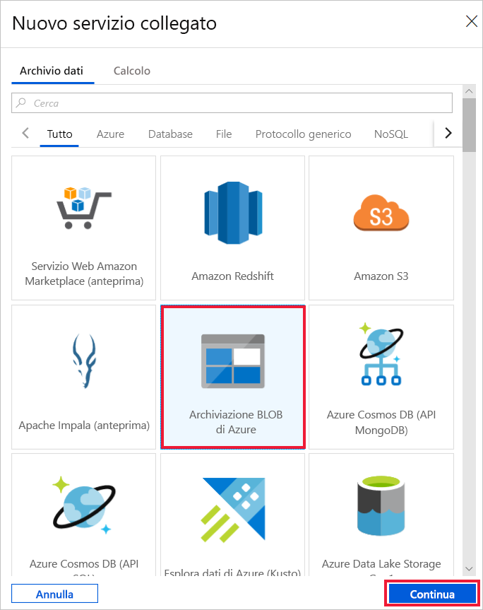
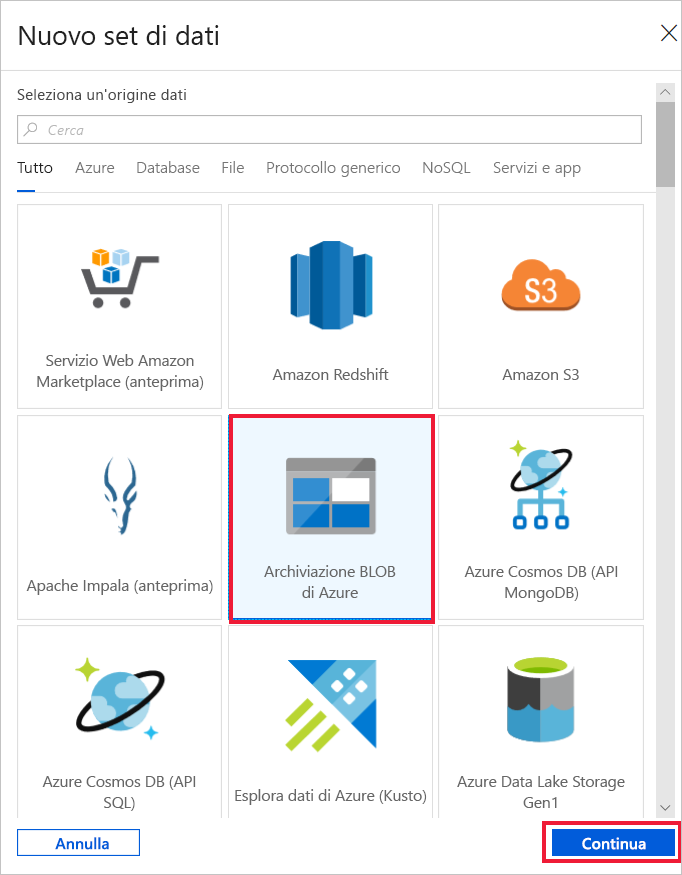

# Creare una data factory usando l'interfaccia utente di Azure Data Factory
> [!div class="op_single_selector" title1="Seleziona la versione del servizio Data Factory che stai utilizzando:"]
> * [Versione 1](v1/data-factory-copy-data-from-azure-blob-storage-to-sql-database.md)
> * [Versione corrente](quickstart-create-data-factory-portal.md)

La guida introduttiva descrive come usare l'interfaccia utente di Azure Data Factory per creare e monitorare una data factory. La pipeline creata in questa data factory *copia* dati da una cartella a un'altra nell'archivio BLOB di Azure. Per un'esercitazione su come *trasformare* i dati usando Azure Data Factory, vedere [Esercitazione: Trasformare dati usando Spark](tutorial-transform-data-spark-portal.md).

> [!NOTE]
> Se non si ha familiarità con Azure Data Factory, vedere [Introduzione ad Azure Data Factory](data-factory-introduction.md) prima di seguire la guida introduttiva. 

[!INCLUDE [data-factory-quickstart-prerequisites](../../includes/data-factory-quickstart-prerequisites.md)] 

### Video 
Questo video contiene informazioni utili sull'interfaccia utente di Data Factory: 
>[!VIDEO https://channel9.msdn.com/Shows/Azure-Friday/Visually-build-pipelines-for-Azure-Data-Factory-v2/Player]

## Creare una data factory

1. Avviare il Web browser **Microsoft Edge** o **Google Chrome**. L'interfaccia utente di Data Factory è attualmente supportata solo nei Web browser Microsoft Edge e Google Chrome.
1. Accedere al [portale di Azure](https://portal.azure.com). 
1. Selezionare **Crea una risorsa** dal menu a sinistra, selezionare **Analytics** e quindi selezionare **Data Factory**. 
   
   
1. Nella pagina **Nuova data factory** immettere **ADFTutorialDataFactory** per **Nome**. 
      
   
 
   Il nome della data factory di Azure deve essere *univoco a livello globale*. Se viene visualizzato l'errore seguente, modificare il nome della data factory, ad esempio, **&lt;nomeutente&gt;ADFTutorialDataFactory**, e provare di nuovo a crearla. Per le regole di denominazione per gli elementi di Data Factory, vedere l'articolo [Data Factory - Regole di denominazione](naming-rules.md).
  
   
1. Per **Sottoscrizione** selezionare la sottoscrizione di Azure in cui creare la data factory. 
1. In **Gruppo di risorse** eseguire una di queste operazioni:
     
   - Selezionare **Usa esistente**e scegliere un gruppo di risorse esistente dall'elenco. 
   - Selezionare **Crea nuovo**e immettere un nome per il gruppo di risorse.   
         
   Per informazioni sui gruppi di risorse, vedere l'articolo relativo all'[uso di gruppi di risorse per la gestione delle risorse di Azure](../azure-resource-manager/resource-group-overview.md).  
1. Per **Versione** selezionare **V2**.
1. Per **Località** selezionare la località per la data factory.

   L'elenco mostra solo le località supportate da Data Factory e in cui verranno archiviati i metadati di Azure Data Factory. Si noti che gli archivi dati associati (ad esempio, Archiviazione di Azure e il database SQL di Azure) e le risorse di calcolo (ad esempio, Azure HDInsight) usati da Data Factory possono essere eseguiti in altre aree.

1. Selezionare **Create**.

1. Al termine della creazione verrà visualizzata la pagina **Data factory**. Selezionare il riquadro **Crea e monitora** per avviare l'applicazione dell'interfaccia utente di Azure Data Factory in una scheda separata.
   
   
1. Nella pagina **Attività iniziali** passare alla scheda **Autore** nel pannello sinistro. 

    

## Creare un servizio collegato
In questa procedura viene creato un servizio collegato per collegare l'account di archiviazione di Azure alla data factory. Il servizio collegato ha le informazioni di connessione usate dal servizio Data Factory in fase di esecuzione per la connessione.

1. Selezionare **Connessioni** e quindi il pulsante **Nuovo** sulla barra degli strumenti. 

       
1. Nella pagina **New Linked Service** (Nuovo servizio collegato) selezionare **Archiviazione BLOB di Azure** e quindi **Continua**. 

   
1. Completare questi passaggi: 

   a. Per **Nome** immettere **AzureStorageLinkedService**.

   b. Per **Nome account di archiviazione** selezionare il nome dell'account di archiviazione di Azure.

   c. Selezionare **Connessione di test** per confermare che il servizio Data Factory possa connettersi all'account di archiviazione. 

   d. Selezionare **Fine** per salvare il servizio collegato. 

    

## Creare set di dati
In questa procedura vengono creati due set di dati, **InputDataset** e **OutputDataset**. I set di dati sono di tipo **AzureBlob**. Fanno riferimento al servizio collegato Archiviazione di Azure creato nella sezione precedente. 

Il set di dati di input rappresenta i dati di origini nella cartella di input. Nella definizione del set di dati di input specificare il contenitore BLOB (**adftutorial**), la cartella (**input**) e il file (**emp.txt**) che includono i dati di origine. 

Il set di dati di output rappresenta i dati copiati nella destinazione. Nella definizione del set di dati di output specificare il contenitore BLOB (**adftutorial**), la cartella (**output**) e il file in cui vengono copiati i dati. A ogni esecuzione di una pipeline è associato un ID univoco. È possibile accedere a questo ID usando la variabile di sistema **RunId**. Il nome del file di output viene valutato dinamicamente in base all'ID dell'esecuzione della pipeline.   

Nelle impostazioni del servizio collegato è stato specificato l'account di archiviazione di Azure che contiene i dati di origine. Nelle impostazioni del set di dati di origine specificare la posizione esatta in cui si trovano i dati, ovvero contenitore BLOB, cartella e file. Nelle impostazioni del set di dati di sink specificare la posizione in cui vengono copiati i dati, ovvero contenitore BLOB, cartella e file. 
 
1. Selezionare il pulsante **+** (segno più) e quindi selezionare **Set di dati**.

   
1. Nella pagina **Nuovo set di dati** selezionare **Archiviazione BLOB di Azure** e quindi selezionare **Fine**. 

   
1. Nella scheda **Generale** per il set di dati immettere **InputDataset** per **Nome**. 

1. Passare alla scheda **Connessione** e completare questa procedura: 

    a. Per **Servizio collegato** selezionare **AzureStorageLinkedService**.

    b. Per **Percorso file** selezionare il pulsante **Sfoglia**.

     c. Nella finestra **Choose a file or folder** (Scegliere un file o una cartella) passare alla cartella di **input** nel contenitore **adftutorial**, selezionare il file **emp.txt** e quindi selezionare **Fine**.

    
    
   d. (Facoltativo) Selezionare **Anteprima dati** per visualizzare l'anteprima dei dati nel file emp.txt.     
1. Ripetere la procedura per creare il set di dati di output:  

   a. Selezionare il pulsante **+** (segno più) e quindi selezionare **Set di dati**.

   b. Nella pagina **Nuovo set di dati** selezionare **Archiviazione BLOB di Azure** e quindi selezionare **Fine**.

   c. Nella tabella **Generale** specificare **OutputDataset** per il nome.

   d. Nella scheda **Connessione** selezionare **AzureStorageLinkedService** come servizio collegato, quindi immettere **adftutorial/output** per la cartella nel campo della directory. Se la cartella **output** non esiste, l'attività di copia la crea in fase di esecuzione.

## Creare una pipeline 
In questa procedura viene creata e convalidata una pipeline con un'attività di copia che usa i set di dati di input e di output. Con l'attività di copia i dati vengono copiati dal file specificato nelle impostazioni del set di dati di input al file specificato nelle impostazioni del set di dati di output. Se il set di dati di input specifica solo una cartella, non il nome file, con l'attività di copia tutti i file della cartella di origine vengono copiati nella destinazione. 

1. Selezionare il pulsante **+** (segno più) e quindi selezionare **Pipeline**. 

   
1. Nella scheda **Generale** specificare **CopyPipeline** per **Nome**. 

1. Nella casella degli strumenti **Attività** espandere **Move & Transform** (Sposta e trasforma). Trascinare l'attività **Copia** dalla casella degli strumenti **Attività** all'area di progettazione della pipeline. È anche possibile eseguire una ricerca di attività nella casella degli strumenti **Attività**. Specificare **CopyFromBlobToBlob** per **Nome**.

   
1. Passare alla scheda **Origine** nelle impostazioni dell'attività Copia e selezionare **InputDataset** per **Source Dataset** (Set di dati di origine).

1. Passare alla scheda **Sink** nelle impostazioni dell'attività Copia e selezionare **OutputDataset** per **Sink Dataset** (Set di dati sink).

1. Fare clic su **Convalida** sulla barra degli strumenti della pipeline sopra l'area di disegno per convalidare le impostazioni della pipeline. Assicurarsi che la pipeline sia stata convalidata correttamente. Per chiudere l'output della convalida, selezionare il pulsante **>>** (freccia destra). 

## Eseguire il debug della pipeline
In questo passaggio viene eseguito il debug della pipeline prima della distribuzione in Data Factory. 

1. Nella barra degli strumenti della pipeline sopra l'area di disegno fare clic su **Debug** per attivare un'esecuzione dei test. 
    
1. Assicurarsi che sia visualizzato lo stato dell'esecuzione della pipeline nella scheda **Output** delle impostazioni della pipeline nella parte inferiore. 

1. Assicurarsi che venga visualizzato un file di output nella cartella **output** del contenitore **adftutorial**. Se la cartella output non esiste, il servizio Data Factory la crea automaticamente. 

## Attivare manualmente la pipeline
In questa procedura vengono distribuite entità (servizi collegati, set di dati, pipeline) in Azure Data Factory. Viene quindi attivata manualmente un'esecuzione della pipeline. 

1. Prima di attivare una pipeline, è necessario pubblicare entità in Data Factory. Per pubblicare, selezionare **Pubblica tutti** nella parte superiore. 

   
1. Per attivare manualmente la pipeline, selezionare **Trigger** sulla barra degli strumenti della pipeline e quindi selezionare **Trigger Now** (Attiva adesso). 

## Monitorare la pipeline

1. Passare alla scheda **Monitoraggio** a sinistra. Usare il pulsante **Aggiorna** per aggiornare l'elenco.

   
1. Selezionare il collegamento **View Activity Runs** (Visualizza le esecuzioni di attività) in **Azioni**. In questa pagina viene visualizzato lo stato dell'esecuzione dell'attività Copia. 

   
1. Per visualizzare informazioni dettagliate sull'operazione di copia, selezionare il collegamento **Dettagli** (immagine degli occhiali) nella colonna **Azioni**. Per informazioni dettagliate sulle proprietà, vedere [Panoramica dell'attività Copia](copy-activity-overview.md). 

   
1. Assicurarsi che un nuovo file sia visualizzato nella cartella **output**. 
1. È possibile tornare alla visualizzazione **Pipeline Runs** (Esecuzioni di pipeline) dalla visualizzazione **Esecuzioni attività** selezionando il collegamento **Pipeline**. 

## Attivare la pipeline in base a una pianificazione
La procedura è facoltativa in questa esercitazione. È possibile creare un *trigger di pianificazione* per pianificare l'esecuzione periodica (ogni ora, ogni giorno e così via) della pipeline. In questa procedura viene creato un trigger per l'esecuzione ogni minuto fino alla data e ora di fine specificate. 

1. Passare alla scheda **Autore**. 

1. Passare alla pipeline, selezionare **Trigger** sulla barra degli strumenti della pipeline e quindi selezionare **New/Edit** (Nuovo/Modifica). 

1. Nella pagina **Add Triggers** (Aggiungi trigger) selezionare **Choose trigger** (Scegli trigger) e quindi selezionare **Nuovo**. 

1. Nella pagina **Nuovo trigger** in **Fine** selezionare **On Date** (In data), specificare un'ora di fine successiva di qualche minuto all'ora corrente e quindi selezionare **Applica**. 

   Per ogni esecuzione della pipeline sono previsti costi, quindi specificare un'ora di fine successiva di qualche minuto all'ora di inizio. Assicurarsi che si tratti dello stesso giorno. Assicurarsi tuttavia che il tempo specificato tra l'ora di pubblicazione e l'ora di fine sia sufficiente per l'esecuzione della pipeline. Il trigger viene applicato solo dopo la pubblicazione della soluzione in Data Factory, non quando si salva il trigger nell'interfaccia utente. 

   
1. Nella pagina **Nuovo trigger** selezionare la casella di controllo **Attivato** e quindi selezionare **Avanti**. 

   
1. Rivedere il messaggio di avviso e selezionare **Fine**.

   
1. Selezionare **Pubblica tutti** per pubblicare le modifiche in Data Factory. 

1. Passare alla scheda **Monitoraggio** a sinistra. Selezionare **Aggiorna** per aggiornare l'elenco. La pipeline viene eseguita una volta al minuto a partire dall'ora di pubblicazione fino all'ora di fine. 

   Notare i valori della colonna **Attivato da**. L'esecuzione manuale del trigger è stata generata dal passaggio precedente, ovvero **Trigger Now** (Attiva adesso). 

   
1. Passare alla visualizzazione **Trigger Runs** (Esecuzioni del trigger). 

       
1. Assicurarsi che venga creato un file di output per ogni esecuzione della pipeline fino alla data e ora di fine specificate nella cartella **output**. 

## Passaggi successivi
La pipeline in questo esempio copia i dati da una posizione a un'altra nell'archivio BLOB di Azure. Per informazioni sull'uso di Data Factory in più scenari, vedere le [esercitazioni](tutorial-copy-data-portal.md). 
