# Creare una data factory tramite l'interfaccia utente di Azure Data Factory
> [!div class="op_single_selector" title1="Select the version of Data Factory service you are using:"]
> * [Versione 1 - Disponibilità generale](v1/data-factory-copy-data-from-azure-blob-storage-to-sql-database.md)
> * [Versione 2 - Anteprima](quickstart-create-data-factory-portal.md)

La guida introduttiva descrive come usare l'interfaccia utente di Azure Data Factory per creare e monitorare una data factory. La pipeline creata in questa data factory **copia** dati da una cartella a un'altra in un archivio BLOB di Azure. Per un'esercitazione su come **trasformare** i dati usando Azure Data Factory, vedere [Esercitazione: Trasformare dati usando Spark](tutorial-transform-data-spark-portal.md). 

> [!NOTE]
> Se non si ha familiarità con Azure Data Factory, vedere [Introduzione ad Azure Data Factory](data-factory-introduction.md) prima di seguire la guida introduttiva. 
>
> Questo articolo si applica alla versione 2 del servizio Data Factory, attualmente in versione di anteprima. Se si usa la versione 1 di Data Factory, disponibile a livello generale, vedere [Data Factory versione 1 - Esercitazione](v1/data-factory-copy-data-from-azure-blob-storage-to-sql-database.md).

[!INCLUDE [data-factory-quickstart-prerequisites](../../includes/data-factory-quickstart-prerequisites.md)] 

### Video 
Questo video contiene informazioni utili sull'interfaccia utente di Data Factory: 
>[!VIDEO https://channel9.msdn.com/Shows/Azure-Friday/Visually-build-pipelines-for-Azure-Data-Factory-v2/Player]

## Creare un'istanza di Data factory

1. Passare al [portale di Azure](https://portal.azure.com). 
2. Scegliere **Nuovo** dal menu a sinistra, fare clic su **Dati e analisi** e quindi fare clic su **Data factory**. 
   
   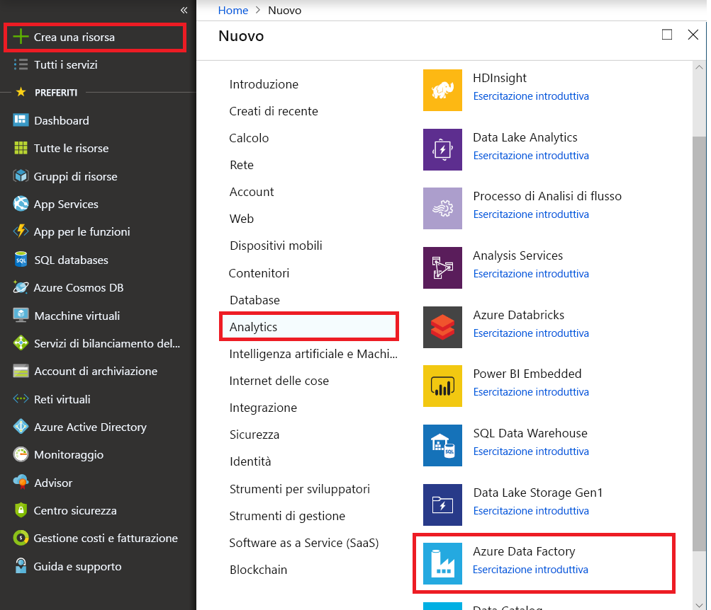
2. Nella pagina **Nuova data factory** immettere **ADFTutorialDataFactory** per **Nome**. 
      
     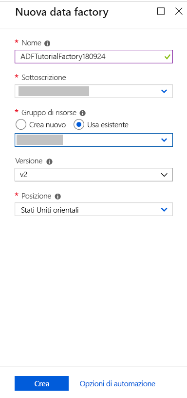
 
   Il nome della data factory di Azure deve essere **univoco a livello globale**. Se viene visualizzato l'errore seguente per il campo Nome, modificare il nome della data factory, ad esempio nomeutenteADFTutorialDataFactory. Per informazioni sulle regole di denominazione per gli elementi di Data factory, vedere l'articolo [Data Factory - Regole di denominazione](naming-rules.md).
  
     
3. Selezionare la **sottoscrizione** di Azure in cui creare la data factory. 
4. Per il **gruppo di risorse**, eseguire una di queste operazioni:
     
      - Selezionare **Usa esistente**e scegliere un gruppo di risorse esistente dall'elenco a discesa. 
      - Selezionare **Crea nuovo**e immettere un nome per il gruppo di risorse.   
         
    Per informazioni sui gruppi di risorse, vedere l'articolo relativo all' [uso di gruppi di risorse per la gestione delle risorse di Azure](../azure-resource-manager/resource-group-overview.md).  
4. Selezionare **V2 (anteprima)** per **Versione**.
5. Selezionare la **località** per la data factory. Nell'elenco a discesa vengono mostrate solo le località supportate da Data Factory. Gli archivi dati (Archiviazione di Azure, database SQL di Azure e così via) e le risorse di calcolo (HDInsight e così via) usati dalla data factory possono trovarsi in altre località.
6. Selezionare **Aggiungi al dashboard**.     
7. Fare clic su **Crea**.
8. Nel dashboard viene visualizzato il riquadro seguente con lo stato: **Deploying data factory** (Distribuzione della data factory). 

    
9. Al termine della creazione verrà visualizzata la pagina **Data Factory**, come illustrato nell'immagine.
   
    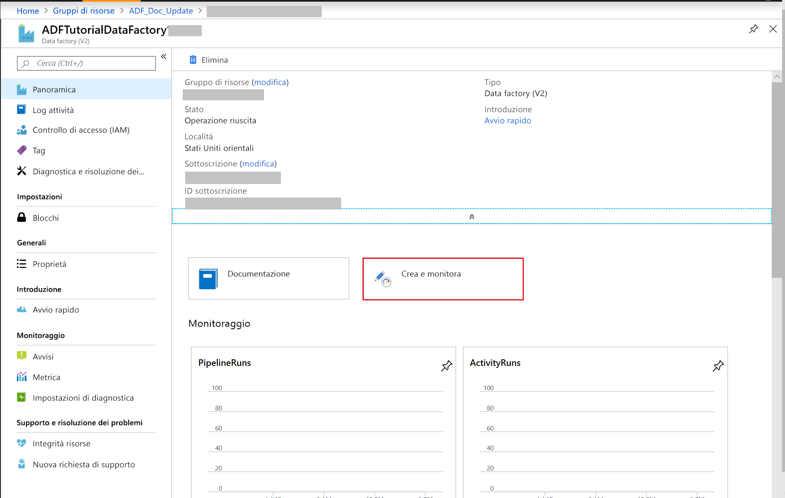
10. Fare clic sul riquadro **Crea e monitora** per avviare l'applicazione dell'interfaccia utente di Azure Data Factory in una scheda separata. 
11. Nella pagina Introduzione passare alla scheda **Modifica** nel riquadro a sinistra, come mostrato nell'immagine seguente: 

    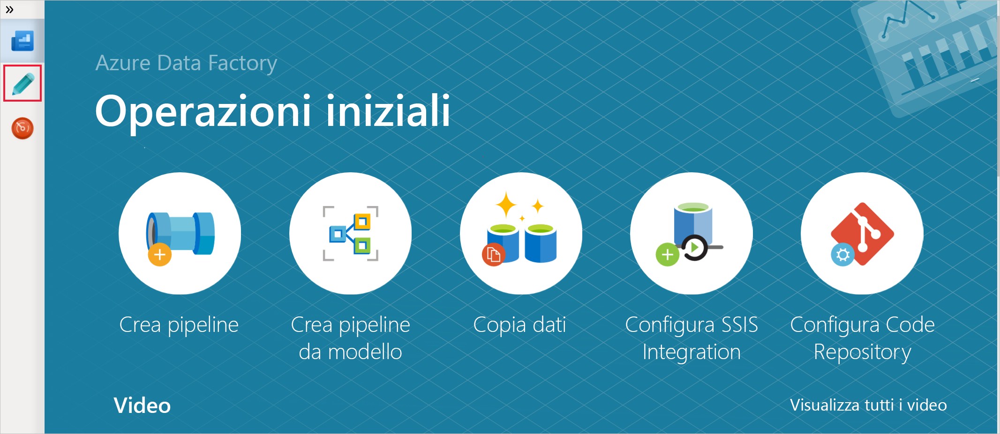

## Creare il servizio collegato Archiviazione di Azure
In questo passaggio viene creato un servizio collegato per collegare l'account di archiviazione di Azure Storage alla data factory. Il servizio collegato ha le informazioni di connessione usate dal servizio Data Factory in fase di esecuzione per la connessione.

2. Fare clic su **Connessioni** e quindi sul pulsante **Nuovo** sulla barra degli strumenti. 

        
3. Nella pagina **New Linked Service** (Nuovo servizio collegato) selezionare **Archiviazione BLOB di Azure** e fare clic su **Continua**. 

    
4. Nella pagina **New Linked Service** (Nuovo servizio collegato) seguire questa procedura: 

    1. Immettere **AzureStorageLinkedService** per **Nome**.
    2. Selezionare il nome dell'account di archiviazione di Azure per il **Nome account di archiviazione**.
    3. Fare clic su **Connessione di test** per confermare che il servizio Data Factory possa connettersi all'account di archiviazione. 
    4. Fare clic su **Salva** per salvare il servizio collegato. 

         
5. Assicurarsi che **AzureStorageLinkedService** sia visualizzato nell'elenco di servizi collegati. 

    

## Creare set di dati
In questo passaggio vengono creati due set di dati, **InputDataset** e **OutputDataset**. I set di dati sono di tipo **AzureBlob**. Fanno riferimento al **servizio collegato Archiviazione di Azure** creato nel passaggio precedente. 

Il set di dati di input rappresenta i dati di origini nella cartella di input. Nella definizione del set di dati di input specificare il contenitore BLOB (**adftutorial**), la cartella (**input**) e il file (**emp.txt**) che include i dati di origine. 

Il set di dati di output rappresenta i dati copiati nella destinazione. Nella definizione del set di dati di output specificare il contenitore BLOB (**adftutorial**), la cartella (**output**) e il file in cui vengono copiati i dati. A ogni esecuzione di una pipeline è associato un ID univoco, a cui è possibile accedere tramite la variabile di sistema **RunId**. Il nome del file di output viene valutato dinamicamente in base all'ID dell'esecuzione della pipeline.   

Nelle impostazioni del servizio collegato è stato specificato l'account di archiviazione di Azure che contiene i dati di origine. Nelle impostazioni del set di dati di origine specificare la posizione esatta in cui si trovano i dati, ovvero contenitore BLOB, cartella e file. Nelle impostazioni del set di dati di sink specificare la posizione in cui vengono copiati i dati, ovvero contenitore BLOB, cartella e file. 
 
1. Fare clic sul pulsante **+ (segno più)** e selezionare **Set di dati**.

    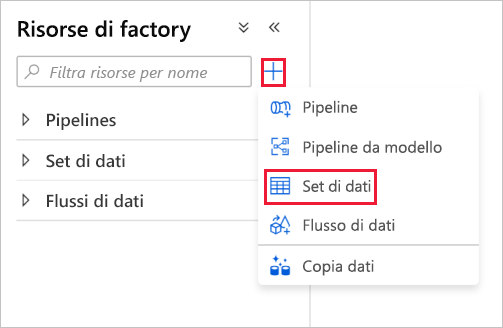
2. Nella pagina **Nuovo set di dati** selezionare **Archiviazione BLOB di Azure** e fare clic su **Fine**. 

    
3. Nella finestra **Proprietà** per il set di dati immettere **InputDataset** per **Nome**. 

    
4. Passare alla scheda **Connessione** e seguire questa procedura: 

    1. Selezionare **AzureStorageLinkedService** per il servizio collegato. 
    2. Fare clic su **Sfoglia** per **Percorso file**. 
        
    3. Nella finestra **Choose a file or folder** (Scegliere un file o una cartella) passare alla cartella di **input** nel contenitore **adftutorial**, selezionare il file **emp.txt** e fare clic su **Fine**.

        
    4. (Facoltativo) Fare clic su **Anteprima dati** per visualizzare l'anteprima dei dati nel file emp.txt.     
5. Ripetere la procedura per creare il set di dati di output.  

    1. Fare clic sul pulsante **+ (segno più)** nel riquadro a sinistra e selezionare **Set di dati**.
    2. Nella pagina **Nuovo set di dati** selezionare **Archiviazione BLOB di Azure** e fare clic su **Fine**.
    3. Specificare **OutputDataset** per il nome.
    4. Immettere **adftutorial/output** per la cartella. L'attività Copia crea la cartella di output, se non esiste già. 
    5. Immettere `@CONCAT(pipeline().RunId, '.txt')` per il nome del file. Ogni volta che si esegue una pipeline, l'esecuzione della pipeline è associata a un ID univoco. L'espressione concatena l'ID di esecuzione della pipeline con l'estensione **.txt** per valutare il nome del file di output. Per l'elenco delle variabili di sistema e delle espressioni supportate, vedere [Variabili di sistema](control-flow-system-variables.md) e [Linguaggio delle espressioni](control-flow-expression-language-functions.md).

        

## Creare una pipeline 
In questo passaggio viene creata e convalidata una pipeline con un'attività **Copia** che usa i set di dati di input e di output. L'attività Copia copia i dati dal file specificato nelle impostazioni del set di dati di input nel file specificato nelle impostazioni del set di dati di output. Se il set di dati di input specifica solo una cartella, non il nome file, l'attività Copia copia tutti i file della cartella di origine nella destinazione. 

1. Fare clic sul pulsante **+ (segno più)** e selezionare **Pipeline**. 

    
2. Specificare **CopyPipeline** per **Nome** nella finestra **Proprietà**. 

    
3. Nella casella degli strumenti **Attività** espandere **Flusso di dati** e trascinare l'attività **Copia** dalla casella degli strumenti **Attività** nell'area di progettazione della pipeline. È anche possibile eseguire una ricerca di attività nella casella degli strumenti **Attività**. Specificare **CopyFromBlobToBlob** per **nome**.

    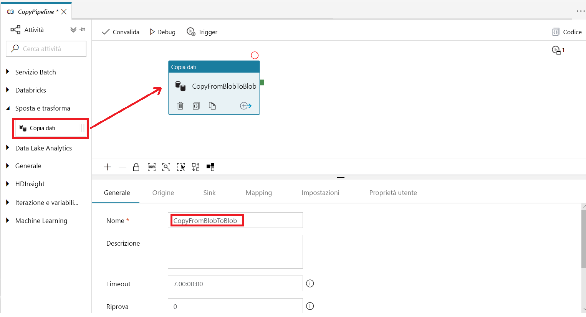
4. Passare alla scheda **Origine** nelle impostazioni dell'attività Copia e selezionare **InputDataset** per il **source dataset** (Set di dati di origine).

        
5. Passare alla scheda **Sink** nelle impostazioni dell'attività Copia e selezionare **OutputDataset** per il **sink dataset** (Set di dati sink).

        
7. Fare clic su **Convalida** per convalidare le impostazioni della pipeline. Assicurarsi che la pipeline sia stata convalidata correttamente. Per chiudere l'output della convalida, fare clic sul pulsante **freccia DESTRA** (>>). 

    

## Eseguire test della pipeline
In questo passaggio vengono eseguiti test della pipeline prima della distribuzione in Data Factory. 

1. Sulla barra degli strumenti per la pipeline fare clic su **Esecuzione dei test**. 
    
    
2. Assicurarsi che sia visualizzato lo stato dell'esecuzione della pipeline nella scheda **Output** delle impostazioni della pipeline. 

        
3. Assicurarsi che venga visualizzato un file di output nella cartella **output** del contenitore **adftutorial**. Se la cartella output non esiste, il servizio Data Factory la crea automaticamente. 
    
    

## Attivare manualmente la pipeline
In questo passaggio vengono distribuite entità (servizi collegati, set di dati, pipeline) in Azure Data Factory. Viene quindi attivata manualmente un'esecuzione della pipeline. È anche possibile pubblicare entità nel proprio repository Git per Visual Studio Team Services. Questa procedura è illustrata in un'[altra esercitazione](tutorial-copy-data-portal.md?#configure-code-repository).

1. Prima di attivare una pipeline, è necessario pubblicare entità in Data Factory. Per pubblicare, fare clic su **Pubblica** nel riquadro a sinistra. 

    
2. Per attivare manualmente la pipeline, fare clic su **Trigger** sulla barra degli strumenti e selezionare **Trigger Now** (Attiva adesso). 
    
    

## Monitorare la pipeline

1. Passare alla scheda **Monitoraggio** a sinistra. Usare il pulsante **Aggiorna** per aggiornare l'elenco.

    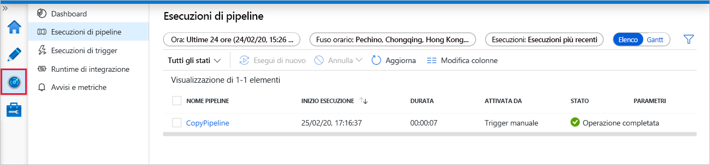
2. Fare clic sul collegamento **View Activity Runs** in **Azioni** (Visualizza le esecuzioni di attività). In questa pagina viene visualizzato lo stato dell'esecuzione dell'attività Copia. 

    
3. Per visualizzare informazioni dettagliate sull'operazione di copia, fare clic sul collegamento **Dettagli** (immagine degli occhiali) nella colonna **Azioni**. Per informazioni dettagliate sulle proprietà, vedere [Panoramica dell'attività Copia](copy-activity-overview.md). 

    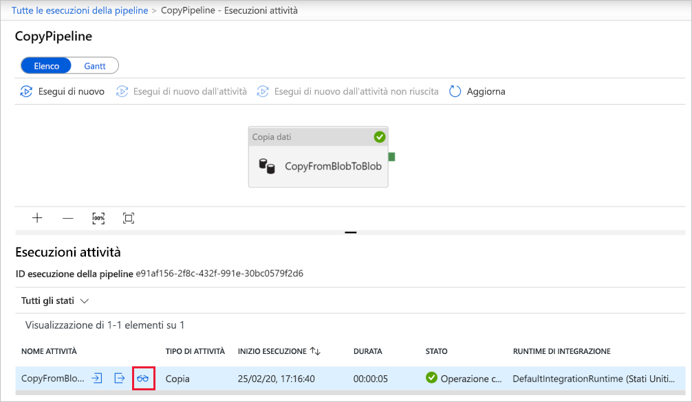
4. Assicurarsi che un nuovo file sia visualizzato nella cartella **output**. 
5. È possibile tornare alla visualizzazione **Pipeline Runs** (Esecuzioni di pipeline) dalla visualizzazione **Esecuzioni attività** facendo clic sul collegamento **Pipeline**. 

## Attivare la pipeline in base a una pianificazione
Il passaggio è facoltativo in questa esercitazione. È possibile creare un **trigger di pianificazione** per pianificare l'esecuzione periodica (ogni ora, ogni giorno e così via) della pipeline. In questo passaggio viene creato un trigger per l'esecuzione ogni minuto fino al valore di data e ora specificato come data di fine. 

1. Passare alla scheda **Modifica**. 

    
1. Scegliere **Trigger** dal menu e quindi fare clic su **Nuovo/Modifica**. 

    
2. Nella pagina **Add Triggers** (Aggiungi trigger) fare clic su **Choose trigger** (Scegli trigger) e quindi su **Nuovo**. 

    
3. Nella pagina **Nuovo trigger** per il campo **Fine** selezionare **On Date** (In data), specificare un'ora di fine successiva di qualche minuto all'ora attuale, quindi fare clic su **Applica**. Per ogni esecuzione della pipeline sono previsti costi, quindi specificare un'ora di fine successiva di qualche minuto all'ora di inizio. Assicurarsi che si tratti dello stesso giorno. Assicurarsi tuttavia che il tempo specificato tra l'ora di pubblicazione e l'ora di fine sia sufficiente per l'esecuzione della pipeline. Il trigger viene applicato solo dopo la pubblicazione della soluzione in Data Factory, non quando si salva il trigger nell'interfaccia utente. 

    
4. Selezionare l'opzione **Attivato** nella pagina **Nuovo trigger** e fare clic su **Avanti** 

    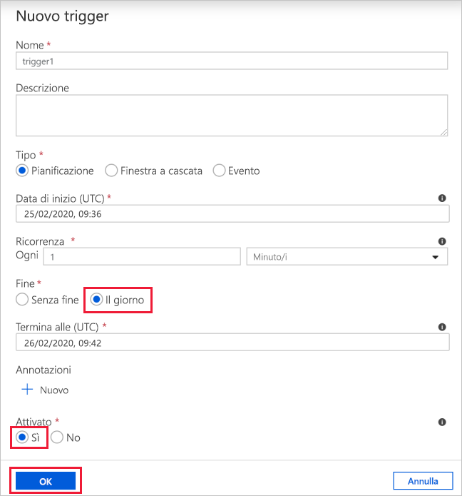
5. Nella pagina **Nuovo trigger** verificare il messaggio di avviso e quindi fare clic su **Fine**.

    
6. Fare clic su **Pubblica** per pubblicare le modifiche in Data Factory. 

    
8. Passare alla scheda **Monitoraggio** a sinistra. Fare clic su **Aggiorna** per aggiornare l'elenco. La pipeline viene eseguita una volta al minuto a partire dall'ora di pubblicazione fino all'ora di fine. Notare i valori della colonna **Attivato da**. L'esecuzione manuale del trigger è stata generata dal passaggio precedente, ovvero **Trigger Now** (Attiva adesso). 

    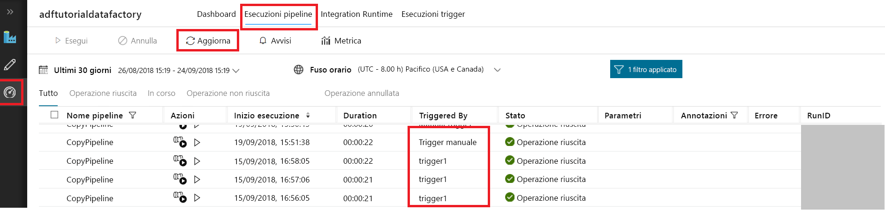
9. Fare clic sulla freccia GIÙ accanto a **Pipeline Runs** (Esecuzioni di pipeline) per passare alla visualizzazione **Trigger Runs** (Esecuzioni del trigger). 

    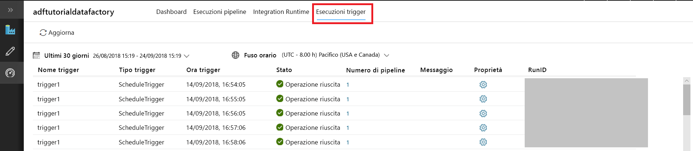    
10. Assicurarsi che venga creato un **file di output** per ogni esecuzione della pipeline fino alla data e ora di fine specificate nella cartella **output**. 

## Passaggi successivi
La pipeline in questo esempio copia i dati da una posizione a un'altra in un archivio BLOB di Azure. Per informazioni sull'uso di Data Factory in più scenari, fare riferimento alle [esercitazioni](tutorial-copy-data-portal.md). 