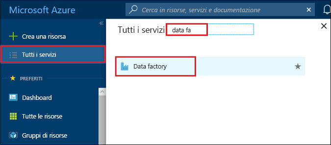
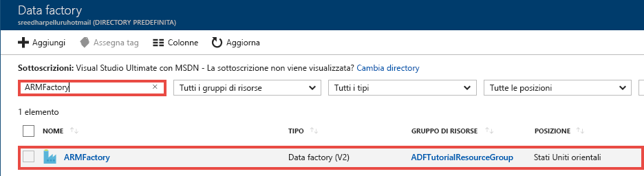
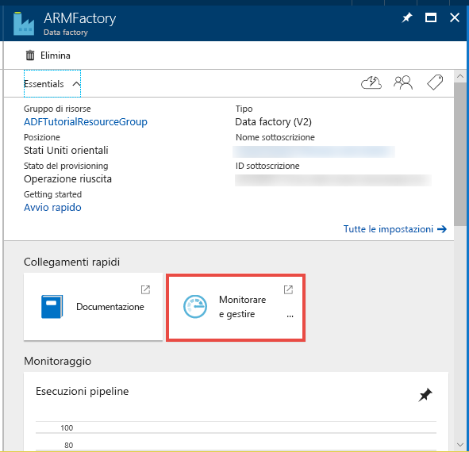
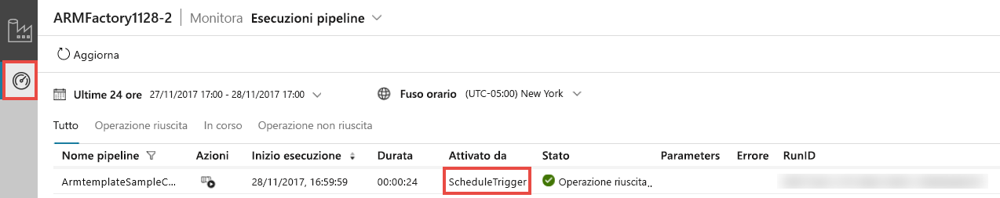
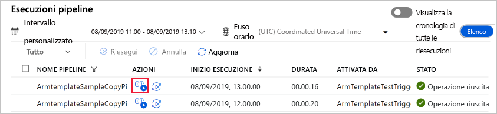
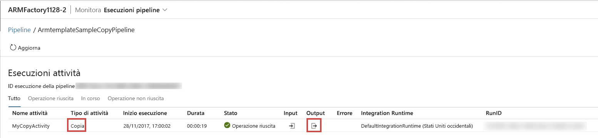

# <a name="tutorial-create-an-azure-data-factory-using-azure-resource-manager-template"></a>Esercitazione: Creare una data factory di Azure usando un modello di Azure Resource Manager
> [!div class="op_single_selector" title1="Select the version of Data Factory service you are using:"]
> * [Versione 1 - Disponibilità generale](v1/data-factory-build-your-first-pipeline-using-arm.md)
> * [Versione 2 - Anteprima](quickstart-create-data-factory-resource-manager-template.md) 

Questa guida introduttiva descrive come usare un modello di Azure Resource Manager per creare una data factory di Azure. La pipeline creata in questa data factory **copia** dati da una cartella a un'altra in un archivio BLOB di Azure. Per un'esercitazione su come **trasformare** i dati usando Azure Data Factory, vedere [Esercitazione: Trasformare dati usando Spark](transform-data-using-spark.md). 

> [!NOTE]
> Questo articolo si applica alla versione 2 del servizio Data Factory, attualmente in versione di anteprima. Se si usa la versione 1 del servizio Data Factory, disponibile a livello generale, vedere [Creare la prima data factory con Data Factory versione 1](v1/data-factory-build-your-first-pipeline-using-arm.md).
>
> Questo articolo non offre una presentazione dettagliata del servizio Data Factory. Per un'introduzione al servizio Azure Data Factory, vedere [Introduzione ad Azure Data Factory](introduction.md).

[!INCLUDE [data-factory-quickstart-prerequisites](../../includes/data-factory-quickstart-prerequisites.md)] 

[!INCLUDE [data-factory-quickstart-prerequisites-2](../../includes/data-factory-quickstart-prerequisites-2.md)]

## <a name="resource-manager-templates"></a>Modelli di Gestione risorse
Per informazioni generali sui modelli di Azure Resource Manager, vedere [Creazione di modelli di Azure Resource Manager](../azure-resource-manager/resource-group-authoring-templates.md). 

La sezione seguente contiene il modello di Resource Manager completo per la definizione di entità di Data Factory. In questo modo sarà possibile eseguire rapidamente l'esercitazione e testare il modello. Per conoscere come viene definita ogni entità di Data Factory, vedere la sezione [Entità di Data Factory nel modello](#data-factory-entities-in-the-template).

## <a name="data-factory-json"></a>JSON per Data Factory 
Creare un file JSON denominato **ADFTutorialARM.json** nella cartella **C:\ADFTutorial** con il contenuto seguente:

```json
{
    "contentVersion": "1.0.0.0",
    "$schema": "http://schema.management.azure.com/schemas/2015-01-01/deploymentTemplate.json#",
    "parameters": {
        "dataFactoryName": {
            "type": "string",
            "metadata": {
                "description": "Name of the data factory. Must be globally unique."
            }
        },
        "dataFactoryLocation": {
            "type": "string",
            "allowedValues": [
                "East US",
                "East US 2"
            ],
            "defaultValue": "East US",
            "metadata": {
                "description": "Location of the data factory. Currently, only East US and East US 2 are supported. "
            }
        },
        "storageAccountName": {
            "type": "string",
            "metadata": {
                "description": "Name of the Azure storage account that contains the input/output data."
            }
        },
        "storageAccountKey": {
            "type": "securestring",
            "metadata": {
                "description": "Key for the Azure storage account."
            }
        },
        "blobContainer": {
            "type": "string",
            "metadata": {
                "description": "Name of the blob container in the Azure Storage account."
            }
        },
        "inputBlobFolder": {
            "type": "string",
            "metadata": {
                "description": "The folder in the blob container that has the input file."
            }
        },
        "inputBlobName": {
            "type": "string",
            "metadata": {
                "description": "Name of the input file/blob."
            }
        },
        "outputBlobFolder": {
            "type": "string",
            "metadata": {
                "description": "The folder in the blob container that will hold the transformed data."
            }
        },
        "outputBlobName": {
            "type": "string",
            "metadata": {
                "description": "Name of the output file/blob."
            }
        },
        "triggerStartTime": {
            "type": "string",
            "metadata": {
                "description": "Start time for the trigger."
            }
        },
        "triggerEndTime": {
            "type": "string",
            "metadata": {
                "description": "End time for the trigger."
            }
        }
    },
    "variables": {
        "azureStorageLinkedServiceName": "ArmtemplateStorageLinkedService",
        "inputDatasetName": "ArmtemplateTestDatasetIn",
        "outputDatasetName": "ArmtemplateTestDatasetOut",
        "pipelineName": "ArmtemplateSampleCopyPipeline",
        "triggerName": "ArmTemplateTestTrigger"
    },
    "resources": [{
        "name": "[parameters('dataFactoryName')]",
        "apiVersion": "2017-09-01-preview",
        "type": "Microsoft.DataFactory/factories",
        "location": "[parameters('dataFactoryLocation')]",
        "properties": {
            "loggingStorageAccountName": "[parameters('storageAccountName')]",
            "loggingStorageAccountKey": "[parameters('storageAccountKey')]"
        },
        "resources": [{
                "type": "linkedservices",
                "name": "[variables('azureStorageLinkedServiceName')]",
                "dependsOn": [
                    "[parameters('dataFactoryName')]"
                ],
                "apiVersion": "2017-09-01-preview",
                "properties": {
                    "type": "AzureStorage",
                    "description": "Azure Storage linked service",
                    "typeProperties": {
                        "connectionString": {
                            "value": "[concat('DefaultEndpointsProtocol=https;AccountName=',parameters('storageAccountName'),';AccountKey=',parameters('storageAccountKey'))]",
                            "type": "SecureString"
                        }
                    }
                }
            },
            {
                "type": "datasets",
                "name": "[variables('inputDatasetName')]",
                "dependsOn": [
                    "[parameters('dataFactoryName')]",
                    "[variables('azureStorageLinkedServiceName')]"
                ],
                "apiVersion": "2017-09-01-preview",
                "properties": {
                    "type": "AzureBlob",
                    "typeProperties": {
                        "folderPath": "[concat(parameters('blobContainer'), '/', parameters('inputBlobFolder'), '/')]",
                        "fileName": "[parameters('inputBlobName')]"
                    },
                    "linkedServiceName": {
                        "referenceName": "[variables('azureStorageLinkedServiceName')]",
                        "type": "LinkedServiceReference"
                    }
                }
            },
            {
                "type": "datasets",
                "name": "[variables('outputDatasetName')]",
                "dependsOn": [
                    "[parameters('dataFactoryName')]",
                    "[variables('azureStorageLinkedServiceName')]"
                ],
                "apiVersion": "2017-09-01-preview",
                "properties": {
                    "type": "AzureBlob",
                    "typeProperties": {
                        "folderPath": "[concat(parameters('blobContainer'), '/', parameters('outputBlobFolder'), '/')]",
                        "fileName": "[parameters('outputBlobName')]"
                    },
                    "linkedServiceName": {
                        "referenceName": "[variables('azureStorageLinkedServiceName')]",
                        "type": "LinkedServiceReference"
                    }
                }
            },
            {
                "type": "pipelines",
                "name": "[variables('pipelineName')]",
                "dependsOn": [
                    "[parameters('dataFactoryName')]",
                    "[variables('azureStorageLinkedServiceName')]",
                    "[variables('inputDatasetName')]",
                    "[variables('outputDatasetName')]"
                ],
                "apiVersion": "2017-09-01-preview",
                "properties": {
                    "activities": [{
                        "type": "Copy",
                        "typeProperties": {
                            "source": {
                                "type": "BlobSource"
                            },
                            "sink": {
                                "type": "BlobSink"
                            }
                        },
                        "name": "MyCopyActivity",
                        "inputs": [{
                            "referenceName": "[variables('inputDatasetName')]",
                            "type": "DatasetReference"
                        }],
                        "outputs": [{
                            "referenceName": "[variables('outputDatasetName')]",
                            "type": "DatasetReference"
                        }]
                    }]
                }
            },
            {
                "type": "triggers",
                "name": "[variables('triggerName')]",
                "dependsOn": [
                    "[parameters('dataFactoryName')]",
                    "[variables('azureStorageLinkedServiceName')]",
                    "[variables('inputDatasetName')]",
                    "[variables('outputDatasetName')]",
                    "[variables('pipelineName')]"
                ],
                "apiVersion": "2017-09-01-preview",
                "properties": {
                    "type": "ScheduleTrigger",
                    "typeProperties": {
                        "recurrence": {
                            "frequency": "Hour",
                            "interval": 1,
                            "startTime": "[parameters('triggerStartTime')]",
                            "endTime": "[parameters('triggerEndTime')]",
                            "timeZone": "UTC"
                        }
                    },
                    "pipelines": [{
                        "pipelineReference": {
                            "type": "PipelineReference",
                            "referenceName": "ArmtemplateSampleCopyPipeline"
                        },
                        "parameters": {}
                    }]
                }
            }
        ]
    }]
}
```

## <a name="parameters-json"></a>Parametri JSON
Creare un file JSON denominato **ADFTutorialARM-Parameters.json** contenente i parametri per il modello di Azure Resource Manager.  

> [!IMPORTANT]
> - Specificare il nome e la chiave dell'account di archiviazione di Azure per i parametri **storageAccountName** e **storageAccountKey** in questo file dei parametri. È stato creato il contenitore adftutorial ed è stato caricato il file di esempio (emp.txt) nella cartella di input in questo archivio BLOB di Azure. 
> - Specificare un nome univoco globale per la data factory per il parametro **dataFactoryName**. Ad esempio: ARMTutorialFactoryJohnDoe11282017. 
> - Per **triggerStartTime** specificare la giornata corrente con formato `2017-11-28T00:00:00`.
> - Per **triggerEndTime** specificare il giorno successivo con formato `2017-11-29T00:00:00`. È anche possibile selezionare l'ora UTC corrente e specificare l'ora o le due ore successive come ora di fine. Ad esempio, se l'ora UTC è attualmente 1:32 AM, specificare `2017-11-29:03:00:00` come ora di fine. In questo caso il trigger esegue due volte la pipeline (alle 2:00 e alle 3:00).

```json
{
  "$schema": "https://schema.management.azure.com/schemas/2015-01-01/deploymentParameters.json#",
  "contentVersion": "1.0.0.0",
  "parameters": {
    "dataFactoryName": {
      "value": "<datafactoryname>"
    },    
    "dataFactoryLocation": {
      "value": "East US"
    },
    "storageAccountName": {
      "value": "<yourstroageaccountname>"
    },
    "storageAccountKey": {
      "value": "<yourstorageaccountkey>"
    },
    "blobContainer": {
      "value": "adftutorial"
    },
    "inputBlobFolder": {
      "value": "input"
    },
    "inputBlobName": {
      "value": "emp.txt"
    },
    "outputBlobFolder": {
      "value": "output"
    },
    "outputBlobName": {
      "value": "emp.txt"
    },
    "triggerStartTime": {
        "value": "2017-11-28T00:00:00. Set to today"
    },
    "triggerEndTime": {
        "value": "2017-11-29T00:00:00. Set to tomorrow"
    }
  }
}
```

> [!IMPORTANT]
> Si possono avere file JSON di parametri separati per gli ambienti di sviluppo, test e produzione che è possibile usare con lo stesso modello JSON di Data Factory. Usando uno script di Power Shell, è possibile automatizzare la distribuzione delle entità di Data Factory in questi ambienti. 

## <a name="deploy-data-factory-entities"></a>Distribuire entità di Data Factory 
In PowerShell eseguire il comando seguente per distribuire entità di Data Factory usando il modello di Resource Manager creato in precedenza in questa guida introduttiva. 

```PowerShell
New-AzureRmResourceGroupDeployment -Name MyARMDeployment -ResourceGroupName ADFTutorialResourceGroup -TemplateFile C:\ADFTutorial\ADFTutorialARM.json -TemplateParameterFile C:\ADFTutorial\ADFTutorialARM-Parameters.json
```

L'output sarà simile all'esempio seguente: 

```
DeploymentName          : MyARMDeployment
ResourceGroupName       : ADFTutorialResourceGroup
ProvisioningState       : Succeeded
Timestamp               : 11/29/2017 3:11:13 AM
Mode                    : Incremental
TemplateLink            :
Parameters              :
                          Name                 Type            Value
                          ===============      ============    ==========
                          dataFactoryName      String          <data factory name>
                          dataFactoryLocation  String          East US
                          storageAccountName   String          <storage account name>
                          storageAccountKey    SecureString
                          blobContainer        String          adftutorial
                          inputBlobFolder      String          input
                          inputBlobName        String          emp.txt
                          outputBlobFolder     String          output
                          outputBlobName       String          emp.txt
                          triggerStartTime     String          11/29/2017 12:00:00 AM
                          triggerEndTime       String          11/29/2017 4:00:00 AM

Outputs                 :
DeploymentDebugLogLevel :
```

## <a name="start-the-trigger"></a>Avviare il trigger

Il modello distribuisce le entità di Data Factory seguenti: 

- Servizio collegato Archiviazione di Azure
- Set di dati di BLOB di Azure (input e output)
- Pipeline con un’attività di copia
- Trigger per l'attivazione della pipeline

Lo stato del trigger distribuito è arrestato. Uno dei modi per avviare il trigger consiste nell'usare il cmdlet **Start-AzureRmDataFactoryV2Trigger** di PowerShell. La procedura seguente fornisce passaggi dettagliati: 

1. Nella finestra di PowerShell creare una variabile per includere il nome del gruppo di risorse. Copiare il comando seguente nella finestra di PowerShell e premere INVIO. Se è stato specificato un nome di gruppo di risorse diverso per il comando New-AzureRmResourceGroupDeployment, aggiornare il valore qui. 

    ```powershell
    $resourceGroupName = "ADFTutorialResourceGroup"
    ``` 
1. Creare una variabile per includere il nome della data factory. Specificare lo stesso nome indicato nel file ADFTutorialARM-Parameters.json.   

    ```powershell
    $dataFactoryName = "<yourdatafactoryname>"
    ```
3. Impostare una variabile per il nome del trigger. Il nome del trigger è hardcoded nel file del modello di Resource Manager (ADFTutorialARM.json).

    ```powershell
    $triggerName = "ArmTemplateTestTrigger"
    ```
4. Ottenere lo **stato del trigger** eseguendo il comando di PowerShell seguente dopo avere specificato il nome della data factory e del trigger:

    ```powershell
    Get-AzureRmDataFactoryV2Trigger -ResourceGroupName $resourceGroupName -DataFactoryName $dataFactoryName -Name $triggerName
    ```

    Di seguito è riportato l'output di esempio: 

    ```json
    TriggerName       : ArmTemplateTestTrigger
    ResourceGroupName : ADFTutorialResourceGroup
    DataFactoryName   : ARMFactory1128
    Properties        : Microsoft.Azure.Management.DataFactory.Models.ScheduleTrigger
    RuntimeState      : Stopped
    ```
    
    Si noti che lo stato di runtime del trigger è **Stopped**. 
5. **Avviare il trigger**. Il trigger esegue la pipeline definita nel modello all'ora specificata. Se questo comando è stato eseguito alle 14:25, il trigger esegue la pipeline alle 15:00 per la prima volta. La pipeline viene quindi eseguita ogni ora fino all'ora di fine specificata per il trigger. 

    ```powershell
    Start-AzureRmDataFactoryV2Trigger -ResourceGroupName $resourceGroupName -DataFactoryName $dataFactoryName -TriggerName $triggerName
    ```
    
    Di seguito è riportato l'output di esempio: 
    
    ```
    Confirm
    Are you sure you want to start trigger 'ArmTemplateTestTrigger' in data factory 'ARMFactory1128'?
    [Y] Yes  [N] No  [S] Suspend  [?] Help (default is "Y"): y
    True
    ```
6. Confermare che il trigger è stato avviato eseguendo di nuovo il comando Get-AzureRmDataFactoryV2Trigger.  

    ```powershell
    Get-AzureRmDataFactoryV2Trigger -ResourceGroupName $resourceGroupName -DataFactoryName $dataFactoryName -TriggerName $triggerName
    ```
    
    Di seguito è riportato l'output di esempio:
    
    ```
    TriggerName       : ArmTemplateTestTrigger
    ResourceGroupName : ADFTutorialResourceGroup
    DataFactoryName   : ARMFactory1128
    Properties        : Microsoft.Azure.Management.DataFactory.Models.ScheduleTrigger
    RuntimeState      : Started
    ```

## <a name="monitor-the-pipeline"></a>Monitorare la pipeline
1. Dopo avere eseguito l'accesso al [portale di Azure](https://portal.azure.com/), fare clic su **Altri servizi**, eseguire una ricerca con una parola chiave come **data fa** e selezionare **Data factory**.

    
2. Nella pagina **Data factory** fare clic sulla data factory creata. Se necessario, filtrare l'elenco specificando il nome della data factory.  

    
3. Nella pagina Data factory fare clic sul riquadro **Monitoraggio e gestione**. 

    
4. L'applicazione **Integrazione dati** dovrebbe essere aperta in una scheda separata nel Web browser. Se la scheda per il monitoraggio non è attiva, passare alla scheda **Monitoraggio**. Si noti che la pipeline eseguita è stata attivata da un **trigger dell'utilità di pianificazione**. 

        

    > [!IMPORTANT]
    > Le esecuzioni della pipeline vengono visualizzate solo al cambio di ogni ora (ad esempio 4:00, 5:00, 6:00 e così via). Fare clic su **Aggiorna** sulla barra degli strumenti per aggiornare l'elenco quando si arriva all'ora successiva. 
5. Fare clic sul collegamento nelle colonne **Azioni**. 

    
6. Vengono visualizzate le esecuzioni di attività associate all'esecuzione della pipeline. In questa guida introduttiva la pipeline ha solo un'attività di tipo copia. Viene quindi visualizzata un'esecuzione per tale attività. 

    
1. Fare clic sul collegamento sotto la colonna **Output**. Viene visualizzato l'output dell'operazione di copia in una finestra di **Output**. Per visualizzare l'output completo, fare clic sul pulsante Ingrandisci. È possibile chiudere la finestra di output ingrandita o chiuderla senza ingrandirla. 

    
7. Arrestare il trigger dopo la visualizzazione di un'esecuzione riuscita/non riuscita. Il trigger esegue la pipeline una volta all'ora. La pipeline copia lo stesso file dalla cartella di input alla cartella di output per ogni esecuzione. Per arrestare il trigger, eseguire il comando seguente nella finestra di PowerShell. 
    
    ```powershell
    Stop-AzureRmDataFactoryV2Trigger -ResourceGroupName $resourceGroupName -DataFactoryName $dataFactoryName -Name $triggerName
    ```

[!INCLUDE [data-factory-quickstart-verify-output-cleanup.md](../../includes/data-factory-quickstart-verify-output-cleanup.md)] 

## <a name="json-definitions-for-entities"></a>Definizioni JSON per le entità
Le entità di Data Factory seguenti vengono definite nel modello JSON: 

- [Servizio collegato Archiviazione di Azure](#azure-storage-linked-service)
- [Set di dati di input del BLOB di Azure](#azure-blob-input-dataset)
- [Set di dati di output del BLOB di Azure](#azure-blob-output-dataset)
- [Pipeline di dati con un'attività di copia](#data-pipeline)
- [Trigger](#trigger)

#### <a name="azure-storage-linked-service"></a>Servizio collegato Archiviazione di Azure
AzureStorageLinkedService collega l'account di archiviazione di Azure alla data factory. Come parte dei prerequisiti è stato creato un contenitore e sono stati caricati i dati in questo account di archiviazione. In questa sezione si specificano il nome e la chiave dell'account di archiviazione di Azure. Per informazioni dettagliate sulle proprietà JSON usate per definire un servizio collegato di Archiviazione di Azure, vedere [Servizio collegato Archiviazione di Azure](connector-azure-blob-storage.md#linked-service-properties). 

```json
{
    "type": "linkedservices",
    "name": "[variables('azureStorageLinkedServiceName')]",
    "dependsOn": [
        "[parameters('dataFactoryName')]"
    ],
    "apiVersion": "2017-09-01-preview",
    "properties": {
        "type": "AzureStorage",
        "description": "Azure Storage linked service",
        "typeProperties": {
            "connectionString": {
                "value": "[concat('DefaultEndpointsProtocol=https;AccountName=',parameters('storageAccountName'),';AccountKey=',parameters('storageAccountKey'))]",
                "type": "SecureString"
            }
        }
    }
}
```

connectionString usa i parametri storageAccountName e storageAccountKey. I valori per questi parametri sono stati passati usando un file di configurazione. La definizione usa anche le variabili azureStroageLinkedService e dataFactoryName definite nel modello. 

#### <a name="azure-blob-input-dataset"></a>Set di dati di input del BLOB di Azure
Il servizio collegato Archiviazione di Azure specifica la stringa di connessione usata dal servizio Data Factory in fase di esecuzione per connettersi all'account di archiviazione di Azure. Nella definizione del set di dati del BLOB si specificano i nomi del contenitore BLOB, della cartella e del file contenente i dati di input. Per informazioni dettagliate sulle proprietà JSON usate per definire un set di dati del BLOB di Azure, vedere [Proprietà del set di dati del BLOB di Azure](connector-azure-blob-storage.md#dataset-properties). 

```json
{
    "type": "datasets",
    "name": "[variables('inputDatasetName')]",
    "dependsOn": [
    "[parameters('dataFactoryName')]",
    "[variables('azureStorageLinkedServiceName')]"
    ],
    "apiVersion": "2017-09-01-preview",
    "properties": {
    "type": "AzureBlob",
    "typeProperties": {
        "folderPath": "[concat(parameters('blobContainer'), '/', parameters('inputBlobFolder'), '/')]",
        "fileName": "[parameters('inputBlobName')]"
    },
    "linkedServiceName": {
        "referenceName": "[variables('azureStorageLinkedServiceName')]",
        "type": "LinkedServiceReference"
    }
    }
},

```

#### <a name="azure-blob-output-dataset"></a>Set di dati di output del BLOB di Azure
Viene specificato il nome della cartella dell'archivio BLOB di Azure che include i dati copiati dalla cartella di input. Per informazioni dettagliate sulle proprietà JSON usate per definire un set di dati del BLOB di Azure, vedere [Proprietà del set di dati del BLOB di Azure](connector-azure-blob-storage.md#dataset-properties). 

```json
{
    "type": "datasets",
    "name": "[variables('outputDatasetName')]",
    "dependsOn": [
    "[parameters('dataFactoryName')]",
    "[variables('azureStorageLinkedServiceName')]"
    ],
    "apiVersion": "2017-09-01-preview",
    "properties": {
    "type": "AzureBlob",
    "typeProperties": {
        "folderPath": "[concat(parameters('blobContainer'), '/', parameters('outputBlobFolder'), '/')]",
        "fileName": "[parameters('outputBlobName')]"
    },
    "linkedServiceName": {
        "referenceName": "[variables('azureStorageLinkedServiceName')]",
        "type": "LinkedServiceReference"
    }
    }
}
```

#### <a name="data-pipeline"></a>Data Pipeline
Viene definita una pipeline che copia i dati da un set di dati di BLOB di Azure in un altro set di dati di BLOB di Azure. Per le descrizioni degli elementi JSON usati per definire una pipeline in questo esempio, vedere [Pipeline JSON](concepts-pipelines-activities.md#pipeline-json). 

```json
{
    "type": "pipelines",
    "name": "[variables('pipelineName')]",
    "dependsOn": [
    "[parameters('dataFactoryName')]",
    "[variables('azureStorageLinkedServiceName')]",
    "[variables('inputDatasetName')]",
    "[variables('outputDatasetName')]"
    ],
    "apiVersion": "2017-09-01-preview",
    "properties": {
    "activities": [
        {
        "type": "Copy",
        "typeProperties": {
            "source": {
            "type": "BlobSource"
            },
            "sink": {
            "type": "BlobSink"
            }
        },
        "name": "MyCopyActivity",
        "inputs": [
            {
            "referenceName": "[variables('inputDatasetName')]",
            "type": "DatasetReference"
            }
        ],
        "outputs": [
            {
            "referenceName": "[variables('outputDatasetName')]",
            "type": "DatasetReference"
            }
        ]
        }
    ]
    }
}
```

#### <a name="trigger"></a>Trigger
Viene definito un trigger che esegue la pipeline una volta all'ora. Lo stato del trigger distribuito è arrestato. Avviare il trigger usando il cmdlet **Start-AzureRmDataFactoryV2Trigger**. Per altre informazioni sui trigger, vedere l'articolo [Esecuzione e trigger di pipeline](concepts-pipeline-execution-triggers.md#triggers). 

```json
{
    "type": "triggers",
    "name": "[variables('triggerName')]",
    "dependsOn": [
        "[parameters('dataFactoryName')]",
        "[variables('azureStorageLinkedServiceName')]",
        "[variables('inputDatasetName')]",
        "[variables('outputDatasetName')]",
        "[variables('pipelineName')]"
    ],
    "apiVersion": "2017-09-01-preview",
    "properties": {
        "type": "ScheduleTrigger",
        "typeProperties": {
            "recurrence": {
                "frequency": "Hour",
                "interval": 1,
                "startTime": "2017-11-28T00:00:00",
                "endTime": "2017-11-29T00:00:00",
                "timeZone": "UTC"               
            }
        },
        "pipelines": [{
            "pipelineReference": {
                "type": "PipelineReference",
                "referenceName": "ArmtemplateSampleCopyPipeline"
            },
            "parameters": {}
        }]
    }
}
```

## <a name="reuse-the-template"></a>Riutilizzare il modello
Nell'esercitazione sono stati creati un modello per definire le entità di Data Factory e un modello per passare i valori dei parametri. Per usare lo stesso modello per distribuire le entità di Data Factory in ambienti diversi, si crea un file dei parametri per ogni ambiente e lo si usa durante la distribuzione in tale ambiente.     

Esempio:  

```PowerShell
New-AzureRmResourceGroupDeployment -Name MyARMDeployment -ResourceGroupName ADFTutorialResourceGroup -TemplateFile ADFTutorialARM.json -TemplateParameterFile ADFTutorialARM-Parameters-Dev.json

New-AzureRmResourceGroupDeployment -Name MyARMDeployment -ResourceGroupName ADFTutorialResourceGroup -TemplateFile ADFTutorialARM.json -TemplateParameterFile ADFTutorialARM-Parameters-Test.json

New-AzureRmResourceGroupDeployment -Name MyARMDeployment -ResourceGroupName ADFTutorialResourceGroup -TemplateFile ADFTutorialARM.json -TemplateParameterFile ADFTutorialARM-Parameters-Production.json
```
Si noti che il primo comando usa il file dei parametri per l'ambiente di sviluppo, il secondo per l'ambiente di test e il terzo per l'ambiente di produzione.  

È anche possibile riutilizzare il modello per eseguire attività ripetute. Ad esempio, creare più data factory con una o più pipeline che implementano la stessa logica, anche se ogni data factory usa account di archiviazione diversi Azure. In questo scenario si usa lo stesso modello nello stesso ambiente (sviluppo, test o produzione) con file dei parametri diversi per creare le data factory. 


## <a name="next-steps"></a>Passaggi successivi
La pipeline in questo esempio copia i dati da una posizione a un'altra in un archivio BLOB di Azure. Per informazioni sull'uso di Data Factory in più scenari, fare riferimento alle [esercitazioni](tutorial-copy-data-dot-net.md). 
