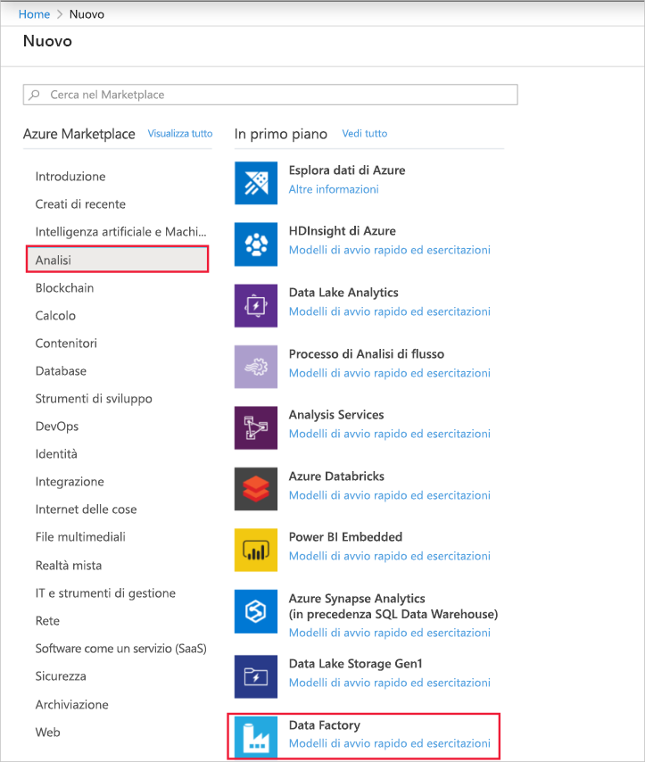
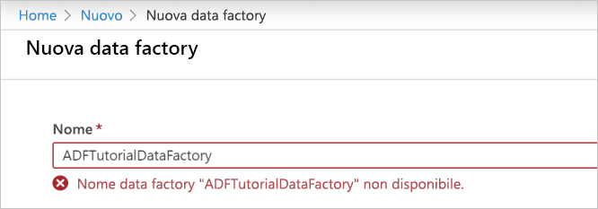
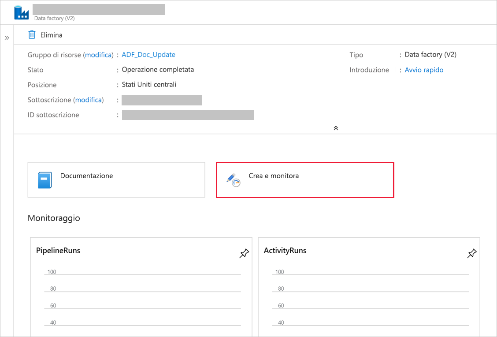
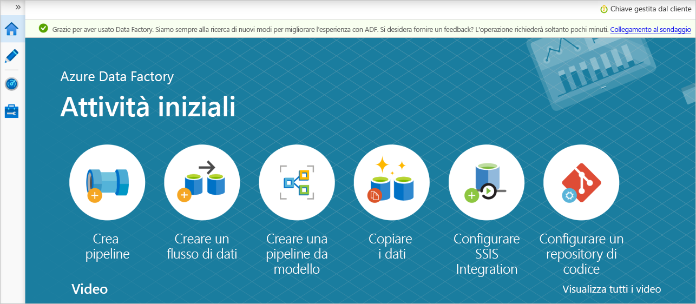

# Copia i file nuovi e modificati in modo incrementale in base a LastModifiedDate utilizzando lo strumento Copia dati

In questa esercitazione si utilizzerà il portale di Azure per creare una data factory. Si userà quindi lo strumento Copia dati per creare una pipeline che consente di copiare in modo incrementale solo i file nuovi e modificati in base alla relativa **LastModifiedDate** dall'archiviazione BLOB di Azure all'archivio BLOB di Azure.

In questo modo, ADF analizzerà tutti i file dell'archivio di origine, applicherà il filtro file in base al relativo LastModifiedDate e copierà il nuovo file aggiornato solo dall'ultima volta nell'archivio di destinazione.  Si noti che, se si consente ad ADF di analizzare grandi quantità di file, ma solo di copiare alcuni file nella destinazione, si prevede comunque che la durata prolungata a causa dell'analisi dei file sia un tempo che richiede molto tempo.   

> [!NOTE]
> Se non si ha familiarità con Azure Data Factory, vedere [Introduzione ad Azure Data Factory](introduction.md).

In questa esercitazione si eseguiranno le attività seguenti:

> [!div class="checklist"]
> * Creare una data factory.
> * Usare lo strumento Copia dati per creare una pipeline.
> * Monitorare le esecuzioni di pipeline e attività.

## Prerequisiti

* **Sottoscrizione di Azure**: Se non si ha una sottoscrizione di Azure, creare un [account gratuito](https://azure.microsoft.com/free/) prima di iniziare.
* **Account di archiviazione di Azure**: Usare l'archiviazione BLOB come archivio dati di _origine_ e _sink_ . Se non è disponibile un account di archiviazione di Azure, vedere le istruzioni fornite in [Creare un account di archiviazione](../storage/common/storage-quickstart-create-account.md).

### Creare due contenitori nell'archivio BLOB

Preparare l'archiviazione BLOB per l'esercitazione eseguendo questi passaggi.

1. Creare un contenitore denominato **source**. Per eseguire questa attività, è possibile utilizzare vari strumenti, ad esempio [Azure Storage Explorer](https://storageexplorer.com/).

2. Creare un contenitore denominato **Destination**. 

## Creare una data factory

1. Nel menu a sinistra selezionare **Crea una risorsa** > **Dati e analisi** > **Data factory**: 
   
   

2. Nella pagina **Nuova data factory** immettere **ADFTutorialDataFactory** in **Nome**. 
 
   Il nome della data factory deve essere _univoco a livello globale_. Potrebbe essere visualizzato il messaggio di errore seguente:
   
   

   Se viene visualizzato un messaggio di errore relativo al valore del nome, immettere un nome diverso per la data factory. Ad esempio, usare il nome _**nomeutente**_ **ADFTutorialDataFactory**. Per informazioni sulle regole di denominazione per gli elementi di Data Factory, vedere [Azure Data Factory - Regole di denominazione](naming-rules.md).
3. Selezionare la **sottoscrizione** di Azure in cui verrà creata la nuova data factory. 
4. In **Gruppo di risorse** eseguire una di queste operazioni:
     
    * Selezionare **Usa esistente** e scegliere un gruppo di risorse esistente dall'elenco a discesa.

    * Selezionare **Crea nuovo** e immettere un nome per il gruppo di risorse. 
         
    Per informazioni sui gruppi di risorse, vedere l'articolo su come [usare gruppi di risorse per gestire le risorse di Azure](../azure-resource-manager/resource-group-overview.md).

5. In **versione**selezionare **v2**.
6. In **Località** selezionare la località per la data factory. Nell'elenco a discesa vengono mostrate solo le località supportate. Gli archivi dati (ad esempio, archiviazione di Azure e il database SQL) e le risorse di calcolo (ad esempio, Azure HDInsight) usati dal data factory possono trovarsi in altre località e aree.
7. Selezionare **Aggiungi al dashboard**. 
8. Selezionare **Create**.
9. Nel dashboard fare riferimento al riquadro **deploying Data Factory** per visualizzare lo stato del processo.

    
10. Al termine della creazione verrà visualizzata la home page **Data factory**.
   
    
11. Per aprire l'interfaccia utente di Azure Data Factory in una scheda separata, selezionare il riquadro **autore & monitoraggio** . 

## Usare lo strumento Copia dati per creare una pipeline

1. Nella pagina attività **iniziali** selezionare il titolo della **copia dati** per aprire lo strumento copia dati. 

   
   
2. Nella pagina **Proprietà** seguire questa procedura:

    a. In **nome attività**immettere **DeltaCopyFromBlobPipeline**.

    b. In **cadenza attività** o **pianificazione attività**Selezionare **Esegui regolarmente in base alla pianificazione**.

    c. In **tipo di trigger**selezionare **finestra a cascata**.
    
    d. Inricorrenza immettere **15 minuto/i**. 
    
    e. Selezionare **Avanti**. 
    
    L'interfaccia utente di Data Factory crea una pipeline con il nome di attività specificato. 

    
    
3. Nella pagina **Archivio dati di origine** completare la procedura seguente:

    a. Selezionare **+ Crea nuova connessione**per aggiungere una connessione.
    
    

    b. Selezionare **Archiviazione BLOB di Azure** nella raccolta e quindi **Continua**.
    
    

    c. Nella pagina **nuovo servizio collegato** selezionare l'account di archiviazione dall'elenco **nome account di archiviazione** e quindi fare clic su **fine**.
    
    
    
    d. Selezionare il servizio collegato appena creato e quindi fare clic su **Avanti**. 
    
   

4. Nella pagina **Choose the input file or folder** (Scegliere il file o la cartella di input) completare questa procedura:
    
    a. Individuare e selezionare la cartella di **origine** , quindi **scegliere Scegli**.
    
    
    
    b. In **comportamento caricamento file**selezionare **caricamento incrementale: LastModifiedDate**.
    
    
    
    c. Controllare la **copia binaria** e selezionare **Avanti**.
    
     
     
5. Nella pagina **archivio dati di destinazione** selezionare **AzureBlobStorage**. Si tratta dello stesso account di archiviazione dell'archivio dati di origine. Quindi selezionare **Avanti**.

    
    
6. Nella pagina **Choose the output file or folder** (Scegliere il file o la cartella di output) completare questa procedura:
    
    a. Individuare e selezionare la cartella di **destinazione** , quindi **scegliere Scegli**.
    
    
    
    b. Selezionare **Avanti**.
    
     
    
7. Nella pagina **Impostazioni** selezionare **Avanti**. 

    
    
8. Nella pagina **Riepilogo** verificare le impostazioni e quindi fare clic su **Avanti**.

    
    
9. Nella pagina **Distribuzione** selezionare **Monitoraggio** per monitorare la pipeline (attività).

    
    
10. Si noti che la scheda **Monitoraggio** a sinistra è selezionata automaticamente. La colonna **Azioni** contiene collegamenti per visualizzare i dettagli delle esecuzioni dell'attività ed eseguire di nuovo la pipeline. Selezionare **Aggiorna** per aggiornare l'elenco e selezionare il collegamento **Visualizza esecuzioni attività** nella colonna **azioni** . 

    

11. Nella pipeline è presente una sola attività (attività di copia), quindi viene visualizzata una sola voce. Per informazioni dettagliate sull'operazione di copia, selezionare il collegamento **Dettagli** (icona a forma di occhiali) nella colonna **Azioni**. 

    
    
    Poiché non è presente alcun file nel contenitore di **origine** nell'account di archiviazione BLOB, non verrà visualizzato alcun file copiato nel contenitore di **destinazione** nell'account di archiviazione BLOB.
    
    
    
12. Creare un file di testo vuoto e denominarlo **file1. txt**. Caricare questo file di testo nel contenitore di **origine** nell'account di archiviazione. Per eseguire queste attività è possibile usare vari strumenti, ad esempio [Azure Storage Explorer](https://storageexplorer.com/).   

    
    
13. Per tornare alla visualizzazione delle **esecuzioni di pipeline** , selezionare tutte le esecuzioni di **pipeline**e attendere che la stessa pipeline venga attivata automaticamente.  

    

14. Selezionare **Visualizza esecuzione attività** per la seconda esecuzione della pipeline quando viene visualizzata. Esaminare quindi i dettagli nello stesso modo usato per la prima esecuzione della pipeline.  

    

    Si vedrà che un file (file1. txt) è stato copiato dal contenitore di **origine** al contenitore di **destinazione** dell'account di archiviazione BLOB.
    
    
    
15. Creare un altro file di testo vuoto e denominarlo **file2. txt**. Caricare questo file di testo nel contenitore di **origine** nell'account di archiviazione BLOB.   
    
16. Ripetere i passaggi 13 e 14 per il secondo file di testo. Si noterà che solo il nuovo file (file2. txt) è stato copiato dal contenitore di **origine** al contenitore di **destinazione** dell'account di archiviazione nell'esecuzione successiva della pipeline.  
    
    

    È anche possibile verificare questo problema utilizzando [Azure Storage Explorer](https://storageexplorer.com/) per eseguire la scansione dei file.
    
    

    
## Passaggi successivi
Passare all'esercitazione seguente per informazioni sulla trasformazione dei dati tramite un cluster Apache Spark in Azure:

> [!div class="nextstepaction"]
>[Trasformare i dati nel cloud usando un cluster Apache Spark](tutorial-transform-data-spark-portal.md)