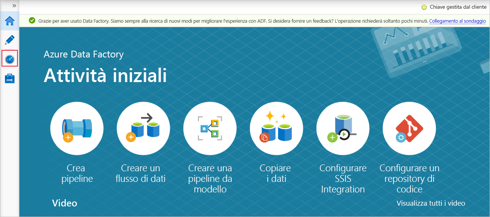

# <a name="incrementally-load-data-from-multiple-tables-in-sql-server-to-an-azure-sql-database"></a>Caricare dati in modo incrementale da più tabelle in SQL Server a un database SQL di Azure
In questa esercitazione si creerà una data factory di Azure con una pipeline che carica dati delta da più tabelle di un database di SQL Server locale a un database SQL di Azure.    

In questa esercitazione vengono completati i passaggi seguenti:

> [!div class="checklist"]
> * Preparare gli archivi dati di origine e di destinazione.
> * Creare una data factory.
> * Creare un runtime di integrazione self-hosted.
> * Installare il runtime di integrazione. 
> * Creare servizi collegati. 
> * Creare i set di dati di origine, sink e limite.
> * Creare, eseguire e monitorare una pipeline.
> * Esaminare i risultati.
> * Aggiungere o aggiornare dati nelle tabelle di origine.
> * Rieseguire e monitorare la pipeline.
> * Esaminare i risultati finali.

## <a name="overview"></a>Panoramica
Di seguito sono descritti i passaggi fondamentali per la creazione di questa soluzione: 

1. **Selezionare la colonna del limite**.
    Selezionare una colonna per ogni tabella nell'archivio dati di origine, che può essere usata per identificare i record nuovi o aggiornati per ogni esecuzione. I dati della colonna selezionata (ad esempio last_modify_time o ID) continuano in genere ad aumentare quando le righe vengono create o aggiornate. Il valore massimo di questa colonna viene usato come limite.

1. **Preparare un archivio dati per l'archiviazione del valore limite**.   
    In questa esercitazione si archivia il valore limite in un database SQL.

1. **Creare una pipeline con le attività seguenti**: 
    
    a. Creare un'attività ForEach che esegue l'iterazione di un elenco di nomi di tabella di origine passato come parametro alla pipeline. Per ogni tabella di origine, l'attività richiama le attività seguenti per eseguire il caricamento differenziale per la tabella.

    b. Creare due attività di ricerca. Usare la prima attività di ricerca per recuperare l'ultimo valore limite. Usare la seconda attività di ricerca per recuperare il nuovo valore limite. Questi valori limite vengono passati all'attività di copia.

    c. Creare un'attività di copia che copi le righe dell'archivio dati di origine con il valore della colonna del limite maggiore del valore limite precedente e minore del nuovo valore limite. L'attività copierà quindi i dati delta dall'archivio dati di origine a un archivio BLOB di Azure come nuovo file.

    d. Creare un'attività stored procedure che aggiorni il valore limite per la pipeline che verrà eseguita la volta successiva. 

    Il diagramma generale della soluzione è il seguente: 

    


Se non si ha una sottoscrizione di Azure, creare un account [gratuito](https://azure.microsoft.com/free/) prima di iniziare.

## <a name="prerequisites"></a>Prerequisiti
* **SQL Server**. Usare un database di SQL Server locale come archivio dati di origine in questa esercitazione. 
* **Database SQL di Azure**. Usare un database SQL come archivio dati sink. Se non è disponibile un database SQL, vedere [Creare un database SQL di Azure](../sql-database/sql-database-get-started-portal.md) per crearne uno. 

### <a name="create-source-tables-in-your-sql-server-database"></a>Creare le tabelle di origine nel database di SQL Server

1. Aprire SQL Server Management Studio e connettersi al database SQL Server locale.

1. In **Esplora server** fare clic con il pulsante destro del mouse sul database e scegliere **Nuova query**.

1. Eseguire il comando SQL seguente sul database per creare le tabelle denominate `customer_table` e `project_table`:

    ```sql
    create table customer_table
    (
        PersonID int,
        Name varchar(255),
        LastModifytime datetime
    );
    
    create table project_table
    (
        Project varchar(255),
        Creationtime datetime
    );
        
    INSERT INTO customer_table
    (PersonID, Name, LastModifytime)
    VALUES
    (1, 'John','9/1/2017 12:56:00 AM'),
    (2, 'Mike','9/2/2017 5:23:00 AM'),
    (3, 'Alice','9/3/2017 2:36:00 AM'),
    (4, 'Andy','9/4/2017 3:21:00 AM'),
    (5, 'Anny','9/5/2017 8:06:00 AM');
    
    INSERT INTO project_table
    (Project, Creationtime)
    VALUES
    ('project1','1/1/2015 0:00:00 AM'),
    ('project2','2/2/2016 1:23:00 AM'),
    ('project3','3/4/2017 5:16:00 AM');
    
    ```

### <a name="create-destination-tables-in-your-azure-sql-database"></a>Creare le tabelle di destinazione nel database SQL di Azure
1. Aprire SQL Server Management Studio e connettersi al database di SQL Server.

1. In **Esplora server** fare clic con il pulsante destro del mouse sul database e scegliere **Nuova query**.

1. Eseguire questo comando SQL sul database SQL per creare le tabelle denominate `customer_table` e `project_table`:  
    
    ```sql
    create table customer_table
    (
        PersonID int,
        Name varchar(255),
        LastModifytime datetime
    );
    
    create table project_table
    (
        Project varchar(255),
        Creationtime datetime
    );

    ```

### <a name="create-another-table-in-the-azure-sql-database-to-store-the-high-watermark-value"></a>Creare un'altra tabella nel database SQL di Azure per archiviare il valore limite massimo
1. Eseguire questo comando SQL sul database SQL per creare una tabella denominata `watermarktable` in cui archiviare il valore limite: 
    
    ```sql
    create table watermarktable
    (
    
        TableName varchar(255),
        WatermarkValue datetime,
    );
    ```
1. Inserire i valori del limite iniziale per entrambe le tabelle di origine nella tabella dei limiti.

    ```sql

    INSERT INTO watermarktable
    VALUES 
    ('customer_table','1/1/2010 12:00:00 AM'),
    ('project_table','1/1/2010 12:00:00 AM');
    
    ```

### <a name="create-a-stored-procedure-in-the-azure-sql-database"></a>Creare una stored procedure nel database SQL di Azure 

Eseguire questo comando per creare una stored procedure nel database SQL. Questa stored procedure aggiorna il valore del limite dopo ogni esecuzione di pipeline. 

```sql
CREATE PROCEDURE usp_write_watermark @LastModifiedtime datetime, @TableName varchar(50)
AS

BEGIN

    UPDATE watermarktable
    SET [WatermarkValue] = @LastModifiedtime 
WHERE [TableName] = @TableName

END

```

### <a name="create-data-types-and-additional-stored-procedures-in-the-azure-sql-database"></a>Creare tipi di dati e stored procedure aggiuntive nel database SQL di Azure
Eseguire questa query per creare due stored procedure e due tipi di dati nel database SQL. Questi elementi vengono usati per unire i dati delle tabelle di origine nelle tabelle di destinazione. 

Per semplificare la procedura, si usano direttamente queste stored procedure passando i dati differenziali tramite una variabile di tabella e quindi unendoli nell'archivio di destinazione. Si noti che non è prevista l'archiviazione di un numero di righe delta elevato (più di 100) nella variabile di tabella.  

Se è necessario unire un numero elevato di righe delta nell'archivio di destinazione, è consigliabile usare un'attività di copia per copiare prima tutti i dati differenziali in una tabella temporanea nell'archivio di destinazione e quindi compilare la propria stored procedure senza usare la variabile di tabella per eseguire il merge dalla tabella temporanea alla tabella finale. 


```sql
CREATE TYPE DataTypeforCustomerTable AS TABLE(
    PersonID int,
    Name varchar(255),
    LastModifytime datetime
);

GO

CREATE PROCEDURE usp_upsert_customer_table @customer_table DataTypeforCustomerTable READONLY
AS

BEGIN
  MERGE customer_table AS target
  USING @customer_table AS source
  ON (target.PersonID = source.PersonID)
  WHEN MATCHED THEN
      UPDATE SET Name = source.Name,LastModifytime = source.LastModifytime
  WHEN NOT MATCHED THEN
      INSERT (PersonID, Name, LastModifytime)
      VALUES (source.PersonID, source.Name, source.LastModifytime);
END

GO

CREATE TYPE DataTypeforProjectTable AS TABLE(
    Project varchar(255),
    Creationtime datetime
);

GO

CREATE PROCEDURE usp_upsert_project_table @project_table DataTypeforProjectTable READONLY
AS

BEGIN
  MERGE project_table AS target
  USING @project_table AS source
  ON (target.Project = source.Project)
  WHEN MATCHED THEN
      UPDATE SET Creationtime = source.Creationtime
  WHEN NOT MATCHED THEN
      INSERT (Project, Creationtime)
      VALUES (source.Project, source.Creationtime);
END

```

### <a name="azure-powershell"></a>Azure PowerShell
Installare i moduli di Azure PowerShell più recenti seguendo le istruzioni descritte in [Installare e configurare Azure PowerShell](/powershell/azure/azurerm/install-azurerm-ps).

## <a name="create-a-data-factory"></a>Creare una data factory
1. Definire una variabile per il nome del gruppo di risorse usato in seguito nei comandi di PowerShell. Copiare il testo del comando seguente in PowerShell, specificare un nome per il [gruppo di risorse di Azure](../azure-resource-manager/resource-group-overview.md) tra virgolette doppie e quindi eseguire il comando. Un esempio è `"adfrg"`. 
   
    ```powershell
    $resourceGroupName = "ADFTutorialResourceGroup";
    ```

    Se il gruppo di risorse esiste già, potrebbe essere preferibile non sovrascriverlo. Assegnare un valore diverso alla variabile `$resourceGroupName` ed eseguire di nuovo il comando.

1. Definire una variabile per la località della data factory. 

    ```powershell
    $location = "East US"
    ```
1. Per creare il gruppo di risorse di Azure, eseguire questo comando: 

    ```powershell
    New-AzResourceGroup $resourceGroupName $location
    ``` 
    Se il gruppo di risorse esiste già, potrebbe essere preferibile non sovrascriverlo. Assegnare un valore diverso alla variabile `$resourceGroupName` ed eseguire di nuovo il comando.

1. Definire una variabile per il nome della data factory. 

    > [!IMPORTANT]
    >  Aggiornare il nome della data factory in modo che sia univoco a livello globale, Un esempio è ADFIncMultiCopyTutorialFactorySP1127. 

    ```powershell
    $dataFactoryName = "ADFIncMultiCopyTutorialFactory";
    ```
1. Per creare la data factory, eseguire questo cmdlet **Set-AzDataFactoryV2**: 
    
    ```powershell       
    Set-AzDataFactoryV2 -ResourceGroupName $resourceGroupName -Location $location -Name $dataFactoryName 
    ```

Tenere presente quanto segue:

* Il nome della data factory deve essere univoco a livello globale. Se viene visualizzato l'errore seguente, modificare il nome e riprovare:

    ```
    The specified Data Factory name 'ADFIncMultiCopyTutorialFactory' is already in use. Data Factory names must be globally unique.
    ```
* Per creare istanze di Data Factory, l'account utente usato per accedere ad Azure deve essere un membro dei ruoli collaboratore o proprietario oppure un amministratore della sottoscrizione di Azure.
* Per un elenco di aree di Azure in cui Data Factory è attualmente disponibile, selezionare le aree di interesse nella pagina seguente, quindi espandere **Analytics** per individuare **Data Factory**: [Prodotti disponibili in base all'area](https://azure.microsoft.com/global-infrastructure/services/). Gli archivi dati (Archiviazione di Azure, database SQL e così via) e le risorse di calcolo (Azure HDInsight e così via) usati dalla data factory possono trovarsi in altre aree.

[!INCLUDE [data-factory-create-install-integration-runtime](../../includes/data-factory-create-install-integration-runtime.md)]


## <a name="create-linked-services"></a>Creare servizi collegati
Si creano servizi collegati in una data factory per collegare gli archivi dati e i servizi di calcolo alla data factory. In questa sezione vengono creati i servizi collegati al database di SQL Server locale e al database SQL di Azure. 

### <a name="create-the-sql-server-linked-service"></a>Creare il servizio collegato di SQL Server
In questo passaggio si collega il database di SQL Server locale alla data factory.

1. Nella cartella C:\ADFTutorials\IncCopyMultiTableTutorial creare un file JSON denominato **SqlServerLinkedService.json** con il contenuto seguente. Selezionare la sezione corretta in base all'autenticazione usata per connettersi a SQL Server. Creare le cartelle locali, se non esistono già. 

    > [!IMPORTANT]
    > Selezionare la sezione corretta in base all'autenticazione usata per connettersi a SQL Server.

    Se si usa l'autenticazione SQL, copiare la definizione JSON seguente:

    ```json
    {  
        "name":"SqlServerLinkedService",
        "properties":{  
            "annotations":[  
    
            ],
            "type":"SqlServer",
            "typeProperties":{  
                "connectionString":"integrated security=False;data source=<servername>;initial catalog=<database name>;user id=<username>;Password=<password>"
            },
            "connectVia":{  
                "referenceName":"<integration runtime name>",
                "type":"IntegrationRuntimeReference"
            }
        }
    } 
   ```    
    Se si usa l'autenticazione Windows, copiare la definizione JSON seguente:

    ```json
    {  
        "name":"SqlServerLinkedService",
        "properties":{  
            "annotations":[  
    
            ],
            "type":"SqlServer",
            "typeProperties":{  
                "connectionString":"integrated security=True;data source=<servername>;initial catalog=<database name>",
                "userName":"<username> or <domain>\\<username>",
                "password":{  
                    "type":"SecureString",
                    "value":"<password>"
                }
            },
            "connectVia":{  
                "referenceName":"<integration runtime name>",
                "type":"IntegrationRuntimeReference"
            }
        }
    }
    ```
    > [!IMPORTANT]
    > - Selezionare la sezione corretta in base all'autenticazione usata per connettersi a SQL Server.
    > - Sostituire &lt;integration runtime name> con il nome del runtime di integrazione.
    > - Prima di salvare il file, sostituire &lt;servername>, &lt;databasename>, &lt;username> e &lt;password> con i valori del database di SQL Server.
    > - Se è necessario usare una barra (`\`) nell'account utente o nel nome del server, usare il carattere di escape (`\`). Un esempio è `mydomain\\myuser`.

1. In PowerShell eseguire il cmdlet seguente per passare alla cartella C:\ADFTutorials\IncCopyMultiTableTutorial.

    ```powershell
    Set-Location 'C:\ADFTutorials\IncCopyMultiTableTutorial'
    ```

1. Eseguire il cmdlet **Set-AzDataFactoryV2LinkedService** per creare il servizio collegato AzureStorageLinkedService. Nell'esempio seguente si passano i valori per i parametri *ResourceGroupName* e *DataFactoryName*: 

    ```powershell
    Set-AzDataFactoryV2LinkedService -DataFactoryName $dataFactoryName -ResourceGroupName $resourceGroupName -Name "SqlServerLinkedService" -File ".\SqlServerLinkedService.json"
    ```

    Di seguito è riportato l'output di esempio:

    ```json
    LinkedServiceName : SqlServerLinkedService
    ResourceGroupName : <ResourceGroupName>
    DataFactoryName   : <DataFactoryName>
    Properties        : Microsoft.Azure.Management.DataFactory.Models.SqlServerLinkedService
    ```

### <a name="create-the-sql-database-linked-service"></a>Creare il servizio collegato per il database SQL
1. Nella cartella C:\ADFTutorials\IncCopyMultiTableTutorial creare un file JSON denominato **AzureSQLDatabaseLinkedService.json** con il contenuto seguente. Creare la cartella ADF, se non esiste. Prima di salvare il file, sostituire &lt;servername&gt;, &lt;database name&gt;, &lt;user name&gt; e &lt;password&gt; con il nome del database di SQL Server, il nome del database, il nome utente e la password. 

    ```json
    {  
        "name":"AzureSQLDatabaseLinkedService",
        "properties":{  
            "annotations":[  
    
            ],
            "type":"AzureSqlDatabase",
            "typeProperties":{  
                "connectionString":"integrated security=False;encrypt=True;connection timeout=30;data source=<servername>.database.windows.net;initial catalog=<database name>;user id=<user name>;Password=<password>;"
            }
        }
    }
    ```
1. In PowerShell eseguire il cmdlet **Set-AzDataFactoryV2LinkedService** per creare il servizio collegato AzureSQLDatabaseLinkedService. 

    ```powershell
    Set-AzDataFactoryV2LinkedService -DataFactoryName $dataFactoryName -ResourceGroupName $resourceGroupName -Name "AzureSQLDatabaseLinkedService" -File ".\AzureSQLDatabaseLinkedService.json"
    ```

    Di seguito è riportato l'output di esempio:

    ```json
    LinkedServiceName : AzureSQLDatabaseLinkedService
    ResourceGroupName : <ResourceGroupName>
    DataFactoryName   : <DataFactoryName>
    Properties        : Microsoft.Azure.Management.DataFactory.Models.AzureSqlDatabaseLinkedService
    ```

## <a name="create-datasets"></a>Creare set di dati
In questo passaggio vengono creati i set di dati per rappresentare l'origine dati, la destinazione dati e la posizione di archiviazione del valore limite.

### <a name="create-a-source-dataset"></a>Creare set di dati di origine

1. Creare un file JSON denominato **SourceDataset.json** nella stessa cartella con il contenuto seguente: 

    ```json
    {  
        "name":"SourceDataset",
        "properties":{  
            "linkedServiceName":{  
                "referenceName":"SqlServerLinkedService",
                "type":"LinkedServiceReference"
            },
            "annotations":[  
    
            ],
            "type":"SqlServerTable",
            "schema":[  
    
            ]
        }
    }
   
    ```

    L'attività di copia nella pipeline usa una query SQL per caricare i dati invece di caricare l'intera tabella.

1. Eseguire il cmdlet **Set-AzDataFactoryV2Dataset** per creare il set di dati SourceDataset.
    
    ```powershell
    Set-AzDataFactoryV2Dataset -DataFactoryName $dataFactoryName -ResourceGroupName $resourceGroupName -Name "SourceDataset" -File ".\SourceDataset.json"
    ```

    Ecco l'output di esempio del cmdlet:
    
    ```json
    DatasetName       : SourceDataset
    ResourceGroupName : <ResourceGroupName>
    DataFactoryName   : <DataFactoryName>
    Structure         :
    Properties        : Microsoft.Azure.Management.DataFactory.Models.SqlServerTableDataset
    ```

### <a name="create-a-sink-dataset"></a>Creare un set di dati sink

1. Nella stessa cartella creare un file JSON denominato **SinkDataset.json** con il contenuto seguente. L'elemento tableName viene impostato dalla pipeline in modo dinamico in fase di esecuzione. L'attività ForEach nella pipeline esegue l'iterazione di un elenco di nomi di tabella e passa il nome di tabella a questo set di dati in ogni interazione. 

    ```json
    {  
        "name":"SinkDataset",
        "properties":{  
            "linkedServiceName":{  
                "referenceName":"AzureSQLDatabaseLinkedService",
                "type":"LinkedServiceReference"
            },
            "parameters":{  
                "SinkTableName":{  
                    "type":"String"
                }
            },
            "annotations":[  
    
            ],
            "type":"AzureSqlTable",
            "typeProperties":{  
                "tableName":{  
                    "value":"@dataset().SinkTableName",
                    "type":"Expression"
                }
            }
        }
    }
    ```

1. Eseguire il cmdlet **Set-AzDataFactoryV2Dataset** per creare il set di dati SinkDataset.
    
    ```powershell
    Set-AzDataFactoryV2Dataset -DataFactoryName $dataFactoryName -ResourceGroupName $resourceGroupName -Name "SinkDataset" -File ".\SinkDataset.json"
    ```

    Ecco l'output di esempio del cmdlet:
    
    ```json
    DatasetName       : SinkDataset
    ResourceGroupName : <ResourceGroupName>
    DataFactoryName   : <DataFactoryName>
    Structure         :
    Properties        : Microsoft.Azure.Management.DataFactory.Models.AzureSqlTableDataset
    ```

### <a name="create-a-dataset-for-a-watermark"></a>Creare un set di dati per un limite
In questo passaggio si crea un set di dati per l'archiviazione di un valore limite massimo. 

1. Nella stessa cartella creare un file JSON denominato **WatermarkDataset.json** con il contenuto seguente: 

    ```json
    {
        "name": " WatermarkDataset ",
        "properties": {
            "type": "AzureSqlTable",
            "typeProperties": {
                "tableName": "watermarktable"
            },
            "linkedServiceName": {
                "referenceName": "AzureSQLDatabaseLinkedService",
                "type": "LinkedServiceReference"
            }
        }
    }    
    ```
1. Eseguire il cmdlet **Set-AzDataFactoryV2Dataset** per creare il set di dati WatermarkDataset.
    
    ```powershell
    Set-AzDataFactoryV2Dataset -DataFactoryName $dataFactoryName -ResourceGroupName $resourceGroupName -Name "WatermarkDataset" -File ".\WatermarkDataset.json"
    ```

    Ecco l'output di esempio del cmdlet:
    
    ```json
    DatasetName       : WatermarkDataset
    ResourceGroupName : <ResourceGroupName>
    DataFactoryName   : <DataFactoryName>
    Structure         :
    Properties        : Microsoft.Azure.Management.DataFactory.Models.AzureSqlTableDataset    
    ```

## <a name="create-a-pipeline"></a>Creare una pipeline
Questa pipeline accetta un elenco di nomi di tabella come parametro. L'**attività ForEach** esegue l'iterazione dell'elenco dei nomi di tabella ed esegue le operazioni seguenti: 

1. Usa l'**attività di ricerca** per recuperare il valore del limite precedente (valore iniziale o usato nell'ultima iterazione).

1. Usa l'**attività di ricerca** per recuperare il nuovo valore del limite (valore massimo della colonna dei limiti nella tabella di origine).

1. Usa l'**attività di copia** per copiare dati tra i due valori del limite dal database di origine al database di destinazione.

1. Usa l'**attività StoredProcedure** per aggiornare il valore del limite precedente da usare nel primo passaggio dell'iterazione successiva. 

### <a name="create-the-pipeline"></a>Creare la pipeline
1. Nella stessa cartella creare un file JSON denominato **IncrementalCopyPipeline.json** con il contenuto seguente: 

    ```json
    {  
        "name":"IncrementalCopyPipeline",
        "properties":{  
            "activities":[  
                {  
                    "name":"IterateSQLTables",
                    "type":"ForEach",
                    "dependsOn":[  
    
                    ],
                    "userProperties":[  
    
                    ],
                    "typeProperties":{  
                        "items":{  
                            "value":"@pipeline().parameters.tableList",
                            "type":"Expression"
                        },
                        "isSequential":false,
                        "activities":[  
                            {  
                                "name":"LookupOldWaterMarkActivity",
                                "type":"Lookup",
                                "dependsOn":[  
    
                                ],
                                "policy":{  
                                    "timeout":"7.00:00:00",
                                    "retry":0,
                                    "retryIntervalInSeconds":30,
                                    "secureOutput":false,
                                    "secureInput":false
                                },
                                "userProperties":[  
    
                                ],
                                "typeProperties":{  
                                    "source":{  
                                        "type":"AzureSqlSource",
                                        "sqlReaderQuery":{  
                                            "value":"select * from watermarktable where TableName  =  '@{item().TABLE_NAME}'",
                                            "type":"Expression"
                                        }
                                    },
                                    "dataset":{  
                                        "referenceName":"WatermarkDataset",
                                        "type":"DatasetReference"
                                    }
                                }
                            },
                            {  
                                "name":"LookupNewWaterMarkActivity",
                                "type":"Lookup",
                                "dependsOn":[  
    
                                ],
                                "policy":{  
                                    "timeout":"7.00:00:00",
                                    "retry":0,
                                    "retryIntervalInSeconds":30,
                                    "secureOutput":false,
                                    "secureInput":false
                                },
                                "userProperties":[  
    
                                ],
                                "typeProperties":{  
                                    "source":{  
                                        "type":"SqlServerSource",
                                        "sqlReaderQuery":{  
                                            "value":"select MAX(@{item().WaterMark_Column}) as NewWatermarkvalue from @{item().TABLE_NAME}",
                                            "type":"Expression"
                                        }
                                    },
                                    "dataset":{  
                                        "referenceName":"SourceDataset",
                                        "type":"DatasetReference"
                                    },
                                    "firstRowOnly":true
                                }
                            },
                            {  
                                "name":"IncrementalCopyActivity",
                                "type":"Copy",
                                "dependsOn":[  
                                    {  
                                        "activity":"LookupOldWaterMarkActivity",
                                        "dependencyConditions":[  
                                            "Succeeded"
                                        ]
                                    },
                                    {  
                                        "activity":"LookupNewWaterMarkActivity",
                                        "dependencyConditions":[  
                                            "Succeeded"
                                        ]
                                    }
                                ],
                                "policy":{  
                                    "timeout":"7.00:00:00",
                                    "retry":0,
                                    "retryIntervalInSeconds":30,
                                    "secureOutput":false,
                                    "secureInput":false
                                },
                                "userProperties":[  
    
                                ],
                                "typeProperties":{  
                                    "source":{  
                                        "type":"SqlServerSource",
                                        "sqlReaderQuery":{  
                                            "value":"select * from @{item().TABLE_NAME} where @{item().WaterMark_Column} > '@{activity('LookupOldWaterMarkActivity').output.firstRow.WatermarkValue}' and @{item().WaterMark_Column} <= '@{activity('LookupNewWaterMarkActivity').output.firstRow.NewWatermarkvalue}'",
                                            "type":"Expression"
                                        }
                                    },
                                    "sink":{  
                                        "type":"AzureSqlSink",
                                        "sqlWriterStoredProcedureName":{  
                                            "value":"@{item().StoredProcedureNameForMergeOperation}",
                                            "type":"Expression"
                                        },
                                        "sqlWriterTableType":{  
                                            "value":"@{item().TableType}",
                                            "type":"Expression"
                                        },
                                        "storedProcedureTableTypeParameterName":{  
                                            "value":"@{item().TABLE_NAME}",
                                            "type":"Expression"
                                        },
                                        "disableMetricsCollection":false
                                    },
                                    "enableStaging":false
                                },
                                "inputs":[  
                                    {  
                                        "referenceName":"SourceDataset",
                                        "type":"DatasetReference"
                                    }
                                ],
                                "outputs":[  
                                    {  
                                        "referenceName":"SinkDataset",
                                        "type":"DatasetReference",
                                        "parameters":{  
                                            "SinkTableName":{  
                                                "value":"@{item().TABLE_NAME}",
                                                "type":"Expression"
                                            }
                                        }
                                    }
                                ]
                            },
                            {  
                                "name":"StoredProceduretoWriteWatermarkActivity",
                                "type":"SqlServerStoredProcedure",
                                "dependsOn":[  
                                    {  
                                        "activity":"IncrementalCopyActivity",
                                        "dependencyConditions":[  
                                            "Succeeded"
                                        ]
                                    }
                                ],
                                "policy":{  
                                    "timeout":"7.00:00:00",
                                    "retry":0,
                                    "retryIntervalInSeconds":30,
                                    "secureOutput":false,
                                    "secureInput":false
                                },
                                "userProperties":[  
    
                                ],
                                "typeProperties":{  
                                    "storedProcedureName":"[dbo].[usp_write_watermark]",
                                    "storedProcedureParameters":{  
                                        "LastModifiedtime":{  
                                            "value":{  
                                                "value":"@{activity('LookupNewWaterMarkActivity').output.firstRow.NewWatermarkvalue}",
                                                "type":"Expression"
                                            },
                                            "type":"DateTime"
                                        },
                                        "TableName":{  
                                            "value":{  
                                                "value":"@{activity('LookupOldWaterMarkActivity').output.firstRow.TableName}",
                                                "type":"Expression"
                                            },
                                            "type":"String"
                                        }
                                    }
                                },
                                "linkedServiceName":{  
                                    "referenceName":"AzureSQLDatabaseLinkedService",
                                    "type":"LinkedServiceReference"
                                }
                            }
                        ]
                    }
                }
            ],
            "parameters":{  
                "tableList":{  
                    "type":"array"
                }
            },
            "annotations":[  
    
            ]
        }
    }
    ```
1. Eseguire il cmdlet **Set-AzDataFactoryV2Pipeline** per creare la pipeline IncrementalCopyPipeline.
    
   ```powershell
   Set-AzDataFactoryV2Pipeline -DataFactoryName $dataFactoryName -ResourceGroupName $resourceGroupName -Name "IncrementalCopyPipeline" -File ".\IncrementalCopyPipeline.json"
   ``` 

   Di seguito è riportato l'output di esempio: 

   ```json
    PipelineName      : IncrementalCopyPipeline
    ResourceGroupName : <ResourceGroupName>
    DataFactoryName   : <DataFactoryName>
    Activities        : {IterateSQLTables}
    Parameters        : {[tableList, Microsoft.Azure.Management.DataFactory.Models.ParameterSpecification]}
   ```
 
## <a name="run-the-pipeline"></a>Eseguire la pipeline

1. Nella stessa cartella creare un file di parametri denominato **Parameters.json** con il contenuto seguente:

    ```json
    {
        "tableList": 
        [
            {
                "TABLE_NAME": "customer_table",
                "WaterMark_Column": "LastModifytime",
                "TableType": "DataTypeforCustomerTable",
                "StoredProcedureNameForMergeOperation": "usp_upsert_customer_table"
            },
            {
                "TABLE_NAME": "project_table",
                "WaterMark_Column": "Creationtime",
                "TableType": "DataTypeforProjectTable",
                "StoredProcedureNameForMergeOperation": "usp_upsert_project_table"
            }
        ]
    }
    ```
1. Eseguire la pipeline IncrementalCopyPipeline usando il cmdlet **Invoke-AzDataFactoryV2Pipeline**. Sostituire i segnaposto con il nome del gruppo di risorse e della data factory.

    ```powershell
    $RunId = Invoke-AzDataFactoryV2Pipeline -PipelineName "IncrementalCopyPipeline" -ResourceGroup $resourceGroupName -dataFactoryName $dataFactoryName -ParameterFile ".\Parameters.json"        
    ``` 

## <a name="monitor-the-pipeline"></a>Monitorare la pipeline

1. Accedere al [portale di Azure](https://portal.azure.com).

1. Selezionare **Tutti i servizi**, eseguire una ricerca con la parola chiave *Data factory* e selezionare **Data factory**. 

1. Cercare la propria data factory nell'elenco delle data factory e selezionarla per aprire la pagina **Data factory**. 

1. Nella pagina **Data factory** selezionare **Crea e monitora** per avviare Azure Data Factory in una scheda separata.

1. Nella pagina **Attività iniziali** selezionare **Monitoraggio** sul lato sinistro. 
    

1. È possibile visualizzare tutte le esecuzioni di pipeline e i rispettivi stati. Notare che nell'esempio seguente lo stato dell'esecuzione della pipeline è **Riuscito**. Per verificare i parametri passati alla pipeline, selezionare il collegamento nella colonna **Parametri**. Se si è verificato un errore, verrà visualizzato un collegamento nella colonna **Errore**.

        
1. Quando si seleziona il collegamento nella colonna **Azioni**, vengono visualizzate tutte le esecuzioni di attività per la pipeline. 

1. Per tornare alla visualizzazione **Pipeline Runs** (Esecuzioni di pipeline), selezionare **Tutte le esecuzioni della pipeline**. 

## <a name="review-the-results"></a>Esaminare i risultati
In SQL Server Management Studio eseguire queste query sul database SQL di destinazione per verificare che i dati siano stati copiati dalle tabelle di origine alle tabelle di destinazione: 

**Query** 
```sql
select * from customer_table
```

**Output**
```
===========================================
PersonID    Name    LastModifytime
===========================================
1           John    2017-09-01 00:56:00.000
2           Mike    2017-09-02 05:23:00.000
3           Alice   2017-09-03 02:36:00.000
4           Andy    2017-09-04 03:21:00.000
5           Anny    2017-09-05 08:06:00.000
```

**Query**

```sql
select * from project_table
```

**Output**

```
===================================
Project     Creationtime
===================================
project1    2015-01-01 00:00:00.000
project2    2016-02-02 01:23:00.000
project3    2017-03-04 05:16:00.000
```

**Query**

```sql
select * from watermarktable
```

**Output**

```
======================================
TableName       WatermarkValue
======================================
customer_table  2017-09-05 08:06:00.000
project_table   2017-03-04 05:16:00.000
```

Notare che i valori del limite per entrambe le tabelle sono stati aggiornati. 

## <a name="add-more-data-to-the-source-tables"></a>Aggiungere altri dati alle tabelle di origine

Eseguire questa query sul database di SQL Server di origine per aggiornare una riga esistente in customer_table. Inserire una nuova riga in project_table. 

```sql
UPDATE customer_table
SET [LastModifytime] = '2017-09-08T00:00:00Z', [name]='NewName' where [PersonID] = 3

INSERT INTO project_table
(Project, Creationtime)
VALUES
('NewProject','10/1/2017 0:00:00 AM');
``` 

## <a name="rerun-the-pipeline"></a>Eseguire di nuovo la pipeline

1. Eseguire di nuovo la pipeline con il comando di PowerShell seguente:

    ```powershell
    $RunId = Invoke-AzDataFactoryV2Pipeline -PipelineName "IncrementalCopyPipeline" -ResourceGroup $resourceGroupname -dataFactoryName $dataFactoryName -ParameterFile ".\Parameters.json"
    ```
1. Monitorare le esecuzioni di pipeline seguendo le istruzioni contenute nella sezione [Monitorare la pipeline](#monitor-the-pipeline). Quando lo stato della pipeline è **In corso**, viene visualizzato un altro collegamento a un'azione in **Azioni** per annullare l'esecuzione della pipeline. 

1. Selezionare **Aggiorna** per aggiornare l'elenco finché l'esecuzione della pipeline non riesce. 

1. Fare eventualmente clic sul collegamento **Visualizza esecuzioni attività** in **Azioni** per visualizzare tutte le esecuzioni di attività associate a questa esecuzione di pipeline. 

## <a name="review-the-final-results"></a>Esaminare i risultati finali
In SQL Server Management Studio eseguire le query seguenti sul database di destinazione per verificare che i dati nuovi/aggiornati siano stati copiati dalle tabelle di origine alle tabelle di destinazione. 

**Query** 
```sql
select * from customer_table
```

**Output**
```
===========================================
PersonID    Name    LastModifytime
===========================================
1           John    2017-09-01 00:56:00.000
2           Mike    2017-09-02 05:23:00.000
3           NewName 2017-09-08 00:00:00.000
4           Andy    2017-09-04 03:21:00.000
5           Anny    2017-09-05 08:06:00.000
```

Notare i nuovi valori di **Name** e **LastModifytime** per **PersonID** per il numero 3. 

**Query**

```sql
select * from project_table
```

**Output**

```
===================================
Project     Creationtime
===================================
project1    2015-01-01 00:00:00.000
project2    2016-02-02 01:23:00.000
project3    2017-03-04 05:16:00.000
NewProject  2017-10-01 00:00:00.000
```

Si noti che è stata aggiunta la voce **NewProject** a project_table. 

**Query**

```sql
select * from watermarktable
```

**Output**

```
======================================
TableName       WatermarkValue
======================================
customer_table  2017-09-08 00:00:00.000
project_table   2017-10-01 00:00:00.000
```

Notare che i valori del limite per entrambe le tabelle sono stati aggiornati.
     
## <a name="next-steps"></a>Passaggi successivi
In questa esercitazione sono stati eseguiti i passaggi seguenti: 

> [!div class="checklist"]
> * Preparare gli archivi dati di origine e di destinazione.
> * Creare una data factory.
> * Creare un runtime di integrazione self-hosted.
> * Installare il runtime di integrazione.
> * Creare servizi collegati. 
> * Creare i set di dati di origine, sink e limite.
> * Creare, eseguire e monitorare una pipeline.
> * Esaminare i risultati.
> * Aggiungere o aggiornare dati nelle tabelle di origine.
> * Rieseguire e monitorare la pipeline.
> * Esaminare i risultati finali.

Passare all'esercitazione successiva per informazioni sulla trasformazione dei dati usando un cluster Spark in Azure:

> [!div class="nextstepaction"]
>[Caricare dati in modo incrementale dal database SQL di Azure all'archivio BLOB di Azure tramite la tecnologia Rilevamento modifiche](tutorial-incremental-copy-change-tracking-feature-powershell.md)


