# <a name="data-management-gateway"></a>Gateway di gestione dati
> [!NOTE]
> Questo articolo si applica alla versione 1 del servizio Data Factory, disponibile a livello generale (GA). Se si usa la versione 2 del servizio Data Factory, disponibile in anteprima, vedere le informazioni sul [runtime di integrazione self-hosted nella versione 2](../create-self-hosted-integration-runtime.md). 

Il gateway di gestione dati è un agente client che deve essere installato nell'ambiente locale per copiare i dati tra archivi dati cloud e locali. Gli archivi dati locali supportati da Data Factory sono disponibili nella sezione [Archivi dati e formati supportati](data-factory-data-movement-activities.md#supported-data-stores-and-formats) .

Questo articolo completa la procedura dettagliata descritta in [Spostare dati tra origini locali e il cloud con Gateway di gestione dati](data-factory-move-data-between-onprem-and-cloud.md) . In questa procedura dettagliata viene creata una pipeline che usa il gateway per spostare i dati da un database di SQL Server locale a un BLOB di Azure. Questo articolo offre informazioni approfondite sul gateway di gestione dati. 

È possibile aumentare il numero di istanze di un gateway di gestione dati associando più computer locali al gateway. È possibile aumentare le prestazioni aumentando il numero di processi di spostamento di dati eseguibili contemporaneamente in un nodo. Questa funzionalità è disponibile anche per un gateway logico con un singolo nodo. Per informazioni dettagliate, vedere l'articolo [Ridimensionamento del gateway di gestione dati in Azure Data Factory](data-factory-data-management-gateway-high-availability-scalability.md).

> [!NOTE]
> Attualmente il gateway supporta solo l'attività di copia e l'attività di stored procedure in Data Factory. Non è possibile usare il gateway da un'attività personalizzata per accedere alle origini dati locali.      

## <a name="overview"></a>Panoramica
### <a name="capabilities-of-data-management-gateway"></a>Funzionalità del gateway di gestione dati
Il gateway di gestione dati offre le funzionalità seguenti:

* Consente di modellare le origini dati locali e le origini dati nel cloud all'interno di un'unica istanza di Data Factory e di spostare i dati al suo interno.
* Consente di monitorare e gestire lo stato del gateway in un'unica schermata dalla pagina di Data Factory.
* Consente di gestire in modo sicuro l'accesso alle origini dati locali.
  * Non è richiesta alcuna modifica del firewall aziendale. Il gateway stabilisce soltanto connessioni basate su HTTP in uscita per accedere a Internet.
  * È possibile crittografare le informazioni sulle credenziali per gli archivi dati locali usando il proprio certificato.
* Consente di spostare i dati in modo efficace: i dati vengono trasferiti in parallelo e sono resilienti ai problemi di rete intermittente grazie alla logica di ripetizione dei tentativi automatica.

### <a name="command-flow-and-data-flow"></a>Flusso dei comandi e flusso di dati
Quando si usa un'attività di copia per copiare dati tra ambiente cloud e locale, l'attività sfrutta un gateway per trasferire i dati dall'origine dati locale al cloud e viceversa.

Di seguito sono riportati un flusso di dati generale e un riepilogo dei passaggi per la copia con il gateway dati: 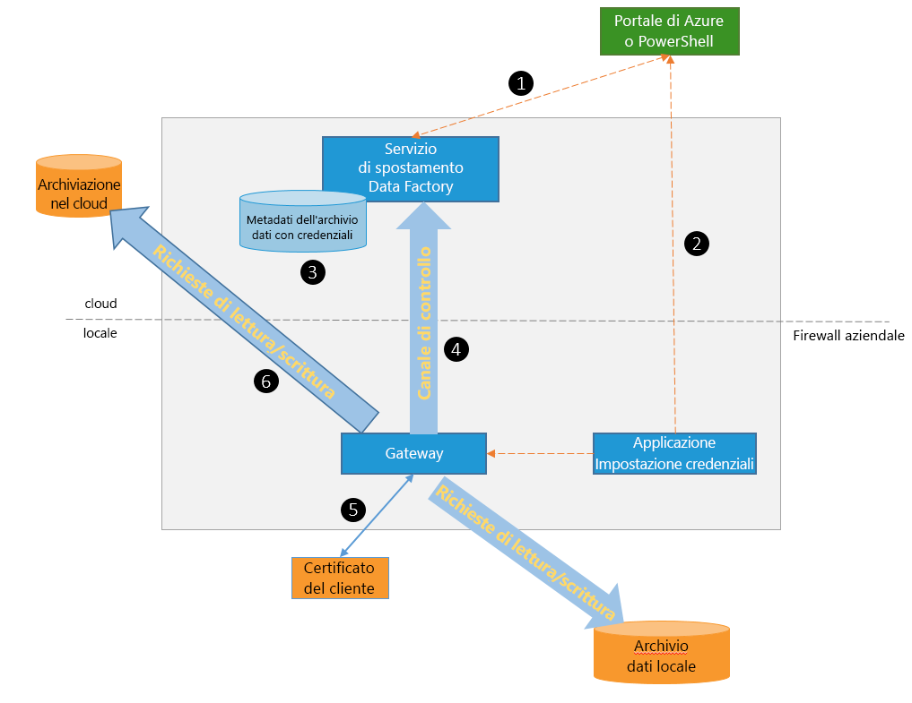

1. Lo sviluppatore di dati crea un gateway per un'istanza di Azure Data Factory usando il [portale di Azure](https://portal.azure.com) oppure un [cmdlet di PowerShell](https://msdn.microsoft.com/library/dn820234.aspx).
2. Viene creato un servizio collegato per un archivio dati locale specificando il gateway. Una parte della configurazione del servizio collegato consiste nell'uso dell'applicazione Impostazione credenziali per specificare i tipi di autenticazione e le credenziali.  La finestra di dialogo dell'applicazione Impostazione credenziali comunica con l'archivio dati per eseguire il test della connessione e con il gateway per salvare le credenziali.
3. Il gateway crittografa le credenziali tramite il certificato associato al gateway (fornito dallo sviluppatore) prima di salvare le credenziali nel cloud.
4. Il servizio Data Factory comunica con il gateway per la pianificazione e la gestione dei processi tramite un canale di controllo che usa una coda condivisa del bus di servizio di Azure. Quando occorre avviare il processo di attività di copia, Data Factory accoda la richiesta insieme alle informazioni sulle credenziali. Il gateway avvia il processo dopo avere eseguito il polling della coda.
5. Il gateway decrittografa le credenziali tramite lo stesso certificato e quindi si connette all'archivio dati locale con il tipo di autenticazione appropriato e le credenziali.
6. Il gateway copia i dati dall'archivio locale in una risorsa di archiviazione cloud o viceversa in base alla configurazione dell'attività di copia nella pipeline di dati. Per questo passaggio il gateway comunica direttamente con i servizi di archiviazione basati sul cloud, ad esempio BLOB di Azure su un canale protetto (HTTPS).

### <a name="considerations-for-using-gateway"></a>Considerazioni sull'uso del gateway
* Una singola istanza del gateway di gestione dati può essere usata per più origini dati locali. Tuttavia, **una singola istanza del gateway viene associata a un solo Data Factory di Azure** e non può essere condivisa con un altro Data Factory.
* In un computer può essere installata **una sola istanza del gateway di gestione dati**. Si supponga di avere due istanze di Data Factory che richiedono l'accesso alle origini dati locali: è necessario installare i gateway nei due computer locali. In altre parole, ogni gateway viene associato a un'istanza specifica di Data Factory.
* Il **gateway non deve trovarsi sullo stesso computer dell'origine dati**. Tuttavia, se i gateway sono posizionati in prossimità dell'origine dati, il tempo di connessione del gateway all'origine dati si riduce. Si consiglia di installare il gateway in un computer diverso da quello che ospita l'origine dati locale. Quando il gateway e l'origine dati si trovano in computer diversi non si contendono le risorse.
* È possibile disporre di **più gateway su diversi computer che si connettono alla stessa origine dati locale**. Ad esempio, potrebbero essere disponibili due gateway che servono due data factory, ma la stessa origine dati locale viene registrata con entrambe le data factory.
* Se un gateway è già installato nel computer per uno scenario **Power BI**, installare un **gateway separato per Azure Data Factory** in un altro computer.
* È necessario usare il gateway anche quando si usa **ExpressRoute**.
* Considerare l'origine dati come origine dati locale, ovvero protetta da firewall, anche quando si usa **ExpressRoute**. Usare il gateway per stabilire la connettività tra il servizio e l'origine dati.
* È necessario **usare il gateway** anche se l'archivio dati è nel cloud in una **VM IaaS di Azure**.

## <a name="installation"></a>Installazione
### <a name="prerequisites"></a>Prerequisiti
* Sono supportati i **sistemi operativi** Windows 7, Windows 8/8.1, Windows 10, Windows Server 2008 R2, Windows Server 2012 e Windows Server 2012 R2. L'installazione del gateway di gestione dati nel controller di dominio al momento non è supportata.
* È necessario .NET Framework 4.5.1 o versioni successive. Se si installa il gateway in un computer Windows 7, installare .NET Framework 4.5 o versioni successive. Per informazioni dettagliate, vedere [Requisiti di sistema di .NET Framework](https://msdn.microsoft.com/library/8z6watww.aspx) .
* La **configurazione** consigliata per il computer gateway è di almeno 2 GHz, 4 core, 8 GB di RAM e un disco da 80 GB.
* Se il computer host entra in stato di ibernazione, il gateway non risponde alle richieste di dati. Pertanto, configurare una **combinazione per il risparmio di energia** appropriata nel computer prima di installare il gateway. Se il computer è configurato per l'ibernazione, l'installazione del gateway invia un messaggio.
* È necessario essere un amministratore del computer per installare e configurare correttamente il gateway di gestione dati. È possibile aggiungere altri utenti al gruppo di Windows locale **Data Management Gateway Users**. I membri di questo gruppo possono usare lo strumento **Gestione configurazione di Gateway di gestione dati** per configurare il gateway.

Dato che le esecuzioni dell'attività di copia seguono una frequenza specifica, l'utilizzo delle risorse, ovvero CPU e memoria, nel computer segue lo stesso ciclo costituito da periodi di picco alternati a periodi di inattività. L'utilizzo delle risorse dipende molto anche dalla quantità di dati da spostare. Quando sono in corso più processi di copia, l'utilizzo delle risorse aumenta durante i periodi di picco.

### <a name="installation-options"></a>Opzioni di installazione
Il gateway di gestione dati può essere installato nei seguenti modi:

* Scaricando un pacchetto di installazione MSI dall' [Area download Microsoft](https://www.microsoft.com/download/details.aspx?id=39717).  Il pacchetto MSI può anche essere usato per aggiornare il gateway di gestione dati esistente alla versione più recente mantenendo tutte le impostazioni.
* Facendo clic sul collegamento **Scaricare e installare il gateway dati** in INSTALLAZIONE MANUALE o **Installa direttamente in questo computer** in INSTALLAZIONE RAPIDA. Vedere l'articolo [Spostare dati tra origini locali e il cloud mediante il Gateway di gestione dati](data-factory-move-data-between-onprem-and-cloud.md) per le istruzioni dettagliate sull'installazione rapida. Il passaggio manuale consente di accedere all'area download.  Le istruzioni per scaricare e installare il gateway dall'area download sono disponibili nella sezione successiva.

### <a name="installation-best-practices"></a>Procedure consigliate per l'installazione:
1. Configurare la combinazione per il risparmio di energia nel computer host del gateway in modo che il computer non entri in stato di ibernazione. Se il computer host entra in stato di ibernazione, il gateway non risponde alle richieste di dati.
2. Eseguire il backup del certificato associato al gateway.

### <a name="install-the-gateway-from-download-center"></a>Installare il gateway dall'Area download
1. Andare alla [pagina di download del Gateway di gestione dati di Microsoft](https://www.microsoft.com/download/details.aspx?id=39717).
2. Fare clic su **Scarica**, selezionare la versione appropriata (**a 32 bit** o **a 64 bit**) e fare clic su **Avanti**.
3. Eseguire direttamente il file **MSI** oppure salvarlo sul disco rigido ed eseguirlo.
4. Nella pagina di **benvenuto** selezionare una **lingua** e fare clic su **Avanti**.
5. **Accettare** il contratto di licenza e fare clic su **Avanti**.
6. Selezionare la **cartella** per installare il gateway e fare clic su **Avanti**.
7. Nella pagina **Pronto per l'installazione** fare clic su **Installa**.
8. Fare clic su **Fine** per completare l'installazione.
9. Ottenere la chiave dal portale di Azure. Vedere la sezione successiva per le istruzioni dettagliate.
10. Nella pagina **Registra gateway** di **Gestione configurazione di Gateway di gestione dati** in esecuzione sul computer in uso attenersi alla procedura seguente:
    1. Incollare la chiave nel testo.
    2. Facoltativamente, fare clic su **Mo_stra chiave del gateway** per visualizzare il testo della chiave.
    3. Fare clic su **Register**.

### <a name="register-gateway-using-key"></a>Registrare il gateway con la chiave
#### <a name="if-you-havent-already-created-a-logical-gateway-in-the-portal"></a>Se non è ancora stato creato un gateway logico nel portale
Per creare un gateway nel portale e ottenere la chiave dalla pagina **Configura**, seguire i passaggi della procedura dettagliata dell'articolo [Spostare dati tra origini locali e il cloud con Gateway di gestione dati](data-factory-move-data-between-onprem-and-cloud.md).    

#### <a name="if-you-have-already-created-the-logical-gateway-in-the-portal"></a>Se è già stato creato un gateway logico nel portale
1. Nel portale di Azure passare alla pagina **Data factory** e fare clic sul riquadro **Servizi collegati**.

    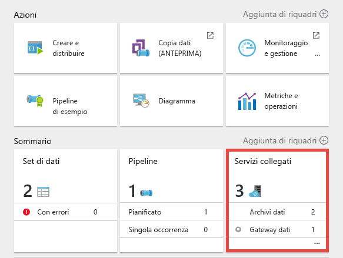
2. Nella pagina **Servizi collegati** selezionare il **gateway** logico creato nel portale.

    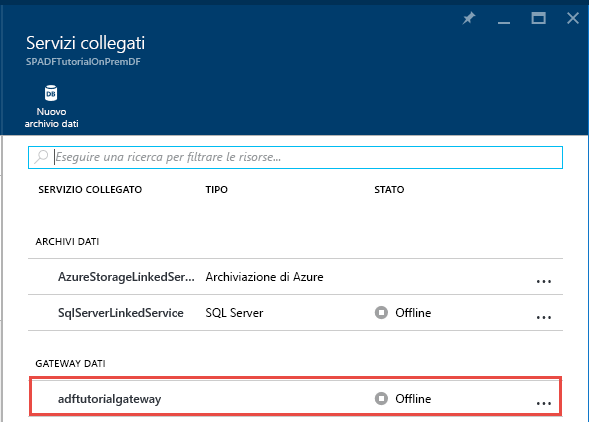  
3. Nella pagina **Gateway dati** fare clic su **Scaricare e installare il gateway dati**.

    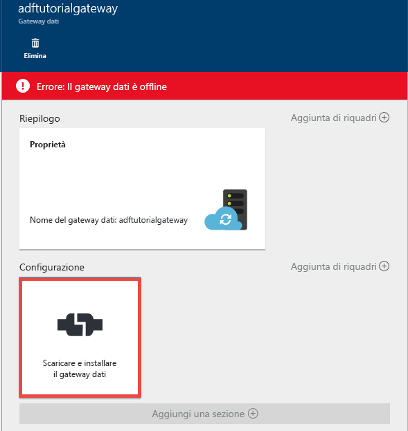   
4. Nella pagina **Configura** fare clic su **Ricrea chiave**. Fare clic su Sì nel messaggio di avviso dopo averlo letto con attenzione.

    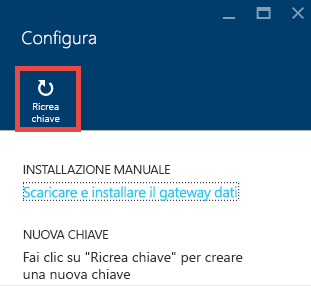
5. Fare clic su pulsante Copia accanto alla chiave. La chiave viene copiata negli Appunti.

    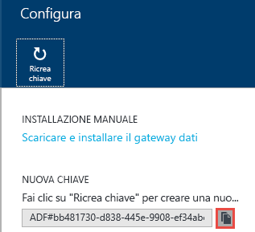

### <a name="system-tray-icons-notifications"></a>Notifiche/icone nell'area di notifica
L'immagine seguente mostra alcune delle icone visualizzate nell'area di notifica.

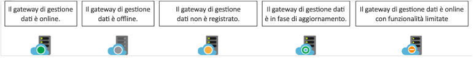

Spostando il cursore sul messaggio di notifica o sull'icona nell'area di notifica, vengono visualizzati i dettagli relativi allo stato del gateway o dell'operazione di aggiornamento in una finestra popup.

### <a name="ports-and-firewall"></a>Porte e firewall
È necessario considerare due firewall, ovvero il **firewall aziendale** in esecuzione nel router centrale dell'organizzazione e **Windows firewall**, configurato come servizio daemon nel computer locale in cui è installato il gateway.  

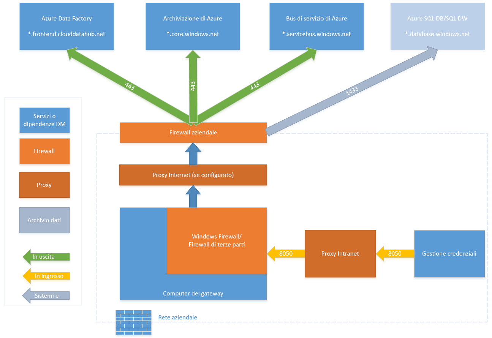

A livello di firewall aziendale è necessario configurare le porte in uscita e i domini seguenti:

| Nomi di dominio | Porte | Descrizione |
| --- | --- | --- |
| *.servicebus.windows.net |443, 80 |Utilizzato per la comunicazione con il backend Data Movement Service |
| *.core.windows.net |443 |Utilizzato per la copia di staging mediante il BLOB di Azure (se configurata)|
| *.frontend.clouddatahub.net |443 |Utilizzato per la comunicazione con il backend Data Movement Service |
| *.servicebus.windows.net |9350-9354, 5671 |Inoltro del bus di servizio su TCP facoltativo usato dalla Copia guidata |


A livello di Windows Firewall queste porte in uscita sono generalmente abilitate. In caso contrario, è possibile configurare le porte e i domini nel modo appropriato nel computer gateway.

> [!NOTE]
> 1. In base all'origine o ai sink, potrebbe essere necessario consentire altri domini e porte in uscita nel firewall aziendale o in Windows Firewall.
> 2. Per alcuni database cloud (ad esempio, [Database SQL di Azure](https://docs.microsoft.com/azure/sql-database/sql-database-configure-firewall-settings), [Azure Data Lake](https://docs.microsoft.com/azure/data-lake-store/data-lake-store-secure-data#set-ip-address-range-for-data-access) e così via), potrebbe essere necessario consentire l'indirizzo IP del computer gateway nella configurazione del firewall.
>
>


#### <a name="copy-data-from-a-source-data-store-to-a-sink-data-store"></a>Copiare dati da un archivio dati di origine a un archivio dati sink
Verificare che le regole del firewall siano abilitate correttamente sul firewall aziendale, su Windows Firewall nel computer del gateway e sull'archivio dati stesso, in modo da consentire al gateway di connettersi all'origine e al sink. Abilitare le regole per ogni archivio dati interessato dall'operazione di copia.

Ad esempio, per eseguire la copia da **un archivio dati locale a un sink di Database SQL di Azure o a un sink di SQL Data Warehouse di Azure**, attenersi alla procedura seguente:

* Consentire comunicazioni **TCP** in uscita sulla porta **1433** per Windows Firewall e il firewall aziendale.
* Configurare le impostazioni del firewall del server SQL di Azure aggiungendo l'indirizzo IP relativo al computer del gateway all'elenco degli indirizzi IP consentiti.

> [!NOTE]
> Se il firewall non consente la porta in uscita 1433, il gateway non riesce ad accedere direttamente ad Azure SQL. In questo caso, è possibile usare la [copia di staging](https://docs.microsoft.com/azure/data-factory/data-factory-copy-activity-performance#staged-copy) sul database SQL di Azure o SQL Azure DW. In questo scenario è necessario solo HTTPS (porta 443) per lo spostamento dei dati.
>
>


### <a name="proxy-server-considerations"></a>Considerazioni sui server proxy
Se l'ambiente di rete aziendale usa un server proxy per accedere a Internet, configurare il gateway di gestione dati per l'uso delle impostazioni proxy appropriate. È possibile impostare il proxy durante la fase di registrazione iniziale.

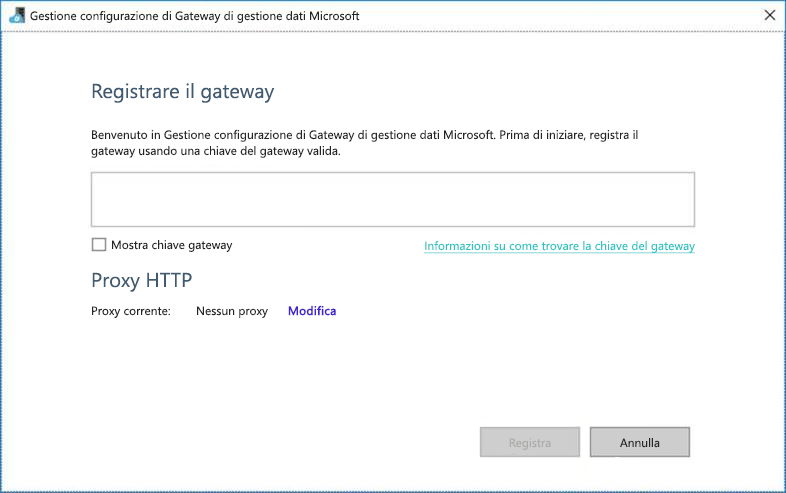

Il gateway usa il server proxy per connettersi al servizio cloud. Fare clic sul collegamento **Modifica** durante la configurazione iniziale. Viene visualizzata la finestra di dialogo **impostazione proxy** .

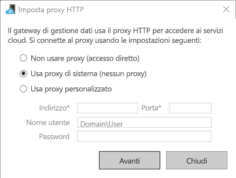

Sono disponibili tre opzioni di configurazione:

* **Non utilizzare proxy**: il gateway non usa in modo esplicito i proxy per connettersi ai servizi cloud.
* **Usa il proxy di sistema**: il gateway usa l'impostazione del proxy configurata in diahost.exe.config e diawp.exe.config.  Se non è stato configurato alcun proxy in diahost.exe.config e diawp.exe.config, il gateway si connette al servizio cloud direttamente senza passare attraverso il proxy.
* **Usa proxy personalizzato**: configurare le impostazioni del proxy HTTP che il gateway deve usare al posto delle configurazioni in diahost.exe.config e diawp.exe.config.  L'indirizzo e la porta sono valori obbligatori.  Nome utente e password sono facoltativi a seconda dell'impostazione di autenticazione del proxy.  Tutte le impostazioni vengono crittografate con il certificato delle credenziali del gateway e archiviate localmente nel computer che ospita il gateway.

Il servizio host del gateway di gestione dati viene riavviato automaticamente dopo avere salvato le impostazioni proxy aggiornate.

Dopo aver registrato correttamente il gateway, se si desidera visualizzare o aggiornare le impostazioni proxy, usare Gestione configurazione di Gateway di gestione dati.

1. Avviare **Gestione configurazione di Gateway di gestione dati**.
2. Passare alla scheda **Impostazioni** .
3. Fare clic sul collegamento **Cambia** nella sezione **Proxy HTTP** per avviare la finestra di dialogo **Imposta proxy HTTP**.  
4. Dopo aver selezionato il pulsante **Avanti** , una finestra di dialogo di avviso richiede l'autorizzazione per salvare le impostazioni del proxy e riavviare il servizio che ospita il gateway.

È possibile visualizzare e aggiornare il proxy HTTP tramite lo strumento Gestione configurazione.

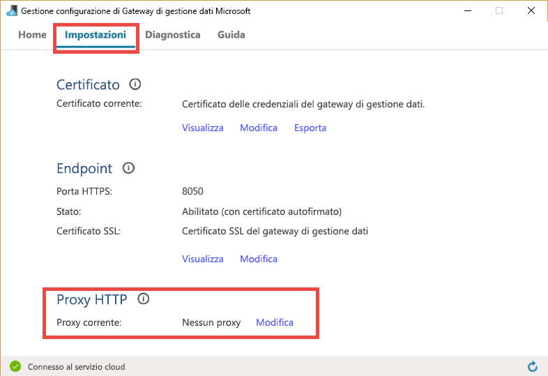

> [!NOTE]
> Se si configura un server proxy con autenticazione NTLM, il servizio che ospita il gateway viene eseguito nell'account di dominio. Se in un secondo momento si modifica la password per l'account di dominio, ricordarsi di aggiornare le impostazioni di configurazione per il servizio e riavviarlo. Per questo requisito, si consiglia di usare un account di dominio dedicato per accedere al server proxy che non richieda l'aggiornamento frequente della password.
>
>

### <a name="configure-proxy-server-settings"></a>Configurare le impostazioni del server proxy
Se si seleziona l'impostazione **Usa il proxy di sistema** per il proxy HTTP, il gateway usa l'impostazione proxy contenuta in diahost.exe.config e diawp.exe.config.  Se non è stato specificato alcun proxy in diahost.exe.config e diawp.exe.config, il gateway si connette al servizio cloud direttamente senza passare attraverso il proxy. La procedura seguente fornisce istruzioni per l'aggiornamento del file diahost.exe.config.  

1. In Esplora file creare una copia sicura di C:\Program Files\Microsoft Data Management Gateway\2.0\Shared\diahost.exe.config per eseguire il backup del file originale.
2. Avviare Notepad.exe come amministratore e aprire il file di testo "C:\Program Files\Microsoft Data Management Gateway\2.0\Shared\diahost.exe.config". Il tag predefinito per system.net viene trovato come indicato nel codice seguente:

         <system.net>
             <defaultProxy useDefaultCredentials="true" />
         </system.net>    

   È quindi possibile aggiungere i dettagli del server proxy, come illustrato nell'esempio seguente:

         <system.net>
               <defaultProxy enabled="true">
                     <proxy bypassonlocal="true" proxyaddress="http://proxy.domain.org:8888/" />
               </defaultProxy>
         </system.net>

   È possibile aggiungere altre proprietà all'interno del tag del proxy per specificare le impostazioni obbligatorie, ad esempio scriptLocation. Per informazioni sulla sintassi, vedere [Elemento proxy (Impostazioni di rete)](https://msdn.microsoft.com/library/sa91de1e.aspx) .

         <proxy autoDetect="true|false|unspecified" bypassonlocal="true|false|unspecified" proxyaddress="uriString" scriptLocation="uriString" usesystemdefault="true|false|unspecified "/>
3. Salvare il file di configurazione nel percorso originale, quindi riavviare il servizio che ospita il gateway di gestione dati per rilevare le modifiche. Per riavviare il servizio: con l'applet dei servizi dal Pannello di controllo o da **Gestione configurazione di Gateway di gestione dati** > fare clic sul pulsante **Arresta servizio** quindi su **Avvia servizio**. Se il servizio non viene avviato, è probabile che una sintassi non corretta del tag XML sia stata aggiunta al file di configurazione dell'applicazione modificato.

> [!IMPORTANT]
> Non dimenticare di aggiornare **entrambi i file**: diahost.exe.config e diawp.exe.config.  


Oltre ai punti precedenti, è necessario assicurarsi anche Microsoft Azure sia stato aggiunto all'elenco aziendale degli elementi consentiti. È possibile scaricare l'elenco di indirizzi IP validi per Microsoft Azure dall' [Area download Microsoft](https://www.microsoft.com/download/details.aspx?id=41653).

#### <a name="possible-symptoms-for-firewall-and-proxy-server-related-issues"></a>Possibili sintomi di problemi correlati al firewall e al server proxy
Se si verificano errori simili ai seguenti, è possibile che siano dovuti a una configurazione non corretta del firewall o del server proxy, che impedisce al gateway di connettersi a Data Factory per l'autenticazione. Per assicurarsi che la configurazione del firewall e del server proxy sia corretta, vedere la sezione precedente.

1. Quando si tenta di registrare il gateway, viene visualizzato l'errore seguente: "Impossibile registrare la chiave del gateway. Prima di provare di nuovo a registrare la chiave del gateway, verificare che lo stato di Gateway di gestione dati sia Connesso e che il servizio host di Gateway di gestione dati sia avviato".
2. Quando si apre Gestione configurazione, lo stato del gateway visualizzato può essere "Disconnesso" o "Connessione". Quando si visualizzano i registri eventi di Windows, in "Visualizzatore eventi" > "Registri applicazioni e servizi" > "Gateway di gestione dati", vengono visualizzati messaggi di errore simili al seguente: `Unable to connect to the remote server`
   `A component of Data Management Gateway has become unresponsive and restarts automatically. Component name: Gateway.`

### <a name="open-port-8050-for-credential-encryption"></a>Aprire la porta 8050 per la crittografia delle credenziali
L'applicazione **Impostazione credenziali** usa la porta in ingresso **8050** per inoltrare le credenziali al gateway quando si configura un servizio collegato locale nel portale di Azure. Durante la configurazione del gateway, l'installazione del gateway apre la porta nel computer gateway per impostazione predefinita.

Se si usa un firewall di terze parti, è possibile aprire manualmente la porta 8050. In caso di problemi del firewall durante la configurazione del gateway, è possibile provare a usare il comando seguente per installare il gateway senza configurare il firewall.

    msiexec /q /i DataManagementGateway.msi NOFIREWALL=1

Se si sceglie di non aprire la porta 8050 nel computer gateway, usare meccanismi diversi dall'uso dell'applicazione **Impostazione credenziali** per configurare le credenziali dell'archivio dati. È ad esempio possibile usare il cmdlet di PowerShell [New-AzureRmDataFactoryEncryptValue](https://msdn.microsoft.com/library/mt603802.aspx) . Per informazioni su come impostare le credenziali dell'archivio dati, vedere la sezione [Impostare le credenziali e la sicurezza](#set-credentials-and-securityy) .

## <a name="update"></a>Aggiornare
Per impostazione predefinita, il gateway di gestione dati viene aggiornato automaticamente quando è disponibile una versione più recente del gateway. Il gateway non viene aggiornato finché non vengono eseguite tutte le operazioni pianificate. Nessun'altra attività viene elaborata dal gateway fino al completamento dell'operazione di aggiornamento. Se l'aggiornamento non riesce, viene eseguito il rollback del gateway alla versione precedente.

L'ora dell'aggiornamento pianificato viene visualizzata nelle posizioni seguenti:

* Pagina delle proprietà del gateway nel portale di Azure.
* Home page di Gestione configurazione di Gateway di gestione dati
* Messaggi di notifica dell'aria di notifica

La scheda Home di Gestione configurazione di Gateway di gestione dati mostra la pianificazione dell'aggiornamento, nonché la data e l'ora dell'ultima installazione o dell'ultimo aggiornamento del gateway.

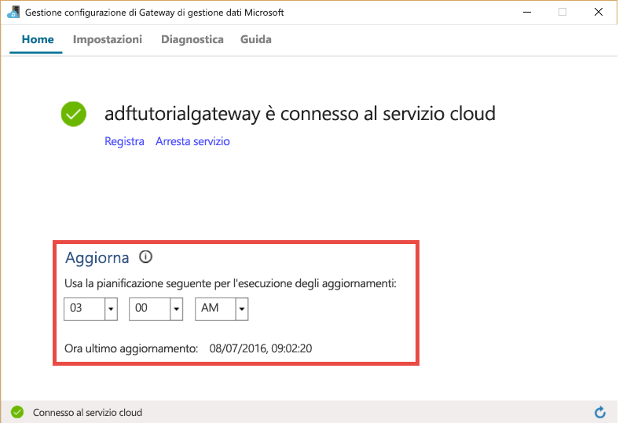

È possibile installare l'aggiornamento immediatamente o attendere che il gateway venga aggiornato automaticamente all'ora pianificata. Ad esempio, l'immagine seguente mostra il messaggio di notifica in Gestione configurazione del gateway con il pulsante Aggiorna su cui è possibile fare clic per avviare immediatamente l'installazione.

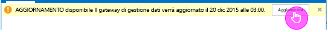

Il messaggio di notifica nell'area di notifica sarà simile all'immagine seguente:

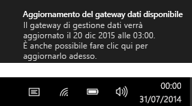

Lo stato dell'operazione di aggiornamento, manuale o automatica, viene visualizzato nell'area di notifica. Alla successiva apertura di Gestione configurazione del gateway verrà visualizzato un messaggio sulla barra di notifica per indicare che il gateway è stato aggiornato, insieme a un collegamento [all'argomento Novità](data-factory-gateway-release-notes.md).

### <a name="to-disableenable-auto-update-feature"></a>Per abilitare o disabilitare la funzionalità di aggiornamento automatico
È possibile abilitare/disabilitare la funzionalità di aggiornamento automatico con la procedura seguente:

[Per gateway a nodo singolo]
1. Avviare Windows PowerShell nel computer gateway.
2. Passare alla cartella C:\Program Files\Microsoft Data Management Gateway\2.0\PowerShellScript.
3. Eseguire il comando seguente per disattivare (disabilitare) la funzionalità di aggiornamento automatico.   

    ```PowerShell
    .\GatewayAutoUpdateToggle.ps1  -off
    ```
4. Per riattivarla:

    ```PowerShell
    .\GatewayAutoUpdateToggle.ps1  -on  
    ```
[Per il gateway a più nodi a disponibilità e scalabilità elevate (anteprima)](data-factory-data-management-gateway-high-availability-scalability.md)
1. Avviare Windows PowerShell nel computer gateway.
2. Passare alla cartella C:\Program Files\Microsoft Data Management Gateway\2.0\PowerShellScript.
3. Eseguire il comando seguente per disattivare (disabilitare) la funzionalità di aggiornamento automatico.   

    Per il gateway con funzionalità di disponibilità elevata (anteprima), è necessario un parametro di AuthKey aggiuntivo.
    ```PowerShell
    .\GatewayAutoUpdateToggle.ps1  -off -AuthKey <your auth key>
    ```
4. Per riattivarla:

    ```PowerShell
    .\GatewayAutoUpdateToggle.ps1  -on -AuthKey <your auth key> 
    ```

## <a name="configuration-manager"></a>Gestione configurazione
Dopo aver installato il gateway, è possibile avviare Gestione configurazione di Gateway di gestione dati in uno dei modi seguenti:

1. Nella finestra **Cerca** digitare **Gateway di gestione dati** per accedere a questa utilità.
2. Eseguire il file **ConfigManager.exe** nella cartella: **C:\Program Files\Microsoft Data Management Gateway\2.0\Shared**

### <a name="home-page"></a>Home page
Nella home page è possibile eseguire queste operazioni:

* Visualizzare lo stato del gateway, ad esempio per vedere se è connesso al servizio cloud e così via.
* **Registrare** usando una chiave dal portale.
* **Interrompere** e avviare **Servizio host di Gateway di gestione dati** sulla macchina gateway.
* **Pianificare gli aggiornamenti** in un orario specifico del giorno.
* Visualizzare la data dell' **ultimo aggiornamento**del gateway.

### <a name="settings-page"></a>Pagina Impostazioni
Nella pagina Impostazioni è possibile eseguire queste operazioni:

* Visualizzare, modificare ed esportare il **certificato** usato dal gateway. Questo certificato viene usato per crittografare le credenziali dell'origine dati.
* Modificare la **porta HTTPS** per l'endpoint. Il gateway apre una porta per impostare le credenziali dell'origine dati.
* **Stato** dell'endpoint
* La visualizzazione del **certificato SSL** viene usata per la comunicazione SSL tra il gateway e il portale per impostare le credenziali per le origini dati.  

### <a name="diagnostics-page"></a>Pagina diagnostica
La pagina diagnostica consente di eseguire queste operazioni:

* Abilitare la **registrazione**dettagliata, visualizzare i log nel visualizzatore eventi e inviare i log a Microsoft in caso di errore.
* **Test della connessione** su un'origine dati.  

### <a name="help-page"></a>Pagina della guida
Nella pagina Aiuto sono presenti le seguenti informazioni:  

* Breve descrizione del gateway
* Numero di versione
* Collegamenti alla Guida in linea, informativa sulla privacy e contratto di licenza.  

## <a name="monitor-gateway-in-the-portal"></a>Monitorare il gateway nel portale
Nel portale di Azure è possibile visualizzare lo snapshot in tempo quasi reale dell'utilizzo delle risorse, ad esempio CPU, memoria, rete (ingresso/uscita) e così via, in un computer gateway.  

1. Nel portale di Azure passare alla home page della data factory e fare clic sul riquadro **Servizi collegati**. 

    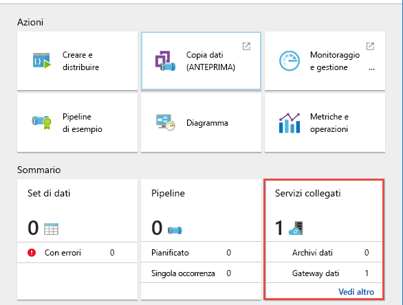 
2. Selezionare il **gateway** nella pagina **Servizi collegati**.

    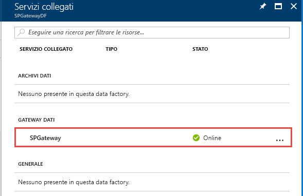
3. Nella pagina **Gateway** è possibile visualizzare l'utilizzo della memoria e della CPU del gateway.

     
4. Abilitare **Impostazioni avanzate** per visualizzare altri dettagli, ad esempio l'utilizzo della rete.
    
    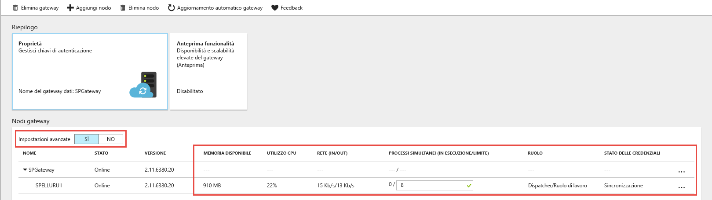

La tabella seguente contiene le descrizioni delle colonne dell'elenco **Nodi del gateway**:  

Proprietà monitoraggio | Descrizione
:------------------ | :---------- 
Nome | Nome del gateway logico e nodi associati al gateway. Il nodo è un computer Windows locale in cui è installato il gateway. Per informazioni sulla possibilità di avere più di un nodo (fino a quattro nodi) in un singolo gateway logico, vedere [Gateway di gestione dati: disponibilità elevata e scalabilità](data-factory-data-management-gateway-high-availability-scalability.md).    
Status | Stato del gateway logico e dei nodi del gateway. Esempio: Online/Offline/Limitato e così via. Per informazioni su questi stati, vedere la sezione [Stato del gateway](#gateway-status). 
Versione | Indica la versione del gateway logico e di ogni nodo del gateway. La versione del gateway logico viene determinata in base alla versione della maggior parte dei nodi del gruppo. Se nella configurazione del gateway logico sono presenti nodi con versioni diverse, solo i nodi con lo stesso numero di versione del gateway logico funzionano correttamente. Gli altri sono in modalità limitata e devono essere aggiornati manualmente (solo se l'aggiornamento automatico non riesce). 
Memoria disponibile | Memoria disponibile in un nodo del gateway. Questo valore è uno snapshot in tempo quasi reale. 
Uso della CPU | Utilizzo della CPU di un nodo del gateway. Questo valore è uno snapshot in tempo quasi reale. 
Rete (in/out) | Utilizzo della rete da parte di un nodo del gateway. Questo valore è uno snapshot in tempo quasi reale. 
Processi simultanei (in esecuzione/limite) | Numero di processi o di attività in esecuzione in ogni nodo. Questo valore è uno snapshot in tempo quasi reale. Per limite si intende il numero massimo di processi simultanei per ogni nodo. Questo valore viene definito in base alle dimensioni del computer. È possibile accrescere il limite per aumentare le prestazioni dell'esecuzione dei processi simultanei negli scenari avanzati, in cui CPU/memoria/rete sono sottoutilizzate, ma è in corso il timeout delle attività. Questa capacità è disponibile anche con un gateway a nodo singolo, anche quando la funzionalità di scalabilità e disponibilità non è abilitata.  
Ruolo | Esistono due tipi di ruoli in un gateway multinodo: dispatcher e ruolo di lavoro. Tutti i nodi sono ruoli di lavoro e quindi possono essere tutti usati per eseguire i processi. Esiste un solo nodo dispatcher, che viene usato per eseguire il pull di attività/processi dai servizi cloud e inviarli a nodi ruolo di lavoro diversi (incluso lo stesso nodo dispatcher).

In questa pagina vengono visualizzate alcune impostazioni che sono più appropriate con due o più nodi (scenario di aumento del numero di istanze) nel gateway. Per informazioni dettagliate sulla configurazione di un gateway multinodo, vedere [Gateway di gestione dati: disponibilità elevata e scalabilità](data-factory-data-management-gateway-high-availability-scalability.md).

### <a name="gateway-status"></a>Stato del gateway
La tabella seguente indica i possibili stati di un **nodo del gateway**: 

Status  | Commenti/Scenari
:------- | :------------------
Online | Nodo connesso al servizio Data Factory.
Offline | Il nodo è offline.
Aggiornamento | È in corso l'aggiornamento automatico del nodo.
Limitato | La causa è un problema di connettività, ad esempio un problema della porta HTTP 8050, di connettività del bus di servizio o di sincronizzazione delle credenziali. 
Inactive | Il nodo è in una configurazione diversa da quella della maggior parte degli altri nodi.<br/><br/> Un nodo può essere inattivo quando non riesce a connettersi agli altri nodi. 


La tabella seguente indica i possibili stati di un **gateway logico**. Lo stato del gateway dipende dagli stati dei nodi del gateway. 

Status | Commenti
:----- | :-------
Needs Registration (Registrazione necessaria) | Nessun nodo è ancora registrato per questo gateway logico
Online | I nodi del gateway sono online
Offline | Nessun nodo nello stato online.
Limitato | Non tutti i nodi in questo gateway sono in uno stato integro. Questo stato è un avviso indicante che qualche nodo potrebbe essere inattivo. <br/><br/>La causa potrebbe essere un problema di sincronizzazione delle credenziali nel nodo dispatcher/ruolo di lavoro. 

## <a name="scale-up-gateway"></a>Aumentare le prestazioni del gateway
È possibile configurare il numero di **processi di spostamento dati simultanei** che possono essere eseguiti in un nodo per aumentare le prestazioni dello spostamento dei dati tra archivi dati locali e cloud. 

Quando la memoria disponibile e la CPU non vengono utilizzate correttamente, ma la capacità inattiva è 0, è consigliabile aumentare le prestazioni accrescendo il numero di processi simultanei che possono essere eseguiti in un nodo. È anche possibile aumentare le prestazioni quando si verificano timeout delle attività perché il gateway è sovraccarico. Nelle impostazioni avanzate di un nodo del gateway è possibile aumentare la capacità massima di un nodo. 
  

## <a name="troubleshooting-gateway-issues"></a>Risoluzione dei problemi di gateway
Vedere l'articolo [Risoluzione dei problemi di gateway](data-factory-troubleshoot-gateway-issues.md) per informazioni e suggerimenti per la risoluzione dei problemi relativi all'uso del gateway di gestione dati.  

## <a name="move-gateway-from-one-machine-to-another"></a>Spostare il gateway da un computer a un altro
Questa sezione illustra la procedura per spostare il client del gateway da un computer a un altro.

1. Nel portale passare alla **Home page di Data Factory** e fare clic sul riquadro **Servizi collegati**.

    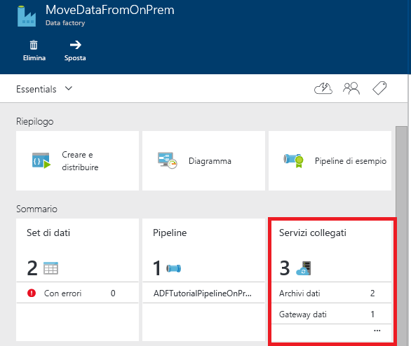
2. Selezionare il gateway nella sezione **GATEWAY DATI** della pagina **Servizi collegati**.

    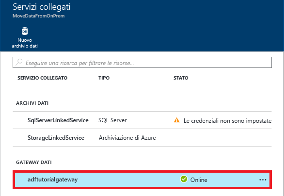
3. Nella pagina **Gateway dati** fare clic su **Scaricare e installare il gateway dati**.

    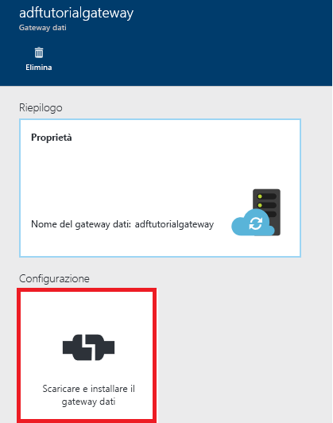
4. Nella pagina **Configura** fare clic su **Scaricare e installare il gateway dati** e seguire le istruzioni per installare il gateway dati nel computer.

    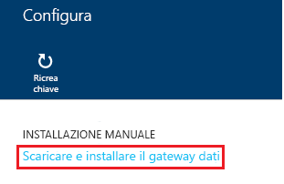
5. Tenere aperto **Gestione configurazione di Gateway di gestione dati di Microsoft** .

    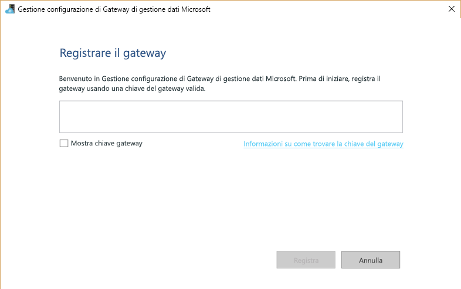    
6. Nella pagina **Configura** del portale fare clic su **Ricrea chiave** nella barra dei comandi e su **Sì** per il messaggio di avviso. Fare clic sul **pulsante Copia** accanto al testo della chiave per copiare la chiave negli Appunti. Il gateway nel computer precedente smette di funzionare non appena si ricrea la chiave.  

    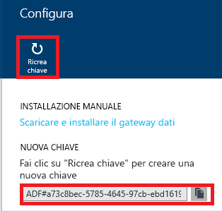
7. Incollare la **chiave** nella casella di testo nella pagina **Registra gateway** di **Gestione configurazione di Gateway di gestione dati** sul computer. (Facoltativo) Selezionare la casella di controllo **Mostra chiave del gateway** per visualizzare il testo della chiave.

    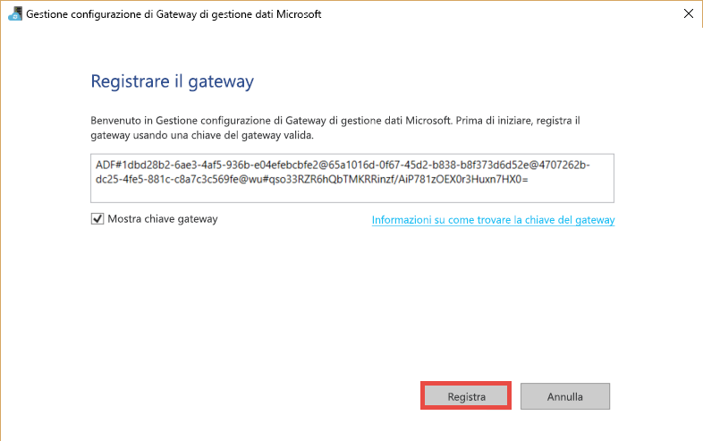
8. Fare clic su **Registra** per registrare il gateway con il servizio cloud.
9. Nella scheda **Impostazioni** fare clic su **Modifica** per selezionare lo stesso certificato usato con il gateway precedente, immettere la **password** e fare clic su **Fine**.

   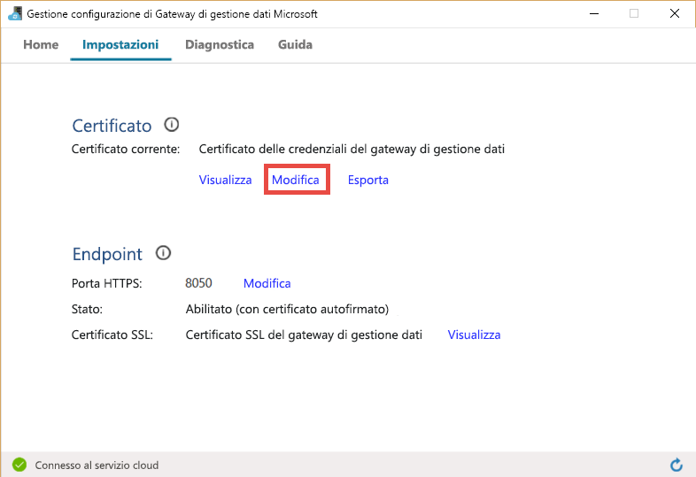

   È possibile esportare un certificato dal gateway precedente seguendo questa procedura: avviare Gestione configurazione di Gateway di gestione dati nel computer precedente, passare alla scheda **Certificato**, fare clic su **Esporta** e seguire le istruzioni.
10. Dopo la registrazione del gateway, nella home page di Gestione configurazione di Gateway di gestione dati verranno visualizzati **Registrazione** impostato su **Registrato** e **Stato** impostato su **Avviato**.

## <a name="encrypting-credentials"></a>Crittografia delle credenziali
Per crittografare le credenziali in Data Factory Editor, attenersi a questa procedura:

1. Avviare il Web browser nel **computer gateway**e passare al [portale di Azure](http://portal.azure.com). Cercare la data factory, se necessario, aprirla nella pagina **DATA FACTORY** e quindi fare clic su **Creare e distribuire** per avviare l'editor di Data Factory.   
2. Fare clic su un **servizio collegato** esistente nella visualizzazione struttura ad albero per vedere la relativa definizione JSON o creare un servizio collegato che richieda un gateway di gestione dati, ad esempio SQL Server o Oracle.
3. Nell'editor JSON specificare il nome del gateway per la proprietà **gatewayName** .
4. Immettere il nome del server per la proprietà **Origine dati** in **connectionString**.
5. Immettere il nome del server per la proprietà **Catalogo iniziale** in **connectionString**.    
6. Fare clic sul pulsante **Crittografa** sulla barra dei comandi per avviare l'applicazione ClickOnce **Gestione credenziali**. Verrà visualizzata la finestra di dialogo **Impostazione credenziali** .

    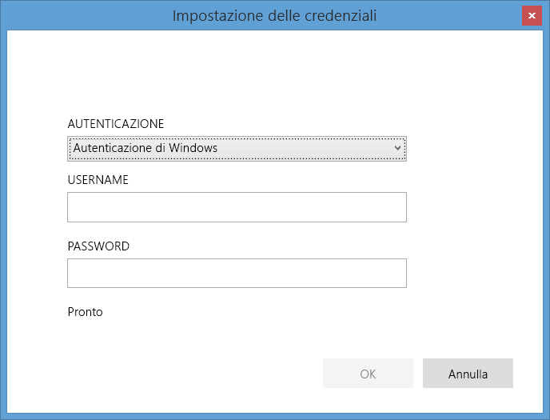
7. Nella finestra di dialogo **Impostazione credenziali** attenersi a questa procedura:
   1. Selezionare l' **autenticazione** che sarà usata dal servizio Data Factory per connettersi al database.
   2. Per l'impostazione **NOME UTENTE** immettere il nome dell'utente che ha accesso al database.
   3. Per l'impostazione **PASSWORD** immettere la password dell'utente.  
   4. Fare clic su **OK** per crittografare le credenziali e chiudere la finestra di dialogo.
8. Verrà ora visualizzata una proprietà **encryptedCredential** in **connectionString**.

    ```JSON
    {
        "name": "SqlServerLinkedService",
        "properties": {
            "type": "OnPremisesSqlServer",
            "description": "",
            "typeProperties": {
                "connectionString": "data source=myserver;initial catalog=mydatabase;Integrated Security=False;EncryptedCredential=eyJDb25uZWN0aW9uU3R",
                "gatewayName": "adftutorialgateway"
            }
        }
    }
    ```
Se si accede al portale da un computer diverso dal computer del gateway, è necessario assicurarsi che l'applicazione di gestione credenziali possa connettersi al computer del gateway. Se l'applicazione non riesce a raggiungere il computer gateway, non è possibile impostare le credenziali per l'origine dati e testare la connessione all'origine dati.  

Quando si usa l'applicazione di **Impostazione credenziali**, il portale crittografa le credenziali usando il certificato specificato nella scheda **Certificato** di **Gestione configurazione di Gateway** del computer gateway.

Se si vuole un approccio basato su API per crittografare le credenziali, è possibile usare il cmdlet di PowerShell [New-AzureRmDataFactoryEncryptValue](https://msdn.microsoft.com/library/mt603802.aspx) . Questo cmdlet consente di crittografare le credenziali mediante il certificato usato dal gateway. Aggiungere le credenziali crittografate all'elemento **EncryptedCredential** di **connectionString** nell'oggetto JSON. Usare l'oggetto JSON con il cmdlet [New AzureRmDataFactoryLinkedService](https://msdn.microsoft.com/library/mt603647.aspx) o nell'editor di Data Factory.

```JSON
"connectionString": "Data Source=<servername>;Initial Catalog=<databasename>;Integrated Security=True;EncryptedCredential=<encrypted credential>",
```

Esiste un altro approccio per impostare le credenziali usando l'editor delle data factory. Se si crea un servizio collegato di SQL Server usando l'editor e si immettono le credenziali in testo normale, le credenziali vengono crittografate tramite un certificato che appartiene al servizio Data Factory, NON tramite il certificato usato dal gateway. Anche se questo approccio può apparire leggermente più veloce, in alcuni casi risulta meno sicuro. È pertanto consigliabile seguire questo approccio solo per scopi di sviluppo o di test.

## <a name="powershell-cmdlets"></a>Cmdlet PowerShell
Questa sezione descrive come creare e registrare un gateway con i cmdlet di Azure PowerShell.

1. Avviare **Azure PowerShell** in modalità di amministrazione.
2. Accedere all'account Azure eseguendo il comando seguente e immettendo le credenziali di Azure.

    ```PowerShell
    Login-AzureRmAccount
    ```
3. Usare il cmdlet **New-AzureRmDataFactoryGateway** per creare un gateway logico come illustrato di seguito:

    ```PowerShell
    $MyDMG = New-AzureRmDataFactoryGateway -Name <gatewayName> -DataFactoryName <dataFactoryName> -ResourceGroupName ADF –Description <desc>
    ```
    **Comando di esempio e output**:

    ```
    PS C:\> $MyDMG = New-AzureRmDataFactoryGateway -Name MyGateway -DataFactoryName $df -ResourceGroupName ADF –Description “gateway for walkthrough”

    Name              : MyGateway
    Description       : gateway for walkthrough
    Version           :
    Status            : NeedRegistration
    VersionStatus     : None
    CreateTime        : 9/28/2014 10:58:22
    RegisterTime      :
    LastConnectTime   :
    ExpiryTime        :
    ProvisioningState : Succeeded
    Key               : ADF#00000000-0000-4fb8-a867-947877aef6cb@fda06d87-f446-43b1-9485-78af26b8bab0@4707262b-dc25-4fe5-881c-c8a7c3c569fe@wu#nfU4aBlq/heRyYFZ2Xt/CD+7i73PEO521Sj2AFOCmiI
    ```

1. In Azure PowerShell, passare alla cartella: **C:\Program Files\Microsoft Data Management Gateway\2.0\PowerShellScript\**. Eseguire **RegisterGateway.ps1** associato alla variabile locale **$Key** come illustrato nel comando seguente. Lo script registra l'agente client installato nel computer con il gateway logico creato in precedenza.

    ```PowerShell
    PS C:\> .\RegisterGateway.ps1 $MyDMG.Key
    ```
    ```
    Agent registration is successful!
    ```
    È possibile registrare il gateway in un computer remoto usando il parametro IsRegisterOnRemoteMachine. Esempio:

    ```PowerShell
    .\RegisterGateway.ps1 $MyDMG.Key -IsRegisterOnRemoteMachine true
    ```
2. È possibile usare il cmdlet **Get-AzureRmDataFactoryGateway** per ottenere l'elenco di gateway nell'istanza di Data factory. Quando lo **stato** è **online**, il gateway è pronto per essere usato.

    ```PowerShell        
    Get-AzureRmDataFactoryGateway -DataFactoryName <dataFactoryName> -ResourceGroupName ADF
    ```
È possibile rimuovere un gateway con il cmdlet **Remove-AzureRmDataFactoryGateway** e aggiornare la descrizione per un gateway usando i cmdlet **Set-AzureRmDataFactoryGateway**. Per la sintassi e altri dettagli relativi a questi cmdlet, vedere Riferimento ai cmdlet di Data Factory.  

### <a name="list-gateways-using-powershell"></a>Elencare i gateway usando PowerShell

```PowerShell
Get-AzureRmDataFactoryGateway -DataFactoryName jasoncopyusingstoredprocedure -ResourceGroupName ADF_ResourceGroup
```

### <a name="remove-gateway-using-powershell"></a>Rimuovere il gateway usando PowerShell

```PowerShell
Remove-AzureRmDataFactoryGateway -Name JasonHDMG_byPSRemote -ResourceGroupName ADF_ResourceGroup -DataFactoryName jasoncopyusingstoredprocedure -Force
```


## <a name="next-steps"></a>Passaggi successivi
* Vedere l'articolo [Spostare dati tra archivi dati locali e cloud](data-factory-move-data-between-onprem-and-cloud.md) . In questa procedura dettagliata viene creata una pipeline che usa il gateway per spostare i dati da un database di SQL Server locale a un BLOB di Azure.  
