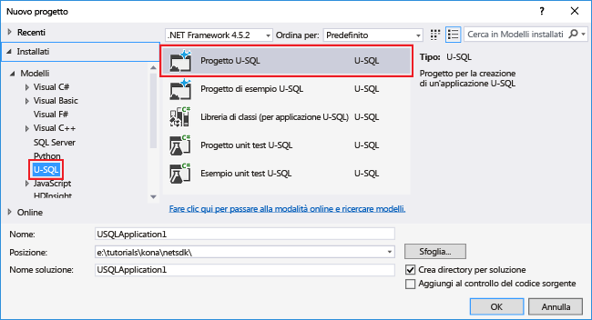

<properties
   pageTitle="Analizzare i log dei siti Web con Analisi Azure Data Lake | Azure"
   description="Informazioni su come analizzare i log dei siti Web con Analisi Azure Data Lake."
   services="data-lake-analytics"
   documentationCenter=""
   authors="mumian"
   manager="paulettm"
   editor="cgronlun"/>

<tags
   ms.service="data-lake-analytics"
   ms.devlang="na"
   ms.topic="article"
   ms.tgt_pltfrm="na"
   ms.workload="big-data"
   ms.date="12/01/2015"
   ms.author="jgao"/>

# Esercitazione: Analizzare i log dei siti Web con Analisi Azure Data Lake

Informazioni su come analizzare i log dei siti Web con Analisi Data Lake, in particolare come scoprire quali referrer hanno riscontrato errori durante la visita al il sito Web.

>[AZURE.NOTE] Se si vuole solo vedere l'applicazione in funzione, per risparmiare tempo è possibile vedere [Usare le esercitazioni interattive su Analisi Azure Data Lake](data-lake-analytics-use-interactive-tutorials.md). Questa esercitazione si basa sullo stesso scenario e sullo stesso codice. Lo scopo di questa esercitazione è fornire agli sviluppatori l'esperienza di creazione ed esecuzione di un'applicazione di Analisi Azure Data Lake dall'inizio alla fine.

## Prerequisiti:

- **Visual Studio 2015, Visual Studio 2013 Update 4 o Visual Studio 2012 con installato Visual C++**.
- **Microsoft Azure SDK per .NET versione 2.5 o successiva**. Installarlo usando il [programma di installazione della piattaforma Web](http://www.microsoft.com/web/downloads/platform.aspx).
- **[Data Lake Tools per Visual Studio](http://aka.ms/adltoolsvs)**.

	Dopo avere installato Data Lake Tools per Visual Studio, in Visual Studio verrà visualizzato il menu **Data Lake**:

	

- **Conoscenza di base di Analisi Data Lake e Data Lake Tools per Visual Studio**. Per iniziare, vedere:

	- [Introduzione ad Analisi Data Lake di Azure con il portale di Azure](data-lake-analytics-get-started-portal.md).
	- [Sviluppare script U-SQL con Data Lake Tools per Visual Studio](data-lake-analytics-data-lake-tools-get-started.md).

- **Account Analisi Data Lake.** Vedere [Creare un account Analisi Azure Data Lake](data-lake-analytics-get-started-portal.md#create_adl_analytics_account).

	Data Lake Tools non supporta la creazione degli account Analisi Data Lake. Sarà quindi necessario creare questi account tramite il portale di Azure, Azure PowerShell, .NET SDK o l'interfaccia della riga di comando di Azure.
- **Caricare i dati di esempio nell'account Analisi Data Lake.** Vedere [Caricare SearchLog.tsv nell'account predefinito Archivio Data Lake](data-lake-analytics-get-started-portal.md#update-data-to-the-default-adl-storage-account).

    Per eseguire un processo di Analisi Data Lake, sanno necessari alcuni dati. Anche se Data Lake Tools supporta il caricamento di dati, si userà il portale per caricare i dati di esempio e seguire più facilmente questa esercitazione.

## Connettersi ad Azure

Prima di poter compilare e testare qualsiasi script U-SQL, è necessario connettersi ad Azure.

**Per connettersi ad Analisi Data Lake**

1. Aprire Visual Studio.
2. Nel menu **Data Lake** fare clic su **Opzioni e impostazioni**.
4. Fare clic su **Accedi** o **Cambia utente** se un altro utente ha già eseguito l'accesso e seguire le istruzioni.
5. Fare clic su **OK** per chiudere la finestra di dialogo Opzioni e impostazioni.

**Per accedere agli account Analisi Data Lake personali**

1. In Visual Studio aprire **Esplora server** premendo i tasti **CTRL + ALT + S**.
2. Da **Esplora server** espandere **Azure** e quindi **Analisi Data Lake**. Verrà visualizzato l'elenco degli account Analisi Data Lake personali, se disponibili. Non è possibile creare account Analisi Data Lake da Visual Studio. Per creare un account, vedere [Introduzione ad Analisi di Azure Data Lake tramite il portale di Azure](data-lake-analytics-get-started-portal.md) o [Introduzione ad Analisi Data Lake di Azure mediante Azure PowerShell](data-lake-analytics-get-started-powershell.md).

## Sviluppare un'applicazione U-SQL

Un'applicazione U-SQL è principalmente uno script U-SQL. Per altre informazioni su U-SQL, vedere [Introduzione a U-SQL](data-lake-analytics-u-sql-get-started.md).

È possibile aggiungere all'applicazione operatori addizione definiti dall'utente. Per altre informazioni, vedere [Sviluppare operatori U-SQL definiti dall'utente per i processi di Analisi Data Lake](data-lake-analytics-u-sql-develop-user-defined-operators.md).

**Per creare e inviare un processo di Analisi Data Lake**

1. Scegliere **Nuovo** dal menu **File** e quindi fare clic su **Progetto**.
2. Selezionare il tipo Progetto U-SQL.

	

3. Fare clic su **OK**. Visual Studio crea una soluzione con un file Script.usql.
4. Immettere lo script seguente nel file Script.usql:

        // Create a database for easy reuse, so you don't need to read from a file every time.
        CREATE DATABASE IF NOT EXISTS SampleDBTutorials;

        // Create a Table valued function. TVF ensures that your jobs fetch data from the weblog file with the correct schema.
        DROP FUNCTION IF EXISTS SampleDBTutorials.dbo.WeblogsView;
        CREATE FUNCTION SampleDBTutorials.dbo.WeblogsView()
        RETURNS @result TABLE
        (
            s_date DateTime,
            s_time string,
            s_sitename string,
            cs_method string,
            cs_uristem string,
            cs_uriquery string,
            s_port int,
            cs_username string,
            c_ip string,
            cs_useragent string,
            cs_cookie string,
            cs_referer string,
            cs_host string,
            sc_status int,
            sc_substatus int,
            sc_win32status int,
            sc_bytes int,
            cs_bytes int,
            s_timetaken int
        )
        AS
        BEGIN

            @result = EXTRACT
                s_date DateTime,
                s_time string,
                s_sitename string,
                cs_method string,
                cs_uristem string,
                cs_uriquery string,
                s_port int,
                cs_username string,
                c_ip string,
                cs_useragent string,
                cs_cookie string,
                cs_referer string,
                cs_host string,
                sc_status int,
                sc_substatus int,
                sc_win32status int,
                sc_bytes int,
                cs_bytes int,
                s_timetaken int
            FROM @"/Samples/Data/WebLog.log"
            USING Extractors.Text(delimiter:' ');
		    RETURN;
		END;

        // Create a table for storing referrers and status
        DROP TABLE IF EXISTS SampleDBTutorials.dbo.ReferrersPerDay;
        @weblog = SampleDBTutorials.dbo.WeblogsView();
        CREATE TABLE SampleDBTutorials.dbo.ReferrersPerDay
        (
            INDEX idx1
            CLUSTERED(Year ASC)
            PARTITIONED BY HASH(Year)
        ) AS

        SELECT s_date.Year AS Year,
            s_date.Month AS Month,
            s_date.Day AS Day,
            cs_referer,
            sc_status,
            COUNT(DISTINCT c_ip) AS cnt
        FROM @weblog
        GROUP BY s_date,
                cs_referer,
                sc_status;

    Per informazioni su U-SQL, vedere [Introduzione al linguaggio U-SQL con Analisi Data Lake](data-lake-analytics-u-sql-get-started.md).

5. Aggiungere al progetto un nuovo script U-SQL e immettere quanto segue:

        // Query the referrers that ran into errors
        @content =
            SELECT *
            FROM SampleDBTutorials.dbo.ReferrersPerDay
            WHERE sc_status >=400 AND sc_status < 500;

        OUTPUT @content
        TO @"/Samples/Outputs/UnsuccessfulResponses.log"
        USING Outputters.Tsv();

6. Tornare al primo script U-SQL e accanto al pulsante **Invia**, specificare l'account di analisi.
7. In **Esplora soluzioni** fare clic con il pulsante destro del mouse su **Script.usql** e quindi fare clic su **Compila script**. Verificare il risultato nel riquadro di output.
8. In **Esplora soluzioni** fare clic con il pulsante destro del mouse su **Script.usql** e quindi fare clic su **Invia script**.
9. Verificare che **Account Analisi** sia quello in cui si vuole eseguire il processo e quindi fare clic su **Invia**. Al termine della procedura di invio, nella finestra dei risultati di Data Lake Tools per Visual Studio saranno disponibili i risultati dell'operazione di invio e il collegamento al processo.
10. Attendere che il processo venga completato. Se il processo non riesce, è molto probabile che manchi il file di origine. Vedere la sezione Prerequisiti di questa esercitazione. Per altre informazioni sulla risoluzione dei problemi, vedere [Monitoraggio e risoluzione dei problemi dei processi di Analisi Azure Data Lake](data-lake-analytics-monitor-and-troubleshoot-jobs-tutorial.md).

    Una volta completato il processo, verrà visualizzata la schermata seguente:

    

11. Ripetere i passaggi da 7 a 10 per **Script1.usql**.

>[AZURE.NOTE]Non è possibile leggere o scrivere in una tabella U-SQL che è stata creata o modificata nello stesso script. Ecco perché vengono usati due script per questo esempio.

**Per visualizzare l'output del processo**

1. Da **Esplora server** espandere **Azure**, quindi **Analisi Data Lake**, l'account di Analisi Data Lake personale e infine **Account di archiviazione**. Fare doppio clic sull'account di archiviazione predefinito di Data Lake e quindi fare clic su **Esplora**.
2.  Fare doppio clic su **Esempi** per aprire la cartella e quindi su **Output**.
3.  Fare doppio clic su **UnsuccessfulResponsees.log**.
4.  È anche possibile fare doppio clic sul file di output nella visualizzazione grafico del processo per passare direttamente al file di output.

## Vedere anche

Per iniziare a usare Analisi Data Lake usando vari tipi di strumenti, vedere:

- [Introduzione a Analisi Data Lake tramite il portale di Azure](data-lake-analytics-get-started-portal.md)
- [Introduzione ad Azure Data Lake Analytics con Azure PowerShell](data-lake-analytics-get-started-powershell.md)
- [Introduzione ad Analisi Data Lake mediante .NET SDK](data-lake-analytics-get-started-net-sdk.md)

Per vedere altri argomenti relativi allo sviluppo:

- [Sviluppare script U-SQL con Data Lake Tools per Visual Studio](data-lake-analytics-data-lake-tools-get-started.md)
- [Introduzione al linguaggio U-SQL di Analisi Azure Data Lake](data-lake-analytics-u-sql-get-started.md)
- [Sviluppare operatori U-SQL definiti dall'utente per i processi di Analisi Data Lake](data-lake-analytics-u-sql-develop-user-defined-operators.md)

<!---HONumber=AcomDC_0413_2016-->