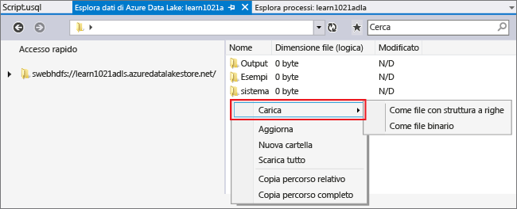
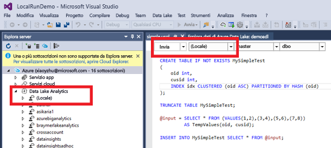
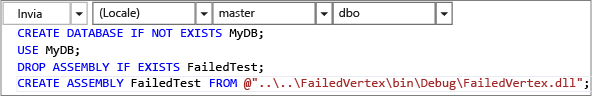

<properties 
   pageTitle="Sviluppare script U-SQL tramite Strumenti di Data Lake per Visual Studio | Azure" 
   description="Informazioni su come installare Strumenti di Data Lake per Visual Studio e come sviluppare e testare script U-SQL." 
   services="data-lake-analytics" 
   documentationCenter="" 
   authors="mumian" 
   manager="paulettm" 
   editor="cgronlun"/>
 
<tags
   ms.service="data-lake-analytics"
   ms.devlang="na"
   ms.topic="get-started-article"
   ms.tgt_pltfrm="na"
   ms.workload="big-data" 
   ms.date="02/10/2016"
   ms.author="jgao"/>

# Esercitazione: Sviluppare script U-SQL tramite Strumenti di Data Lake per Visual Studio

[AZURE.INCLUDE [get-started-selector](../../includes/data-lake-analytics-selector-get-started.md)]

Informazioni su come installare Strumenti di Data Lake per Visual Studio e usarlo per scrivere e testare script U-SQL.

U-SQL è un linguaggio estremamente scalabile e facilmente estendibile per la preparazione, la trasformazione e l'analisi di tutti i dati presenti nel data lake e non solo. Per altre informazioni, vedere la pagina di [riferimento su U-SQL](http://go.microsoft.com/fwlink/p/?LinkId=691348).

###Prerequisiti

- **Visual Studio 2015, Visual Studio 2013 Update 4 oppure Visual Studio 2012 con Visual C++ installato** 
- **Microsoft Azure SDK per .NET versione 2.7.1 o successiva**. Installarlo usando il [programma di installazione della piattaforma Web](http://www.microsoft.com/web/downloads/platform.aspx).
- **[Strumenti di Data Lake per Visual Studio](http://aka.ms/adltoolsvs)**. 

    Dopo aver installato Strumenti di Data Lake per Visual Studio, in Visual Studio verrà visualizzato il menu Data Lake:
    
    

- **Eseguire le procedure descritte nelle due sezioni seguenti, disponibili nell'articolo [Introduzione a Analisi di Azure Data Lake con il portale di Azure](data-lake-analytics-get-started-portal.md)**.

	- [Creare un account di Analisi Azure Data Lake](data-lake-analytics-get-started-portal.md#create_adl_analytics_account).
	- [Caricare SearchLog.tsv nell'account di archiviazione predefinito di Data Lake](data-lake-analytics-get-started-portal.md#update-data-to-the-default-adl-storage-account).

    Per comodità, uno script di esempio di PowerShell per la creazione di un servizio di Analisi Data Lake e per il caricamento di file dei dati di origine è disponibile in [Appendice: Esempio di PowerShell per la preparazione dell'esercitazione](data-lake-analytics-data-lake-tools-get-started.md#appx-a-powershell-sample-for-preparing-the-tutorial).
    
	Data Lake Tools non supporta la creazione degli account Analisi Data Lake. Sarà quindi necessario creare questi account tramite il portale di Azure, Azure PowerShell, .NET SDK o l'interfaccia della riga di comando di Azure. Per eseguire un processo di Analisi Data Lake, sanno necessari alcuni dati. Anche se Data Lake Tools supporta il caricamento di dati, si userà il portale per caricare i dati di esempio e seguire più facilmente questa esercitazione.

## Connettersi ad Azure

**Per connettersi ad Analisi Data Lake**

1. Aprire Visual Studio.
2. Scegliere **Esplora server** dal menu **Visualizza** per aprire Esplora server. In alternativa, premere **[CTRL] + [ALT] + S**.
3. Fare clic con il pulsante destro del mouse su **Azure**, fare clic su "Connetti a sottoscrizioni di Microsoft Azure" e quindi seguire le istruzioni.
4. Da **Esplora server** espandere **Azure** e quindi **Analisi Data Lake**. Verrà visualizzato l'elenco degli account di Analisi Data Lake personali, se disponibili. Non è possibile creare account di Analisi Data Lake da Visual Studio. Per creare un account, vedere [Introduzione a Analisi di Azure Data Lake con il portale di Azure](data-lake-analytics-get-started-portal.md) o [Introduzione a Analisi di Azure Data Lake con Azure PowerShell](data-lake-analytics-get-started-powershell.md).

## Caricare i file dei dati di origine

Alcuni dati sono già stati caricati nell'ambito della sezione **Prerequisiti** di questa esercitazione.

Nel caso in cui si preferisca usare dati personali, di seguito sono riportate le procedure da seguire per caricare dati da Strumenti di Data Lake.

**Per caricare file nell'account Azure Data Lake dipendente**

1. Da **Esplora server** espandere **Azure**, quindi **Analisi Data Lake**, l'account di Analisi Data Lake personale e infine **Account di archiviazione**. Verrà visualizzato l'account di archiviazione predefinito di Data Lake, con gli account di archiviazione di Data Lake e gli account di Archiviazione di Azure collegati. L'account di archiviazione predefinito di Data Lake è contraddistinto dall'etichetta "Account di archiviazione predefinito".
2. Fare doppio clic sull'account di archiviazione predefinito di Data Lake e quindi fare clic su **Esplora**. Viene visualizzato il pannello di esplorazione relativo a Strumenti di Data Lake per Visual Studio. Nella parte sinistra è presente una visualizzazione albero, mentre la visualizzazione contenuto è disponibile sulla destra.
3. Selezionare la cartella in cui si desidera caricare i file. 
4. Fare clic con il pulsante destro del mouse su uno spazio vuoto e fare clic su **Carica**. 

	

**Per caricare file in un account di archiviazione BLOB di Azure collegato**

1. Da **Esplora server** espandere **Azure**, quindi **Analisi Data Lake**, l'account di Analisi Data Lake personale e infine **Account di archiviazione**. Verrà visualizzato l'account di archiviazione predefinito di Data Lake, con gli account di archiviazione di Data Lake e gli account di Archiviazione di Azure collegati. 
2. Espandere l'account di Archiviazione di Azure.
3. Fare clic con il pulsante destro del mouse sul contenitore in cui si vuole caricare i file e quindi fare clic su **Esplora**. Se non è disponibile, creare prima di tutto un contenitore usando il portale di Azure, Azure PowerShell o altri strumenti.
4. Selezionare la cartella in cui si desidera caricare i file. 
5. Fare clic con il pulsante destro del mouse su uno spazio vuoto e fare clic su **Carica**. 

## Sviluppare script U-SQL 

I processi di Data Lake Analtyics vengono scritti nel linguaggio U-SQL. Per altre informazioni su U-SQL, vedere [Introduzione al linguaggio U-SQL](data-lake-analytics-u-sql-get-started.md) e [Informazioni di riferimento sul linguaggio U-SQL](http://go.microsoft.com/fwlink/?LinkId=691348).

**Per creare e inviare un processo di Analisi Data Lake**

1. Scegliere **Nuovo** dal menu **File** e quindi fare clic su **Progetto**.
2. Selezionare il tipo **Progetto U-SQL**.

	

3. Fare clic su **OK**. Visual Studio crea una soluzione con un file **Script.usql**.
4. Immettere lo script seguente in **Script.usql**:

        @searchlog =
            EXTRACT UserId          int,
                    Start           DateTime,
                    Region          string,
                    Query           string,
                    Duration        int?,
                    Urls            string,
                    ClickedUrls     string
            FROM "/Samples/Data/SearchLog.tsv"
            USING Extractors.Tsv();

		@res =
		    SELECT *
		    FROM @searchlog;        

        OUTPUT @searchlog   
            TO "/Output/SearchLog-from-Data-Lake.csv"
        USING Outputters.Csv();

	Questo script U-SQL legge il file dei dati di origine mediante **Extractors.Tsv()** e quindi crea un file con estensione csv mediante **Outputters.Csv()**.
    
    Non modificare i due percorsi, a meno che il file di origine non sia stato copiato in una posizione diversa. Analisi Data Lake creerà la cartella di output, se non esiste già.
	
	Risulta più semplice usare i percorsi relativi dei file archiviati negli account predefiniti di Data Lake, ma è possibile usare anche percorsi assoluti. Ad esempio
    
        adl://<Data LakeStorageAccountName>.azuredatalakestore.net:443/Samples/Data/SearchLog.tsv
        
    È necessario usare percorsi assoluti per accedere ai file presenti negli account di archiviazione collegati. La sintassi dei file presenti in un account di Archiviazione di Azure collegato è:
    
        wasb://<BlobContainerName>@<StorageAccountName>.blob.core.windows.net/Samples/Data/SearchLog.tsv

    >[AZURE.NOTE] Non sono attualmente supportate autorizzazioni di accesso a contenitori pubblici o a contenitori BLOB di Azure con BLOB pubblici.

	Prestare attenzione alle funzionalità seguenti:

	- **IntelliSense**
	 
		Per le entità seguenti vengono visualizzati il nome completato in modo automatico e i membri: Rowset, Classes, Databases, Schemas e User Defined Objects (UDO).
		 
		IntelliSense per le entità di catalogo (Databases, Schemas, Tables, UDO, e così via) è correlato all'account di calcolo personale. È possibile controllare l'account di calcolo, il database e lo schema attualmente attivi nella barra degli strumenti superiore e sostituirli tramite gli elenchi a discesa.
 
    - **Espandere le colonne con il simbolo dell'asterisco * **

        Cliccando a destra del simbolo *, verrà visualizzata una sottolineatura blu sotto l'asterisco. Passare il puntatore del mouse sulla sottolineatura blu e quindi fare clic sulla freccia rivolta verso il basso.
	! [Strumenti di Data Lake per Visual Studio espande l'asterisco] (./media/data-lake-analytics-data-lake-tools-get-started/data-lake-analytics-data-lake-tools-expand-asterisk.png)

        Fare clic su **Espandi colonne** e lo strumento sostituirà l'asterisco con i nomi di colonna.
    
	- **Formattazione automatica**
	
		Gli utenti possono modificare il rientro dello script di ambito in base alla struttura di codice definita in Modifica->Avanzate:
  
		- Formatta documento (Ctrl + E, D): formatta l'intero documento   
		- Formatta selezione (Ctrl+K, Ctrl+F): formatta la selezione. Se non è stata effettuata alcuna selezione, questo collegamento formatta la riga in cui si trova il cursore.  
		
		Tutte le regole di formattazione possono essere configurate in Strumenti->Opzioni->Editor di testo->SIP->Formattazione.  
	- **Rientro automatico**
	 
		Strumenti di Data Lake per Visual Studio è in grado di impostare automaticamente il rientro delle espressioni durante la scrittura degli script. Per attivare questa funzionalità, disabilitata per impostazione predefinita, è necessario selezionare U-SQL->Opzioni e impostazioni->Opzione->Abilita rientro automatico.

	- **Vai a definizione e Trova tutti i riferimenti**
	
		Fare clic con il pulsante destro del mouse sul nome di un set di righe/parametro/colonna/UDO e fare clic su Vai a definizione (F12) per accedere alla relativa definizione. Facendo clic su Trova tutti i riferimenti (Shift+F12) verranno invece visualizzati tutti i riferimenti.

	- **Inserimento di percorsi di Azure**
		
		Con Strumenti di Data Lake per Visual Studio non sarà più necessario ricordare il percorso del file di Azure e digitarlo manualmente, ma sarà sufficiente fare clic con il pulsante destro del mouse sull'editor e selezionare Inserisci percorso di Azure. Selezionare il file nella finestra di dialogo del browser relativo al BLOB di Azure. Fare clic su **OK**. Il percorso del file verrà inserito nel codice personale.

5. Specificare l'account di Analisi Data Lake, il database e lo schema. È possibile selezionare **(local)** per eseguire lo script in locale per finalità di testing. Per altre informazioni, vedere [Eseguire U-SQL in locale](#run-u-sql-locally).

	

    Per altre informazioni, vedere [Usare il catalogo di U-SQL](data-lake-analytics-use-u-sql-catalog.md).

5. In **Esplora soluzioni** fare clic con il pulsante destro del mouse su **Script.usql** e quindi fare clic su **Compila script**. Verificare il risultato nel riquadro di output.
6. In **Esplora soluzioni** fare clic con il pulsante destro del mouse su **Script.usql** e quindi fare clic su **Invia script**. In alternativa, è possibile fare clic su **Invia** nel pannello Script.usql. Vedere l'immagine sopra riportata. Fare clic sulla freccia rivolta verso il basso accanto al pulsante di invio per accedere alle opzioni avanzate.
7. Specificare **Nome processo**, verificare il nome presente in **Account di Analisi** e quindi fare doppio clic su **Invia**. Al termine della procedura di invio, nella finestra dei risultati di Strumenti di Data Lake per Visual Studio saranno disponibili i risultati dell'operazione di invio e il collegamento al processo.

	

8. Per visualizzare lo stato attuale del processo, è necessario fare clic sul pulsante Aggiorna per aggiornare la schermata. Al termine del processo, verranno visualizzate le schede relative a **Grafico del processo**, **Operazioni sui metadati**, **Cronologia dello stato** e **Diagnostica**:

	

	* Riepilogo del processo. Mostra le informazioni di riepilogo del processo corrente, tra cui lo stato, lo stato di avanzamento, il tempo di esecuzione, il nome di runtime, l'autore dell'invio e così via.   
	* Dettagli del processo. Visualizza informazioni dettagliate sul processo corrente, tra cui lo script, le risorse e la vista relativa all'esecuzione del vertice.
	* Grafico del processo. Contiene quattro grafici in cui vengono visualizzate graficamente numerose informazioni sul processo, tra cui lo stato di avanzamento, i dati letti, i dati scritti, il tempo di esecuzione, il tempo di esecuzione medio per ogni nodo, la velocità effettiva di input e la velocità effettiva di output.
	* Operazioni sui metadati. Mostra tutte le operazioni eseguite sui metadati.
	* Cronologia dello stato. 
	* Diagnostica. Strumenti di Data Lake per Visual Studio diagnosticherà l'esecuzione dei processi in modo automatico e invierà avvisi in caso di errori o problemi di prestazioni nei processi. Per altre informazioni, vedere la sezione relativa alle funzioni di diagnostica del processo (collegamento da definire). 
	
**Per controllare lo stato del processo**

1. Da Esplora server espandere **Azure**, quindi **Analisi Data Lake** e il nome dell'account di Analisi Data Lake
2. Fare doppio clic su **Processi** per ottenere un elenco dei processi.
2. Fare clic su un processo per visualizzarne lo stato.

**Per visualizzare l'output del processo**

1. Da **Esplora server** espandere **Azure**, quindi **Analisi Data Lake**, l'account di Analisi Data Lake personale e infine **Account di archiviazione**. Fare doppio clic sull'account di archiviazione predefinito di Data Lake e quindi fare clic su **Esplora**. 
2.  Fare doppio clic su **output** per aprire la cartella
3.  Fare doppio clic su **SearchLog-From-adltools.csv**.

###Riproduzione del processo 

Con la riproduzione del processo è possibile controllare lo stato di avanzamento del processo e rilevare visivamente eventuali colli di bottiglia o anomalie delle prestazioni. Questa funzionalità può essere usata sia prima del completamento del processo (ad esempio mentre il processo è ancora in esecuzione), sia dopo il termine dell'esecuzione. Se si esegue la riproduzione durante l'esecuzione del processo, sarà possibile riprodurre lo stato di avanzamento fino all'ora corrente.

**Per visualizzare lo stato di esecuzione del processo**

1. Fare clic su **Carica profilo** nell'angolo superiore destro. Vedere l'immagine sopra riportata.
2. Fare clic sul pulsante di riproduzione nell'angolo inferiore sinistro per rivedere lo stato di esecuzione del processo. 
3. Durante la riproduzione, è possibile fare clic su **Pausa** per arrestarla oppure trascinare direttamente la barra di avanzamento in posizioni specifiche. 

###Mappa termica 

Strumenti di Data Lake per Visual Studio applica alla visualizzazione del processo sovrapposizioni di colore selezionabili dall'utente per indicare, per ogni fase, lo stato di avanzamento, l'input/output di dati, il tempo di esecuzione e la velocità effettiva di input/output. In questo modo, gli utenti possono individuare in modo diretto e intuitivo eventuali problemi potenziali e la distribuzione delle proprietà del processo. Dall'elenco a discesa è possibile scegliere un'origine dati da visualizzare.

## Eseguire U-SQL in locale

Mediante l’esperienza di esecuzione di U-SQL in locale in Visual Studio, è possibile:

- Eseguire script U-SQL in locale, insieme ad Assembly C#. 
- Eseguire il debug di Assembly C# in locale. 
- Creare, eliminare o visualizzare le tabelle locali, gli assembly, gli schemi e le tabelle in Esplora Server esattamente come è possibile fare per il servizio Analisi Azure Data Lake. 

Verrà visualizzato un account *locale* in Visual Studio e il programma di installazione creerà una cartella *DataRoot* in *C:\\LocalRunRoot*. Verrà utilizzata la cartella DataRoot:

- Archiviazione dei metadati, comprese tabelle, database, TVF e così via.
- Per un determinato script: se si fa riferimento a un percorso relativo nei percorsi di input/output, si cercherà il DataRoot (nonché il percorso dello script se è quello di input)
- NON si farà riferimento alla cartella DataRoot se si sta tentando di registrare un assembly e di utilizzare un percorso relativo (vedere "Usare assembly quando si effettua l’esecuzione in locale" per ulteriori dettagli)

Il video seguente illustra la funzionalità di esecuzione in locale di U-SQL:

>[AZURE.VIDEO usql-localrun]

### Problemi noti e limitazioni

- L’esecuzione in locale U-SQL non supporta i set di file di query in locale. Vedere [Set di file U SQL](https://msdn.microsoft.com/library/azure/mt621294.aspx). Questo aspetto verrà risolto in futuro.
- Rallentamento delle prestazioni a causa del livello basso di azioni simultanee, poiché i piani di processo vengono eseguiti in serie in un unico processo. 
- L’esecuzione in locale non mostra i grafici del processo in Visual Studio. Questo aspetto verrà esaminato in futuro. 
- Impossibile creare tabelle/DB e così via in Esplora Server per l'account locale.
- Quando si fa riferimento a un percorso relativo:

    - Nell'input di script (ESTRARRE * DA "/percorso/abc") - verrà effettuata la ricerca sia nel percorso di DataRoot che nel percorso dello script. 
    - Nell’output dello script (OUTPUT A "percorso/abc"): il percorso DataRoot verrà usato come cartella di output. 
    - Nella registrazione dell’assembly (CREARE ASSEMBLY xyz da "/ path/abc"): verrà ricercato il percorso dello script, ma non il DataRoot. 
    - In TVF/Visualizzazione o in altre entità di metadati registrate: verrà ricercato il percorso DataRoot, ma non il percorso dello script. 
    
    Per gli script eseguiti nel servizio di Data Lake, gli account di archiviazione predefiniti verranno utilizzati come cartella radice e ne verrà di conseguenza effettuata la ricerca.

### Testare gli script SQL U in locale
Per istruzioni su come sviluppare script U-SQL, vedere [Sviluppare script U-SQL](#develop-and-test-u-sql-scripts). Per compilare ed eseguire gli script SQL U in locale, selezionare **(Local)** nell'elenco a discesa del cluster e quindi fare clic su **Invia**. Assicurarsi di avere i dati appropriati a cui si fa riferimento - o fare riferimento al percorso assoluto o inserire i dati nella cartella DataRoot.

È possibile anche fare doppio clic su uno script e quindi fare clic su **Eseguire il piano locale** nel menu di scelta rapida oppure premere **CTRL + F5** per attivare l'esecuzione locale.

### Utilizzare gli assembly in esecuzione locale

Esistono due modi per eseguire i file C# personalizzati:

- Scrivere assembly nel file dietro il codice e l'assembly verrà automaticamente registrata ed eliminata al termine dello script. 
- Creare un progetto di assembly C# e registrare la dll di output per l'account locale tramite uno script come riportato di seguito. Si noti che il percorso è relativo allo script anziché alla cartella DataRoot.

 
### Eseguire il debug degli script e delle assembly C# in locale

È possibile eseguire il debug delle assembly C# senza inviarle e registrarle al servizio di Analisi Azure Data Lake. È possibile impostare dei punti di interruzione sia nei file dietro il codice, sia nel progetto C# a cui si fa riferimento.

**Per eseguire il debug del codice locale nel file code-behind**
1. Impostare dei punti di interruzione nel file dietro il codice.
2. Premere **F5** per eseguire il debug dello script in locale.

La procedura seguente funziona solo in Visual Studio 2015. Nella versione precedente di Visual Studio potrebbe essere necessario aggiungere manualmente i file .pdb.

**Per eseguire il debug del codice locale in un progetto C# a cui si fa riferimento**
1. Creare un progetto Assembly C# e compilarlo per generare l’output dll.
2. Registrare la dll utilizzando un'istruzione U-SQL:

        CREATE ASSEMBLY assemblyname FROM @"..\..\path\to\output\.dll";
3.	Impostare i punti di interruzione nel codice C#.
4.	Premere **F5** per eseguire il debug dello script con riferimento al dll C# in locale.  

##Vedere anche

Per iniziare a usare Analisi Data Lake usando vari tipi di strumenti, vedere:

- [Introduzione a Analisi Data Lake tramite il portale di Azure](data-lake-analytics-get-started-portal.md)
- [Introduzione ad Azure Data Lake Analytics con Azure PowerShell](data-lake-analytics-get-started-powershell.md)
- [Introduzione ad Analisi Data Lake mediante .NET SDK](data-lake-analytics-get-started-net-sdk.md)

Per visualizzare altri argomenti relativi allo sviluppo:

- [Analizzare blog mediante Analisi Data Lake](data-lake-analytics-analyze-weblogs.md)
- [Sviluppare script U-SQL tramite Strumenti di Data Lake per Visual Studio](data-lake-analytics-data-lake-tools-get-started.md)
- [Introduzione al linguaggio U-SQL di Analisi Azure Data Lake](data-lake-analytics-u-sql-get-started.md)
- [Sviluppare operatori U-SQL definiti dall'utente per i processi di Analisi Data Lake](data-lake-analytics-u-sql-develop-user-defined-operators.md)

##Appendice: Esempio di PowerShell per la preparazione dell'esercitazione

Lo script di PowerShell seguente prepara automaticamente i dati di origine e un account di Analisi Azure Data Lake, in modo da poter passare alla sezione [Sviluppare script U-SQL](data-lake-analytics-data-lake-tools-get-started.md#develop-u-sql-scripts).

    #region - used for creating Azure service names
    $nameToken = "<Enter an alias>" 
    $namePrefix = $nameToken.ToLower() + (Get-Date -Format "MMdd")
    #endregion

    #region - service names
    $resourceGroupName = $namePrefix + "rg"
    $dataLakeStoreName = $namePrefix + "adas"
    $dataLakeAnalyticsName = $namePrefix + "adla"
    $location = "East US 2"
    #endregion

    # Treat all errors as terminating
    $ErrorActionPreference = "Stop"

    #region - Connect to Azure subscription
    Write-Host "`nConnecting to your Azure subscription ..." -ForegroundColor Green
    try{Get-AzureRmContext}
    catch{Login-AzureRmAccount}
    #endregion

    #region - Create an Azure Data Lake Analytics service account
    Write-Host "Create a resource group ..." -ForegroundColor Green
    New-AzureRmResourceGroup `
        -Name  $resourceGroupName `
        -Location $location

    Write-Host "Create a Data Lake account ..."  -ForegroundColor Green
    New-AzureRmDataLakeStoreAccount `
        -ResourceGroupName $resourceGroupName `
        -Name $dataLakeStoreName `
        -Location $location 

    Write-Host "Create a Data Lake Analytics account ..."  -ForegroundColor Green
    New-AzureRmDataLakeAnalyticsAccount `
        -Name $dataLakeAnalyticsName `
        -ResourceGroupName $resourceGroupName `
        -Location $location `
        -DefaultDataLake $dataLakeStoreName

    Write-Host "The newly created Data Lake Analytics account ..."  -ForegroundColor Green
    Get-AzureRmDataLakeAnalyticsAccount `
        -ResourceGroupName $resourceGroupName `
        -Name $dataLakeAnalyticsName  
    #endregion

    #region - prepare the source data
    Write-Host "Import the source data ..."  -ForegroundColor Green
    $localFolder = "C:\Tutorials\Downloads" # A temp location for the file. 
    $storageAccount = "adltutorials"  # Don't modify this value.
    $container = "adls-sample-data"  #Don't modify this value.

    # Create the temp location  
    New-Item -Path $localFolder -ItemType Directory -Force 

    # Download the sample file from Azure Blob storage
    $context = New-AzureStorageContext -StorageAccountName $storageAccount -Anonymous
    $blobs = Azure\Get-AzureStorageBlob -Container $container -Context $context
    $blobs | Get-AzureStorageBlobContent -Context $context -Destination $localFolder

    # Upload the file to the default Data Lake Store account    
    Import-AzureRmDataLakeStoreItem -AccountName $dataLakeStoreName -Path $localFolder"SearchLog.tsv" -Destination "/Samples/Data/SearchLog.tsv"

    Write-Host "List the source data ..."  -ForegroundColor Green
    Get-AzureRmDataLakeStoreChildItem -Account $dataLakeStoreName -Path  "/Samples/Data/"
    #endregion

<!---HONumber=AcomDC_0218_2016-->