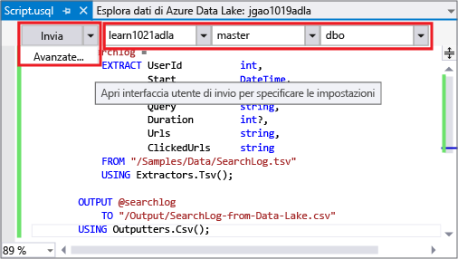
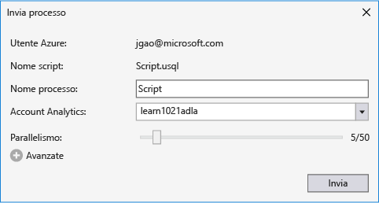
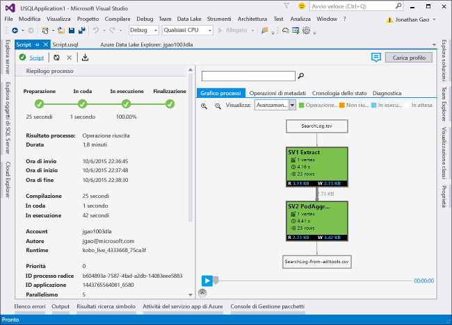

# <a name="develop-u-sql-scripts-by-using-data-lake-tools-for-visual-studio"></a>Sviluppare script U-SQL tramite Strumenti Data Lake per Visual Studio
[!INCLUDE [get-started-selector](../../includes/data-lake-analytics-selector-get-started.md)]


Informazioni su come usare Visual Studio per creare account Azure Data Lake Analytics, definire processi in [U-SQL](data-lake-analytics-u-sql-get-started.md) e inviare processi al servizio Data Lake Analytics. Per altre informazioni su Data Lake Analytics, vedere [Panoramica di Azure Data Lake Analytics](data-lake-analytics-overview.md).


## <a name="prerequisites"></a>Prerequisiti

* **Visual Studio**: sono supportate tutte le versioni ad eccezione della versione Express.
    * Visual Studio 2017
    * Visual Studio 2015
    * Visual Studio 2013
* **Microsoft Azure SDK per .NET** versione 2.7.1 o successiva.  Eseguire l'installazione usando [Installazione guidata piattaforma Web](http://www.microsoft.com/web/downloads/platform.aspx).
* Un account **Data Lake Analytics**. Per creare un account, vedere [Introduzione ad Azure Data Lake Analytics con il portale di Azure](data-lake-analytics-get-started-portal.md).

## <a name="install-azure-data-lake-tools-for-visual-studio"></a>Installare Strumenti Azure Data Lake per Visual Studio 

Scaricare e installare Strumenti Azure Data Lake per Visual Studio dall'[Area download](http://aka.ms/adltoolsvs). Dopo l'installazione si noti che:
* Il nodo **Esplora server** > **Azure** contiene un nodo **Data Lake Analytics**. 
* Il menu **Strumenti** include una voce **Data Lake**.

## <a name="connect-to-an-azure-data-lake-analytics-account"></a>Connettersi a un account Azure Data Lake Analytics

1. Aprire Visual Studio.
2. Aprire Esplora server selezionando **Visualizza** > **Esplora Server**.
3. Fare clic con il pulsante destro del mouse su **Azure**. Scegliere quindi **Connetti a sottoscrizione di Microsoft Azure** e seguire le istruzioni.
4. In Esplora server selezionare **Azure** > **Data Lake Analytics**. Verrà visualizzato un elenco degli account Data Lake Analytics.


## <a name="write-your-first-u-sql-script"></a>Scrivere il primo script U-SQL

Il testo seguente è un semplice script U-SQL. Definisce un set di dati di piccole dimensioni e scrive tale set di dati nell'istanza predefinita di Data Lake Store come file denominato `/data.csv`.

```
@a  = 
    SELECT * FROM 
        (VALUES
            ("Contoso", 1500.0),
            ("Woodgrove", 2700.0)
        ) AS 
              D( customer, amount );
OUTPUT @a
    TO "/data.csv"
    USING Outputters.Csv();
```

### <a name="submit-a-data-lake-analytics-job"></a>Inviare un processo di Data Lake Analytics

1. Selezionare **File** > **Nuovo** > **Progetto**.

2. Selezionare il tipo di **Progetto U-SQL** e quindi fare clic su **OK**. Visual Studio crea una soluzione con un file **Script.usql**.

3. Incollare lo script precedente nella finestra **Script.usql**.

4. Nell'angolo superiore sinistro della finestra **Script.usql** specificare l'account Data Lake Analytics.

    

5. Nell'angolo superiore sinistro della finestra **Script.usql** selezionare **Invia**.
6. Verificare il nome presente in **Account Analytics** e quindi selezionare **Invia**. Al termine dell'invio, nella finestra dei risultati di Strumenti Data Lake per Visual Studio saranno disponibili i risultati dell'operazione di invio.

    
7. Per visualizzare lo stato più aggiornato del processo e aggiornare la schermata, fare clic su **Aggiorna**. Quando il processo ha esito positivo, vengono visualizzate le schede **Grafico del processo**, **Operazioni metadati**, **Cronologia dello stato** e **Diagnostica**:

    

   * **Riepilogo processo** mostra il riepilogo del processo.   
   * **Dettagli processo** mostra informazioni più specifiche sul processo, inclusi script, risorse e vertici.
   * **Grafico del processo** visualizza l'andamento del processo.
   * **Operazioni metadati** mostra tutte le azioni eseguite nel catalogo U-SQL.
   * **Dati** mostra tutti gli input e gli output.
   * **Diagnostica** fornisce un'analisi avanzata per l'ottimizzazione dell'esecuzione e delle prestazioni del processo.

### <a name="to-check-job-state"></a>Per controllare lo stato del processo

1. In Esplora server selezionare **Azure** > **Data Lake Analytics**. 
2. Espandere il nome dell'account Data Lake Analytics.
3. Fare doppio clic su **Processi**.
4. Selezionare il processo inviato in precedenza.

### <a name="to-see-the-output-of-a-job"></a>Per visualizzare l'output di un processo

1. In Esplora server cercare il processo inviato.
2. Fare clic sulla scheda **Dati** .
3. Nella scheda **Output del processo** selezionare il file `"/data.csv"`.

## <a name="next-steps"></a>Passaggi successivi

* [Eseguire script U-SQL nella workstation per test e debug](data-lake-analytics-data-lake-tools-local-run.md)
* [Eseguire il debug di codice C# in processi U-SQL con Strumenti Azure Data Lake per Visual Studio Code](data-lake-tools-for-vscode-local-run-and-debug.md)
* [Usare gli strumenti di Azure Data Lake per Visual Studio Code](data-lake-analytics-data-lake-tools-for-vscode.md)
