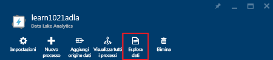
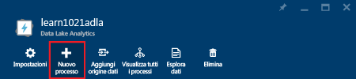
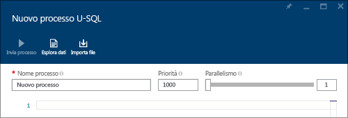
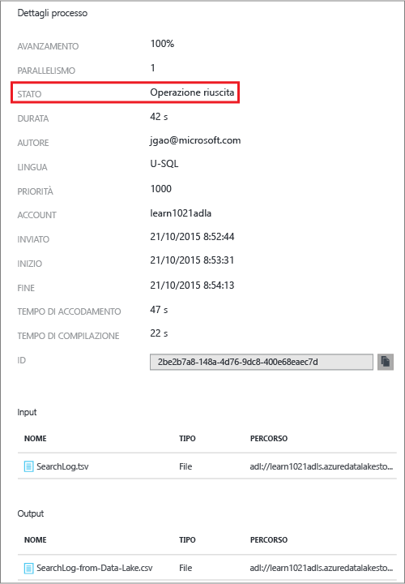
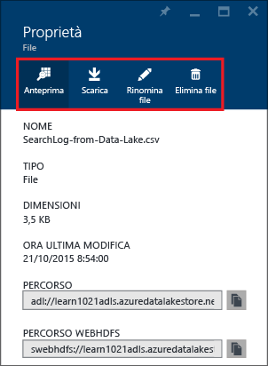

<properties 
   pageTitle="Introduzione ad Analisi di Azure Data Lake con il portale di Azure | Azure" 
   description="Informazioni su come usare il portale di Azure per creare un account di Analisi Data Lake, creare un processo di Analisi Data Lake mediante U-SQL e inviare il processo." 
   services="data-lake-analytics" 
   documentationCenter="" 
   authors="edmacauley" 
   manager="paulettm" 
   editor="cgronlun"/>
 
<tags
   ms.service="data-lake-analytics"
   ms.devlang="na"
   ms.topic="hero-article"
   ms.tgt_pltfrm="na"
   ms.workload="big-data" 
   ms.date="04/21/2016"
   ms.author="edmaca"/>

# Esercitazione: Introduzione a Analisi di Azure Data Lake con il portale di Azure

[AZURE.INCLUDE [get-started-selector](../../includes/data-lake-analytics-selector-get-started.md)]

Informazioni su come usare il portale di Azure per creare account di Analisi di Azure Data Lake, definire processi di Analisi di Azure Data Lake in [U-SQL](data-lake-analytics-u-sql-get-started.md) e inviare processi ad account di Analisi di Azure Data Lake. Per altre informazioni su Analisi Data Lake, vedere [Panoramica di Analisi Data Lake di Azure](data-lake-analytics-overview.md).

In questa esercitazione si svilupperà un processo che legge un file di valori separati da tabulazioni (TSV) e lo converte in un file di valori separati da virgole (CSV). Per eseguire la stessa esercitazione usando altri strumenti supportati, fare clic sulle schede disponibili nella parte superiore di questa sezione. Dopo il completamento del primo processo, è possibile iniziare a scrivere trasformazioni di dati più complesse con U-SQL.

[AZURE.INCLUDE [basic-process-include](../../includes/data-lake-analytics-basic-process.md)]

##Prerequisiti

Prima di iniziare questa esercitazione, è necessario disporre di quanto segue:

- **Una sottoscrizione di Azure**. Vedere [Ottenere una versione di valutazione gratuita di Azure](https://azure.microsoft.com/pricing/free-trial/).

##Creare un account di Analisi Data Lake

È necessario disporre di un account di Analisi Data Lake prima di poter eseguire qualsiasi processo.

Ogni account di Analisi Data Lake presenta una dipendenza sull'account di [Archivio Data Lake di Azure](). Questo account viene definito account di Data Lake Store predefinito. È possibile creare l'account di Archivio Data Lake anticipatamente o quando si crea l'account di Analisi Data Lake. In questa esercitazione si creerà l'account di Archivio Data Lake contestualmente all'account di Analisi Data Lake.

**Per creare un account di Analisi Data Lake**

1. Accedere al nuovo [portale di Azure classico](https://portal.azure.com).
2. Fare clic su **Nuovo**, su **Dati e Analisi** e quindi su **Analisi Data Lake**.
6. Immettere o selezionare le informazioni seguenti:

    

	- **Nome**: nome dell'account di Analisi.
	- **Archivio Data Lake**: ogni account di Analisi Data Lake dispone di un account di Archivio Data Lake dipendente. L'account di Data Lake Analytics e l'account di Data Lake Store dipendente devono trovarsi nello stesso data center di Azure. Seguire le istruzioni per creare un nuovo account di Data Lake Store o selezionarne uno esistente.
	- **Sottoscrizione**: scegliere la sottoscrizione di Azure usata per l'account di Analisi.
	- **Gruppo di risorse** Selezionare un gruppo di risorse di Azure esistente o crearne uno nuovo. Gestione risorse di Azure consente di usare le risorse dell'applicazione come singolo gruppo. Per altre informazioni, vedere [Panoramica di Gestione risorse di Azure](resource-group-overview.md). 
	- **Località**. Selezionare un data center di Azure per l'account di Analisi Data Lake. 
7. Selezionare **Aggiungi alla Schermata iniziale**. Questa impostazione è necessaria per l'esecuzione dell'esercitazione.
8. Fare clic su **Crea**. Viene visualizzata la schermata iniziale del portale. Alla schermata iniziale viene aggiunto un nuovo riquadro con l'etichetta "Distribuzione di Analisi Data Lake di Azure". Il processo per la creazione di un account di Analisi Data Lake richiede alcuni istanti. Al termine del processo, il portale aprirà l'account in un nuovo pannello.

	

Dopo aver creato un account di Analisi Data Lake, è possibile aggiungere altri account di Archivio Data Lake e account di Archiviazione di Azure. Per istruzioni, vedere la sezione relativa alla [gestione delle origini dati degli account di Analisi Data Lake](data-lake-analytics-manage-use-portal.md#manage-account-data-sources).

##Preparare i dati di origine

In questa esercitazione si eseguirà l'elaborazione di alcuni log di ricerca. Il log di ricerca può essere archiviato in Archivio Data Lake o in un'archiviazione BLOB di Azure.

Il portale di Azure fornisce un’interfaccia utente per copiare alcuni file di dati di esempio nell'account di Data Lake predefinito, tra cui anche un file di log di ricerca.

**Per copiare file di dati di esempio**

1. Nel portale di Azure fare clic su **Microsoft Azure** nell'angolo superiore sinistro.
2. Fare clic nel riquadro contenente il nome dell'account di Analisi Data Lake personale. È stato aggiunto qui durante la creazione dell'account. Se l'account non è stato aggiunto, vedere [Aprire un account di Analisi Data Lake dal portale](data-lake-analytics-manage-use-portal.md#access-adla-account) per aprire l'account.
3. Espandere il pannello **Informazioni di base** e quindi fare clic su **Esplora processi di esempio**. Viene aperto un altro pannello denominato **Processi di esempio**.
4. Fare clic su **Copia dati di esempio** e quindi su **OK** per confermare.
5. Fare clic sull'opzione **Notifica**, contraddistinta da un'icona a forma di campana. Verrà visualizzato un messaggio di log per indicare che **l'aggiornamento dei dati di esempio è stato completato**. Fare clic su un punto qualsiasi all'esterno del riquadro di notifica per chiuderlo.
7. Nella parte superiore del pannello dell'account di Analisi Data Lake fare clic su **Esplora dati**. 

	

    Vengono aperti due panelli: **Esplora dati** e un pannello relativo all'account di Archivio Data Lake.
8. Nel pannello relativo all'account di Archivio Data Lake fare clic su **Esempi** per espandere la cartella e quindi su **Dati** per espandere la cartella. Verranno visualizzati i file e le cartelle seguenti:

    - AmbulanceData/
    - AdsLog.tsv
    - SearchLog.tsv
    - version.txt
    - WebLog.log
    
    In questa esercitazione si userà SearchLog.tsv.

In pratica, si programmeranno le applicazioni in modo che i dati vengano caricati o scritti in account di archiviazione collegati. Per caricare i file, vedere [Caricare dati in Archivio Data Lake](data-lake-analytics-manage-use-portal.md#upload-data-to-adls) o [Caricare dati nell'archiviazione BLOB](data-lake-analytics-manage-use-portal.md#upload-data-to-wasb).

##Creare e inviare processi di Analisi Data Lake

Dopo aver preparato i dati di origine, è possibile iniziare a sviluppare uno script U-SQL.

**Per inviare il processo**

1. Nel pannello del portale relativo all'account di Analisi Data Lake fare clic su **Nuovo processo**. 

	

    Se il pannello non è presente, vedere [Aprire un account di Analisi Data Lake dal portale](data-lake-analytics-manage-use-portal.md#access-adla-account).
4. Immettere il **Nome processo** e lo script U-SQL seguente:

	

        @searchlog =
            EXTRACT UserId          int,
                    Start           DateTime,
                    Region          string,
                    Query           string,
                    Duration        int?,
                    Urls            string,
                    ClickedUrls     string
            FROM "/Samples/Data/SearchLog.tsv"
            USING Extractors.Tsv();
        
        OUTPUT @searchlog   
            TO "/Output/SearchLog-from-Data-Lake.csv"
        USING Outputters.Csv();

	Questo script U-SQL legge il file dei dati di origine mediante **Extractors.Tsv()** e quindi crea un file con estensione csv mediante **Outputters.Csv()**.
    
    Non modificare i due percorsi, a meno che il file di origine non sia stato copiato in una posizione diversa. Analisi Data Lake creerà la cartella di output, se non esiste già. In questo caso si useranno semplici percorsi relativi.
	
	Per i file archiviati negli account predefiniti di Data Lake risulta più semplice usare percorsi relativi, ma è possibile usare anche percorsi assoluti. Ad esempio
    
        adl://<Data LakeStorageAccountName>.azuredatalakestore.net:443/Samples/Data/SearchLog.tsv
      

    Per altre informazioni su U-SQL, vedere [Introduzione al linguaggio U-SQL di Analisi Data Lake di Azure](data-lake-analytics-u-sql-get-started.md) e [Informazioni di riferimento sul linguaggio U-SQL](http://go.microsoft.com/fwlink/?LinkId=691348).
     
5. Fare clic su **Invia processo** nel menu in alto. Viene visualizzato un nuovo pannello Dettagli processo. Sulla barra del titolo viene visualizzato lo stato del processo.
6. Attendere finché lo stato del processo non viene modificato in **Riuscito**. Al termine del processo, viene aperto un nuovo pannello con i dettagli del processo:

    

    Nell'immagine sopra riportata è possibile osservare che il processo ha impiegato circa 1,5 minuti per passare dallo stato Riuscito a Terminato.
    
    In caso di esito negativo del processo, vedere [Monitorare e risolvere i problemi dei processi di Analisi Data Lake](data-lake-analytics-monitor-and-troubleshoot-jobs-tutorials.md).

7. Nella parte inferiore del pannello **Dettagli processo** fare clic sul nome del processo: **SearchLog-from-Data-Lake.csv**. Sarà possibile visualizzare in anteprima, scaricare, rinominare ed eliminare il file di output.

    
8. Fare clic su **Anteprima** per visualizzare il file di output.

    

##Vedere anche

- Per visualizzare una query più complessa, vedere [Analizzare i log del sito Web mediante Analisi Data Lake di Azure](data-lake-analytics-analyze-weblogs.md).
- Per iniziare a sviluppare applicazioni U-SQL, vedere [Sviluppare script U-SQL tramite Strumenti di Data Lake per Visual Studio](data-lake-analytics-data-lake-tools-get-started.md).
- Per informazioni su U-SQL, vedere [Introduzione al linguaggio U-SQL di Analisi Data Lake di Azure](data-lake-analytics-u-sql-get-started.md).
- Per informazioni sulle attività di gestione, vedere [Gestire Analisi di Azure Data Lake tramite il portale di Azure](data-lake-analytics-manage-use-portal.md).
- Per una panoramica su Analisi Data Lake, vedere [Panoramica di Analisi Data Lake di Azure](data-lake-analytics-overview.md).
- Per visualizzare la stessa esercitazione usando altri strumenti, scegliere i selettori di scheda nella parte superiore della pagina.

<!---HONumber=AcomDC_0427_2016-->