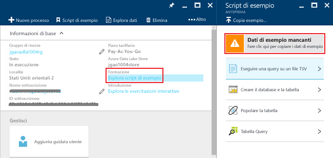

# Esercitazione: Introduzione ad Azure Data Lake Analytics con il portale di Azure
[!INCLUDE [get-started-selector](../../includes/data-lake-analytics-selector-get-started.md)]

Informazioni su come usare il portale di Azure per creare account Azure Data Lake Analytics, definire processi di Data Lake Analytics in [U-SQL](data-lake-analytics-u-sql-get-started.md) e inviare processi al servizio Data Lake Analytics. Per altre informazioni su Data Lake Analytics, vedere [Panoramica di Azure Data Lake Analytics](data-lake-analytics-overview.md).

In questa esercitazione verrà sviluppato un processo che legge un file di valori delimitati da tabulazioni (TSV) e lo converte in un file di valori delimitati da virgole (CSV). Per eseguire la stessa esercitazione usando altri strumenti supportati, fare clic sulle schede disponibili nella parte superiore di questa sezione. Dopo il completamento del primo processo, è possibile iniziare a scrivere trasformazioni di dati più complesse con U-SQL.

## Prerequisiti
Prima di iniziare questa esercitazione sono necessari gli elementi seguenti:

* **Una sottoscrizione di Azure**. Vedere [Ottenere una versione di prova gratuita di Azure](https://azure.microsoft.com/pricing/free-trial/).

## Creare un account di Analisi Data Lake
È necessario disporre di un account di Data Lake Analytics prima di poter eseguire qualsiasi processo.

Ogni account di Analisi Data Lake presenta una dipendenza sull'account di [Archivio Data Lake di Azure]() .  Questo account viene definito account di Data Lake Store predefinito.  È possibile creare l'account di Archivio Data Lake anticipatamente o quando si crea l'account di Analisi Data Lake. In questa esercitazione si creerà l'account di Archivio Data Lake contestualmente all'account di Analisi Data Lake.

**Per creare un account di Analisi Data Lake**

1. Accedere al [portale di Azure](https://portal.azure.com).
2. Fare clic su **Nuovo**, su **Intelligence e analisi** e quindi su **Data Lake Analytics**.
3. Digitare o selezionare i valori seguenti:

    

   * **Nome**: assegnare un nome all'account Data Lake Analytics.
   * **Sottoscrizione**: scegliere la sottoscrizione di Azure usata per l'account di Analytics.
   * **Gruppo di risorse**. Selezionare un gruppo di risorse di Azure esistente o crearne uno nuovo. Gestione risorse di Azure consente di lavorare con le risorse dell'applicazione come gruppo. Per altre informazioni, vedere [Panoramica di Gestione risorse di Azure](../azure-resource-manager/resource-group-overview.md).
   * **Località**. Selezionare un data center di Azure per l'account di Data Lake Analytics.
   * **Data Lake Store**: ogni account di Data Lake Analytics ha un account di Data Lake Store dipendente. L'account di Data Lake Analytics e l'account di Data Lake Store dipendente devono trovarsi nello stesso data center di Azure. Seguire le istruzioni per creare un nuovo account di Data Lake Store o selezionarne uno esistente.
4. Fare clic su **Crea**. Viene visualizzata la schermata iniziale del portale. Alla schermata iniziale viene aggiunto un nuovo riquadro con l'etichetta "Distribuzione di Analisi Data Lake di Azure". Il processo per la creazione di un account di Analisi Data Lake richiede alcuni istanti. Al termine del processo, il portale aprirà l'account in un nuovo pannello.

Dopo aver creato un account di Analisi Data Lake, è possibile aggiungere altri account di Archivio Data Lake e account di Archiviazione di Azure. Per istruzioni, vedere la sezione relativa alla [gestione delle origini dati degli account di Analisi Data Lake](data-lake-analytics-manage-use-portal.md#manage-account-data-sources).

## Preparare i dati di origine
In questa esercitazione verrà eseguita l'elaborazione di alcuni log di ricerca.  Il log di ricerca può essere archiviato in Data Lake Store o in un archivio BLOB di Azure.

Il portale di Azure offre un’interfaccia utente per copiare alcuni file di dati di esempio nell'account Data Lake Store predefinito, tra cui anche un file di log di ricerca.

**Per copiare file di dati di esempio**

1. Aprire l'account Data Lake Analytics dal [portale di Azure](https://portal.azure.com).  Vedere [Gestire gli account Data Lake Analytics](data-lake-analytics-get-started-portal.md#create-data-lake-analytics-account) per creare un account e quindi aprirlo nel portale.
2. Espandere il riquadro **Informazioni di base** e quindi fare clic su **Esplora script di esempio**. Verrà visualizzato un altro pannello denominato **Script di esempio**.

    
3. Fare clic su **Mancano i dati di esempio** per copiare i file di dati di esempio. Al termine, il portale visualizzerà il messaggio **I dati di esempio sono stati aggiornati**.
4. Nella parte superiore del pannello dell'account di Analisi Data Lake fare clic su **Esplora dati** .

    

    Vengono aperti due panelli: **Esplora dati** e un pannello relativo all'account Data Lake Store predefinito.
5. Nel pannello relativo all'account Data Lake Store predefinito fare clic su **Esempi** per espandere la cartella e quindi su **Dati** per espandere la cartella. Verranno visualizzati i file e le cartelle seguenti:

   * AmbulanceData/
   * AdsLog.tsv
   * SearchLog.tsv
   * version.txt
   * WebLog.log

     In questa esercitazione si userà SearchLog.tsv.

Si programmeranno in pratica le applicazioni in modo che i dati vengano caricati o scritti in account di archiviazione collegati. Per caricare i file, vedere [Upload data to Data Lake Store](data-lake-analytics-manage-use-portal.md#upload-data-to-adls) (Caricare dati in Data Lake Store) o [Upload data to Blob storage](data-lake-analytics-manage-use-portal.md#upload-data-to-wasb) (Caricare dati nell'archivio BLOB).

## Creare e inviare processi di Analisi Data Lake
Dopo aver preparato i dati di origine, è possibile iniziare a sviluppare uno script U-SQL.  

**Per inviare un processo**

1. Nel pannello del portale relativo all'account di Analisi Data Lake fare clic su **Nuovo processo**.

    

    Se il pannello non è presente, vedere [Aprire un account di Analisi Data Lake dal portale](data-lake-analytics-manage-use-portal.md#access-adla-account).
2. Immettere il **Nome processo**e lo script U-SQL seguente:

        @searchlog =
            EXTRACT UserId          int,
                    Start           DateTime,
                    Region          string,
                    Query           string,
                    Duration        int?,
                    Urls            string,
                    ClickedUrls     string
            FROM "/Samples/Data/SearchLog.tsv"
            USING Extractors.Tsv();

        OUTPUT @searchlog   
            TO "/Output/SearchLog-from-Data-Lake.csv"
        USING Outputters.Csv();

    

    Questo script U-SQL legge il file di dati di origine tramite **Extractors.Tsv()** e quindi crea un file CSV tramite **Outputters.Csv()**.

    Non modificare i due percorsi, a meno che il file di origine non sia stato copiato in una posizione diversa.  Data Lake Analytics creerà la cartella di output, se non esiste già.  In questo caso si useranno semplici percorsi relativi.  

    Per i file archiviati negli account predefiniti di Data Lake risulta più semplice usare percorsi relativi, ma è possibile usare anche percorsi assoluti.  Ad esempio

        adl://<Data LakeStorageAccountName>.azuredatalakestore.net:443/Samples/Data/SearchLog.tsv

    Per altre informazioni su U-SQL, vedere [Introduzione al linguaggio U-SQL di Azure Data Lake Analytics](data-lake-analytics-u-sql-get-started.md) e [U-SQL language reference](http://go.microsoft.com/fwlink/?LinkId=691348) (Riferimenti al linguaggio U-SQL).

1. Fare clic su **Invia processo** nel menu in alto.   
2. Attendere finché lo stato del processo non viene modificato in **Riuscito**. È possibile vedere che l'esecuzione del processo ha richiesto circa un minuto.

    In caso di esito negativo del processo, vedere [Monitorare e risolvere i problemi dei processi di Data Lake Analytics](data-lake-analytics-monitor-and-troubleshoot-jobs-tutorial.md).
3. Nella parte inferiore del pannello fare clic sulla scheda **Output** e quindi su **SearchLog-from-Data-Lake.csv**. Sarà possibile visualizzare in anteprima, scaricare, rinominare ed eliminare il file di output.

    

## Vedere anche
* Per visualizzare una query più complessa, vedere [Analizzare i log del sito Web mediante Azure Data Lake Analytics](data-lake-analytics-analyze-weblogs.md).
* Per iniziare a sviluppare applicazioni U-SQL, vedere [Sviluppare script U-SQL tramite Strumenti di Data Lake per Visual Studio](data-lake-analytics-data-lake-tools-get-started.md).
* Per informazioni su U-SQL, vedere [Introduzione al linguaggio U-SQL di Azure Data Lake Analytics](data-lake-analytics-u-sql-get-started.md).
* Per informazioni sulle attività di gestione, vedere [Gestire Azure Data Lake Analytics tramite il portale di Azure](data-lake-analytics-manage-use-portal.md).
* Per una panoramica su Data Lake Analytics, vedere [Panoramica di Azure Data Lake Analytics](data-lake-analytics-overview.md).
* Per visualizzare la stessa esercitazione usando altri strumenti, scegliere i selettori di scheda nella parte superiore della pagina.
* Per registrare informazioni di diagnostica, vedere [Accessing diagnostics logs for Azure Data Lake Analytics](data-lake-analytics-diagnostic-logs.md)

<!--HONumber=Nov16_HO2-->

