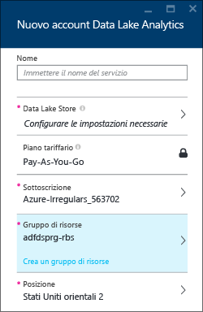
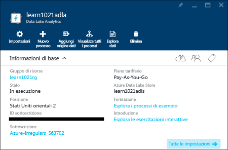

# Gestire Analisi Data Lake di Azure tramite il portale di Azure
[!INCLUDE [manage-selector](../../includes/data-lake-analytics-selector-manage.md)]

Informazioni su come gestire gli account, le origini dati, gli utenti e i processi di Azure Data Lake Analytics tramite il portale di Azure. Per visualizzare gli argomenti relativi alla gestione tramite altri strumenti, fare clic sul selettore di scheda sopra riportato.

**Prerequisiti**

Prima di iniziare questa esercitazione, è necessario disporre di quanto segue:

* **Una sottoscrizione di Azure**. Vedere [Ottenere una versione di valutazione gratuita di Azure](https://azure.microsoft.com/pricing/free-trial/).

<!-- ################################ -->
<!-- ################################ -->
## Gestire account
Prima di eseguire qualsiasi processo di Analisi Data Lake, è necessario disporre di un account di Analisi Data Lake. A differenza di Azure HDInsight, un account di Analisi non è soggetto ad alcun pagamento fino a quando il processo non è in esecuzione. Il pagamento, infatti, viene richiesto solo per la durata di esecuzione di un processo. Per altre informazioni, vedere [Panoramica di Analisi Data Lake di Azure](data-lake-analytics-overview.md).

**Per creare account di Analisi Data Lake**

1. Accedere al nuovo [portale di Azure](https://portal.azure.com).
2. Fare clic su **Nuovo**, su **Dati e Analisi** e quindi su **Analisi Data Lake**.
3. Immettere o selezionare le informazioni seguenti:
   
    
   
   * **Nome**: nome dell'account di Analisi.
   * **Archivio Data Lake**: ogni account di Analisi Data Lake dispone di un account di Archivio Data Lake di Azure dipendente. L'account di Analisi Data Lake e l'account di Archivio Data Lake dipendente devono trovarsi nello stesso data center di Azure. Seguire le istruzioni per creare un nuovo account di Data Lake Store o selezionarne uno esistente.
   * **Sottoscrizione**: scegliere la sottoscrizione di Azure usata per l'account di Analisi.
   * **Gruppo di risorse**. Selezionare un gruppo di risorse di Azure esistente o crearne uno nuovo. Gestione risorse di Azure consente di usare le risorse dell'applicazione come singolo gruppo. Per altre informazioni, vedere [Panoramica di Gestione risorse di Azure](../resource-group-overview.md).
   * **Località**. Selezionare un data center di Azure per l'account di Analisi Data Lake.
4. Fare clic su **Crea**. Viene visualizzata la schermata iniziale del portale. Alla schermata iniziale viene aggiunto un nuovo riquadro con l'etichetta "Distribuzione di Analisi Data Lake di Azure". Il processo per la creazione di un account di Analisi Data Lake richiede alcuni istanti. Al termine del processo, il portale aprirà l'account in un nuovo pannello.
   
    

 **Per accedere/aprire un account di Analisi Data Lake**

1. Accedere al nuovo [portale di Azure](https://portal.azure.com/).
2. Fare clic su **Sfoglia** nel menu a sinistra e quindi su **Analisi Data Lake**.
3. Selezionare l'account di Analisi Data Lake a cui si desidera accedere. L'account verrà aperto in un nuovo pannello.

**Per eliminare un account di Analisi Data Lake**

1. Aprire l'account di Analisi Data Lake che si desidera eliminare. Per istruzioni, vedere la sezione relativa all'[accesso a un account di Analisi Data Lake](#access-adla-account).
2. Fare clic su **Elimina** nel menu di pulsanti disponibile nella parte superiore del pannello.
3. Digitare il nome dell'account e quindi fare clic su **Elimina**.

L'eliminazione di un account di Analisi non comporta l'eliminazione dell'account di Archivio Data Lake dipendente. Per istruzioni sull'eliminazione di account di archiviazione di Data Lake, vedere [Eliminare un account di Archivio Data Lake](../data-lake-store/data-lake-store-get-started-portal.md#delete-azure-data-lake-store-account).

<!-- ################################ -->
<!-- ################################ -->
## Gestire le origini dati degli account
Analisi Data Lake supporta attualmente le seguenti origini dati:

* [Archivio Data Lake di Azure](../data-lake-store/data-lake-store-overview.md)
* [Archiviazione di Azure](../storage/storage-introduction.md)

Quando si crea un account di Analisi Data Lake, è necessario impostare un account di Archivio Data Lake di Azure come account di archiviazione predefinito. L'account di Archivio Data Lake predefinito viene usato per archiviare i metadati e i log di controllo dei processi. Dopo aver creato un account di Analisi Data Lake, è possibile aggiungere altri account di Archivio Data Lake e/o account di Archiviazione di Azure.

**Per trovare l'account di archiviazione di Data Lake predefinito**

* Aprire l'account di Analisi Data Lake che si desidera gestire. Per istruzioni, vedere la sezione relativa all'[accesso a un account di Analisi Data Lake](#access-adla-account). L'archivio Data Lake predefinito viene visualizzato in **Informazioni di base**:
  
    

**Per aggiungere altre origini dati**

1. Aprire l'account di Analisi Data Lake che si desidera gestire. Per istruzioni, vedere la sezione relativa all'[accesso a un account di Analisi Data Lake](#access-adla-account).
2. Fare clic su **Impostazioni** e quindi su **Origini dati**. Verrà visualizzato un elenco contenente l'account di Archivio Data Lake predefinito.
3. Fare clic su **Aggiungi origine dati**.
   
    
   
    Per aggiungere un account di Archivio Data Lake di Azure, è necessario il nome dell'account e i diritti di accesso all'account per poter eseguire una query. Per aggiungere una risorsa di archiviazione BLOB di Azure, è necessario l'account di archiviazione e la chiave dell'account, che è possibile trovare accedendo all'account di archiviazione nel portale.

**Per esplorare origini dati**

1. Aprire l'account di Analisi che si desidera gestire. Per istruzioni, vedere la sezione relativa all'[accesso a un account di Analisi Data Lake](#access-adla-account).
2. Fare clic su **Impostazioni** e quindi su **Esplora dati**.
   
    
3. Fare clic su un account di Archivio Data Lake per aprirlo.
   
    
   
    Per ogni account di Archivio Data Lake, è possibile
   
   * **Nuova cartella**: aggiungere una nuova cartella.
   * **Carica**: caricare file nell'account di archiviazione dalla workstation.
   * **Accesso**: configurare le autorizzazioni di accesso.
   * **Rinomina cartella**: rinominare una cartella.
   * **Proprietà cartella**: visualizzare le proprietà di un file o una cartella, ad esempio il percorso WASB o WEBHDFS, l'ora dell'ultima modifica e così via.
   * **Elimina cartella**: eliminare una cartella.

 **Per caricare file in un account di Archivio Data Lake**

1. Nel menu a sinistra del portale fare clic su **Sfoglia** e quindi su **Data Lake Store**.
2. Selezionare l'account di Archivio Data Lake su cui si desidera caricare i dati. Per trovare l'account di archiviazione di Data Lake predefinito, vedere [qui](#default-adl-account).
3. Fare clic su **Esplora dati** nel menu superiore.
4. Fare clic su **Nuova directory** per creare una nuova cartella oppure su un nome di cartella per cambiare cartella.
5. Fare clic su **Carica** nel menu superiore per caricare il file.

 **Per caricare file in un account di archiviazione BLOB di Azure**

Vedere [Caricare dati per processi Hadoop in HDInsight](../hdinsight/hdinsight-upload-data.md). Queste informazioni sono valide per Analisi Data Lake.

## Gestire gli utenti
Analisi Data Lake usa il controllo degli accessi in base al ruolo con Azure Active Directory. Quando si crea un account di Data Lake Analytics, all'account viene aggiunto il ruolo "Amministratori della sottoscrizione". È possibile aggiungere altri utenti e gruppi di sicurezza con i ruoli seguenti:

| Ruolo | Descrizione |
| --- | --- |
| Proprietario |Consente di gestire qualsiasi aspetto, incluso l'accesso alle risorse. |
| Collaboratore |Consente di accedere al portale, nonché inviare e monitorare processi. Per poter inviare processi, tuttavia, un collaboratore deve disporre anche dell'autorizzazione di lettura o scrittura per gli account di Archivio Data Lake. |
| Sviluppatore Analisi Data Lake |Gli utenti possono inviare processi e monitorare tutti i processi, ma possono annullare solo i processi personali. Non possono gestire il proprio account, ovvero aggiungere utenti, modificare autorizzazioni o eliminare l'account. Per poter eseguire processi, devono disporre dell'accesso in lettura o scrittura per gli account di Archivio Data Lake |
| Reader |Consente di visualizzare tutti gli elementi, ma senza apportare alcuna modifica. |
| Utente DevTest Labs |Consente di visualizzare tutti gli elementi, nonché connettere, avviare, riavviare e arrestare macchine virtuali. |
| Amministratore accessi utente |Consente di gestire gli accessi utente alle risorse di Azure. |

Per informazioni sulla creazione di utenti e gruppi di sicurezza di Azure Active Directory , vedere [Informazioni su Azure Active Directory](../active-directory/active-directory-whatis.md).

**Per aggiungere utenti o gruppi di sicurezza a un account di Analisi**

1. Aprire l'account di Analisi che si desidera gestire. Per istruzioni, vedere la sezione relativa all'[accesso a un account di Analisi Data Lake](#access-adla-account).
2. Fare clic su **Impostazioni** e quindi su **Utenti**. In alternativa, è possibile fare clic su **Accedi** sulla barra del titolo **Elementi essenziali**, come illustrato nella schermata seguente:
   
    
3. Nel pannello **Utente** fare clic su **Aggiungi**.
4. Selezionare un ruolo e aggiungere un utente, quindi fare clic su **OK**.

**Nota: se l'utente o il gruppo di sicurezza deve inviare dei processi, sarà necessario che gli venga concessa anche l'autorizzazione di accesso ad Archivio Data Lake. Per altre informazioni, vedere [Protezione dei dati presenti in Archivio Data Lake](../data-lake-store/data-lake-store-secure-data.md).**

<!-- ################################ -->
<!-- ################################ -->
## Gestire i processi
È necessario disporre di un account di Analisi Data Lake prima di poter eseguire qualsiasi processo. Per altre informazioni, vedere [Gestire gli account di Analisi Data Lake](#manage-data-lake-analytics-accounts).

**Per creare un processo**

1. Aprire l'account di Analisi che si desidera gestire. Per istruzioni, vedere la sezione relativa all'[accesso a un account di Analisi Data Lake](#access-adla-account).
2. Fare clic su **Nuovo processo**.
   
    
   
    Verrà visualizzato un nuovo pannello simile alla figura seguente:
   
    
   
    Per ogni processo, è possibile configurare

    |Nome|Descrizione|
    |----|-----------|
    |Nome processo|Immettere il nome del processo.|
    |Priorità|Un numero più basso indica una priorità maggiore. Se due processi sono entrambi in coda, verrà eseguito per primo quello con il numero di priorità più basso|
    |Parallelismo |Numero massimo di processi di calcolo che possono essere eseguiti contemporaneamente. Se si aumenta questo numero, è possibile che vengano migliorate le prestazioni, ma anche che vengano incrementati i costi.|
    |Script|Immettere lo script U-SQL per il processo.|

    Attraverso la stessa interfaccia è possibile anche esplorare le origini dati collegate e aggiungere ad esse nuovi file.
1. Fare clic su **Invia processo** se si desidera inviare il processo.

**Per inviare un processo**

Vedere [Creare processi di Analisi Data Lake](#create-job).

**Per monitorare processi**

1. Aprire l'account di Analisi che si desidera gestire. Per istruzioni, vedere la sezione relativa all'[accesso a un account di Analisi Data Lake](#access-adla-account). Il pannello di gestione dei processi mostra le principali informazioni relative al processo:
   
    
2. Fare clic su **Gestione processo**, come illustrato nella schermata precedente.
   
    
3. Fare clic su un processo dell'elenco oppure sul pulsante **Filtra** per trovare più facilmente il processo desiderato:
   
    
   
    È possibile filtrare i processi per **Intervallo di tempo**, **Nome processo** o **Autore**.
4. Fare clic su **Invia di nuovo** se si desidera inviare nuovamente il processo.

**Per inviare nuovamente un processo**

Vedere [Monitorare processi di Analisi Data Lake](#monitor-jobs).

## Monitorare l'utilizzo dell'account
**Per monitorare l'utilizzo dell'account**

1. Aprire l'account di Analisi che si desidera gestire. Per istruzioni, vedere la sezione relativa all'[accesso a un account di Analisi Data Lake](#access-adla-account). Il pannello Utilizzo mostra informazioni relative al modo in cui viene usato l'account:
   
    
2. Fare doppio clic sul pannello per visualizzare altri dettagli.

## Visualizzare il catalogo di U-SQL
Il [catalogo di U-SQL](data-lake-analytics-use-u-sql-catalog.md) permette di definire la struttura dei dati e del codice in modo da poterli condividere mediante U-SQL. Il catalogo consente di ottenere le migliori prestazioni possibili con i dati in Azure Data Lake. È possibile visualizzare il catalogo di U-SQL dal portale di Azure.

**Per sfogliare il catalogo di U-SQL**

1. Aprire l'account di Analisi che si desidera gestire. Per istruzioni, vedere la sezione relativa all'[accesso a un account di Analisi Data Lake](#access-adla-account).
2. Fare clic su **Esplora dati** nel menu superiore.
3. Espandere **Catalogo**, **master** e quindi **Tabelle, **Funzioni con valori di tabella** o **Assembly**. La schermata seguente illustra una funzione con valori di tabella.
   
    

<!-- ################################ -->
<!-- ################################ -->
## Usare i gruppi Gestione risorse di Azure
Le applicazioni sono in genere costituite da molti componenti, ad esempio app Web, database, server di database, risorsa di archiviazione e servizi di terze parti. Gestione risorse di Azure (ARM) consente di usare le risorse dell'applicazione come gruppo, detto Gruppo di risorse di Azure. È quindi possibile distribuire, aggiornare, monitorare o eliminare tutte le risorse per l'applicazione con una singola operazione coordinata. È possibile descrivere le risorse del gruppo in un modello JSON per la distribuzione e quindi usare tale modello per ambienti diversi, ad esempio di testing, staging e produzione. È possibile chiarire la fatturazione per l'organizzazione visualizzando i costi per l'intero gruppo. Per altre informazioni, vedere [Panoramica di Gestione risorse di Azure](../resource-group-overview.md).

Un servizio di Analisi Data Lake può includere i componenti seguenti:

* Account di Analisi Data Lake di Azure
* Account di Archivio Data Lake predefinito (obbligatorio)
* Account di Archivio Data Lake di Azure aggiuntivi
* Account di Archiviazione di Azure aggiuntivi

È possibile creare tutti questi componenti in un unico gruppo ARM per semplificarne la gestione.

Un account di Analisi Data Lake e gli account di archiviazione dipendenti devono trovarsi nello stesso data center di Azure, mentre il gruppo ARM può trovarsi anche in un data center diverso.

## Vedere anche
* [Panoramica di Analisi Microsoft Azure Data Lake](data-lake-analytics-overview.md)
* [Introduzione a Analisi Data Lake tramite il portale di Azure](data-lake-analytics-get-started-portal.md)
* [Gestire Azure Data Lake Analytics tramite Azure PowerShell](data-lake-analytics-manage-use-powershell.md)
* [Monitorare e risolvere i problemi dei processi di Azure Data Lake Analytics tramite il portale di Azure](data-lake-analytics-monitor-and-troubleshoot-jobs-tutorial.md)

<!---HONumber=AcomDC_0914_2016-->