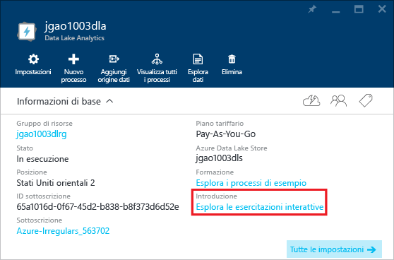

# Usare le esercitazioni interattive di Azure Data Lake Analytics
Il Portale di Azure fornisce un'esercitazione interattiva che consente di iniziare a usare Data Lake Analytics. In questo articolo viene illustrato come completare l'esercitazione per analizzare i log del sito Web.

> [!NOTE]
> Se si desidera eseguire la stessa esercitazione usando Visual Studio, vedere [Analizzare i log del sito Web mediante Data Lake Analytics](data-lake-analytics-analyze-weblogs.md).
> Al portale verranno aggiunte altre esercitazioni interattive.
> 
> 

Per altre esercitazioni, vedere:

* [Esercitazione: Introduzione ad Azure Data Lake Analytics con il portale di Azure](data-lake-analytics-get-started-portal.md)
* [Introduzione ad Azure Data Lake Analytics con Azure PowerShell](data-lake-analytics-get-started-powershell.md)
* [Introduzione ad Azure Data Lake Analytics con .NET SDK](data-lake-analytics-get-started-net-sdk.md)
* [Sviluppare script U-SQL mediante Strumenti di Data Lake per Visual Studio](data-lake-analytics-data-lake-tools-get-started.md) 

**Prerequisiti**

Prima di iniziare questa esercitazione, è necessario disporre di quanto segue:

* **Un account di Data Lake Analytics**.  Vedere [Introduzione ad Azure Data Lake Analytics con il Portale di Azure](data-lake-analytics-get-started-portal.md).

## Creare un account di Analisi Data Lake
È necessario disporre di un account di Data Lake Analytics prima di poter eseguire qualsiasi processo.

Ogni account di Data Lake Analytics presenta una dipendenza sull'account di [Azure Data Lake Store](../data-lake-store/data-lake-store-overview.md) l'account predefinito di Data Lake Store.  In questa esercitazione verrà creato l'account predefinito di Data Lake Store insieme all'account di Analytics, ma sarà possibile crearlo anche prima.

**Per creare un account di Analisi Data Lake**

1. Accedere al [portale di Azure](https://portal.azure.com/signin/index/?Microsoft_Azure_Kona=true&Microsoft_Azure_DataLake=true&hubsExtension_ItemHideKey=AzureDataLake_BigStorage%2cAzureKona_BigCompute).
2. Fare clic su **Microsoft Azure** nell'angolo superiore sinistro per aprire la Schermata iniziale.
3. Fare clic sul riquadro **Marketplace** .  
4. Digitare **Azure Data Lake Analytics** nella casella di ricerca del pannello **Tutto** e quindi premere **INVIO**. Nell'elenco verrà visualizzato **Azure Data Lake Analytics** .
5. Fare clic su **Azure Data Lake Analytics** nell'elenco.
6. Fare clic su **Crea** nella parte inferiore del pannello.
7. Digitare o selezionare:
   
    
   
   * **Nome**: nome dell'account di Analytics.
   * **Data Lake Store**: ogni account di Data Lake Analytics ha un account di Data Lake Store dipendente. L'account di Data Lake Analytics e l'account di Data Lake Store dipendente devono trovarsi nello stesso data center di Azure. Seguire le istruzioni per creare un account di Data Lake Store o selezionarne uno esistente.
   * **Sottoscrizione**: scegliere la sottoscrizione di Azure usata per l'account di Analytics.
   * **Gruppo di risorse**. Selezionare un gruppo di risorse di Azure esistente o crearne uno nuovo. Le applicazioni sono in genere costituite da molti componenti, ad esempio app Web, database, server di database, risorsa di archiviazione e servizi di terze parti. Gestione risorse di Azure (ARM) consente di usare le risorse dell'applicazione come gruppo, detto Gruppo di risorse di Azure. È quindi possibile distribuire, aggiornare, monitorare o eliminare le risorse per l'applicazione in un'unica operazione coordinata. Per la distribuzione viene usato un modello che può essere usato per diversi ambienti, ad esempio di testing, staging e produzione. È possibile chiarire la fatturazione per l'organizzazione visualizzando i costi per l'intero gruppo. Per altre informazioni, vedere [Panoramica di Gestione risorse di Azure](../azure-resource-manager/resource-group-overview.md). 
   * **Località**. Selezionare un data center di Azure per l'account di Data Lake Analytics. 
8. Selezionare **Aggiungi alla Schermata iniziale**. Questa impostazione è necessaria per l'esecuzione di questa esercitazione.
9. Fare clic su **Crea**. Viene visualizzata la Schermata iniziale del portale. Alla home page viene aggiunto un nuovo riquadro con l'etichetta "Deploying Azure Data Lake Analytics" (Distribuzione di Azure Data Lake Analytics). Il processo per la creazione di un account di Analisi Data Lake richiede alcuni istanti. Al termine del processo, il portale aprirà l'account in un nuovo pannello.
   
    

## Eseguire l'esercitazione interattiva Analisi del log del sito Web
**Per aprire l'esercitazione interattiva Website Log Analytics**

1. Nel portale, fare clic su **Microsoft Azure** dal menu a sinistra per aprire la Schermata iniziale.
2. Fare clic nel riquadro collegato all'account di Data Lake Analytics.
3. Fare clic su **Esplora le esercitazioni interattive** sulla barra **Informazioni di base**.
   
    
4. Se viene visualizzato un avviso di colore arancione indicante "Samples not set up, click...", fare clic su **Copy Sample Data** per copiare i dati di esempio nell'account di Data Lake Store predefinito. L'esercitazione interattiva richiede i dati per l'esecuzione.
5. Nel pannello **Esercitazioni interattive** fare clic su **Website Log Analytics** (Analisi log siti Web). Il portale aprirà l'esercitazione in un nuovo pannello.
6. Fare clic su **Introduzione**, quindi seguire le istruzioni

## Vedere anche
* [Panoramica di Analisi Microsoft Azure Data Lake](data-lake-analytics-overview.md)
* [Esercitazione: Introduzione ad Azure Data Lake Analytics con il portale di Azure](data-lake-analytics-get-started-portal.md)
* [Introduzione ad Azure Data Lake Analytics con Azure PowerShell](data-lake-analytics-get-started-powershell.md)
* [Sviluppare script U-SQL mediante Strumenti di Data Lake per Visual Studio](data-lake-analytics-data-lake-tools-get-started.md)
* [Analizzare i log dei siti Web mediante Azure Data Lake Analytics](data-lake-analytics-analyze-weblogs.md)

<!--HONumber=Dec16_HO2-->

