<properties
   pageTitle="Panoramica del controllo di accesso in Data Lake Store | Microsoft Azure"
   description="Informazioni sul controllo di accesso in Azure Data Lake Store"
   services="data-lake-store"
   documentationCenter=""
   authors="nitinme"
   manager="jhubbard"
   editor="cgronlun"/>

<tags
   ms.service="data-lake-store"
   ms.devlang="na"
   ms.topic="get-started-article"
   ms.tgt_pltfrm="na"
   ms.workload="big-data"
   ms.date="09/06/2016"
   ms.author="nitinme"/>



# Controllo di accesso in Azure Data Lake Store

Data Lake Store implementa un modello di controllo di accesso derivante da HDFS e, di conseguenza, dal modello di controllo di accesso POSIX. Questo articolo offre un riepilogo delle nozioni di base del modello di controllo di accesso per Data Lake Store. Per altre informazioni sul modello di controllo di accesso HDFS, vedere [HDFS Permissions Guide](https://hadoop.apache.org/docs/current/hadoop-project-dist/hadoop-hdfs/HdfsPermissionsGuide.html) (Guida alle autorizzazioni HDFS).

## Elenchi di controllo di accesso per file e cartelle

Esistono due tipologie di elenchi di controllo di accesso (ACL): **ACL di accesso** e **ACL predefiniti**.

* **ACL di accesso**: questi elenchi controllano l'accesso a un oggetto. Sia i file che le cartelle hanno ACL di accesso.

* **ACL predefiniti**: "modello" di ACL associato a una cartella che determina gli ACL di accesso per tutti gli elementi figlio creati in tale cartella. I file non hanno ACL predefiniti.

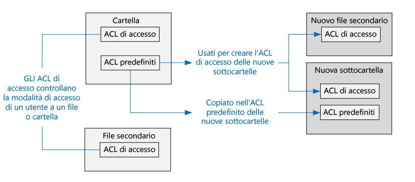



Sia gli ACL di accesso che gli ACL predefiniti presentano la stessa struttura.

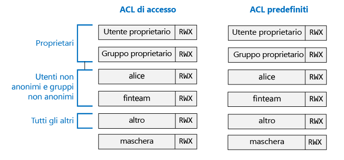



>[AZURE.NOTE] La modifica dell'ACL predefinito per un elemento padre non influisce sull'ACL di accesso o sull'ACL predefinito degli elementi figlio già esistenti.

## Utenti e identità

Ogni file e cartella ha autorizzazioni distinte per le entità seguenti:

* Utente proprietario del file
* Gruppo proprietario
* Utenti non anonimi
* Gruppi con nome
* Tutti gli altri utenti

Le identità degli utenti e dei gruppi sono identità di Azure Active Directory (AAD). Di conseguenza, se non diversamente specificato, un "utente" nel contesto di Data Lake Store potrebbe corrispondere a un utente o a un gruppo di sicurezza di AAD.

## Autorizzazioni

Le autorizzazioni per un oggetto del file system sono **Lettura**, **Scrittura** ed **Esecuzione** e possono essere usate per file e cartelle come illustrato nella tabella seguente.

| | File | Cartella |
|------------|-------------|----------|
| **Lettura (R)** | È possibile leggere il contenuto di un file | Per elencare il contenuto della cartella sono necessarie le autorizzazioni **Lettura** ed **Esecuzione**.|
| **Scrittura (W)** | È possibile scrivere o aggiungere in un file | Per creare elementi figlio in una cartella sono necessarie autorizzazioni **Scrittura + Esecuzione** |
| **Esecuzione (X)** | Nessun valore nel contesto di Data Lake Store | È necessaria per attraversare gli elementi figlio di una cartella |

### Forme brevi per le autorizzazioni

La forma **RWX** viene usata per indicare **Lettura + Scrittura + Esecuzione**. Esiste una forma numerica concentrata in cui **Lettura=4**, **Scrittura=2** ed **Esecuzione=1** e la somma rappresenta le autorizzazioni. Di seguito sono riportati alcuni esempi.

| Forma numerica | Forma breve | Significato |
|--------------|------------|------------------------|
| 7 | RWX | Lettura + Scrittura + Esecuzione |
| 5 | R-X | Lettura + Esecuzione |
| 4 | R-- | Lettura |
| 0 | --- | Nessuna autorizzazione |

### Non ereditarietà delle autorizzazioni

Nel modello di tipo POSIX usato da Data Lake Store, le autorizzazioni per un elemento vengono archiviate nell'elemento stesso. In altri termini, le autorizzazioni per un elemento non sono ereditabili dagli elementi padre.

## Scenari comuni correlati alle autorizzazioni

Di seguito sono riportati alcuni scenari comuni che consentono di comprendere quali autorizzazioni sono necessarie per eseguire determinate operazioni su un account Data Lake Store.

### Autorizzazioni necessarie per la lettura di un file

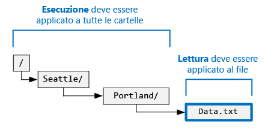



* Per il file da leggere, il chiamante deve avere autorizzazioni **Lettura**
* Per tutte le cartelle della struttura di cartelle contenenti il file, il chiamante deve avere autorizzazioni **Esecuzione**

### Autorizzazioni necessarie per l'aggiunta a un file

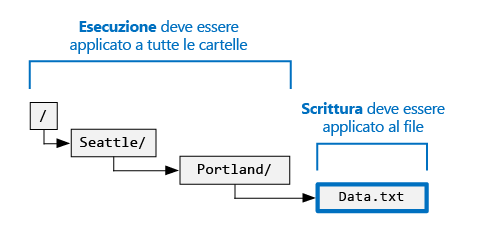



* Per il file a cui si intende eseguire l'aggiunta, il chiamante deve avere autorizzazioni **Scrittura**
* Per tutte le cartelle contenenti il file, il chiamante deve avere autorizzazioni **Esecuzione**

### Autorizzazioni necessarie per l'eliminazione di un file

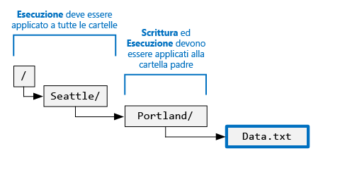



* Per la cartella padre, il chiamante deve avere autorizzazioni **Scrittura + Esecuzione**
* Per tutte le altre cartelle nel percorso del file, il chiamante deve avere autorizzazioni **Esecuzione**

>[AZURE.NOTE] Se vengono soddisfatte le due condizioni precedenti, non sono necessarie autorizzazioni di scrittura per il file per eliminarlo.

### Autorizzazioni necessarie per l'enumerazione di una cartella

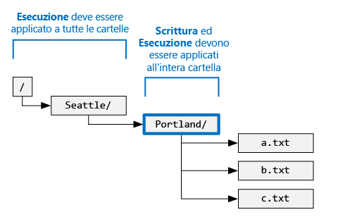



* Per la cartella di cui si intende eseguire l'enumerazione, il chiamante deve avere autorizzazioni **Lettura + Esecuzione**
* Per tutte le cartelle predecessore, il chiamante deve avere autorizzazioni **Esecuzione**

## Visualizzazione delle autorizzazioni nel portale di Azure

Nel pannello **Esplora dati** dell'account Data Lake Store fare clic su **Accesso** per visualizzare gli ACL per un file o una cartella. Nella schermata seguente fare clic su Accesso per visualizzare gli ACL per la cartella **catalog** dell'account **mydatastore**.

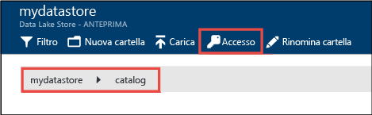



Successivamente, nel pannello **Accesso** fare clic su **Visualizzazione semplice** per passare alla visualizzazione semplificata.

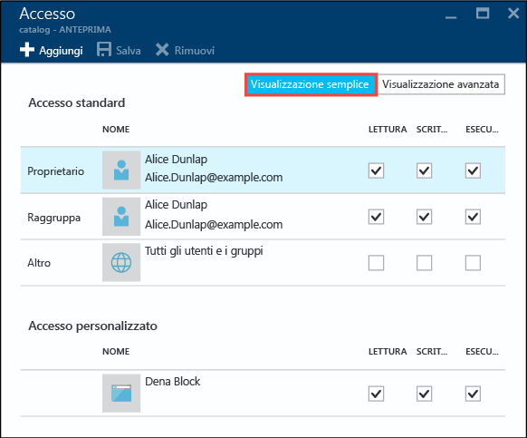



Fare clic su **Visualizzazione avanzata** per passare alla visualizzazione più avanzata.

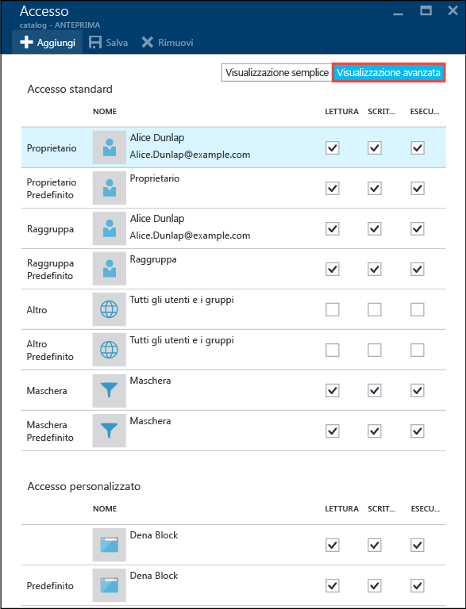



## Superuser

Un superuser ha diritti superiori rispetto a qualsiasi altro utente di Data Lake Store. Un superuser:

* Ha autorizzazioni RWX per **tutti** i file e le cartelle.
* Può modificare le autorizzazioni per qualsiasi file o cartella.
* Può modificare l'utente o il gruppo proprietario di qualsiasi file o cartella.

In Azure, un account Data Lake Store include diversi ruoli di Azure:

* Proprietari
* Collaboratori
* Lettori
* e così via.

Tutti i membri del ruolo **Proprietari** per un account Data Lake Store sono automaticamente superuser per tale account. Per altre informazioni sul controllo degli accessi in base al ruolo in Azure, vedere [questo articolo](../active-directory/role-based-access-control-configure.md).

## Utente proprietario

L'utente che ha creato l'elemento ne è automaticamente l'utente proprietario. Un utente proprietario può:

* Modificare le autorizzazioni di un file di sua proprietà.
* Modificare il gruppo proprietario di un file di sua proprietà, a condizione che l'utente proprietario sia anche membro del gruppo di destinazione.

>[AZURE.NOTE] L'utente proprietario **non può** modificare l'utente proprietario di un altro file. Solo i superuser possono modificare l'utente proprietario di un file o una cartella.

## Gruppo proprietario

Negli ACL POSIX, ogni utente è associato a un "gruppo primario". L'utente "alice" ad esempio, può appartenere al gruppo "finanza". Alice può appartenere a più gruppi, ma uno solo è sempre designato come suo gruppo primario. In POSIX, quando Alice crea un file, come gruppo proprietario del file viene impostato il gruppo primario di Alice, in questo caso "finanza".
 
Quando viene creato un nuovo elemento del file system, Data Lake Store assegna un valore al gruppo proprietario.

* **Caso 1** - Cartella radice "/": questa cartella viene creata al momento della creazione di un account Data Lake Store. In questo caso, il gruppo proprietario viene impostato sull'utente che ha creato l'account.
* **Caso 2** - Tutti gli altri casi: quando viene creato un nuovo elemento, il gruppo proprietario viene copiato dalla cartella padre.

Il gruppo proprietario può essere modificato da:
* Qualsiasi superuser
* Utente proprietario, se è anche membro del gruppo di destinazione

## Algoritmo di controllo dell'accesso

La figura seguente rappresenta l'algoritmo di controllo dell'accesso per gli account Data Lake Store.

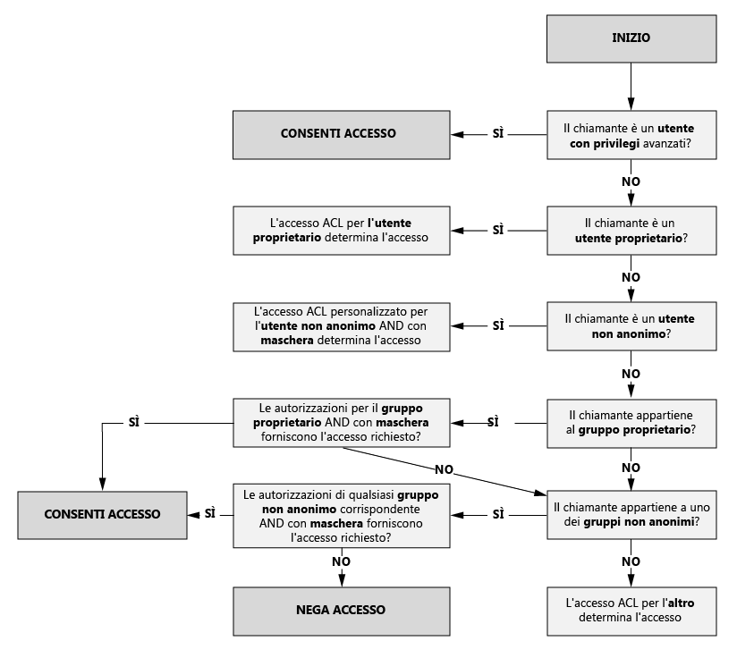



## Proprietà mask e "autorizzazioni valide"

La proprietà **mask** è un valore RWX usato per limitare l'accesso per **utenti non anonimi**, **gruppo proprietario** e **gruppi con nome** durante l'esecuzione dell'algoritmo di controllo dell'accesso. Di seguito sono descritti i concetti chiave relativi a mask.

* La proprietà mask crea "autorizzazioni valide", ovvero modifica le autorizzazioni al momento del controllo dell'accesso.
* La proprietà mask può essere modificata direttamente dal proprietario del file e da qualsiasi superuser.
* La proprietà mask può rimuovere autorizzazioni per creare l'autorizzazione valida. La proprietà mask **non può** aggiungere autorizzazioni all'autorizzazione valida.

Verranno ora esaminati alcuni esempi. Di seguito, la proprietà mask è impostata su **RWX** e non rimuove quindi alcuna autorizzazione. Si noti che le autorizzazioni valide per l'utente non anonimo, il gruppo proprietario e il gruppo con nome non vengono modificate durante il controllo dell'accesso.

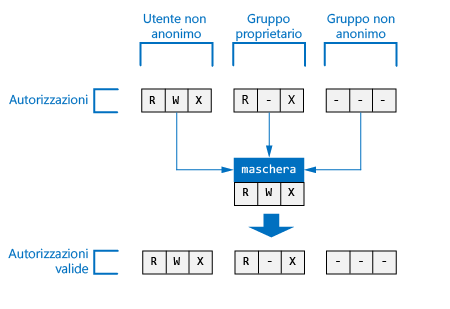



Nell'esempio seguente, la proprietà mask è impostata su **R-X**. Di conseguenza, al momento del controllo dell'accesso **disattiva l'autorizzazione di scrittura** per l'**utente non anonimo**, il **gruppo proprietario** e il **gruppo con nome**.

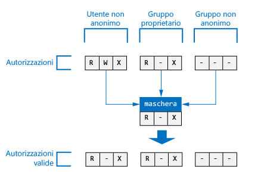



Per riferimento, di seguito è illustrata la visualizzazione nel portale di Azure della proprietà mask per un file o una cartella.

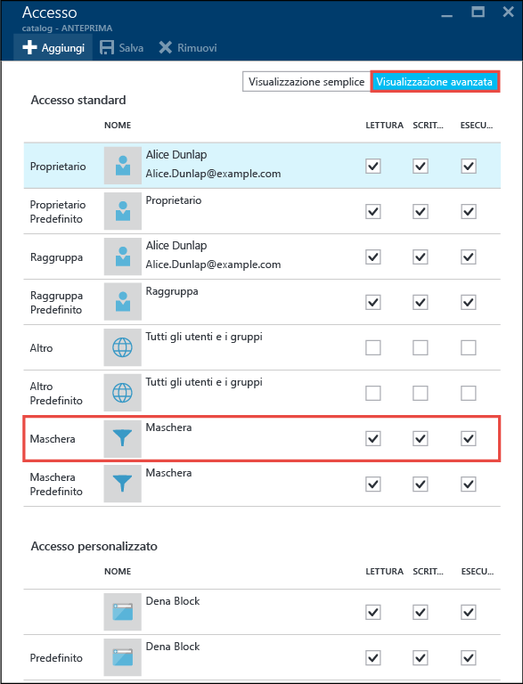



>[AZURE.NOTE] Per un nuovo account Data Lake Store, l'impostazione predefinita di mask per l'ACL di accesso e l'ACL predefinito della cartella radice ("/") è RWX.

## Autorizzazioni per nuovi file e cartelle

Quando si crea un nuovo file o una nuova cartella in una cartella esistente, l'ACL predefinito per la cartella padre determina quanto segue:

* ACL predefinito e ACL di accesso di una cartella figlio
* ACL di accesso di un file figlio (i file non hanno un ACL predefinito)

### ACL di accesso di una cartella o un file figlio

Quando si crea una cartella o un file figlio, l'ACL predefinito dell'elemento padre viene copiato come ACL di accesso della cartella o del file figlio. Se **altri** utenti hanno autorizzazioni RWX nell'ACL predefinito dell'elemento padre, vengono completamente rimosse dall'ACL di accesso dell'elemento figlio.

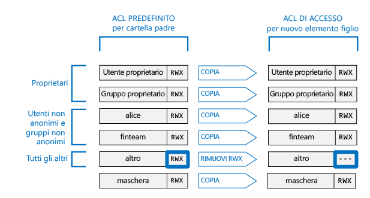



Nella maggior parte degli scenari, le informazioni sopra riportate costituiscono tutto quanto è necessario sapere in merito al modo in cui viene determinato l'ACL di accesso di un elemento figlio. Se si ha familiarità con i sistemi POSIX e si vuole comprendere in modo approfondito come viene ottenuta questa trasformazione, vedere la sezione [Ruolo di umask nella creazione dell'ACL di accesso per nuovi file e cartelle](#umasks-role-in-creating-the-access-acl-for-new-files-and-folders) più avanti in questo articolo.
 

### ACL predefinito di una cartella figlio

Quando viene creata una cartella figlio in una cartella padre, l'ACL predefinito della cartella padre viene copiato, così com'è, nell'ACL predefinito della cartella figlio.

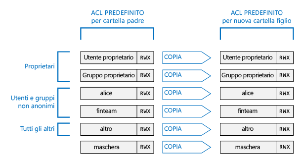



## Argomenti avanzati per informazioni dettagliate sugli ACL in Data Lake Store

Di seguito sono riportati alcuni argomenti avanzati che consentono di ottenere informazioni dettagliate su come vengono determinati gli ACL per i file e le cartelle di Data Lake Store.

### Ruolo di umask nella creazione dell'ACL di accesso per nuovi file e cartelle

In un sistema compatibile con POSIX, il concetto generale è che la proprietà umask è un valore a 9 bit relativo alla cartella padre usato per trasformare l'autorizzazione per l'**utente proprietario**, il **gruppo proprietario** e gli **altri** utenti nell'ACL di accesso di una nuova cartella o un nuovo file figlio. I bit di umask identificano i bit da disattivare nell'ACL di accesso dell'elemento figlio. La proprietà umask viene così usata per impedire in modo selettivo la propagazione delle autorizzazioni per l'utente proprietario, il gruppo proprietario e gli altri utenti.
  
In un sistema HDFS, umask è in genere un'opzione di configurazione a livello di sito controllata dagli amministratori. Data Lake Store usa una proprietà **umask a livello di account** non modificabile. La tabella seguente descrive la proprietà umask di Data Lake Store.

| Gruppo utenti | Impostazione | Effetto sull'ACL di accesso di un nuovo elemento figlio |
|------------ |---------|---------------------------------------|
| Utente proprietario | --- | Nessun effetto | | Gruppo proprietario| --- | Nessun effetto | | Altri | RWX | Rimozione Lettura + Scrittura + Esecuzione |

La figura seguente illustra il funzionamento di questa proprietà umask. L'effetto in definitiva è la rimozione dell'autorizzazione **Lettura + Scrittura + Esecuzione** per gli **altri** utenti. Dato che in umask non sono specificati bit per l'**utente proprietario** e il **gruppo proprietario**, tali autorizzazioni non vengono trasformate.

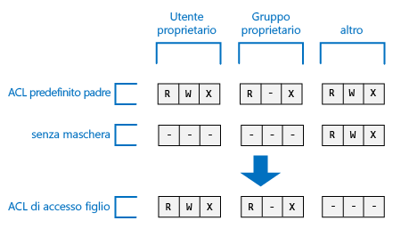



### Sticky bit

Lo sticky bit è una funzionalità più avanzata di un file system POSIX. Nel contesto di Data Lake Store, è improbabile che lo sticky bit sia necessario.

La tabella seguente descrive il funzionamento dello sticky bit in Data Lake Store.

| Gruppo utenti | File | Cartella |
|--------------------|---------|-------------------------|
| Sticky bit **OFF** | Nessun effetto | Nessun effetto |
| Sticky bit **ON** | Nessun effetto | Impedisce a chiunque tranne i **superuser** e l'**utente proprietario** di un elemento figlio di eliminare o rinominare l'elemento figlio. |

Lo sticky bit non viene visualizzato nel portale di Azure.

## Domande comuni sugli ACL in Data Lake Store

Di seguito sono riportate alcune domande comuni frequentemente poste in merito agli ACL in Data Lake Store.

### È necessario abilitare il supporto per gli ACL?

No. Il controllo di accesso tramite ACL è sempre attivo per un account Data Lake Store.

### Quali autorizzazioni sono necessarie per eliminare in modo ricorsivo una cartella e il relativo contenuto?

* Sono necessarie autorizzazioni **Scrittura + Esecuzione** nella cartella padre.
* Sono necessarie autorizzazioni **Lettura + Scrittura + Esecuzione** nella cartella da eliminare e in ogni cartella all'interno di essa.
>[AZURE.NOTE] Per eliminare i file nelle cartelle non sono necessarie autorizzazioni di scrittura per tali file. La cartella radice "/" non può **mai** essere eliminata.

### Quale utente viene impostato come proprietario di un file o una cartella?

Il creatore di un file o una cartella ne diventa il proprietario.

### Quale gruppo viene impostato come proprietario di un file o una cartella al momento della creazione?

L'impostazione viene copiata dal gruppo proprietario della cartella padre in cui si crea il nuovo file o la nuova cartella.

### Se l'utente proprietario di un file non ha le autorizzazioni RWX di cui ha bisogno, che cosa occorre fare?

L'utente proprietario può semplicemente modificare le autorizzazioni del file in modo da assegnarsi tutte le autorizzazioni RWX necessarie.

### Data Lake Store supporta l'ereditarietà degli ACL?

No.

### Qual è la differenza tra mask e umask?

| mask | umask|
|------|------|
| La proprietà **mask** è disponibile per ogni file e cartella. | **umask** è una proprietà dell'account Data Lake Store. Di conseguenza, in Data Lake Store esiste un unico valore umask. |
| La proprietà mask per un file o una cartella può essere modificata dall'utente proprietario, dal gruppo proprietario di un file o da un superuser. | La proprietà umask non può essere modificata da alcun utente, inclusi i superuser. È un valore costante non modificabile.|
| La proprietà mask viene usata durante l'algoritmo di controllo dell'accesso in fase di esecuzione per determinare se un utente ha il diritto di eseguire un'operazione su un file o una cartella. Il ruolo di mask è creare "autorizzazioni valide" al momento del controllo dell'accesso. | La proprietà umask non viene usata durante il controllo dell'accesso. Viene usata per determinare l'ACL di accesso dei nuovi elementi figlio di una cartella. |
| La proprietà mask è un valore RWX a 3 bit applicato a un utente non anonimo, a un gruppo con nome e all'utente proprietario al momento del controllo dell'accesso.| La proprietà umask è un valore a 9 bit applicato all'utente proprietario, al gruppo proprietario e agli altri utenti di un nuovo elemento figlio.| 

### Dove è possibile reperire altre informazioni sul modello di controllo di accesso POSIX?

* [http://www.vanemery.com/Linux/ACL/POSIX\_ACL\_on\_Linux.html](http://www.vanemery.com/Linux/ACL/POSIX_ACL_on_Linux.html)

* [HDFS Permission Guide (Guida alle autorizzazioni HDFS)](http://hadoop.apache.org/docs/current/hadoop-project-dist/hadoop-hdfs/HdfsPermissionsGuide.html)

* [Domande frequenti su POSIX](http://www.opengroup.org/austin/papers/posix_faq.html)

* [POSIX 1003.1 2008](http://standards.ieee.org/findstds/standard/1003.1-2008.html)

* [POSIX 1003.1e 1997](http://users.suse.com/~agruen/acl/posix/Posix_1003.1e-990310.pdf)

* [ACL POSIX in Linux](http://users.suse.com/~agruen/acl/linux-acls/online/)

* [ACL: Using Access Control Lists on Linux (ACL: uso di elenchi di controllo di accesso in Linux)](http://bencane.com/2012/05/27/acl-using-access-control-lists-on-linux/)

## Vedere anche

* [Panoramica dell’Archivio Data Lake di Azure](data-lake-store-overview.md)

* [Introduzione all’analisi dei dati di Data Lake di Azure](../data-lake-analytics/data-lake-analytics-get-started-portal.md)

<!---HONumber=AcomDC_0914_2016-->