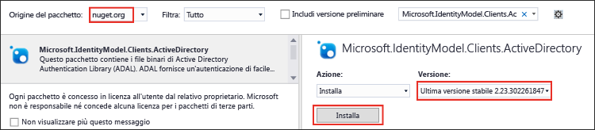

<properties
   pageTitle="Usare .NET SDK con Data Lake Store per sviluppare applicazioni | Azure"
   description="Usare .NET SDK con Azure Data Lake Store per sviluppare applicazioni"
   services="data-lake-store"
   documentationCenter=""
   authors="nitinme"
   manager="paulettm"
   editor="cgronlun"/>

<tags
   ms.service="data-lake-store"
   ms.devlang="na"
   ms.topic="hero-article"
   ms.tgt_pltfrm="na"
   ms.workload="big-data"
   ms.date="04/07/2016"
   ms.author="nitinme"/>

# Introduzione ad Azure Data Lake Store con .NET SDK

> [AZURE.SELECTOR]
- [Portale](data-lake-store-get-started-portal.md)
- [PowerShell](data-lake-store-get-started-powershell.md)
- [.NET SDK](data-lake-store-get-started-net-sdk.md)
- [SDK per Java](data-lake-store-get-started-java-sdk.md)
- [API REST](data-lake-store-get-started-rest-api.md)
- [Interfaccia della riga di comando di Azure](data-lake-store-get-started-cli.md)
- [Node.JS](data-lake-store-manage-use-nodejs.md)

Informazioni su come usare .NET SDK con Azure Data Lake Store per creare un account di Azure Data Lake Store ed eseguire operazioni di base, ad esempio creare cartelle, caricare e scaricare i file di dati, eliminare l'account e così via. Per altre informazioni su Data Lake, vedere [Azure Data Lake Store](data-lake-store-overview.md).

## Prerequisiti

* Visual Studio 2013 o 2015. Le istruzioni seguenti fanno riferimento a Visual Studio 2015.
* Una **sottoscrizione di Azure**. Vedere [Ottenere una versione di valutazione gratuita di Azure](https://azure.microsoft.com/pricing/free-trial/).
* **Abilitare la sottoscrizione di Azure** per l'anteprima pubblica di Data Lake Store. Vedere le [istruzioni](data-lake-store-get-started-portal.md#signup).
* Creare un'applicazione Azure Active Directory (AAD) e recuperare l'**ID client** e l'**URI di risposta**. Per altre informazioni sulle applicazioni AAD e istruzioni su come ottenere un ID client, vedere [Creare un'applicazione e un'entità servizio di Active Directory tramite il portale](../resource-group-create-service-principal-portal.md). L'URI di risposta sarà disponibile anche dal portale dopo aver creato l'applicazione.

## Come si esegue l'autenticazione tramite Azure Active Directory?

Il frammento di codice riportato di seguito offre due metodi per l'autenticazione:

* **Interattivo**, in cui l'utente accede tramite l'applicazione. Questo viene implementato nel metodo `AuthenticateUser` nel frammento di codice riportato di seguito.

* **Non interattivo**, in cui l'applicazione fornisce le proprie credenziali. Questo viene implementato nel metodo `AuthenticateAppliaction` nel frammento di codice riportato di seguito.

Anche se nel frammento di codice riportato di seguito sono inclusi i metodi per entrambi gli approcci, questo articolo usa il metodo `AuthenticateUser`. Questo metodo richiede l'immissione dell'ID client dell'applicazione AAD e dell'URI di risposta. Il collegamento nella sezione dei prerequisiti include le istruzioni per ottenere tali valori.

>[AZURE.NOTE] Per modificare il frammento di codice e usare invece il metodo `AuthenticateApplication`, oltre all'ID client e all'URI di risposta è necessario specificare anche la chiave di autenticazione client come input del metodo. Per informazioni su come generare e recuperare la chiave di autenticazione client, vedere anche l'articolo [Creare un'applicazione e un'entità servizio di Active Directory tramite il portale](../resource-group-create-service-principal-portal.md).

## Creare un'applicazione .NET

1. Aprire Visual Studio e creare un'applicazione console.

2. Scegliere **Nuovo** dal menu **File** e quindi fare clic su **Progetto**.

3. In **Nuovo progetto** digitare o selezionare i valori seguenti:

	| Proprietà | Valore |
	|----------|-----------------------------|
	| Categoria | Templates/Visual C#/Windows |
	| Modello | Applicazione console |
	| Name | CreateADLApplication |

4. Fare clic su **OK** per creare il progetto.

5. Aggiungere i pacchetti NuGet al progetto.

	1. Fare clic con il pulsante destro del mouse sul nome del progetto in Esplora soluzioni e scegliere **Gestisci pacchetti NuGet**.
	2. Nella scheda **Gestione pacchetti NuGet** assicurarsi che l'opzione **Origine pacchetto** sia impostata su **nuget.org** e che la casella di controllo **Includi versione preliminare** sia selezionata.
	3. Cercare e installare i pacchetti di Archivio Data Lake seguenti:

		* `Microsoft.Azure.Management.DataLake.Store`
		* `Microsoft.Azure.Management.DataLake.StoreUploader`

		

	4. Installare anche il pacchetto `Microsoft.IdentityModel.Clients.ActiveDirectory` per l'autenticazione di Azure Active Directory. Assicurarsi di *deselezionare* la casella di controllo **Includi versione preliminare** per poter installare una versione stabile del pacchetto.

		

	5. Chiudere la finestra **Gestione pacchetti NuGet**.

7. Aprire **Program.cs** e sostituire il blocco di codice esistente con il codice seguente. Immettere anche i valori per i parametri indicati nel frammento di codice, ad esempio **\_adlsAccountName** e **\_resourceGroupName** e sostituire i segnaposto per **APPLICATION-CLIENT-ID**, **APPLICATION-REPLY-URI** e **SUBSCRIPTION-ID**.

	Questo codice esegue i processi seguenti: creazione di un account per l'archivio Data Lake, creazione di cartelle nell'archivio, caricamento di file, scaricamento di file e infine eliminazione dell'account. Se si stanno cercando dati di esempio da caricare, è possibile ottenere la cartella **Ambulance Data** dal [repository Git di Azure Data Lake](https://github.com/MicrosoftBigData/usql/tree/master/Examples/Samples/Data/AmbulanceData).

        using System;
        using System.IO;
        using System.Security;
        using System.Text;
        using System.Collections.Generic;
        using System.Linq;

        using Microsoft.Azure.Management.DataLake.Store;
        using Microsoft.Azure.Management.DataLake.Store.Models;
        using Microsoft.Azure.Management.DataLake.StoreUploader;
        using Microsoft.IdentityModel.Clients.ActiveDirectory;
        using Microsoft.Rest;

        namespace SdkSample
        {
            class Program
            {
                private static DataLakeStoreAccountManagementClient _adlsClient;
                private static DataLakeStoreFileSystemManagementClient _adlsFileSystemClient;

                private static string _adlsAccountName;
                private static string _resourceGroupName;
                private static string _location;

                private static void Main(string[] args)
                {
                    _adlsAccountName = "<DATA-LAKE-STORE-NAME>"; // TODO: Replace this value with the name for a NEW Store account.
                    _resourceGroupName = "<RESOURCE-GROUP-NAME>"; // TODO: Replace this value. This resource group should already exist.
                    _location = "East US 2";

                    string localFolderPath = @"C:\local_path"; // TODO: Make sure this exists and can be overwritten.
                    string localFilePath = @"C:\local_path\file.txt"; // TODO: Make sure this exists and can be overwritten.
                    string remoteFolderPath = "/data_lake_path/";
                    string remoteFilePath = remoteFolderPath + "file.txt";

                    // Authenticate the user
                    var tokenCreds = AuthenticateUser("common", "https://management.core.windows.net/",
                        "<APPLICATION-CLIENT-ID>", new Uri("https://<APPLICATION-REPLY-URI>")); // TODO: Replace bracketed values.

                    SetupClients(tokenCreds, "<SUBSCRIPTION-ID>"); // TODO: Replace bracketed value.

                    // Run sample scenarios
                    WaitForNewline("Authenticated.", "Creating NEW account.");
                    CreateAccount();
                    WaitForNewline("Account created.", "Creating a directory.");

                    // Create a directory in the Data Lake Store
                    CreateDirectory(remoteFolderPath);
                    WaitForNewline("Directory created.", "Showing directory info.");

                    // Get info about the directory in the Data Lake Store
                    var itemInfo = GetItemInfo(remoteFolderPath);
                    Console.WriteLine("Type: " + itemInfo.Type);
                    Console.WriteLine("Last modified (UTC): " +
                                      new DateTime(1970, 1, 1, 0, 0, 0, 0, DateTimeKind.Utc).AddMilliseconds(
                                          itemInfo.ModificationTime.Value));
                    WaitForNewline("Directory info shown.", "Uploading a file.");

                    // Upload a file to the Data Lake Store
                    UploadFile(localFilePath, remoteFilePath);
                    WaitForNewline("File uploaded.", "Listing files and directories.");

                    // List the files in the Data Lake Store
                    var itemList = ListItems(remoteFolderPath);
                    var fileMenuItems = itemList.Select(a => String.Format("{0,15} {1}", a.Type, a.PathSuffix));
                    Console.WriteLine(String.Join("\r\n", fileMenuItems));
                    WaitForNewline("Files and directories listed.", "Appending content to a file.");

                    // Append to a file in the Data Lake Store
                    AppendToFile(remoteFilePath, "123");
                    WaitForNewline("Content appended.", "Downloading a file.");

                    // Download a file from the Data Lake Store
                    DownloadFile(remoteFilePath, localFilePath);
                    WaitForNewline("File downloaded.", "Deleting account.");

                    // Delete account
                    DeleteAccount();
                    WaitForNewline("Account deleted. You can now exit.");
                }

                // Helper function to show status and wait for user input
                public static void WaitForNewline(string reason, string nextAction = "")
                {
                    if (!String.IsNullOrWhiteSpace(nextAction))
                    {
                        Console.WriteLine(reason + "\r\nPress ENTER to continue...");
                        Console.ReadLine();
                        Console.WriteLine(nextAction);
                    }
                    else
                    {
                        Console.WriteLine(reason + "\r\nPress ENTER to continue...");
                        Console.ReadLine();
                    }
                }

                // Authenticate the user with AAD through an interactive popup.
                // You need to have an application registered with AAD in order to authenticate.
                //   For more information and instructions on how to register your application with AAD, see:
                //   https://azure.microsoft.com/documentation/articles/resource-group-create-service-principal-portal/
                public static TokenCredentials AuthenticateUser(string tenantId, string resource, string appClientId, Uri appRedirectUri, string userId = "")
                {
                    var authContext = new AuthenticationContext("https://login.microsoftonline.com/" + tenantId);

                    var tokenAuthResult = authContext.AcquireToken(resource, appClientId, appRedirectUri,
                        PromptBehavior.Auto, UserIdentifier.AnyUser);

                    return new TokenCredentials(tokenAuthResult.AccessToken);
                }

                // Authenticate the application with AAD through the application's secret key.
                // You need to have an application registered with AAD in order to authenticate.
                //   For more information and instructions on how to register your application with AAD, see:
                //   https://azure.microsoft.com/documentation/articles/resource-group-create-service-principal-portal/
                public static TokenCredentials AuthenticateApplication(string tenantId, string resource, string appClientId, Uri appRedirectUri, SecureString clientSecret)
                {
                    var authContext = new AuthenticationContext("https://login.microsoftonline.com/" + tenantId);
                    var credential = new ClientCredential(appClientId, clientSecret);

                    var tokenAuthResult = authContext.AcquireToken(resource, credential);

                    return new TokenCredentials(tokenAuthResult.AccessToken);
                }

                //Set up clients
                public static void SetupClients(TokenCredentials tokenCreds, string subscriptionId)
                {
                    _adlsClient = new DataLakeStoreAccountManagementClient(tokenCreds);
                    _adlsClient.SubscriptionId = subscriptionId;

                    _adlsFileSystemClient = new DataLakeStoreFileSystemManagementClient(tokenCreds);
                    _adlsFileSystemClient.SubscriptionId = subscriptionId;
                }

                // Create account
                public static void CreateAccount()
                {
                    // Create ADLS account
                    var adlsParameters = new DataLakeStoreAccount(location: _location);
                    _adlsClient.Account.Create(_resourceGroupName, _adlsAccountName, adlsParameters);
                }

                // Delete account
                public static void DeleteAccount()
                {
                    _adlsClient.Account.Delete(_resourceGroupName, _adlsAccountName);
                }

                // List all ADLS accounts within the subscription
                public static List<DataLakeStoreAccount> ListAdlStoreAccounts()
                {
                    var response = _adlsClient.Account.List(_adlsAccountName);
                    var accounts = new List<DataLakeStoreAccount>(response);

                    while (response.NextPageLink != null)
                    {
                        response = _adlsClient.Account.ListNext(response.NextPageLink);
                        accounts.AddRange(response);
                    }

                    return accounts;
                }

                // Upload a file
                public static void UploadFile(string srcFilePath, string destFilePath, bool force = true)
                {
                    var parameters = new UploadParameters(srcFilePath, destFilePath, _adlsAccountName, isOverwrite: force);
                    var frontend = new DataLakeStoreFrontEndAdapter(_adlsAccountName, _adlsFileSystemClient);
                    var uploader = new DataLakeStoreUploader(parameters, frontend);
                    uploader.Execute();
                }

                // Concatenate files
                public static void ConcatenateFiles(string[] srcFilePaths, string destFilePath)
                {
                    _adlsFileSystemClient.FileSystem.Concat(destFilePath, srcFilePaths, _adlsAccountName);
                }

                // Get file or directory info
                public static FileStatusProperties GetItemInfo(string path)
                {
                    return _adlsFileSystemClient.FileSystem.GetFileStatus(path, _adlsAccountName).FileStatus;
                }

                // List files and directories
                public static List<FileStatusProperties> ListItems(string directoryPath)
                {
                    return _adlsFileSystemClient.FileSystem.ListFileStatus(directoryPath, _adlsAccountName).FileStatuses.FileStatus.ToList();
                }

                // Download file
                public static void DownloadFile(string srcPath, string destPath)
                {
                    var stream = _adlsFileSystemClient.FileSystem.Open(srcPath, _adlsAccountName);
                    var fileStream = new FileStream(destPath, FileMode.Create);

                    stream.CopyTo(fileStream);
                    fileStream.Close();
                    stream.Close();
                }

                // Append to file
                public static void AppendToFile(string path, string content)
                {
                    var stream = new MemoryStream(Encoding.UTF8.GetBytes(content));

                    _adlsFileSystemClient.FileSystem.Append(path, stream, _adlsAccountName);
                }

                // Create a directory
                public static void CreateDirectory(string path)
                {
                    _adlsFileSystemClient.FileSystem.Mkdirs(path, _adlsAccountName);
                }
            }
        }

8. Compilare ed eseguire l'applicazione. Seguire le istruzioni per eseguire e completare l'applicazione.

## Passaggi successivi

- [Proteggere i dati in Data Lake Store](data-lake-store-secure-data.md)
- [Usare Azure Data Lake Analytics con Data Lake Store](../data-lake-analytics/data-lake-analytics-get-started-portal.md)
- [Usare Azure HDInsight con Data Lake Store](data-lake-store-hdinsight-hadoop-use-portal.md)

<!---HONumber=AcomDC_0413_2016-->