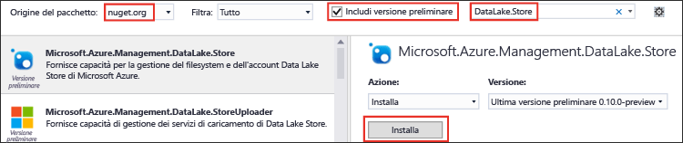

<properties
   pageTitle="Usare .NET SDK con Data Lake Store per sviluppare applicazioni | Microsoft Azure"
   description="Usare .NET SDK con Azure Data Lake Store per sviluppare applicazioni"
   services="data-lake-store"
   documentationCenter=""
   authors="nitinme"
   manager="jhubbard"
   editor="cgronlun"/>



<tags
   ms.service="data-lake-store"
   ms.devlang="na"
   ms.topic="get-started-article"
   ms.tgt_pltfrm="na"
   ms.workload="big-data"
   ms.date="09/15/2016"
   ms.author="nitinme"/>

# Introduzione ad Azure Data Lake Store con .NET SDK

> [AZURE.SELECTOR]
- [Portale](data-lake-store-get-started-portal.md)
- [PowerShell](data-lake-store-get-started-powershell.md)
- [.NET SDK](data-lake-store-get-started-net-sdk.md)
- [SDK per Java](data-lake-store-get-started-java-sdk.md)
- [API REST](data-lake-store-get-started-rest-api.md)
- [Interfaccia della riga di comando di Azure](data-lake-store-get-started-cli.md)
- [Node.JS](data-lake-store-manage-use-nodejs.md)

Informazioni su come usare [.NET SDK con Azure Data Lake Store](https://msdn.microsoft.com/library/mt581387.aspx) per eseguire operazioni di base, ad esempio creare cartelle, caricare e scaricare file di dati e così via. Per altre informazioni su Data Lake, vedere [Azure Data Lake Store](data-lake-store-overview.md).

## Prerequisiti

* **Visual Studio 2013 o 2015**. Le istruzioni seguenti fanno riferimento a Visual Studio 2015.

* **Una sottoscrizione di Azure**. Vedere [Ottenere una versione di valutazione gratuita di Azure](https://azure.microsoft.com/pricing/free-trial/).

* **Account di Archivio Data Lake di Azure**. Per istruzioni su come creare un account, vedere [Introduzione ad Azure Data Lake Store tramite il portale di Azure](data-lake-store-get-started-portal.md)

* **Creare un'applicazione di Azure Active Directory** se si vuole che l'applicazione esegua automaticamente l'autenticazione con Azure Active Directory.

	* **Per l'autenticazione non interattiva, basata su entità servizio**: in Azure Active Directory è necessario creare un'**applicazione Web**. Dopo aver creato l'applicazione, recuperare i valori seguenti correlati.
		- Ottenere l'**ID client** e il **segreto client** per l'applicazione
		- Assegnare l'applicazione Azure Active Directory a un ruolo. Il ruolo può essere al livello dell'ambito in cui si desidera concedere l'autorizzazione per l'applicazione di Azure Active Directory. Ad esempio, è possibile assegnare l'applicazione al livello della sottoscrizione o del gruppo di risorse.

	Per istruzioni su come recuperare questi valori, impostare le autorizzazioni e assegnare i ruoli, vedere [Creare un'applicazione e un'entità servizio di Active Directory tramite il portale](../resource-group-create-service-principal-portal.md).

## Creare un'applicazione .NET

1. Aprire Visual Studio e creare un'applicazione console.

2. Scegliere **Nuovo** dal menu **File** e quindi fare clic su **Progetto**.

3. In **Nuovo progetto** digitare o selezionare i valori seguenti:

	| Proprietà | Valore |
	|----------|-----------------------------|
	| Categoria | Templates/Visual C#/Windows |
	| Modello | Applicazione console |
	| Nome | CreateADLApplication |

4. Fare clic su **OK** per creare il progetto.

5. Aggiungere i pacchetti NuGet al progetto.

	1. Fare clic con il pulsante destro del mouse sul nome del progetto in Esplora soluzioni e scegliere **Gestisci pacchetti NuGet**.
	2. Nella scheda **Gestione pacchetti NuGet** assicurarsi che l'opzione **Origine pacchetto** sia impostata su **nuget.org** e che la casella di controllo **Includi versione preliminare** sia selezionata.
	3. Cercare e installare i pacchetti NuGet seguenti:

		* `Microsoft.Azure.Management.DataLake.Store` - In questa esercitazione si usa v0.12.5-preview.
		* `Microsoft.Azure.Management.DataLake.StoreUploader` - In questa esercitazione si usa v0.10.6-preview.
		* `Microsoft.Rest.ClientRuntime.Azure.Authentication` - In questa esercitazione si usa v2.2.8-preview.

		



	4. Chiudere la finestra **Gestione pacchetti NuGet**.

6. Aprire **Program.cs**, eliminare il codice esistente e quindi includere le istruzioni seguenti per aggiungere riferimenti agli spazi dei nomi.

        using System;
        using System.Threading;
        
        using Microsoft.Rest.Azure.Authentication;
        using Microsoft.Azure.Management.DataLake.Store;
        using Microsoft.Azure.Management.DataLake.StoreUploader;

7. Dichiarare le variabili come illustrato di seguito e specificare i valori per il nome di Data Lake Store e il nome del gruppo di risorse già esistenti. Assicurarsi anche che il nome file e percorso locale forniti esistano già nel computer. Aggiungere il frammento di codice seguente dopo le dichiarazioni dello spazio dei nomi.

        namespace SdkSample
        {
            class Program
            {
                private static DataLakeStoreAccountManagementClient _adlsClient;
                private static DataLakeStoreFileSystemManagementClient _adlsFileSystemClient;
                
                private static string _adlsAccountName;
                private static string _resourceGroupName;
                private static string _location;
                
                private static void Main(string[] args)
                {
                    _adlsAccountName = "<DATA-LAKE-STORE-NAME>"; // TODO: Replace this value with the name of your existing Data Lake Store account.
                    _resourceGroupName = "<RESOURCE-GROUP-NAME>"; // TODO: Replace this value with the name of the resource group containing your Data Lake Store account.
                    _location = "East US 2";
                    
                    string localFolderPath = @"C:\local_path"; // TODO: Make sure this exists and can be overwritten.
                    string localFilePath = localFolderPath + "file.txt"; // TODO: Make sure this exists and can be overwritten.
                    string remoteFolderPath = "/data_lake_path/";
                    string remoteFilePath = remoteFolderPath + "file.txt";
                }
            }
        }

Nelle sezioni rimanenti dell'articolo è possibile vedere come usare i metodi .NET disponibili per eseguire operazioni come autenticazione, caricamento di file e così via.

## Autenticazione

Il frammento seguente può essere usato per un'esperienza di accesso interattiva.

    // User login via interactive popup
    //    Use the client ID of an existing AAD "Native Client" application.
    SynchronizationContext.SetSynchronizationContext(new SynchronizationContext());
    var domain = "common"; // Replace this string with the user's Azure Active Directory tenant ID or domain name, if needed.
    var nativeClientApp_clientId = "1950a258-227b-4e31-a9cf-717495945fc2";
    var activeDirectoryClientSettings = ActiveDirectoryClientSettings.UsePromptOnly(nativeClientApp_clientId, new Uri("urn:ietf:wg:oauth:2.0:oob"))
    var creds = UserTokenProvider.LoginWithPromptAsync(domain, activeDirectoryClientSettings).Result;

In alternativa, il frammento seguente può essere usato per autenticare l'applicazione in modo non interattivo, usando il segreto client o la chiave per un'entità applicazione o servizio.

    // Service principal / appplication authentication with client secret / key
    //    Use the client ID and certificate of an existing AAD "Web App" application.
    SynchronizationContext.SetSynchronizationContext(new SynchronizationContext());
    var domain = "<AAD-directory-domain>";
    var webApp_clientId = "<AAD-application-clientid>";
    var clientSecret = "<AAD-application-clientid>";
    var clientCredential = new ClientCredential(webApp_clientId, clientSecret);
    var creds = ApplicationTokenProvider.LoginSilentAsync(domain, clientCredential).Result;

Come terza opzione, il frammento seguente può essere usato per autenticare l'applicazione in modo non interattivo, usando il certificato di un'entità applicazione o servizio.

    // Service principal / application authentication with certificate
    //    Use the client ID and certificate of an existing AAD "Web App" application.
    SynchronizationContext.SetSynchronizationContext(new SynchronizationContext());
    var domain = "<AAD-directory-domain>";
    var webApp_clientId = "<AAD-application-clientid>";
    System.Security.Cryptography.X509Certificates.X509Certificate2 clientCert = <AAD-application-client-certificate>
    var clientAssertionCertificate = new ClientAssertionCertificate(webApp_clientId, clientCert);
    var creds = ApplicationTokenProvider.LoginSilentWithCertificateAsync(domain, clientAssertionCertificate).Result;

## Creare oggetti client

Il frammento seguente crea gli account Data Lake Store e gli oggetti client del file system, usati per inviare richieste al servizio.

    // Create client objects
    var fileSystemClient = new DataLakeStoreFileSystemManagementClient(creds);

## Elencare tutti gli account Data Lake Store all'interno di una sottoscrizione

Il frammento seguente elenca tutti gli account Data Lake Store all'interno di una determinata sottoscrizione di Azure.

    // List all ADLS accounts within the subscription
    public static List<DataLakeStoreAccount> ListAdlStoreAccounts()
    {
        var response = _adlsClient.Account.List(_adlsAccountName);
        var accounts = new List<DataLakeStoreAccount>(response);
        
        while (response.NextPageLink != null)
        {
            response = _adlsClient.Account.ListNext(response.NextPageLink);
            accounts.AddRange(response);
        }
        
        return accounts;
    }

## Creare una directory

Il frammento seguente illustra il metodo `CreateDirectory` che è possibile usare per creare una directory in un account Data Lake Store.

    // Create a directory
    public static void CreateDirectory(string path)
    {
        _adlsFileSystemClient.FileSystem.Mkdirs(_adlsAccountName, path);
    }

## Caricare un file

Il frammento seguente illustra il metodo `UploadFile` che è possibile usare per caricare file in un account Data Lake Store.

    // Upload a file
    public static void UploadFile(string srcFilePath, string destFilePath, bool force = true)
    {
        var parameters = new UploadParameters(srcFilePath, destFilePath, _adlsAccountName, isOverwrite: force);
        var frontend = new DataLakeStoreFrontEndAdapter(_adlsAccountName, _adlsFileSystemClient);
        var uploader = new DataLakeStoreUploader(parameters, frontend);
        uploader.Execute();
    }

DataLakeStoreUploader supporta il caricamento e il download ricorsivi tra un percorso di file o cartella locale e Data Lake Store.

## Ottenere informazioni su un file o una directory

Il frammento seguente illustra il metodo `GetItemInfo` che è possibile usare per recuperare informazioni su un file o una directory disponibile in Data Lake Store.

    // Get file or directory info
    public static FileStatusProperties GetItemInfo(string path)
    {
        return _adlsFileSystemClient.FileSystem.GetFileStatus(_adlsAccountName, path).FileStatus;
    }

## Elencare file o directory

Il frammento seguente illustra il metodo `ListItem` che è possibile usare per elencare il file e le directory in un account Data Lake Store.

    // List files and directories
    public static List<FileStatusProperties> ListItems(string directoryPath)
    {
        return _adlsFileSystemClient.FileSystem.ListFileStatus(_adlsAccountName, directoryPath).FileStatuses.FileStatus.ToList();
    }

## Concatenare file

Il frammento seguente illustra il metodo `ConcatenateFiles` da usare per concatenare file.

    // Concatenate files
    public static void ConcatenateFiles(string[] srcFilePaths, string destFilePath)
    {
        _adlsFileSystemClient.FileSystem.Concat(_adlsAccountName, destFilePath, srcFilePaths);
    }

## Aggiungere a un file

Il frammento seguente illustra il metodo `AppendToFile` da usare per aggiungere dati a un file già archiviato in un account Data Lake Store.

    // Append to file
    public static void AppendToFile(string path, string content)
    {
        var stream = new MemoryStream(Encoding.UTF8.GetBytes(content));
        
        _adlsFileSystemClient.FileSystem.Append(_adlsAccountName, path, stream);
    }

## Scaricare un file

Il frammento seguente illustra il metodo `DownloadFile` da usare per scaricare un file da un account Data Lake Store.

    // Download file
    public static void DownloadFile(string srcPath, string destPath)
    {
        var stream = _adlsFileSystemClient.FileSystem.Open(_adlsAccountName, srcPath);
        var fileStream = new FileStream(destPath, FileMode.Create);
        
        stream.CopyTo(fileStream);
        fileStream.Close();
        stream.Close();
    }

## Passaggi successivi

- [Proteggere i dati in Data Lake Store](data-lake-store-secure-data.md)
- [Usare Azure Data Lake Analytics con Data Lake Store](../data-lake-analytics/data-lake-analytics-get-started-portal.md)
- [Usare Azure HDInsight con Archivio Data Lake](data-lake-store-hdinsight-hadoop-use-portal.md)
- [Informazioni di riferimento su .NET SDK con Data Lake Store](https://msdn.microsoft.com/library/mt581387.aspx)
- [Data Lake Store REST Reference (Informazioni di riferimento su REST per Data Lake Store)](https://msdn.microsoft.com/library/mt693424.aspx)

<!---HONumber=AcomDC_0921_2016-->