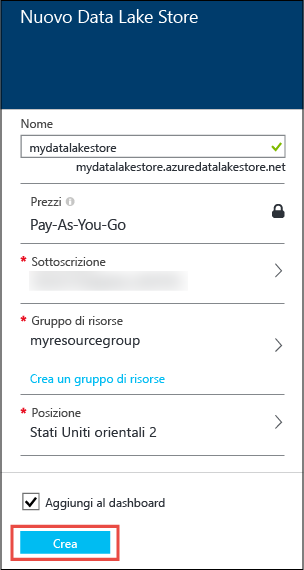
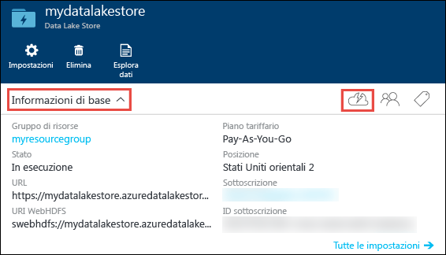
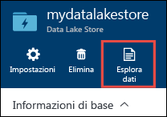
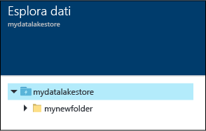
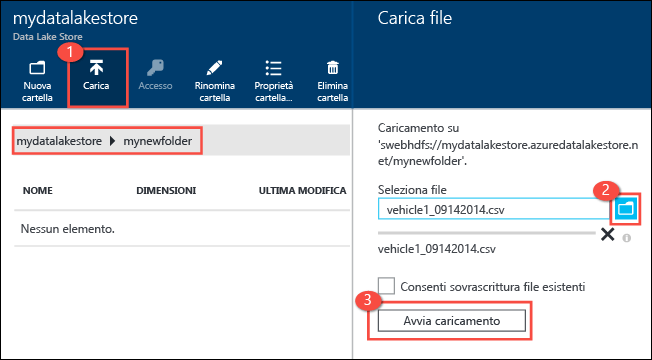
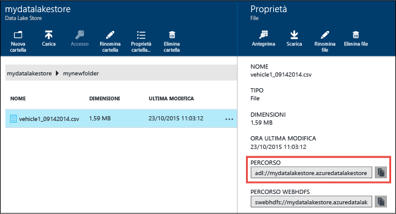
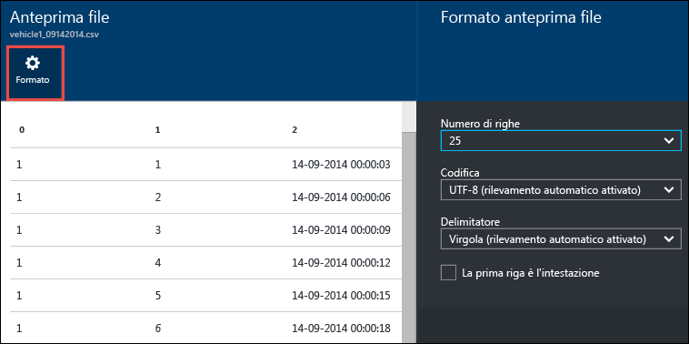
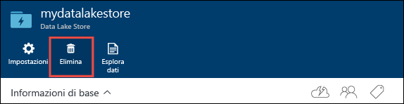

<properties 
   pageTitle="Introduzione a Data Lake Store | Azure" 
   description="Usare il portale per creare un account di Data Lake Store ed eseguire operazioni di base nel Data Lake Store" 
   services="data-lake-store" 
   documentationCenter="" 
   authors="nitinme" 
   manager="jhubbard" 
   editor="cgronlun"/>
 
<tags
   ms.service="data-lake-store"
   ms.devlang="na"
   ms.topic="hero-article"
   ms.tgt_pltfrm="na"
   ms.workload="big-data" 
   ms.date="09/13/2016"
   ms.author="nitinme"/>



# Introduzione all’Archivio Data Lake di Azure tramite il portale di Azure.

> [AZURE.SELECTOR]
- [Portale](data-lake-store-get-started-portal.md)
- [PowerShell](data-lake-store-get-started-powershell.md)
- [.NET SDK](data-lake-store-get-started-net-sdk.md)
- [SDK per Java](data-lake-store-get-started-java-sdk.md)
- [API REST](data-lake-store-get-started-rest-api.md)
- [Interfaccia della riga di comando di Azure](data-lake-store-get-started-cli.md)
- [Node.JS](data-lake-store-manage-use-nodejs.md)

Informazioni su come usare il portale di Azure per creare un account di Azure Data Lake Store ed eseguire operazioni di base, ad esempio creare cartelle, caricare e scaricare i file di dati, eliminare l'account e così via. Per altre informazioni su Data Lake Store, vedere [Panoramica dell’archivio Data Lake di Azure](data-lake-store-overview.md).

## Prerequisiti

Prima di iniziare questa esercitazione, è necessario disporre di quanto segue:

- **Una sottoscrizione di Azure**. Vedere [Ottenere una versione di valutazione gratuita di Azure](https://azure.microsoft.com/pricing/free-trial/).

## Apprendimento rapido con i video

Guardare i video seguenti per iniziare a usare Archivio Data Lake.

* [Creare un account Archivio Data Lake](https://mix.office.com/watch/1k1cycy4l4gen)
* [Gestire i dati in Archivio Data Lake usando Esplora dati](https://mix.office.com/watch/icletrxrh6pc)

## Creare un account di Azure Data Lake Store

1. Accedere al nuovo [portale di Azure](https://portal.azure.com).

2. Fare clic su **NUOVO**, fare clic su **Dati + archiviazione**, e quindi fare clic su **Archivio Data Lake di Azure**. Leggere le informazioni nel pannello **Archivio Azure Data Lake**, quindi fare clic su **Crea** nell'angolo inferiore sinistro del pannello.

3. Nel pannello **nuovo archivio Data Lake**, fornire i valori come illustrato nella schermata riportata di seguito:

	



	- **Sottoscrizione**. Selezionare la sottoscrizione in cui si vuole creare un nuovo account Data Lake Store.
	- **Gruppo di risorse** Selezionare un gruppo di risorse esistente, o fare clic su **Crea un gruppo di risorse** per crearne uno. Un gruppo di risorse è un contenitore che contiene risorse correlate per un'applicazione. Per altre informazioni, vedere [Gruppi di risorse in Azure](resource-group-overview.md#resource-groups).
	- **Posizione**: selezionare una posizione in cui si desidera creare l'account Archivio Data Lake

4. Selezionare **Aggiungi alla schermata iniziale** se si desidera che l'account Archivio Data Lake sia accessibile dalla schermata iniziale.

5. Fare clic su **Crea**. Se si è scelto di aggiungere l'account nella schermata iniziale, si viene indirizzati nella schermata iniziale, dove è possibile visualizzare lo stato di avanzamento del provisioning dell'account Archivio Data Lake. Una volta eseguito il provisioning dell'account di Archivio Data Lake, viene visualizzato il pannello dell’account.

6. Espandere l’elenco a discesa **Essentials** per visualizzare le informazioni relative all'account Archivio Data Lake, ad esempio la risorsa di gruppo di cui fa parte, la posizione e così via. Scegliere l’icona **Avvio rapido** per visualizzare i collegamenti ad altre risorse correlate a Archivio Data Lake

	



## Creare delle cartelle in Azure Data Lake Store

È possibile creare delle cartelle con il proprio account di Archivio Data Lake per gestire e archiviare i dati.

1. Aprire l'account archivio Data Lake appena creato. Dal riquadro sinistro fare clic su **Sfoglia**, fare clic su **Archivio Data Lake**, e poi dal pannello dell’Archivio Data Lake, fare clic sul nome dell’account in cui si desidera creare delle cartelle. Se è stato aggiunto l'account alla schermata iniziale, fare clic sul riquadro dell’account.

2. Nel pannello dell’account Archivio Data Lake, fare clic su **Esplora dati**.

	



3. Nel pannello dell’ Archivio Data Lake, fare clic su **Nuova cartella**, immettere un nome per la nuova cartella e quindi fare clic su **OK**.
	
	


	
	La cartella appena creata verrà elencata nel pannello **Esplora dati**. È possibile creare cartelle nidificate fino a qualsiasi livello.

	



## Caricare dati in Archivio Data Lake di Azure

È possibile caricare i dati in un archivio Data Lake di Azure direttamente a livello di radice o in una cartella creata all'interno dell'account. Nella schermata di seguito, seguire i passaggi per caricare un file in una sotto-cartella dal pannello **Esplora dati**. In questa schermata, il file viene caricato in una sotto-cartella nei percorsi di navigazione (contrassegnati in una casella rossa).

Se si stanno cercando dati di esempio da caricare, è possibile ottenere la cartella **Ambulance Data** dal [Repository GitHub per Azure Data Lake](https://github.com/MicrosoftBigData/usql/tree/master/Examples/Samples/Data/AmbulanceData).





## Proprietà e azioni disponibili sui dati archiviati

Fare clic sul file appena aggiunto per aprire il pannello **Proprietà**. Le proprietà associate al file e alle azioni che è possibile eseguire nel file sono disponibili in questo pannello. È inoltre possibile copiare il percorso completo al file nell'account dell’Archivio Data Lake di Azure, evidenziato nella casella rossa nella schermata riportata di seguito.





* Fare clic su **Anteprima** per visualizzare un'anteprima del file direttamente dal browser. È possibile specificare anche il formato dell'anteprima. Fare clic su **Anteprima**, fare clic su **Formato** nel pannello **Anteprima File** e nell pannello **Formato di Anteprima del file** specificare opzioni quali il numero di righe da visualizzare, la codifica da utilizzare, il delimitatore da utilizzare e così via.

  



* Fare clic su **Download** per scaricare il file nel computer.

* Fare clic su **Rinomina file** per rinominare il file.

* Fare clic su **Elimina file** per eliminare il file.

## Protezione dei dati

È possibile proteggere i dati archiviati nell'account Archivio Data Lake di Azure mediante Azure Active Directory e il controllo di accesso (ACL). Per istruzioni su come eseguire questa operazione, vedere [Protezione dei dati nell'archivio Data Lake di Azure](data-lake-store-secure-data.md).

## Eliminare l'account di Azure Data Lake Store

Per eliminare un account di Archivio Data Lake di Azure, dal pannello dell’account dell’Archivio Data Lake, fare clic su **Elimina**. Per confermare l'azione, verrà chiesto di immettere il nome dell'account che si desidera eliminare. Immettere il nome dell’account e quindi fare clic su **Elimina**.





## Passaggi successivi

- [Proteggere i dati in Data Lake Store](data-lake-store-secure-data.md)
- [Usare Azure Data Lake Analytics con Data Lake Store](../data-lake-analytics/data-lake-analytics-get-started-portal.md)
- [Usare Azure HDInsight con Data Lake Store](data-lake-store-hdinsight-hadoop-use-portal.md)
- [Accesso ai log di diagnostica per Azure Data Lake Store](data-lake-store-diagnostic-logs.md)

<!---HONumber=AcomDC_0914_2016-->