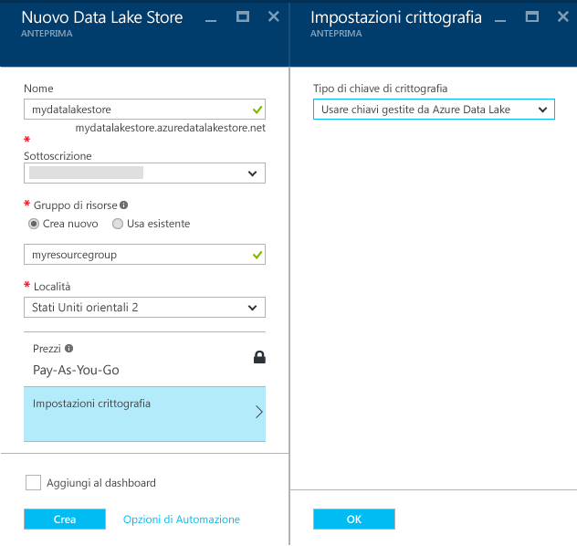
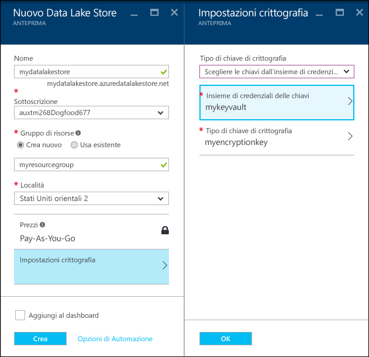
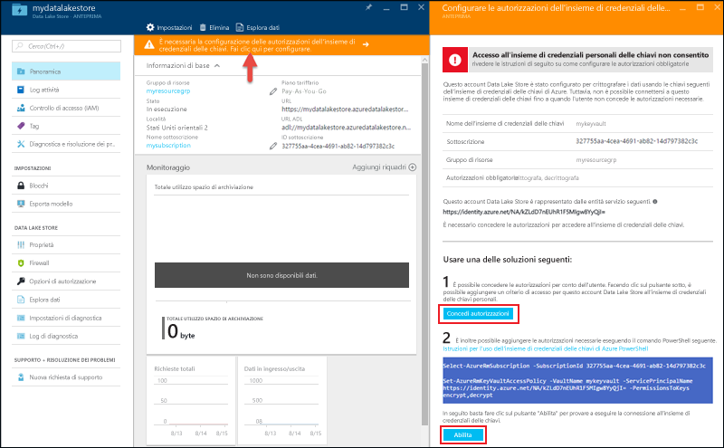

# Introduzione all’Archivio Data Lake di Azure tramite il portale di Azure.
> [!div class="op_single_selector"]
> * [Portale](data-lake-store-get-started-portal.md)
> * [PowerShell](data-lake-store-get-started-powershell.md)
> * [.NET SDK](data-lake-store-get-started-net-sdk.md)
> * [SDK per Java](data-lake-store-get-started-java-sdk.md)
> * [API REST](data-lake-store-get-started-rest-api.md)
> * [Interfaccia della riga di comando di Azure](data-lake-store-get-started-cli.md)
> * [Interfaccia della riga di comando di Azure 2.0](data-lake-store-get-started-cli-2.0.md)
> * [Node.js](data-lake-store-manage-use-nodejs.md)
> * [Python](data-lake-store-get-started-python.md)
>
> 

Informazioni su come usare il portale di Azure per creare un account di Azure Data Lake Store ed eseguire operazioni di base, ad esempio creare cartelle, caricare e scaricare i file di dati, eliminare l'account e così via. Per altre informazioni su Data Lake Store, vedere [Panoramica di Azure Data Lake Store](data-lake-store-overview.md).

## Prerequisiti
Prima di iniziare questa esercitazione, è necessario disporre di quanto segue:

* **Una sottoscrizione di Azure**. Vedere [Ottenere una versione di valutazione gratuita di Azure](https://azure.microsoft.com/pricing/free-trial/).

## Apprendimento rapido con i video
Guardare i video seguenti per iniziare a usare Archivio Data Lake.

* [Creare un account Archivio Data Lake](https://mix.office.com/watch/1k1cycy4l4gen)
* [Gestire i dati in Archivio Data Lake usando Esplora dati](https://mix.office.com/watch/icletrxrh6pc)

## Creare un account di Azure Data Lake Store
1. Accedere al nuovo [portale di Azure](https://portal.azure.com).
2. Fare clic su **NUOVO**, selezionare **Data + Storage** (Dati + archiviazione), quindi fare clic su **Azure Data Lake Store**. Leggere le informazioni nel pannello **Azure Data Lake Store**, quindi fare clic su **Crea** nell'angolo inferiore sinistro del pannello.
3. Nel pannello **nuovo archivio Data Lake** , fornire i valori come illustrato nella schermata riportata di seguito:
   
    
   
   * **Nome**. Immettere un nome univoco per l'account Data Lake Store.
   * **Sottoscrizione**. Selezionare la sottoscrizione in cui si vuole creare un nuovo account Data Lake Store.
   * **Gruppo di risorse**. Selezionare un gruppo di risorse esistente oppure selezionare l'opzione **Crea nuovo** per crearne uno. Un gruppo di risorse è un contenitore che contiene risorse correlate per un'applicazione. Per altre informazioni, vedere [Gruppi di risorse in Azure](../azure-resource-manager/resource-group-overview.md#resource-groups).
   * **Posizione**: selezionare una posizione in cui si desidera creare l'account Archivio Data Lake
   * **Impostazioni crittografia**. È possibile scegliere se crittografare l'account Data Lake Store. Se si sceglie di crittografarlo, è anche possibile specificare come gestire la chiave di crittografia principale che si vuole usare per crittografare i dati nell'account.
     
     * (Facoltativo) Selezionare **Non abilitare la crittografia** dall'elenco a discesa per rifiutare esplicitamente la crittografia.
     * (Impostazione predefinita) Selezionare **Usare chiavi gestite da Azure Data Lake** per gestire le chiavi di crittografia con Azure Data Lake Store.
       
         
     * (Facoltativo) Selezionare **Scegliere le chiavi dall'insieme di credenziali delle chiavi di Azure** per usare le proprie chiavi presenti nell'insieme di credenziali delle chiavi di Azure. Con questa opzione, è anche possibile creare le chiavi e un account dell'insieme di credenziali delle chiavi, se necessario.
       
         
       
       Fare clic su **OK** nel pannello **Impostazioni crittografia**.
       
       > [!NOTE]
       > Se si usano le chiavi di un insieme di credenziali delle chiavi di Azure per configurare la crittografia per l'account Data Lake Store, è necessario assegnare le autorizzazioni per l'accesso dell'account Azure Data Lake Store all'insieme di credenziali delle chiavi di Azure. Per le istruzioni, vedere [Assegnare le autorizzazioni all'insieme di credenziali delle chiavi di Azure](#assign-permissions-to-the-azure-key-vault).
       > 
       > 
4. Fare clic su **Crea**. Se si è scelto di aggiungere l'account al dashboard, si viene indirizzati al dashboard, dove è possibile visualizzare lo stato di avanzamento del provisioning dell'account Data Lake Store. Una volta eseguito il provisioning dell'account di Archivio Data Lake, viene visualizzato il pannello dell’account.

## Assegnare le autorizzazioni all'insieme di credenziali delle chiavi di Azure
Se sono state usate le chiavi di un insieme di credenziali delle chiavi di Azure per configurare la crittografia nell'account Data Lake Store, è necessario configurare l'accesso tra l'account Data Lake Store e l'account dell'insieme di credenziali delle chiavi di Azure. Seguire quindi questa procedura.

1. Se sono state usate le chiavi dell'insieme di credenziali delle chiavi di Azure, il pannello dell'account Data Lake Store visualizza un avviso in alto. Fare clic sull'avviso per aprire il pannello **Configurare le autorizzazioni dell'insieme di credenziali delle chiavi**.
   
    
2. Il pannello mostra due opzioni per configurare l'accesso.
   
   * Nella prima opzione, fare clic su **Concedi autorizzazione** per configurare l'accesso. La prima opzione è abilitata solo quando l'utente che ha creato l'account Data Lake Store è anche un amministratore dell'insieme di credenziali delle chiavi di Azure.
   * L'altra opzione consiste nell'eseguire il cmdlet di PowerShell visualizzato nel pannello. È necessario essere il proprietario dell'insieme di credenziali delle chiavi di Azure o poter concedere le autorizzazioni per l'insieme di credenziali delle chiavi di Azure. Dopo avere eseguito il cmdlet, tornare al pannello e fare clic su **Abilita** per configurare l'accesso.

## Creare delle cartelle in Azure Data Lake Store
È possibile creare delle cartelle con il proprio account di Archivio Data Lake per gestire e archiviare i dati.

1. Aprire l'account archivio Data Lake appena creato. Dal riquadro sinistro fare clic su **Sfoglia** e selezionare **Data Lake Store**, quindi dal pannello di Data Lake Store fare clic sul nome dell’account in cui si desidera creare le cartelle. Se è stato aggiunto l'account alla schermata iniziale, fare clic sul riquadro dell’account.
2. Nel pannello dell'account di Archivio Data Lake, fare clic su **Esplora dati**.
   
    
3. Nel pannello dell’account di Data Lake Store, fare clic su **Nuova cartella**, rinominarla, quindi selezionare **OK**.
   
    
   
    La cartella appena creata verrà elencata nel pannello **Esplora dati** . È possibile creare cartelle nidificate fino a qualsiasi livello.
   
    

## Caricare dati in Archivio Data Lake di Azure
È possibile caricare i dati in un archivio Data Lake di Azure direttamente a livello di radice o in una cartella creata all'interno dell'account. Nella schermata di seguito, seguire i passaggi per caricare un file in una sotto-cartella dal pannello **Esplora dati** . In questa schermata, il file viene caricato in una sotto-cartella nei percorsi di navigazione (contrassegnati in una casella rossa).

Se si stanno cercando dati di esempio da caricare, è possibile ottenere la cartella **Ambulance Data** dal [Repository GitHub per Azure Data Lake](https://github.com/MicrosoftBigData/usql/tree/master/Examples/Samples/Data/AmbulanceData).

## Proprietà e azioni disponibili sui dati archiviati
Fare clic sul file appena aggiunto per aprire il pannello **Proprietà** . Le proprietà associate al file e alle azioni che è possibile eseguire nel file sono disponibili in questo pannello. È inoltre possibile copiare il percorso completo al file nell'account dell’Archivio Data Lake di Azure, evidenziato nella casella rossa nella schermata riportata di seguito.

* Fare clic su **Anteprima** per visualizzare un'anteprima del file direttamente dal browser. È possibile specificare anche il formato dell'anteprima. Fare clic su **Anteprima**, selezionare **Formato** nel pannello **Anteprima file** e nell pannello **File Preview Format** (Formato anteprima file) specificare le opzioni, come ad esempio il numero di righe da visualizzare, la codifica e il delimitatore da usare e così via.
  
  
* Fare clic su **Download** per scaricare il file nel computer.
* Fare clic su **Rinomina file** per rinominare il file.
* Fare clic su **Elimina file** per eliminare il file.

## Protezione dei dati
È possibile proteggere i dati archiviati nell'account Archivio Data Lake di Azure mediante Azure Active Directory e il controllo di accesso (ACL). Per istruzioni su come eseguire questa operazione, vedere [Protezione dei dati nell'archivio Data Lake di Azure](data-lake-store-secure-data.md).

## Eliminare l'account di Azure Data Lake Store
Per eliminare un account di Archivio Data Lake di Azure, dal pannello dell’account dell’Archivio Data Lake, fare clic su **Elimina**. Per confermare l'azione, verrà chiesto di immettere il nome dell'account che si desidera eliminare. Immettere il nome dell’account e quindi fare clic su **Elimina**.

## Passaggi successivi
* [Proteggere i dati in Data Lake Store](data-lake-store-secure-data.md)
* [Usare Azure Data Lake Analytics con Data Lake Store](../data-lake-analytics/data-lake-analytics-get-started-portal.md)
* [Usare Azure HDInsight con Data Lake Store](data-lake-store-hdinsight-hadoop-use-portal.md)
* [Accesso ai log di diagnostica per Azure Data Lake Store](data-lake-store-diagnostic-logs.md)

