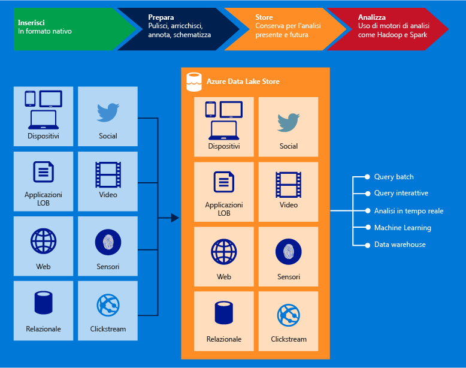

<properties
   pageTitle="Panoramica di Azure Data Lake Store | Azure"
   description="Comprendere che cos'è Azure Data Lake Store e il valore che fornisce per altri archivi di dati"
   services="data-lake-store"
   documentationCenter=""
   authors="nitinme"
   manager="jhubbard"
   editor="cgronlun"/>

<tags
   ms.service="data-lake-store"
   ms.devlang="na"
   ms.topic="get-started-article"
   ms.tgt_pltfrm="na"
   ms.workload="big-data"
   ms.date="08/02/2016"
   ms.author="nitinme"/>

# Panoramica dell’Archivio Data Lake di Azure

Azure Data Lake Store è un repository su vasta scala a livello aziendale per carichi di lavoro di analisi di Big Data. Azure Data Lake consente di acquisire dati di qualsiasi dimensione, tipo e velocità di inserimento in un'unica posizione per le analisi esplorative e operative.

> [AZURE.TIP] Utilizzare il [percorso di apprendimento di archivio Data Lake](https://azure.microsoft.com/documentation/learning-paths/data-lake-store-self-guided-training/) per iniziare ad esplorare il servizio di Archivio Data Lake di Azure.

Si può accedere all’Archivio Data Lake di Azure da Hadoop (disponibile con i cluster HDInsight) mediante le API REST WebHDFS compatibili. È progettato specificamente per consentire l'analisi su dati archiviati ed è ottimizzato per eseguire prestazioni per scenari di analisi dei dati. Per impostazione predefinita, include tutte le funzionalità a livello aziendale, protezione, gestibilità, scalabilità, affidabilità e disponibilità, essenziali per i casi di utilizzo aziendale reali.

Di seguito sono riportate alcune delle principali funzionalità di Azure Data Lake.

### Creato per Hadoop

L'archivio Azure Data Lake è un file system Apache Hadoop compatibile con HDFS (Hadoop Distributed File System) e funziona con l'ecosistema Hadoop. Le applicazioni HDInsight esistenti o i servizi che utilizzano l'API WebHDFS possono integrarsi facilmente con l'Archivio Data Lake. L’Archivio Data Lake presenta anche un'interfaccia REST compatibile con WebHDFS per le applicazioni

I dati archiviati nell'Archivio Data Lake possono essere analizzati facilmente mediante framework di analisi di Hadoop, come MapReduce o Hive. Si può eseguire il provisioning sui cluster di Microsoft Azure HDInsight e questi possono essere configurati per accedere direttamente ai dati archiviati nell'Archivio Data Lake.

### Archiviazione illimitata, file dei petabyte

L’Archivio Data Lake di Azure fornisce un'archiviazione illimitata ed è adatto per l'archiviazione di una serie di dati per l'analisi. Ciò non impone limiti per le dimensioni dell’account, le dimensioni dei file o la quantità di dati che possono essere archiviati in un Data Lake. I singoli file possono variare da kilobyte di petabyte rendendo la scelta ideale per memorizzare qualsiasi tipo di dati. I dati vengono archiviati in modo permanente creando più copie e non esiste alcun limite per la durata del tempo durante il quale i dati possono essere archiviati nel Data Lake.

### Prestazioni ottimizzate per l'analisi di Big Data

L'archivio Data Lake di Azure è progettato per l'esecuzione di sistemi di analisi di scalabilità di grandi dimensioni che richiedono una velocità effettiva molto elevata per eseguire query e analisi su grandi quantità di dati. Il Data Lake propaga parti di un file su un numero di singoli server di archiviazione. Ciò migliora la velocità effettiva di lettura durante la lettura in parallelo del file per l'esecuzione dell’analisi dei dati.

### A livello aziendale: con disponibilità elevata e sicuro

L’Archivio Data Lake di Azure offre affidabilità e disponibilità standard del settore. Gli asset di dati vengono archiviati in modo permanente creando copie ridondanti per salvaguardarsi da eventuali errori imprevisti. Le aziende possono utilizzare Azure Data Lake nelle loro soluzioni come una parte importante della piattaforma di dati esistente.

Archivio Data Lake fornisce anche la protezione a livello aziendale per i dati archiviati. Per altre informazioni, vedere [Protezione dei dati in Archivio Data Lake di Azure](#DataLakeStoreSecurity).

### Tutti i dati

L’Archivio Data Lake di Azure può immagazzinare i dati nel loro formato originale, così come sono, senza alcuna trasformazione. Archivio Data Lake non richiede uno schema prima che i dati vengano caricati, lasciando al singolo framework di analisi l’interpretazione dei dati e la definizione di uno schema al momento dell'analisi. La possibilità di archiviare i file di dimensioni e formati arbitrari fa sì che Archivio Data Lake possa gestire dati strutturati, semi-strutturati e non strutturati.

I contenitori di Archivio Azure Data Lake per i dati sono essenzialmente cartelle e file. È possibile agire sui dati archiviati mediante SDK, portale di Azure e Azure PowerShell. Dopo aver inserito i dati nell'archivio usando queste interfacce e i contenitori appropriati, è possibile memorizzare qualsiasi tipo di dati. Archivio Data Lake non esegue una gestione particolare dei dati in base al tipo di dati archiviati.

## Protezione dei dati nell'archivio Data Lake di Azure

Azure Data Lake Store utilizza la Azure Active Directory per gli elenchi di autenticazione e di controllo di accesso (ACL) per gestire l'accesso ai dati.

| Funzionalità | Descrizione |
|-----------------------------------------|------------------------------------------|
| Autenticazione | L’Archivio Data Lake di Azure si integra con la Azure Active Directory (AAD) per la gestione delle identità e degli accessi per tutti i dati memorizzati nell'archivio Data Lake di Azure. Come risultato dell'integrazione, ci sono i vantaggi di Azure Data Lake tratti da tutte le funzionalità AAD compresi l’autenticazione a più fattori, l'accesso condizionale, il controllo dell'accesso basato su ruoli, il monitoraggio dell'utilizzo dell'applicazione, sicurezza, il monitoraggio e l’avviso di sicurezza, e così via. L’Archivio Data Lake di Azure supporta il protocollo OAuth 2.0 per l'autenticazione con l'interfaccia REST. |
| Controllo di accesso | L'Archivio Data Lake di Azure fornisce il controllo di accesso mediante il supporto delle autorizzazioni di tipo POSIX esposte dal protocollo WebHDFS. Nella versione corrente, gli ACL possono essere abilitati nella cartella radice, nelle sottocartelle e nei singoli file. Gli ACL applicati alla cartella radice saranno applicabili anche a ogni cartella e file figlio.|

Per altre informazioni sulla protezione dei dati in Archivio Data Lake, fare clic sui collegamenti seguenti.

* Per istruzioni su come proteggere i dati in Archivio Data Lake, vedere [Protezione dei dati nell'archivio Data Lake di Azure](data-lake-store-secure-data.md).
* Se si preferiscono i video, [guardare questo video](https://mix.office.com/watch/1q2mgzh9nn5lx) su come proteggere i dati archiviati in Archivio Data Lake.

## Applicazioni compatibili con l'archivio Data Lake di Azure

Archivio Azure Data Lake è compatibile con la maggior parte dei componenti open source nell'ecosistema Hadoop. Si integra bene anche con altri servizi di Azure. Questo fa di Archivio Data Lake la soluzione ideale per le esigenze di archiviazione dei dati. Per altre informazioni su come usare Archivio Data Lake sia con componenti open source che con altri servizi di Azure, fare clic sui collegamenti seguenti.

* Vedere [Applicazioni e servizi compatibili con Archivio Azure Data Lake](data-lake-store-compatible-oss-other-applications.md) per un elenco di applicazioni open source interoperative con Archivio Data Lake.
* Vedere [Integrazione con altri servizi di Azure](data-lake-store-integrate-with-other-services.md) per comprendere come l’Archivio Data Lake possa essere utilizzato con altri servizi di Azure per abilitare una vasta gamma di scenari.
* Per informazioni su come usare Archivio Data Lake in scenari come l'inserimento, l'elaborazione, il download e la visualizzazione di dati, vedere [Scenari per l'uso di Archivio Data Lake](data-lake-store-data-scenarios.md).

## Informazioni sul file system di Azure Data Lake Store (adl://)

È possibile accedere a Data Lake Store attraverso il nuovo file system, AzureDataLakeFilesystem (adl://), in ambienti Hadoop (disponibile con il cluster HDInsight). Le applicazioni e servizi che utilizzano adl:// sono in grado di sfruttare altre ottimizzazioni delle prestazioni che non sono attualmente disponibili in WebHDFS. Di conseguenza, l’Archivio Data Lake offre la flessibilità di ricorrere alle migliori prestazioni con l'opzione consigliata di utilizzo adl:// o di mantenere il codice esistente continuando a utilizzare l'API WebHDFS direttamente. Azure HDInsight utilizza AzureDataLakeFilesystem per fornire prestazioni ottimali su Archivio Data Lake.

È possibile accedere ai dati nell'Archivio Data Lake utilizzando `adl://<data_lake_store_name>.azuredatalakestore.net`. Per altre informazioni su come accedere ai dati nell'Archivio Data Lake vedere [Visualizzare le proprietà dei dati archiviati](data-lake-store-get-started-portal.md#properties)

## Come iniziare ad utilizzare Archivio Data Lake di Azure?

Vedere [Guida introduttiva all’utilizzo di Archivio Data Lake tramite il portale di Azure](data-lake-store-get-started-portal.md), a come eseguire il provisioning di un Archivio Data Lake tramite il portale di Azure. Una volta eseguito il provisioning di Data Lake di Azure, è possibile imparare a utilizzare le offerte di Big data, ad esempio Analisi di Azure Data Lake o Azure HDInsight con l'Archivio Data Lake. È inoltre possibile creare un'applicazione .NET per ottenere un account Archivio Data Lake di Azure ed eseguire operazioni, scaricare dati e così via.

- [Introduzione all’analisi dei dati di Data Lake di Azure](../data-lake-analytics/data-lake-analytics-get-started-portal.md)
- [Usare Azure HDInsight con Data Lake Store](data-lake-store-hdinsight-hadoop-use-portal.md)
- [Introduzione a Azure Data Lake Store utilizzando .NET SDK](data-lake-store-get-started-net-sdk.md)

## Video su Archivio Data Lake

Se si preferisce guardare dei video per imparare a usare Archivio Data Lake, sono disponibili video su diverse funzionalità.

* [Creare un account di Archivio Azure Data Lake](https://mix.office.com/watch/1k1cycy4l4gen)
* [Usare Esplora dati per gestire i dati in Archivio Azure Data Lake](https://mix.office.com/watch/icletrxrh6pc)
* [Connettere Analisi Azure Data Lake ad Archivio Azure Data Lake](https://mix.office.com/watch/qwji0dc9rx9k)
* [Accedere ad Archivio Azure Data Lake con Analisi Data Lake](https://mix.office.com/watch/1n0s45up381a8)
* [Connettere Azure HDInsight ad Archivio Azure Data Lake](https://mix.office.com/watch/l93xri2yhtp2)
* [Accedere ad Archivio Azure Data Lake con Hive e Pig](https://mix.office.com/watch/1n9g5w0fiqv1q)
* [Usare DistCp (Hadoop Distributed Copy) per copiare i dati da e in Archivio Azure Data Lake](https://mix.office.com/watch/1liuojvdx6sie)
* [Usare Apache Sqoop per spostare i dati tra origini relazionali e Archivio Azure Data Lake](https://mix.office.com/watch/1butcdjxmu114)
* [Orchestrazione di dati con Azure Data Factory per Archivio Azure Data Lake](https://mix.office.com/watch/1oa7le7t2u4ka)
* [Protezione dei dati in Archivio Azure Data Lake](https://mix.office.com/watch/1q2mgzh9nn5lx)

<!----HONumber=AcomDC_0914_2016-->