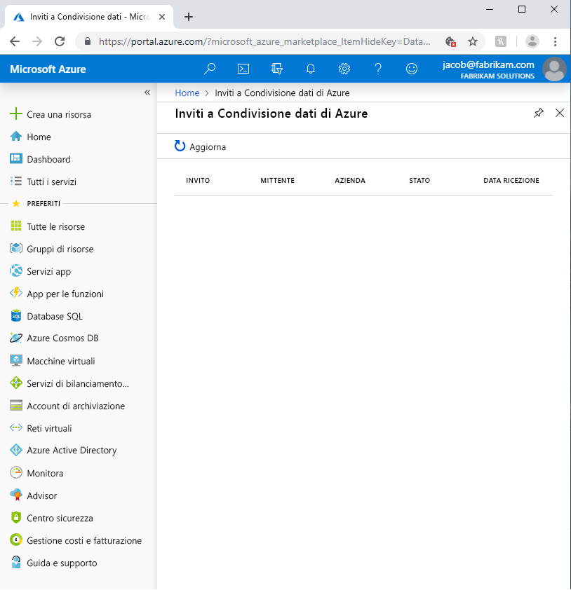
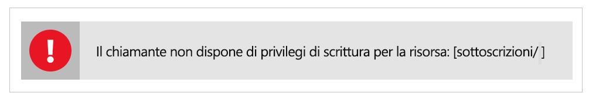

# Risolvere i problemi comuni in Condivisione dati di Azure (anteprima)

Questo articolo descrive come risolvere i problemi comuni relativi a Condivisione dati di Azure (anteprima). 

## Inviti a Condivisione dati di Azure 

In alcuni casi quando un nuovo utente fa clic su **Accept Invitation** (Accetta invito) nel messaggio di posta elettronica di invito ricevuto, viene visualizzato un elenco di inviti vuoto. 

L'errore descritto in precedenza è un problema noto del servizio ed è attualmente in fase di analisi. Per ovviare al problema, seguire questa procedura. 

1. Nel portale di Azure passare a **Sottoscrizioni**
1. Selezionare la sottoscrizione usata per Condivisione dati di Azure
1. Fare clic su **Provider di risorse**
1. Cercare Microsoft.DataShare
1. Fare clic su **Registra**

Per completare questa procedura, è necessario il [ruolo Collaboratore di Controllo degli accessi in base al ruolo in Azure](https://docs.microsoft.com/azure/role-based-access-control/built-in-roles#contributor). 

Se non è ancora possibile visualizzare un invito alla condivisione dati, contattare il provider di dati e assicurarsi che abbia inviato l'invito all'indirizzo di posta elettronica di accesso di Azure e *non* all'alias di posta elettronica personale. 

> [!IMPORTANT]
> Se è già stato accettato un invito a Condivisione dati di Azure e il servizio è stato chiuso prima della configurazione dell'archiviazione, seguire le istruzioni della guida pratica su [come configurare un mapping di set di dati](how-to-configure-mapping.md) per informazioni su come completare la configurazione della condivisione dati ricevuta e iniziare a ricevere dati. 

## Errore durante la creazione o la ricezione di una nuova condivisione dati

"Error: Operation returned an invalid status code 'BadRequest'" (Errore: l'operazione ha restituito un codice di stato non valido 'BadRequest)

"Error: AuthorizationFailed" (Errore: autorizzazione non riuscita)

"Error: role assignment to storage account" (Errore: assegnazione di ruolo all'account di archiviazione)

Se viene visualizzato uno degli errori indicati in precedenza durante la creazione o la ricezione di una nuova condivisione dati, le autorizzazioni per l'account di archiviazione non sono sufficienti. L'autorizzazione richiesta è *Microsoft.Authorization/role assignments/write*, che è disponibile nel ruolo di proprietario dell'account di archiviazione o può essere assegnata a un ruolo personalizzato. Anche se si è creato l'account di archiviazione è stato creato, NON si è automaticamente il proprietario di tale account. Seguire questa procedura per concedere a se stessi il ruolo di proprietario dell'account di archiviazione. In alternativa, è possibile creare un ruolo personalizzato con questa autorizzazione al quale è possibile aggiungere se stessi.  

1. Passare all'account di archiviazione nel portale di Azure.
1. Selezionare **Controllo di accesso (IAM)** .
1. Fare clic su **Aggiungi**.
1. Aggiungere se stessi come proprietario.

## Passaggi successivi

Per informazioni su come iniziare a condividere i dati, procedere con l'esercitazione sulla [condivisione dei dati](share-your-data.md).

