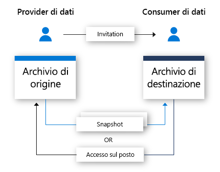

# Informazioni su Condivisione dati di Azure (anteprima)

Nel mondo moderno i dati vengono visti come asset strategici fondamentali che molte organizzazioni hanno l'esigenza di semplificare e condividere in sicurezza con clienti e partner. Esistono molte soluzioni per rispondere a questa esigenza, tra cui FTP, posta elettronica, API, solo per citarne alcune. Le organizzazioni possono facilmente perdere traccia delle persone con cui hanno condiviso i loro dati. Il provisioning e l'amministrazione della condivisione dei dati tramite FTP o tramite un'infrastruttura API appositamente realizzata comportano spesso costi elevati. L'uso di questi metodi di condivisione su vasta scala è associato a un sovraccarico di gestione. 

Molte organizzazioni sono tenute a essere responsabili dei dati che hanno condiviso. Oltre alla responsabilità, molte vorrebbero avere la possibilità di controllare, gestire e monitorare con semplicità tutti i dati che condividono. Nel mondo moderno, in cui i dati sono destinati a crescere a un ritmo esponenziale, è necessaria una soluzione semplice per condividere i Big Data. I clienti pretendono di avere i dati più aggiornati possibile per avere la certezza di derivarne informazioni significative e tempestive.

Condivisione dati di Azure (anteprima) consente alle organizzazioni di condividere i dati in modo semplice e sicuro con più clienti e partner. Con pochi clic del mouse, è possibile effettuare il provisioning di un nuovo account di condivisione dati, aggiungere set di dati e invitare clienti e partner a condividerli. I provider di dati rimangono sempre in controllo dei dati che hanno condiviso. Con Condivisione dati di Azure, è semplice gestire e monitorare i dati condivisi, quando e con chi. 

Il provider di dati può mantenere il controllo del modo in cui vengono gestiti i dati specificando apposite condizioni per l'utilizzo. Il consumer dei dati deve accettare queste condizioni prima di iniziare a riceverli. I provider di dati possono specificare la frequenza con cui i consumer ricevono gli aggiornamenti. L'accesso a nuovi aggiornamenti può essere revocato in qualsiasi momento dal provider di dati. 

Condivisione dati di Azure consente di ottimizzare le informazioni semplificando la combinazione di dati di terze parti per arricchire gli scenari di analisi e intelligenza artificiale. È possibile sfruttare facilmente le funzionalità degli strumenti di analisi di Azure per preparare, elaborare e analizzare i dati condivisi tramite Condivisione dati di Azure. 

## Scenari per Condivisione dati di Azure

Il servizio Condivisione dati di Azure può essere usato in numerosi settori diversi. Ad esempio, un rivenditore può scegliere di condividere i dati recenti dei punti vendita con i fornitori. Usando Condivisione dati di Azure, può configurare una condivisione contenente questi dati per tutti i fornitori e condividerli su base oraria o giornaliera. 

Condivisione dati di Azure può anche essere usato per stabilire un Marketplace di dati per uno specifico settore. Ad esempio, un ente pubblico o un istituto di ricerca può condividere regolarmente con terze parti e in forma anonima i dati sulla crescita della popolazione. 

Un altro caso d'uso di Condivisione dati di Azure riguarda l'instaurazione di un consorzio di dati. Ad esempio, diversi istituti di ricerca possono condividere i dati con un singolo organismo attendibile. I dati vengono analizzati, aggregati o elaborati con gli strumenti di analisi di Azure e quindi condivisi con le parti interessate. 

## Funzionamento

Condivisione dati di Azure usa un approccio alla condivisione basato su snapshot, per cui i dati vengono spostati dalla sottoscrizione di Azure del provider e finiscono nella sottoscrizione di Azure del consumer. Il provider di dati può effettuare il provisioning di una condivisione dati in cui invitare i destinatari. I consumer dei dati ricevono l'invito alla condivisione dati tramite posta elettronica. Dopo aver accettato l'invito, il consumer può attivare uno snapshot completo dei dati ricevuti in condivisione. Questi dati vengono ricevuti nell'account di archiviazione del consumer. I consumer dei dati ricevono regolari aggiornamenti incrementali per i dati, in modo da avere sempre l'ultima versione. 

I provider di dati possono offrire ai consumer aggiornamenti incrementali per i dati condivisi tramite una pianificazione di snapshot. Le pianificazioni di snapshot vengono offerte su base oraria o giornaliera. Dopo aver accettato e configurato la condivisione dati, il consumer può sottoscrivere una pianificazione di snapshot. Questa opzione è vantaggiosa negli scenari in cui i dati condivisi vengono aggiornati regolarmente e il consumer ha bisogno della versione più aggiornata. 

Dopo aver accettato una condivisione dati, il consumer potrà ricevere i dati in un account di archiviazione a sua scelta. Se ad esempio il provider condivide i dati tramite Archiviazione BLOB di Azure, il consumer può riceverli in Azure Data Lake Store. 

## Funzionalità principali

Condivisione dati di Azure consente ai provider di dati di:

* Condividere dati da Archiviazione di Azure e Azure Data Lake Store con clienti e partner esterni all'organizzazione

* Tenere traccia delle persone con cui ha condiviso i dati

* Controllare la frequenza con cui i consumer ricevono aggiornamenti per i dati

* Consentire ai clienti di eseguire il pull dell'ultima versione dei dati, se necessario, oppure di ricevere automaticamente le modifiche incrementali apportate ai dati a un intervallo predefinito

Condivisione dati di Azure consente ai consumer dei dati di: 

* Visualizzare una descrizione del tipo di dati condivisi

* Visualizzare le condizioni per l'utilizzo dei dati

* Accettare o rifiutare un invito di Condivisione dati di Azure

* Attivare uno snapshot completo o incrementale di una condivisione dati ricevuta da un'organizzazione

* Sottoscrivere una condivisione dati per ricevere la copia più recente dei dati tramite copia di snapshot incrementale

* Accettare i dati condivisi in un account di Archiviazione BLOB di Azure o Azure Data Lake Gen2

Tutte le principali funzionalità descritte sopra sono supportate tramite Azure o API REST. Per altre informazioni sull'uso di Condivisione dati di Azure tramite API REST, vedere la documentazione di riferimento. 

## Security

Condivisione dati di Azure sfrutta le funzionalità di sicurezza sottostanti offerte da Azure per proteggere i dati inattivi e in movimento. I dati inattivi vengono crittografati, se la funzionalità è supportata dal meccanismo di archiviazione sottostante. Anche i dati in movimento vengono crittografati, così come i metadati su una condivisione dati quando sono inattivi e in movimento. 

I controlli dell'accesso possono essere configurati a livello di risorsa di Condivisione dati di Azure per assicurare che siano accessibili solo da persone autorizzate. 

Condivisione dati di Azure sfrutta le identità gestite per le risorse di Azure (in precedenza MSI) per la gestione automatica delle identità in Azure Active Directory. Le identità gestite per le risorse di Azure vengono sfruttate per l'accesso agli account di archiviazione usati per la condivisione di dati. Non viene effettuato alcuno scambio di credenziali tra un provider di dati e un consumer. Per altre informazioni, vedere la pagina [Identità gestite per le risorse di Azure](https://docs.microsoft.com/azure/active-directory/managed-identities-azure-resources/services-support-managed-identities). 

## Prezzi

L'anteprima di Condivisione dati di Azure viene fatturata per due componenti. Il primo componente riguarda la gestione della condivisione dati. Durante la fase di anteprima, la gestione della condivisione dati sarà gratuita.

Il secondo componente riguarda lo spostamento. Condivisione dati di Azure prevede un addebito per lo spostamento dei dati dal tenant di Azure del provider al tenant di Azure del consumer. È richiesto il pagamento per lo spostamento di set di dati in base a singola operazione e per l'elaborazione richiesta per tale operazione. L'elaborazione dello spostamento dei set di dati viene addebitata in base a vCore-ora. Gli addebiti per l'elaborazione dello spostamento dei set di dati vengono ripartiti in modo proporzionale in base ai minuti, con arrotondamento per eccesso al minuto successivo. Durante la fase di anteprima, le operazioni di spostamento dei set di dati sono gratuite. 

Per altre informazioni sui prezzi, visitare la [pagina dei prezzi](https://azure.microsoft.com/pricing/) di Condivisione dati di Azure.

## Aree supportate

Per l'elenco delle aree di Azure in cui è disponibile Condivisione dati di Azure, visitare la pagina di [prodotti disponibili per area](https://azure.microsoft.com/global-infrastructure/services/) e cercare Condivisione dati di Azure. 

Condivisione dati di Azure non archivia alcun dato. I dati vengono archiviati negli account di archiviazione sottostanti che vengono condivisi. Se ad esempio un provider di dati archivia i propri dati in un account di Azure Data Lake Store situato negli Stati Uniti occidentali, i dati verranno archiviati in questa area. Se condivide i dati con un account di archiviazione di Azure situato in Europa occidentale, i dati vengono trasferiti direttamente all'account di archiviazione in Europa occidentale. 

Il servizio Condivisione dati di Azure non deve necessariamente essere disponibile nell'area in cui lo si vuole usare. Se ad esempio i dati sono archiviati in un account di archiviazione di Azure situato in un'area in cui Condivisione dati di Azure non è ancora disponibile, è comunque possibile usare il servizio per condividere i dati. 

## Passaggi successivi

Per informazioni su come iniziare a condividere i dati, procedere con l'esercitazione sulla [condivisione dei dati](share-your-data.md).
