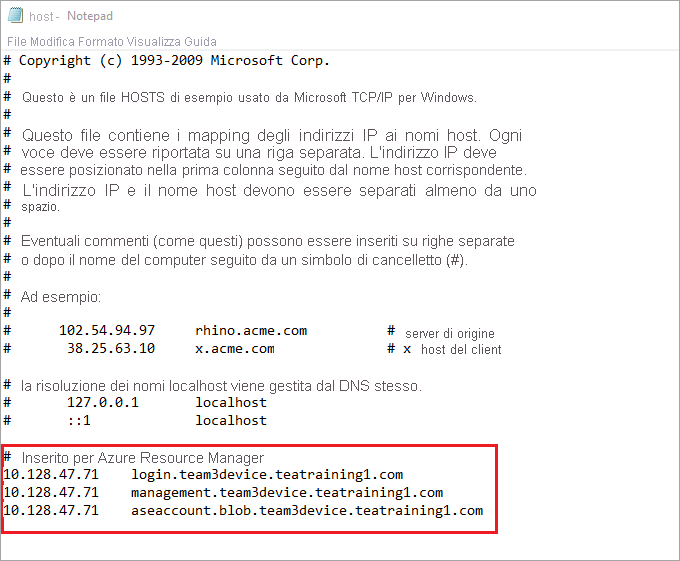

# <a name="deploy-vms-on-your-azure-stack-edge-gpu-device-using-azure-cli-and-python"></a>Distribuire VM in un dispositivo GPU Azure Stack Edge tramite interfaccia della riga di comando di Azure e Python

<!--[!INCLUDE [applies-to-skus](../../includes/azure-stack-edge-applies-to-all-sku.md)]-->

[!INCLUDE [azure-stack-edge-gateway-deploy-virtual-machine-overview](../../includes/azure-stack-edge-gateway-deploy-virtual-machine-overview.md)]

Questa esercitazione descrive come creare e gestire una macchina virtuale nel dispositivo Azure Stack Edge usando l'interfaccia della riga di comando di Azure e Python.

## <a name="vm-deployment-workflow"></a>Flusso di lavoro di distribuzione della VM

Il flusso di lavoro di distribuzione è illustrato nel diagramma seguente.


Il riepilogo generale del flusso di lavoro di distribuzione è il seguente:

1. Connettersi ad Azure Resource Manager
2. Creare un gruppo di risorse
3. Creare un account di archiviazione
4. Aggiungere l'URI del BLOB al file hosts
5. Installare i certificati
6. Caricare il VHD
7. Creare dischi gestiti dal disco rigido virtuale
8. Creare un'immagine di VM dal disco gestito dell'immagine
9. Creare una VM con le risorse create in precedenza
10. Creare una rete virtuale
11. Creare una scheda di interfaccia di rete virtuale usando l'ID subnet della rete virtuale

Per una spiegazione dettagliata del diagramma del flusso di lavoro, vedere [Distribuire VM nel dispositivo Azure Stack Edge con Azure PowerShell](azure-stack-edge-j-series-deploy-virtual-machine-powershell.md). Per informazioni su come connettersi ad Azure Resource Manager, vedere [Connettersi ad Azure Resource Manager con Azure PowerShell](azure-stack-edge-j-series-connect-resource-manager.md).

## <a name="prerequisites"></a>Prerequisiti

Prima di iniziare a creare e gestire una macchina virtuale nel dispositivo Azure Stack Edge usando l'interfaccia della riga di comando di Azure e Python, è necessario assicurarsi di aver completato i prerequisiti elencati nei passaggi seguenti:

1. Sono state completate le impostazioni di rete nel dispositivo Azure Stack Edge, come descritto in [Passaggio 1: Configurare il dispositivo Azure Stack Edge](azure-stack-edge-j-series-connect-resource-manager.md#step-1-configure-azure-stack-edge-device).

2. È stata abilitata un'interfaccia di rete per il calcolo. L'indirizzo IP di questa interfaccia di rete viene usato per creare uno switch virtuale per la distribuzione della VM. I passaggi seguenti illustrano il processo:

    1. Passare a **Calcolo**. Selezionare l'interfaccia di rete che si userà per creare uno switch virtuale.

        > [!IMPORTANT] 
        > È possibile configurare una sola porta per il calcolo.

    2. Abilitare il calcolo nell'interfaccia di rete. Azure Stack Edge crea e gestisce uno switch virtuale corrispondente a tale interfaccia di rete.

    Se si decide di usare un'altra interfaccia di rete per il calcolo, assicurarsi di:

    - Eliminare tutte le macchine virtuali distribuite con Azure Resource Manager.

    - Eliminare tutte le interfacce di rete virtuali e la rete virtuale associate a questa interfaccia di rete.

    - È ora possibile abilitare un'altra interfaccia di rete per il calcolo.

3. Sono stati creati e installati tutti i certificati nel dispositivo Azure Stack Edge e nell'archivio attendibile del client. Seguire la procedura descritta in [Passaggio 2: Creare e installare i certificati](azure-stack-edge-j-series-connect-resource-manager.md#step-2-create-and-install-certificates).

4. È stato creato un certificato con estensione *cer* (formato PEM) e codifica Base64 per il dispositivo Azure Stack Edge. Questo certificato è già stato caricato come catena di firma nel dispositivo ed è stato installato nell'archivio radice attendibile del client. Il certificato è necessario anche in formato *pem* per il funzionamento di Python in questo client.

    Convertire il certificato in formato pem usando il comando `certutil`. È necessario eseguire questo comando nella directory che contiene il certificato.

    ```powershell
    certutil.exe <SourceCertificateName.cer> <DestinationCertificateName.pem>
    ```
    Ecco la sintassi di esempio di questo comando:

    ```powershell
    PS C:\Certificates> certutil.exe -encode aze-root.cer aze-root.pem
    Input Length = 2150
    Output Length = 3014
    CertUtil: -encode command completed successfully.
    PS C:\Certificates>
    ```    
    Questo certificato pem verrà anche aggiunto all'archivio di Python in seguito.

5. L'indirizzo IP del dispositivo è stato assegnato nella pagina **Rete** dell'interfaccia utente Web locale del dispositivo. È necessario aggiungere questo indirizzo IP a:

    - Il file host nel client OPPURE
    - La configurazione del server DNS
    
    > [!IMPORTANT]
    > È consigliabile modificare la configurazione del server DNS per la risoluzione dei nomi di endpoint.

    1. Avviare il **Blocco note** come amministratore (per salvare il file sono necessari privilegi di amministratore), quindi aprire il file **hosts** nella cartella `C:\Windows\System32\Drivers\etc`.
    
        
    
    2. Aggiungere le voci seguenti al file **hosts** sostituendo i valori con quelli appropriati per il dispositivo:
    
        ```
        <Device IP> login.<appliance name>.<DNS domain>
        <Device IP> management.<appliance name>.<DNS domain>
        <Device IP> <storage name>.blob.<appliance name>.<DNS domain>
        ```
    3. Usare l'immagine seguente per riferimento. Salvare il file **hosts**.

        

6. [Scaricare lo script Python](https://aka.ms/ase-vm-python) usato in questa procedura.

## <a name="step-1-set-up-azure-clipython-on-the-client"></a>Passaggio 1: Configurare l'interfaccia della riga di comando di Azure/Python nel client

### <a name="verify-profile-and-install-azure-cli"></a>Verificare il profilo e installare l'interfaccia della riga di comando di Azure

<!--1. Verify the API profile of the client and identify which version of the modules and libraries to include on your client. In this example, the client system will be running Azure Stack 1904 or later. For more information, see [Azure Resource Manager API profiles](https://docs.microsoft.com/azure-stack/user/azure-stack-version-profiles?view=azs-1908#azure-resource-manager-api-profiles).-->

1. Installare l'interfaccia della riga di comando di Azure nel client. In questo esempio è stata installata l'interfaccia della riga di comando di Azure 2.0.80. Per verificare la versione dell'interfaccia della riga di comando di Azure, eseguire il comando `az --version`.

    Quello che segue è un output di esempio del comando precedente:

    ```powershell
    PS C:\windows\system32> az --version
    azure-cli                         2.0.80
    
    command-modules-nspkg              2.0.3
    core                              2.0.80
    nspkg                              3.0.4
    telemetry                          1.0.4
    Extensions:
    azure-cli-iot-ext                  0.7.1
    
    Python location 'C:\Program Files (x86)\Microsoft SDKs\Azure\CLI2\python.exe'
    Extensions directory 'C:\.azure\cliextensions'
    
    Python (Windows) 3.6.6 (v3.6.6:4cf1f54eb7, Jun 27 2018, 02:47:15) [MSC v.1900 32 bit (Intel)]
    
    Legal docs and information: aka.ms/AzureCliLegal
    
    Your CLI is up-to-date.
    
    Please let us know how we are doing: https://aka.ms/clihats
    PS C:\windows\system32>
    ```

    Se non è disponibile, scaricare e [installare l'interfaccia della riga di comando di Azure in Windows](https://docs.microsoft.com/cli/azure/install-azure-cli-windows?view=azure-cli-latest). È possibile eseguire l'interfaccia della riga di comando di Azure usando il prompt dei comandi di Windows o Windows PowerShell.

2. Prendere nota del percorso Python dell'interfaccia della riga di comando. È necessario per determinare la posizione dell'archivio certificati attendibile per l'interfaccia della riga di comando di Azure.

3. Per eseguire lo script di esempio usato in questo articolo, sono necessarie le versioni seguenti della libreria Python:

    ```powershell
    azure-common==1.1.23
    azure-mgmt-resource==2.1.0
    azure-mgmt-network==2.7.0
    azure-mgmt-compute==5.0.0
    azure-mgmt-storage==1.5.0
    azure-storage-blob==1.2.0rc1
    haikunator
    msrestazure==0.6.2
    ```
    Per installare le versioni, eseguire il comando seguente:

    ```powershell
    .\python.exe -m pip install haikunator
    ```

    L'output di esempio seguente mostra l'installazione di Haikunator:

    ```powershell
    PS C:\Program Files (x86)\Microsoft SDKs\Azure\CLI2> .\python.exe -m pip install haikunator

    Collecting haikunator
      Downloading https://files.pythonhosted.org/packages/43/fa/130968f1a1bb1461c287b9ff35c630460801783243acda2cbf3a4c5964a5/haikunator-2.1.0-py2.py3-none-any.whl
    
    Installing collected packages: haikunator
    Successfully installed haikunator-2.1.0
    You are using pip version 10.0.1, however version 20.0.1 is available.
    You should consider upgrading using the 'python -m pip install --upgrade pip' command.
    
    PS C:\Program Files (x86)\Microsoft SDKs\Azure\CLI2> 
    ```

    L'output di esempio seguente mostra l'installazione di pip per `msrestazure`: 
    
    ```powershell
    PS C:\Program Files (x86)\Microsoft SDKs\Azure\CLI2> .\python.exe -m pip install msrestazure==0.6.2
    Requirement already satisfied: msrestazure==0.6.2 in c:\program files (x86)\microsoft sdks\azure\cli2\lib\site-packages (0.6.2)
    Requirement already satisfied: msrest<2.0.0,>=0.6.0 in c:\program files (x86)\microsoft sdks\azure\cli2\lib\site-packages (from msrestazure==0.6.2) (0.6.10)
    === CUT ===========================  CUT ==================================
    Requirement already satisfied: cffi!=1.11.3,>=1.8 in c:\program files (x86)\microsoft sdks\azure\cli2\lib\site-packages (from cryptography>=1.1.0->adal<2.0.0,>=0.6.0->msrestazure==0.6.2) (1.13.2)
    Requirement already satisfied: pycparser in c:\program files (x86)\microsoft sdks\azure\cli2\lib\site-packages (from cffi!=1.11.3,>=1.8->cryptography>=1.1.0->adal<2.0.0,>=0.6.0->msrestazure==0.6.2) (2.18)
    You are using pip version 10.0.1, however version 20.0.1 is available.
    You should consider upgrading using the 'python -m pip install --upgrade pip' command.
    PS C:\Program Files (x86)\Microsoft SDKs\Azure\CLI2>
    ```

### <a name="trust-the-azure-stack-edge-ca-root-certificate"></a>Considerare attendibile il certificato radice CA di Azure Stack Edge

1. Trovare il percorso del certificato nel computer. Il percorso può variare a seconda della posizione in cui è stato installato `az cli`. Eseguire Windows PowerShell come amministratore. Passare al percorso in cui `az cli` ha installato Python: `C:\Program Files (x86)\Microsoft SDKs\Azure\CLI2\python.exe`.

    Per ottenere il percorso del certificato, digitare il comando seguente:

    ```powershell
    .\python -c "import certifi; print(certifi.where())"
    ```
    
    Il cmdlet restituisce il percorso del certificato, come illustrato di seguito:  
        
    ```powershell
    PS C:\Program Files (x86)\Microsoft SDKs\Azure\CLI2> .\python -c "import certifi; print(certifi.where())"
    C:\Program Files (x86)\Microsoft SDKs\Azure\CLI2\lib\site-packages\certifi\cacert.pem
    PS C:\Program Files (x86)\Microsoft SDKs\Azure\CLI2>
    ```
      
    Prendere nota di questo percorso perché verrà usato in un secondo momento: `C:\Program Files (x86)\Microsoft SDKs\Azure\CLI2\lib\site-packages\certifi\cacert.pem`

2. Considerare attendibile il certificato radice CA di Azure Stack Edge aggiungendolo al certificato Python esistente. Specificare il percorso in cui è stato salvato il certificato PEM in precedenza.

    ```powershell
    $pemFile = "<Path to the pem format certificate>"
    ```
    Un percorso di esempio è "C:\VM-scripts\rootteam3device.pem"
    
    Digitare quindi la serie seguente di comandi in Windows PowerShell:

    ```powershell
    $root = New-Object System.Security.Cryptography.X509Certificates.X509Certificate2
        $root.Import($pemFile)
        
    Write-Host "Extracting required information from the cert file"
    $md5Hash    = (Get-FileHash -Path $pemFile -Algorithm MD5).Hash.ToLower()
    $sha1Hash   = (Get-FileHash -Path $pemFile -Algorithm SHA1).Hash.ToLower()
    $sha256Hash = (Get-FileHash -Path $pemFile -Algorithm SHA256).Hash.ToLower()

    $issuerEntry  = [string]::Format("# Issuer: {0}", $root.Issuer)
    $subjectEntry = [string]::Format("# Subject: {0}", $root.Subject)
    $labelEntry   = [string]::Format("# Label: {0}", $root.Subject.Split('=')[-1])
    $serialEntry  = [string]::Format("# Serial: {0}", $root.GetSerialNumberString().ToLower())
    $md5Entry = [string]::Format("# MD5 Fingerprint: {0}", $md5Hash)
    $sha1Entry= [string]::Format("# SHA1 Fingerprint: {0}", $sha1Hash)
    $sha256Entry  = [string]::Format("# SHA256 Fingerprint: {0}", $sha256Hash)
    $certText = (Get-Content -Path $pemFile -Raw).ToString().Replace("`r`n","`n")
    
    $rootCertEntry = "`n" + $issuerEntry + "`n" + $subjectEntry + "`n" + $labelEntry + "`n" + `
    $serialEntry + "`n" + $md5Entry + "`n" + $sha1Entry + "`n" + $sha256Entry + "`n" + $certText
    
    Write-Host "Adding the certificate content to Python Cert store"
    Add-Content "${env:ProgramFiles(x86)}\Microsoft SDKs\Azure\CLI2\Lib\site-packages\certifi\cacert.pem" $rootCertEntry
    
    Write-Host "Python Cert store was updated to allow the Azure Stack Edge CA root certificate"
    ```
    
### <a name="connect-to-azure-stack-edge"></a>Connettersi ad Azure Stack Edge

1. Registrare l'ambiente Azure Stack Edge eseguendo il comando `az cloud register`.

    In alcuni scenari la connettività Internet diretta in uscita viene instradata attraverso un proxy o un firewall che impone l'intercettazione SSL. In questi casi, il comando az cloud register può avere esito negativo con un messaggio di errore analogo a \"Non è possibile ottenere gli endpoint dal cloud.\" Come soluzione alternativa per questo errore, impostare le variabili di ambiente seguenti in Windows PowerShell:

    ```powershell
    $ENV:AZURE_CLI_DISABLE_CONNECTION_VERIFICATION = 1 
    $ENV:ADAL_PYTHON_SSL_NO_VERIFY = 1
    ```

2. Impostare le variabili di ambiente per lo script per l'endpoint di Azure Resource Manager, la posizione in cui vengono create le risorse e il percorso in cui si trova il disco rigido virtuale. La posizione delle risorse è fissa in tutti i dispositivi Azure Stack Edge ed è impostata su `dbelocal`. È anche necessario specificare i prefissi degli indirizzi e l'indirizzo IP privato. Tutte le variabili di ambiente seguenti sono valori basati sui propri valori, ad eccezione di `AZURE_RESOURCE_LOCATION`, che deve essere hardcoded su `"dbelocal"`.

    ```powershell
    $ENV:ARM_ENDPOINT = "https://management.team3device.teatraining1.com"
    $ENV:AZURE_RESOURCE_LOCATION = "dbelocal"
    $ENV:VHD_FILE_PATH = "C:\Downloads\Ubuntu1604\Ubuntu13.vhd"
    $ENV:ADDRESS_PREFIXES = "5.5.0.0/16"
    $ENV:PRIVATE_IP_ADDRESS = "5.5.174.126"
    ```

3. Registrare l'ambiente. Usare i parametri seguenti quando si esegue az cloud register:

    | Valore | Descrizione | Esempio |
    | --- | --- | --- |
    | Nome ambiente | Il nome dell'ambiente a cui connettersi | Specificare un nome, ad esempio `aze-environ` |
    | L'endpoint di Resource Manager | L'URL è `https://Management.<appliancename><dnsdomain>`. <br> Per ottenere questo URL, passare alla pagina **Dispositivi** nell'interfaccia utente Web locale del dispositivo. |Ad esempio, `https://management.team3device.teatraining1.com`  |
    
    ```powershell
    az cloud register -n <environmentname> --endpoint-resource-manager "https://management.<appliance name>.<DNS domain>"
    ```
    Ecco un esempio di sintassi del comando precedente:
    
    ```powershell
    PS C:\Program Files (x86)\Microsoft SDKs\Azure\CLI2> az cloud register -n az-new-env --endpoint-resource-manager "https://management.team3device.teatraining1.com"
    ```
    
    
4. Impostare l'ambiente attivo usando i comandi seguenti:

    ```powershell
    az cloud set -n <EnvironmentName>
    ```
    Ecco un esempio di sintassi del comando precedente:

    ```powershell
    PS C:\Program Files (x86)\Microsoft SDKs\Azure\CLI2> az cloud set -n az-new-env
    Switched active cloud to 'az-new-env'.
    Use 'az login' to log in to this cloud.
    Use 'az account set' to set the active subscription.
    PS C:\Program Files (x86)\Microsoft SDKs\Azure\CLI2>
    ```

4. Accedere all'ambiente Azure Stack Edge eseguendo il comando `az login`. È possibile accedere all'ambiente Azure Stack Edge sia come utente che come [entità servizio](https://docs.microsoft.com/azure/active-directory/develop/app-objects-and-service-principals).

   Per accedere come *utente*, seguire questa procedura:

   È possibile specificare il nome utente e una password direttamente all'interno del comando `az login` oppure eseguire l'autenticazione tramite un browser. È necessario eseguire quest'ultima operazione se per l'account è abilitata l'autenticazione a più fattori.

   Ecco un esempio di sintassi di `az login`:
    
    ```powershell
    PS C:\Certificates> az login -u EdgeARMuser
    ```
   Dopo aver usato il comando di accesso, viene chiesta una password. Specificare la password di Azure Resource Manager.

   Ecco l'output di esempio di un accesso riuscito dopo aver fornito la password:  
   
   ```powershell
   PS C:\Program Files (x86)\Microsoft SDKs\Azure\CLI2> az login -u EdgeARMuser
   Password:
   [
        {
            "cloudName": "az-new-env",
            "id": "A4257FDE-B946-4E01-ADE7-674760B8D1A3",
            "isDefault": true,
            "name": "Default Provider Subscription",
            "state": "Enabled",
            "tenantId": "c0257de7-538f-415c-993a-1b87a031879d",
            "user": {
                "name": "EdgeArmUser@localhost",
                "type": "user"
            }
        }
   ]
   PS C:\Program Files (x86)\Microsoft SDKs\Azure\CLI2>
   ```

   Le variabili di ambiente seguenti devono essere impostate per funzionare da *entità servizio*:

   ```
   $ENV:ARM_TENANT_ID = "c0257de7-538f-415c-993a-1b87a031879d"
   $ENV:ARM_CLIENT_ID = "cbd868c5-7207-431f-8d16-1cb144b50971"
   $ENV:ARM_CLIENT_SECRET - "<Your Azure Resource Manager password>"
   $ENV:ARM_SUBSCRIPTION_ID = "A4257FDE-B946-4E01-ADE7-674760B8D1A3"
   ```

   L'ID tenant di Azure Resource Manager, l'ID client di Azure Resource Manager e l'ID sottoscrizione di Azure Resource Manager sono tutti hardcoded e hanno gli stessi valori in tutti i dispositivi Azure Stack Edge. Il segreto client di Azure Resource Manager è la password di Azure Resource Manager impostata.

   Per altre informazioni, vedere [Panoramica di Azure Resource Manager](azure-stack-edge-j-series-set-azure-resource-manager-password.md).

5. Impostare il profilo sulla versione 2019-03-01-hybrid. Per cambiare la versione del profilo, eseguire il comando seguente:

    ```powershell
    az cloud update --profile 2019-03-01-hybrid
    ```

    Ecco un esempio di sintassi di `az cloud update`:

    ```powershell
    PS C:\Program Files (x86)\Microsoft SDKs\Azure\CLI2> az cloud update --profile 2019-03-01-hybrid
    PS C:\Program Files (x86)\Microsoft SDKs\Azure\CLI2>
    ```

## <a name="step-2-create-a-vm"></a>Passaggio 2: Creare una macchina virtuale

Per creare una macchina virtuale, è disponibile uno script Python. A seconda del fatto che sia stato eseguito l'accesso come utente o che sia stata impostata un'entità servizio, lo script accetta l'input di conseguenza e crea una VM.

1. Eseguire lo script Python dalla stessa directory in cui è installato Python.

    `.\python.exe example_dbe_arguments_name_https.py cli`

2. Quando viene eseguito lo script, il caricamento del disco rigido virtuale richiede 20-30 minuti. Per visualizzare lo stato di avanzamento dell'operazione di caricamento, è possibile usare Azure Storage Explorer o AzCopy.

    Ecco un esempio di output di un'esecuzione riuscita dello script. Lo script crea tutte le risorse all'interno di un gruppo di risorse, usa queste risorse per creare una macchina virtuale e infine elimina il gruppo di risorse, incluse tutte le risorse create.

    
    ```powershell
    PS C:\Program Files (x86)\Microsoft SDKs\Azure\CLI2> .\python.exe example_dbe_arguments_name_https.py cli
    
    Create Resource Group
    Create a storage account
    Uploading to Azure Stack Storage as blob:
            ubuntu13.vhd
    
    Listing blobs...
            ubuntu13.vhd
    
    VM image resource id:
                /subscriptions/a4257fde-b946-4e01-ade7-674760b8d1a3/resourceGroups/azure-sample-group-virtual-machines118/providers/Microsoft.Compute/images/UbuntuImage
    
    Create Vnet
    Create Subnet
    Create NIC
    Creating Linux Virtual Machine
    Tag Virtual Machine
    Create (empty) managed Data Disk
    Get Virtual Machine by Name
    Attach Data Disk
    Detach Data Disk
    Deallocating the VM (to prepare for a disk resize)
    Update OS disk size
    Start VM
    Restart VM
    Stop VM
    
    List VMs in subscription
            VM: VmName118
    
    List VMs in resource group
            VM: VmName118
    
    Delete VM
    All example operations completed successfully!
    
    Delete Resource Group
    Deleted: azure-sample-group-virtual-machines118
    PS C:\Program Files (x86)\Microsoft SDKs\Azure\CLI2>
    ``` 


## <a name="next-steps"></a>Passaggi successivi

[Comandi az comuni dell'interfaccia della riga di comando per macchine virtuali Linux](../virtual-machines/linux/cli-manage.md)