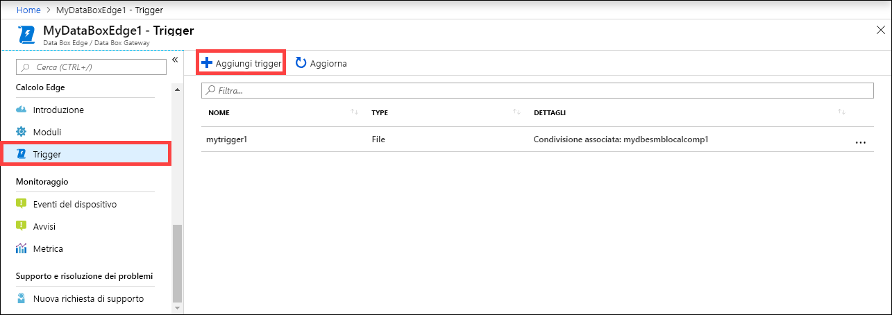
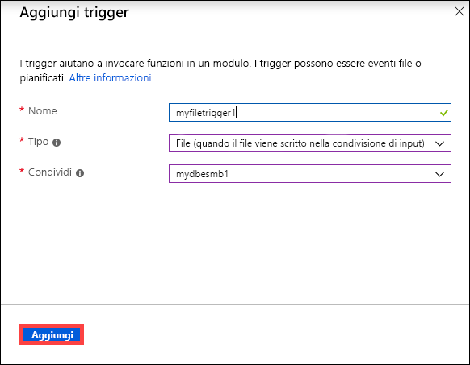
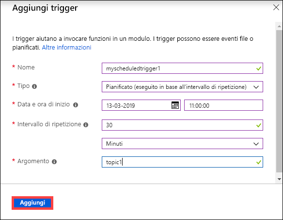
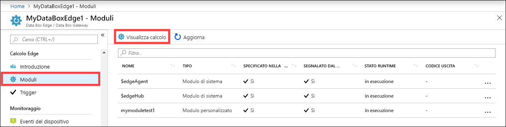
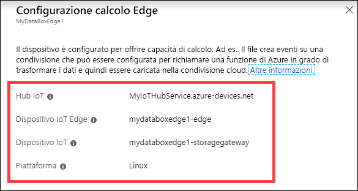
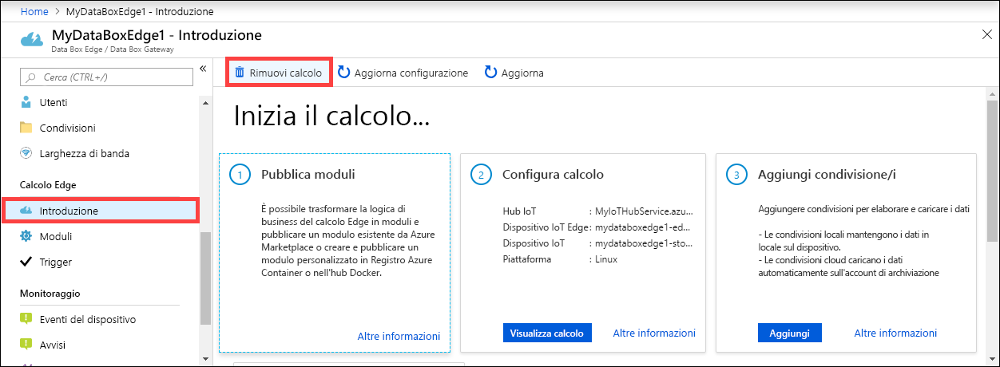
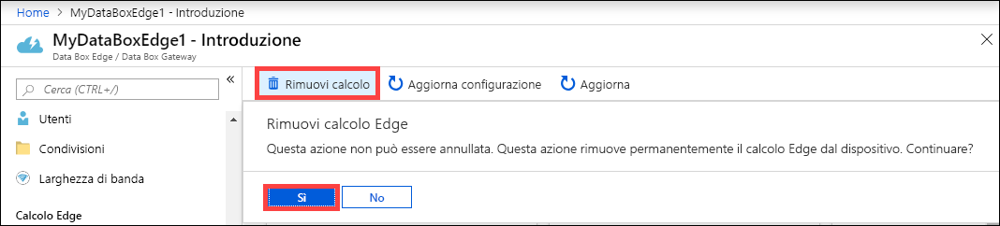
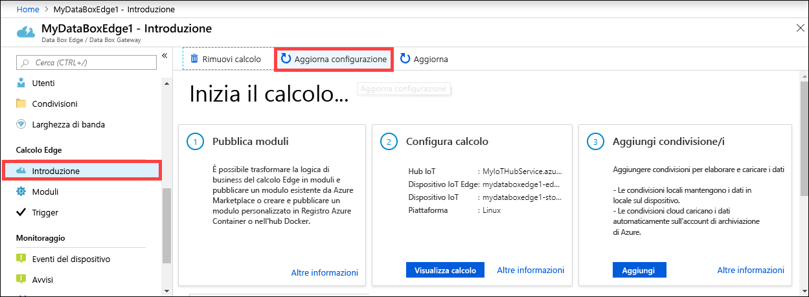
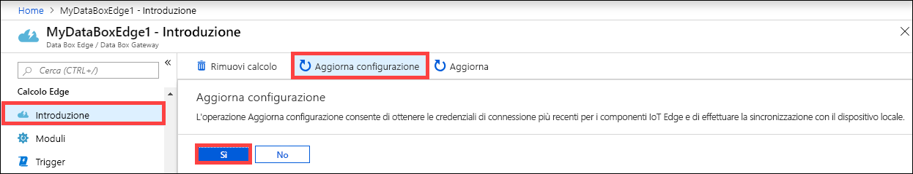
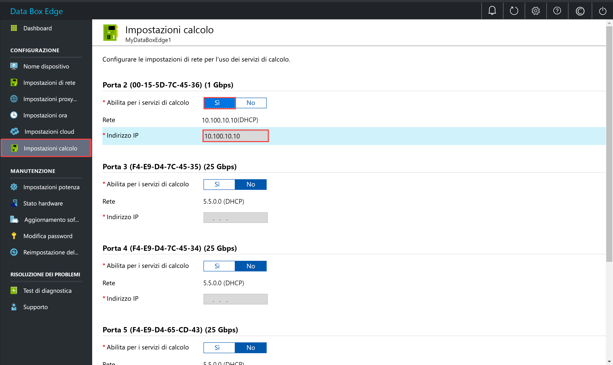

# Gestione del calcolo in Azure Data Box Edge

Questo articolo descrive come gestire il calcolo in Azure Data Box Edge. È possibile gestire il calcolo tramite il portale di Azure o l'interfaccia utente Web locale. Usare il portale di Azure per gestire moduli, trigger e la configurazione di calcolo, e l'interfaccia utente Web locale per gestire le impostazioni di calcolo.

> [!IMPORTANT]
> Data Box Edge è disponibile in anteprima. Rivedere le [condizioni del servizio per l'anteprima di Azure](https://azure.microsoft.com/support/legal/preview-supplemental-terms/) prima di ordinare e distribuire la soluzione.

In questo articolo viene spiegato come:

> [!div class="checklist"]
> * Gestire i trigger
> * Configurare la gestione del calcolo

## Gestire i trigger

Gli eventi sono fenomeni che possono verificarsi all'interno dell'ambiente cloud o sul dispositivo su cui si desidera intervenire. Ad esempio, un evento è quando si crea un file in una condivisione. I trigger generano gli eventi. In Azure Data Box Edge, i trigger possono essere in risposta a eventi del file o a una schedule (pianificazione).

- **File**: Questi trigger vengono inviati in risposta agli eventi del file, ad esempio la creazione di un file, la modifica di un file.
- **Scheduled**: Questi trigger vengono inviati in risposta a una pianificazione che è possibile definire con una data di inizio, ora di inizio e l'intervallo di ripetizione.

### Aggiungere un trigger

Eseguire i passaggi seguenti nel portale di Azure per creare un trigger.

1. Nel portale di Azure, selezionare la risorsa Data Box Edge e quindi passare a **Calcolo Edge > Trigger**. Sulla barra dei comandi selezionare **+ Aggiungi Trigger**.

    

2. Nel pannello **Aggiungi trigger** specificare un nome univoco per il trigger.
    
    <!--Trigger names can only contain numbers, lowercase letters, and hyphens. The share name must be between 3 and 63 characters long and begin with a letter or a number. Each hyphen must be preceded and followed by a non-hyphen character.-->

3. Selezionare un **Tipo** per il trigger. Scegliere **File** se il trigger è in risposta a un evento del file. Selezionare **Scheduled** quando si desidera avviare il trigger a un'ora definita ed eseguirlo a un intervallo di ripetizione specificato. A seconda della selezione, viene presentato un set diverso di opzioni.

    - **Trigger di file**: scegliere nell'elenco a discesa una condivisione montata. Quando si attiva un evento del file in tale condivisione, il trigger potrebbe richiamare una funzione di Azure.

        

    - **Trigger pianificato**: specificare la data/ora di inizio e l'intervallo di ripetizione espresso in ore, minuti o secondi. Inoltre, immettere il nome per un argomento. Un argomento fornirà la flessibilità necessaria per indirizzare il trigger a un modulo distribuito nel dispositivo.

        `"route3": "FROM /* WHERE topic = 'topicname' INTO BrokeredEndpoint("modules/modulename/inputs/input1")"` è una stringa di indirizzamento di esempio.

        

4. Selezionare **Aggiungi** per creare il trigger. Una notifica mostra che la creazione del trigger è in corso. Dopo aver creato il trigger, il pannello viene aggiornato per effettuare la reflection del nuovo trigger.
 
    

### Eliminare un trigger

Eseguire i passaggi seguenti nel portale di Azure per eliminare un trigger.

1. Nell'elenco dei trigger selezionare il trigger che si desidera eliminare.

    

2. Fare clic con il pulsante destro del mouse e quindi scegliere **Elimina**.

    

3. Alla richiesta di conferma fare clic su **Sì**.

    

Viene inoltre aggiornato l'elenco dei trigger per riflettere l'eliminazione.

## Configurazione della gestione del calcolo

Usare il portale di Azure per visualizzare la configurazione di calcolo, rimuovere una configurazione di calcolo esistente o per aggiornare la configurazione di calcolo per sincronizzare le chiavi di accesso per il dispositivo IoT e il dispositivo IoT Edge in Azure Data Box Edge.

### Visualizzazione del calcolo Edge

Eseguire i passaggi seguenti nel portale di Azure per visualizzare la configurazione di calcolo per il dispositivo.

1. Nel portale di Azure, selezionare la risorsa Data Box Edge e quindi passare a **Calcolo Edge > Moduli**. Selezionare **Visualizza calcolo** sulla barra dei comandi.

    

2. Prendere nota della configurazione di calcolo del dispositivo. Dopo aver configurato il calcolo, verrà creata una risorsa dell'hub IoT. In tale risorsa dell'hub IoT, sono configurati un dispositivo IoT e un dispositivo IoT Edge. Solo i moduli di Linux sono supportati per l'esecuzione nel dispositivo IoT Edge.

    

### Rimozione della configurazione del calcolo

Eseguire i passaggi seguenti nel portale di Azure per rimuovere la configurazione di calcolo Edge esistente per il dispositivo.

1. Nel portale di Azure selezionare la risorsa Data Box Edge e quindi passare a **Calcolo Edge > Introduzione**. Selezionare **Rimuovi calcolo** sulla barra dei comandi.

    

2. Se si rimuove la configurazione di calcolo, occorre riconfigurare il dispositivo nel caso in cui è necessario utilizzare nuovamente la funzione calcolo. Alla richiesta di conferma selezionare **Sì**.

    

### Sincronizzazione delle chiavi di accesso per il dispositivo IoT e il dispositivo IoT Edge

Quando si configura il calcolo in Azure Data Box Edge, vengono creati un dispositivo IoT e un dispositivo IoT Edge. A questi dispositivi vengono assegnate automaticamente delle chiavi di accesso simmetriche. Per una protezione ottimale, queste chiavi vengono ruotate regolarmente tramite il servizio dell'hub IoT.

Per ruotare queste chiavi di accesso, è possibile accedere al servizio dell'hub IoT creato e selezionare il dispositivo IoT o il dispositivo IoT Edge. Ogni dispositivo dispone di una chiave di accesso primaria e di una chiave di accesso secondaria. Assegnare la chiave di accesso primaria alla chiave di accesso secondaria, quindi riscrivere la chiave di accesso primaria.

Se il dispositivo IoT e le chiavi di accesso del dispositivo IoT Edge sono state ruotate, è quindi necessario aggiornare la configurazione in Azure Data Box Edge per ottenere le chiavi di accesso più recenti. La sincronizzazione consente al dispositivo di ottenere le chiavi più recenti per il dispositivo IoT e il dispositivo IoT Edge. Azure Data Box Edge utilizza solo le chiavi di accesso primarie.

Eseguire i passaggi seguenti nel portale di Azure per sincronizzare le chiavi di accesso per il proprio dispositivo.

1. Nel portale di Azure selezionare la risorsa Data Box Edge e quindi passare a **Calcolo Edge > Introduzione**. Selezionare **Aggiorna configurazione** sulla barra dei comandi.

    

2. Selezionare **Sì** quando viene richiesta la conferma.

     

3. Uscire dalla finestra di dialogo dopo aver completato la sincronizzazione.

## Abilitare un'interfaccia di rete per il calcolo

Potrebbe essere necessario accedere a un modulo in esecuzione nel dispositivo Data Box Edge. Per accedere al modulo dall'esterno, si dovrà assegnare un indirizzo IP a un'interfaccia di rete nel dispositivo. È possibile gestire queste impostazioni di calcolo dall'interfaccia utente Web locale.

Per configurare le impostazioni di calcolo, seguire questa procedura nell'interfaccia utente Web locale.

1. Nell'interfaccia utente Web locale passare a **Configurazione > Impostazioni calcolo**.  

2. **Abilitare** l'interfaccia di rete che si vuole usare per connettersi ai moduli di calcolo nel dispositivo. 

    - Se si usano indirizzi IP statici, immettere un indirizzo IP per l'interfaccia di rete.
    - Se si usa DHCP, gli indirizzi IP verranno assegnati automaticamente.

3. Selezionare **Applica** per applicare le impostazioni.

    

## Passaggi successivi

- Informazioni su come [gestire gli utenti dal portale di Azure](data-box-edge-manage-users.md).
