# Usare il portale di Azure per gestire le condivisioni in Azure Data Box Edge

Questo articolo descrive come gestire le condivisioni in Azure Data Box Edge. È possibile gestire Azure Data Box Edge dal portale di Azure o dall'interfaccia utente Web locale. Usare il portale di Azure per aggiungere, eliminare o aggiornare le condivisioni o per sincronizzare la chiave di archiviazione dell'account di archiviazione associato alle condivisioni.

## Informazioni sulle condivisioni

Per trasferire i dati in Azure, è necessario creare le condivisioni in Azure Data Box Edge. Le condivisioni che si aggiungono nel dispositivo Data Box Edge possono essere condivisioni locali o condivisioni che eseguono il push dei dati nel cloud.

 - **Condivisioni locali**: usare queste condivisioni quando si vuole che i dati vengano elaborati in locale nel dispositivo.
 - **Condivisioni**: usare queste condivisioni quando si vuole eseguire automaticamente il push dei dati del dispositivo nell'account di archiviazione nel cloud. Tutte le funzioni del cloud, come **Aggiorna** e **Sincronizza chiavi di archiviazione**, si applicano a queste condivisioni.

In questo articolo viene spiegato come:

> [!div class="checklist"]
> * Aggiungere una condivisione
> * Eliminare una condivisione
> * Aggiornare le condivisioni
> * Sincronizzare la chiave di archiviazione

## Aggiungere una condivisione

Eseguire i passaggi seguenti nel portale di Azure per creare una condivisione.

1. Nel portale di Azure passare alla risorsa Data Box Edge e quindi scegliere **Gateway > Condivisioni**. Selezionare **+ Aggiungi condivisione** sulla barra dei comandi.

    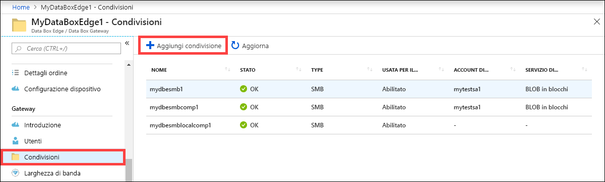

2. In **Aggiungi condivisione** specificare le impostazioni della condivisione. Specificare un nome univoco per la condivisione.
    
    I nomi di condivisioni possono contenere solo numeri, lettere minuscole e trattini. Il nome condivisione deve avere una lunghezza compresa fra 3 e 63 caratteri e iniziare con una lettera o un numero. Ogni trattino deve essere preceduto e seguito da un carattere diverso da un trattino.

3. Selezionare un **Tipo** per la condivisione. Il tipo può essere **SMB** o **NFS**. L'impostazione predefinita è SMB. SMB è l'opzione standard per i client Windows, mentre NFS è l'opzione usata per i client Linux. Le opzioni visualizzate variano leggermente a seconda che si scelgano condivisioni SMB o NFS.

4. Specificare un **account di archiviazione** in cui risiede la condivisione. Nell'account di archiviazione viene creato un contenitore con il nome della condivisione, se non esiste già. Se esiste già un contenitore, viene usato quello.

5. Dall'elenco a discesa **Servizio di archiviazione** selezionare BLOB in blocchi, BLOB di pagine o File. Il tipo di servizio scelto dipende dal formato che si vuole applicare ai dati che risiederanno in Azure. In questo esempio si vuole che i dati vengano trasferiti in Azure come **BLOB in blocchi**, quindi è questa l'opzione da selezionare. Se si sceglie **BLOB di pagine**, è necessario verificare che i dati siano allineati su 512 byte. Usare **Blob di pagine** per dischi VHD o VHDX, che sono sempre allineati su 512 byte.

6. Questo passaggio varia a seconda che si stia creando una condivisione SMB o NFS.
    - **Se si crea una condivisione SMB**: nel campo **Utente locale con tutti i privilegi** selezionare **Crea nuovo** o **Usa esistente**. Se si crea un nuovo utente locale, compilare i campi **Nome utente**, **Password** e Conferma password. Vengono così assegnate le autorizzazioni all'utente locale. Dopo aver assegnato le autorizzazioni in questa fase, è possibile modificarle con Esplora file.

        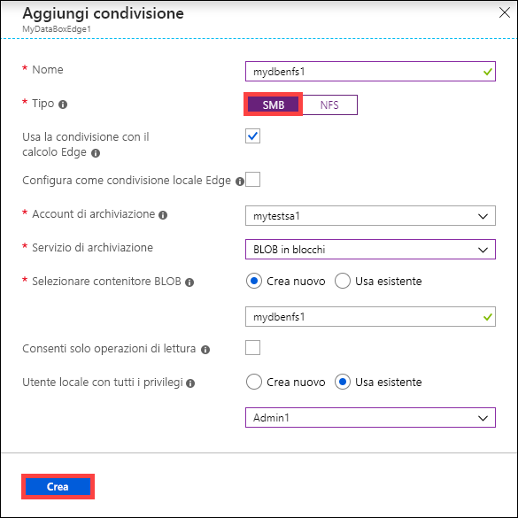

        Se si seleziona Consenti solo operazioni di lettura per i dati di questa condivisione, sarà possibile specificare utenti di sola lettura.
    - **Se si crea una condivisione NFS**: occorre specificare l'**indirizzo IP dei client autorizzati** ad accedere alla condivisione.

        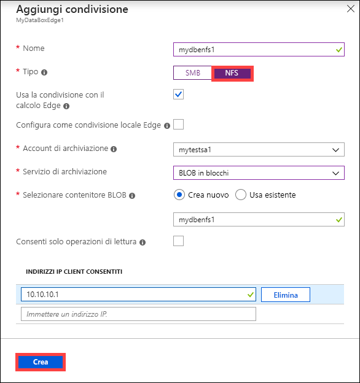

7. Per accedere facilmente alle condivisioni dai moduli di calcolo Edge, usare il punto di montaggio locale. Selezionare **Usa la condivisione con il calcolo Edge** per montare automaticamente la condivisione dopo che è stata creata. Quando questa opzione è selezionata, inoltre, il modulo Edge può usare il calcolo con il punto di montaggio locale.

8. Fare clic su **Crea** per creare la condivisione. Viene ricevuta una notifica che indica che la creazione della condivisione è in corso. Dopo aver creato la condivisione con le impostazioni specificate, il pannello **Condivisioni** viene aggiornato per includere la nuova condivisione.

## Aggiungere una condivisione locale

1. Nel portale di Azure passare alla risorsa Data Box Edge e quindi scegliere **Gateway > Condivisioni**. Selezionare **+ Aggiungi condivisione** sulla barra dei comandi.

    

2. In **Aggiungi condivisione** specificare le impostazioni della condivisione. Specificare un nome univoco per la condivisione.
    
    I nomi di condivisioni possono contenere solo numeri, lettere minuscole e trattini. Il nome condivisione deve avere una lunghezza compresa fra 3 e 63 caratteri e iniziare con una lettera o un numero. Ogni trattino deve essere preceduto e seguito da un carattere diverso da un trattino.

3. Selezionare un **Tipo** per la condivisione. Il tipo può essere **SMB** o **NFS**. L'impostazione predefinita è SMB. SMB è l'opzione standard per i client Windows, mentre NFS è l'opzione usata per i client Linux. Le opzioni visualizzate variano leggermente a seconda che si scelgano condivisioni SMB o NFS.

4. Per accedere facilmente alle condivisioni dai moduli di calcolo Edge, usare il punto di montaggio locale. Selezionare **Usa la condivisione con il calcolo Edge** per consentire al modulo Edge di usare il calcolo con il punto di montaggio locale.

5. Selezionare **Configura come condivisione locale Edge**. I dati nelle condivisioni locali rimarranno in locale nel dispositivo. È possibile elaborare questi dati in locale.

6. Nel campo **Utente locale con tutti i privilegi** selezionare **Crea nuovo** o **Usa esistente**.

7. Selezionare **Create**. 

    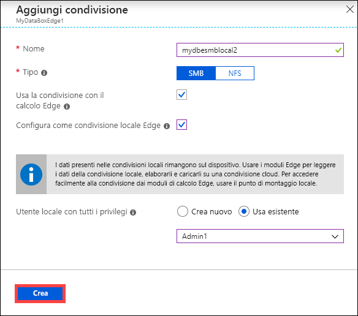

    Viene visualizzata una notifica per indicare che la creazione della condivisione è in corso. Dopo aver creato la condivisione con le impostazioni specificate, il pannello **Condivisioni** viene aggiornato per includere la nuova condivisione.

    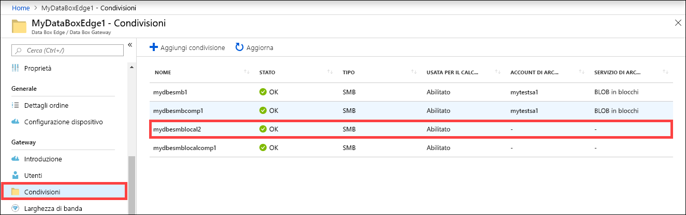
    
    Selezionare la condivisione per visualizzare il punto di montaggio locale per i moduli di calcolo Edge relativi a questa condivisione.

    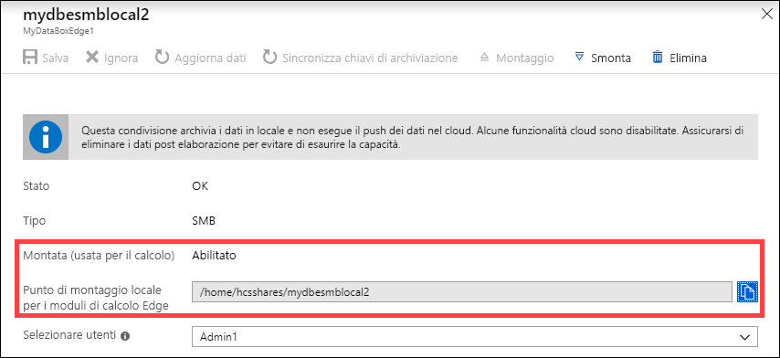

## Montare una condivisione

Se si è creata una condivisione prima di configurare il calcolo nel dispositivo Data Box Edge, sarà necessario montare la condivisione. Per montare una condivisione, seguire questa procedura.

1. Nel portale di Azure passare alla risorsa Data Box Edge e quindi scegliere **Gateway > Condivisioni**. Nell'elenco delle condivisioni selezionare la condivisione da montare. Per la condivisione selezionata, nella colonna **Usata per il calcolo** verrà visualizzato lo stato **Disabilitata**.

    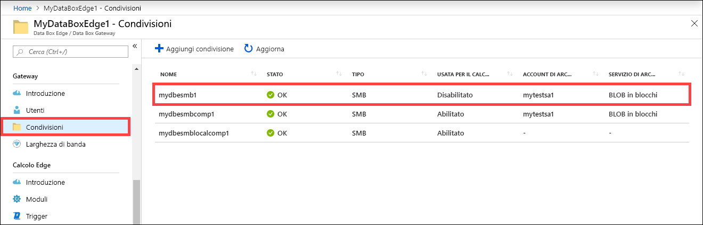

2. Selezionare **Montaggio**.

    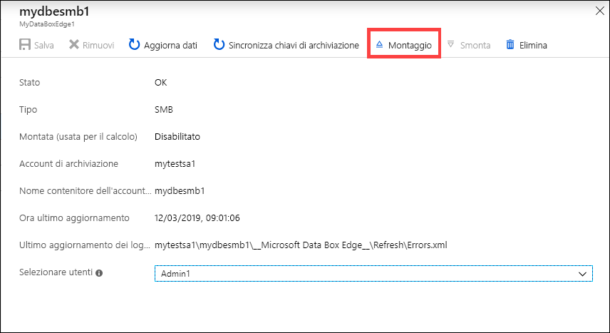

3. Alla richiesta di conferma selezionare **Sì**. La condivisione verrà montata.

    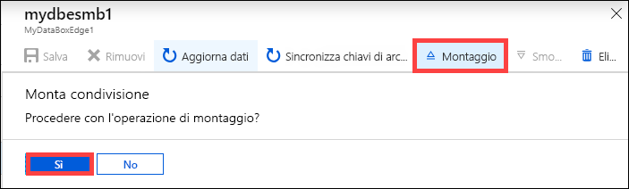

4. Dopo il montaggio della condivisione, passare all'elenco delle condivisioni. Lo stato della condivisione visualizzato nella colonna **Usata per il calcolo** sarà **Abilitata**.

    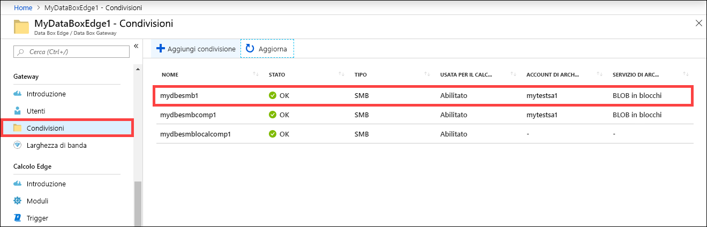

5. Selezionare di nuovo la condivisione per visualizzarne il punto di montaggio locale. Il modulo di calcolo Edge usa questo punto di montaggio locale per la condivisione.

    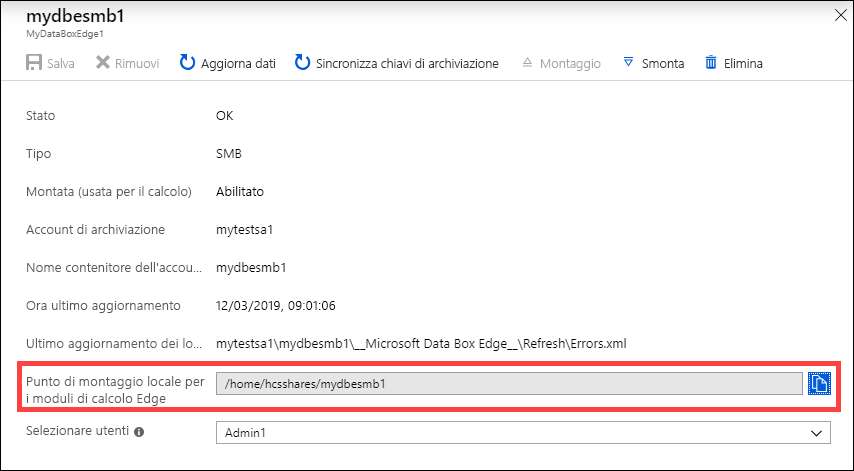

## Smontare una condivisione

Per smontare una condivisione, seguire questa procedura nel portale di Azure.

1. Nel portale di Azure passare alla risorsa Data Box Edge e quindi scegliere **Gateway > Condivisioni**.

    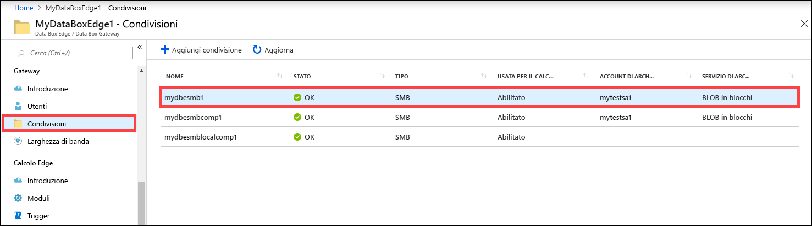

2. Nell'elenco delle condivisioni selezionare la condivisione da smontare. È opportuno assicurarsi che la condivisione che si smonta non venga usata da alcun modulo. Se la condivisione viene usata da un modulo, verranno rilevati problemi con il modulo corrispondente. Selezionare **Smonta**.

    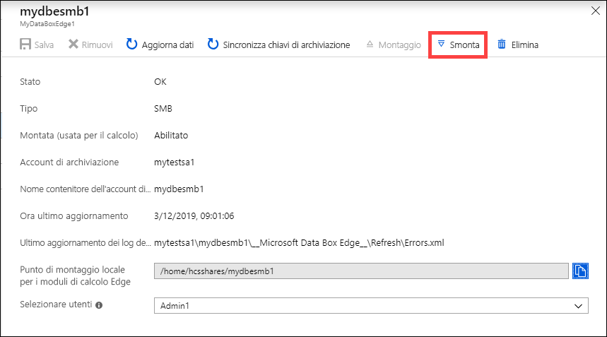

3. Alla richiesta di conferma selezionare **Sì**. La condivisione verrà smontata.

    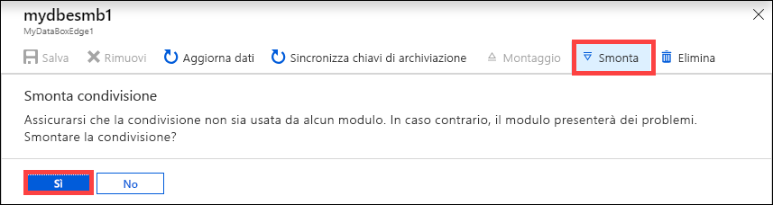

4. Dopo lo smontaggio della condivisione, passare all'elenco delle condivisioni. Lo stato della condivisione visualizzato nella colonna **Usata per il calcolo** sarà **Disabilitata**.

    

## Eliminare una condivisione

Eseguire i passaggi seguenti nel portale di Azure per eliminare una condivisione.

1. Nell'elenco delle condivisioni fare clic sulla condivisione da eliminare.

    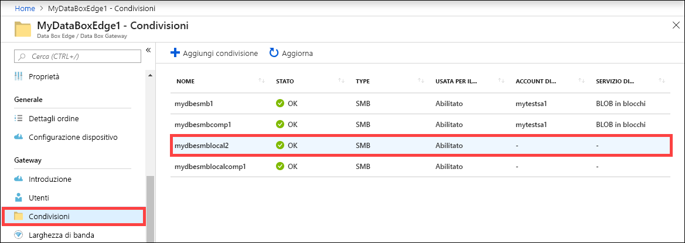

2. Fare clic su **Elimina**.

    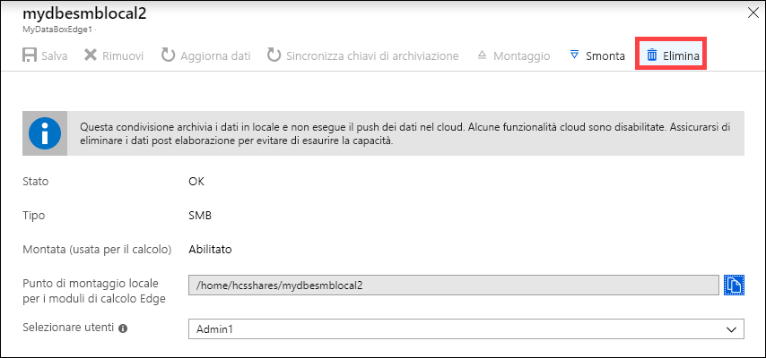

3. Alla richiesta di conferma fare clic su **Sì**.

    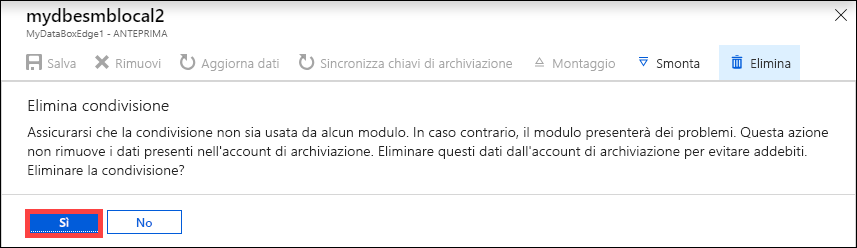

L'elenco di condivisioni viene aggiornato in base all'eliminazione.

## Aggiornare le condivisioni

La funzionalità di aggiornamento consente di aggiornare il contenuto di una condivisione. Quando si aggiorna una condivisione, viene avviata una ricerca per trovare tutti gli oggetti Azure, inclusi BLOB e file che sono stati aggiunti al cloud dopo l'ultimo aggiornamento. Questi file aggiuntivi vengono quindi scaricati per aggiornare il contenuto della condivisione nel dispositivo.

> [!IMPORTANT]
> - Non è possibile aggiornare le condivisioni locali.
> - Le autorizzazioni e gli elenchi di controllo di accesso (ACL) non vengono mantenuti tra le operazioni di aggiornamento. 

Eseguire i passaggi seguenti nel portale di Azure per aggiornare una condivisione.

1.  Passare a **Condivisioni** nel portale di Azure. Fare clic sulla condivisione che si vuole aggiornare.

    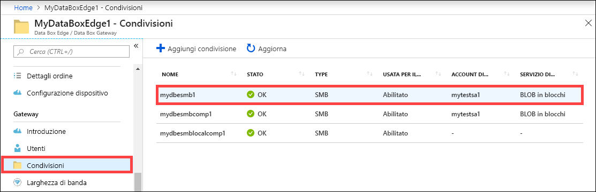

2.  Fare clic su **Aggiorna**. 

    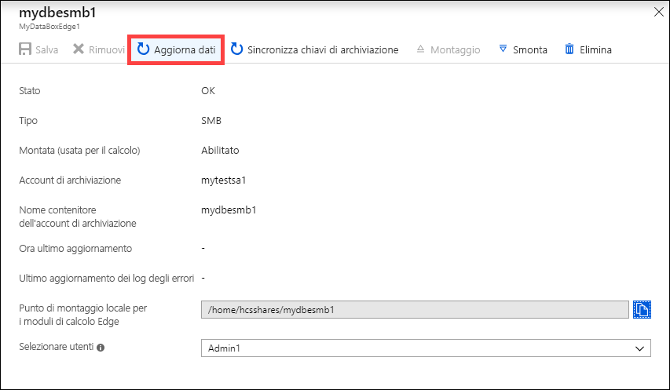
 
3.  Alla richiesta di conferma fare clic su **Sì**. Viene avviato un processo di aggiornamento del contenuto della condivisione locale.

    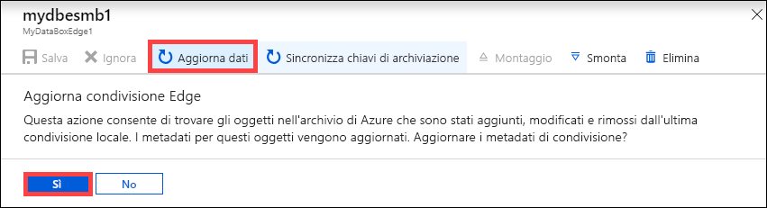
 
4.  Durante l'aggiornamento, l'opzione di aggiornamento non è disponibile nel menu di scelta rapida. Fare clic sulla notifica del processo per visualizzare lo stato del processo di aggiornamento.

5.  Il tempo necessario per aggiornare dipende dal numero di file nel contenitore di Azure, nonché dai file nel dispositivo. Dopo aver completato l'aggiornamento, viene aggiornato il timestamp di condivisione. Anche se l'aggiornamento include gli errori parziali, l'operazione è considerata riuscita e il timestamp viene aggiornato. Anche i log degli errori di aggiornamento vengono aggiornati.

    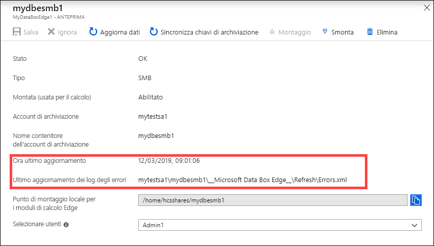
 
Se si verifica un errore, viene generato un avviso. L'avviso illustra in dettaglio la causa e i suggerimenti per correggere il problema. L'avviso contiene anche collegamenti a un file con il riepilogo completo degli errori, inclusi i file che non è stato possibile aggiornare o eliminare.

## Sincronizzare le chiavi di archiviazione

Se le chiavi dell'account di archiviazione sono state ruotate, sarà necessario sincronizzare le chiavi di accesso alle risorse di archiviazione. La sincronizzazione consente al dispositivo di ottenere le chiavi più recenti per l'account di archiviazione.

Eseguire i passaggi seguenti nel portale di Azure per sincronizzare la chiave di accesso alle risorse di archiviazione.

1. Passare a **Panoramica** nella risorsa. Nell'elenco delle condivisioni, scegliere e fare clic su una condivisione associata all'account di archiviazione che è necessario sincronizzare.

    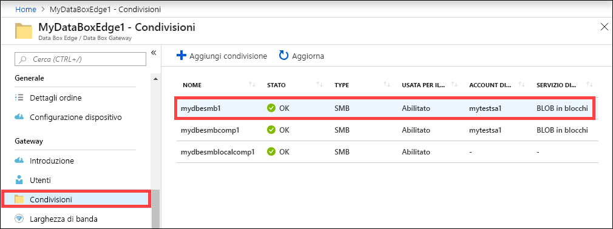

2. Fare clic su **Sincronizza chiavi di archiviazione**. Fare clic sull'opzione **Sì** quando viene richiesta la conferma.

     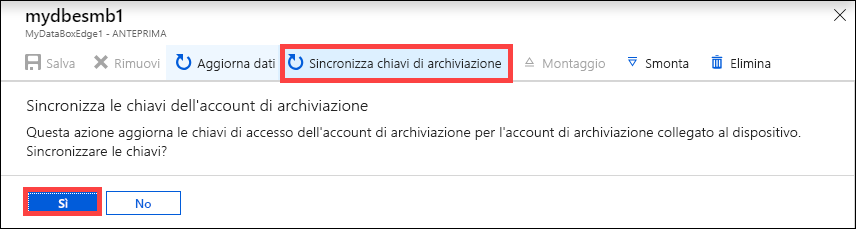

3. Uscire dalla finestra di dialogo dopo aver completato la sincronizzazione.

>[!NOTE]
> È sufficiente eseguire questa operazione una sola volta per un account di archiviazione specificato. Non è necessario ripetere questa azione per tutte le condivisioni associate allo stesso account di archiviazione.

## Passaggi successivi

- Informazioni su come [gestire gli utenti dal portale di Azure](data-box-edge-manage-users.md).
