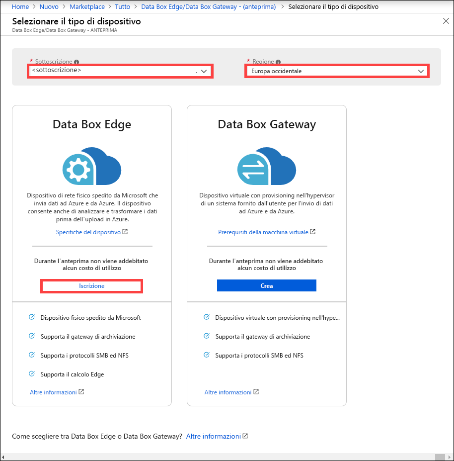
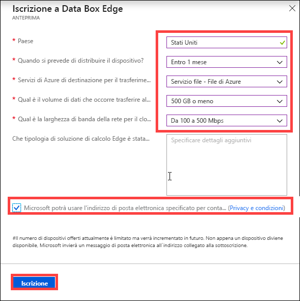

# Che cos'è Azure Data Box Edge (anteprima)? 

Azure Data Box Edge è una soluzione di archiviazione che consente di elaborare i dati e inviarli in rete ad Azure. Questo articolo fornisce una panoramica della soluzione Data Box Edge e dei vantaggi, delle funzionalità chiave e degli scenari in cui distribuire questo dispositivo. 

Data Box Edge usa un dispositivo fisico fornito da Microsoft per accelerare il trasferimento sicuro dei dati. Il dispositivo fisico si trova in locale ed è possibile scrivere dati al suo interno mediante i protocolli NFS e SMB. 

Data Box Edge include tutte le funzionalità di gateway di Data Box Gateway. Data Box è inoltre dotato di funzionalità di elaborazione perimetrale abilitate per l'intelligenza artificiale che consentono di analizzare, elaborare o filtrare i dati durante lo spostamento in BLOB in blocchi, BLOB di pagine o File di Azure.  

> [!IMPORTANT]
> - Data Box Edge è disponibile in anteprima. [Effettuare l'iscrizione](#sign-up) al servizio.
> - Prima di distribuire la soluzione, leggere le [condizioni d'uso per l'anteprima](https://azure.microsoft.com/support/legal/preview-supplemental-terms/).

## Casi d'uso

Azure Data Box Edge è un dispositivo di elaborazione perimetrale abilitato per l'intelligenza artificiale con funzionalità di trasferimento dei dati di rete. Ecco i vari scenari in cui è possibile usare Data Box Edge per il trasferimento dei dati.

- **Pre-elaborazione dei dati**: analizzare i dati in locale o nei dispositivi IoT per ottenere rapidamente i risultati pur rimanendo nelle vicinanze della posizione in cui vengono generati i dati. Data Box Edge trasferisce i set di dati completi nel cloud per eseguire operazioni di elaborazione più avanzate o analisi più approfondite.  La pre-elaborazione può essere usata per: 

    - Aggregare i dati.
    - Modificare i dati, ad esempio per rimuovere informazioni personali.
    - Suddividere e trasferire i dati necessari per analisi più approfondite nel cloud.
    - Analizzare e rispondere a eventi IoT. 

- **Inferenza di Azure Machine Learning**: con Data Box Edge è possibile eseguire modelli di apprendimento automatico per ottenere risultati rapidi su cui intervenire prima che i dati vengano inviati al cloud. Il set di dati completo viene trasferito per continuare a ripetere il training dei modelli di apprendimento automatico e migliorarli.

- **Trasferimento dei dati sulla rete in Azure**: usare Data Box Edge per trasferire rapidamente e facilmente i dati in Azure per consentire ulteriori analisi ed elaborazioni o per scopi di archiviazione. 

## Vantaggi

Data Box Edge offre i vantaggi seguenti:

- **Trasferimento semplice dei dati**: rende lo spostamento dei dati da e verso l'archiviazione di Azure semplice quanto l'uso di una condivisione di rete locale.  
- **Prestazioni elevate**: consente trasferimenti a prestazioni elevate da e verso Azure. 
- **Accesso rapido**: memorizza nella cache i file più recenti per un accesso rapido dei file locali.  
- **Uso della larghezza di banda limitata**: i dati possono essere scritti in Azure anche quando la rete è limitata per ridurre l'utilizzo durante le ore lavorative più intense.  
- **Trasformazione dei dati**: consente l'analisi, l'elaborazione o il filtraggio dei dati durante lo spostamento in Azure.

## Funzionalità principali

Data Box Edge include le funzionalità seguenti:

|Funzionalità |DESCRIZIONE  |
|---------|---------|
|Prestazioni elevate     | Larghezza di banda e trasferimento dei dati completamente automatizzati e ottimizzati.|
|Protocolli supportati     | Supporto per protocolli SMB e NFS standard per l'inserimento di dati.   Per altre informazioni sulle versioni supportate, vedere i [requisiti di sistema di Data Box Edge](http://aka.ms/dbe-docs).|
|Calcolo       |Consente l'analisi, l'elaborazione e il filtraggio dei dati.|
|Accesso ai dati     | Indirizzare l'accesso ai dati dai BLOB del servizio di archiviazione di Azure e da File di Azure usando le API cloud per un'ulteriore elaborazione dei dati nel cloud.|
|Accesso rapido     | Cache locale nel dispositivo per l'accesso rapido dei file usati più di recente.|
|Caricamento offline     | La modalità disconnessa supporta scenari di caricamento offline.|
|Aggiornamento dati     | Possibilità di aggiornare i file locali con quelli più recenti nel cloud.|
|Crittografia    | Supporto BitLocker per crittografare i dati in locale e proteggere tramite *https* il trasferimento dei dati nel cloud.       |
|Resilienza     | Resilienza di rete integrata.        |

## Funzionalità e specifiche

Il dispositivo fisico Data Box Edge include le funzionalità seguenti:

| Funzionalità/specifiche                                          | DESCRIZIONE              |
|---------------------------------------------------------|--------------------------|
| Dimensioni   | Larghezza: 43,81 cm Profondità: 68,58 cm Altezza: 4,44 cm (bordi e maniglie degli alimentatori esclusi)  |            
| Spazio nel rack|1U quando viene inserito nel rack|
| Cavi| 2 cavi di alimentazione 2 cavi RJ-45 a 1 Gbps 2 cavi in rame SFP+ a 10 Gbps|
| Componenti|2 alimentatori integrati|
| CPU|2 processori Intel Xeon con 10 core ciascuno  |
| Memoria| 64 GB di RAM|
| Dischi| 8 unità SSD NVMe, ogni disco è da 1,6 TB   Un errore in un'unità SSD NVMe si riflette sull'intero sistema. |
| Capacità di archiviazione locale| 12,8 TB di capacità totale|
| Interfacce di rete| 2 interfacce da 1 GbE: 1 per la gestione, non configurabile dall'utente, usata per la configurazione iniziale. L'altra interfaccia dati è configurabile dall'utente ed è DHCP per impostazione predefinita.  2 interfacce da 25 GbE: utilizzabili anche come interfacce da 10 GbE. Queste interfacce dati possono essere configurate dall'utente come statiche o DHCP (impostazione predefinita).   2 interfacce da 25 GbE: queste interfacce dati possono essere configurate dall'utente come statiche o DHCP (impostazione predefinita).|

## Componenti

La soluzione Data Box Edge è costituita dalla risorsa Data Box Edge, dal dispositivo fisico Data Box Edge e da un'interfaccia utente Web locale.

* **Dispositivo fisico Data Box Edge**: un server montato su rack 1U fornito da Microsoft che può essere configurato per inviare dati ad Azure. 
    
* **Risorsa Data Box Edge**: una risorsa del portale di Azure che consente di gestire un dispositivo Data Box Edge da un'interfaccia Web accessibile da posizioni geografiche diverse. Usare la risorsa Data Box Edge per creare e gestire risorse, visualizzare e gestire dispositivi e avvisi e gestire condivisioni.  

    <!---->

    Per altre informazioni, vedere [Use the Data Box Edge service to administer your Data Box Edge device](http://aka.ms/dbe-docs) (Usare il servizio Data Box Edge per gestire il dispositivo Data Box Edge).

* **Interfaccia utente web locale di Data Box**: usare l'interfaccia utente Web locale per eseguire la diagnostica, arrestare e riavviare il dispositivo Data Box Edge, visualizzare i log di copia e contattare il supporto tecnico Microsoft per inviare una richiesta di servizio.

    <!---->

    Per informazioni sull'uso dell'interfaccia utente basata sul Web, vedere l'articolo relativo all'[uso dell'interfaccia utente basata sul Web per amministrare Data Box](http://aka.ms/dbe-docs).

## Aree di disponibilità

Il dispositivo fisico Data Box Edge, la risorsa di Azure e l'account di archiviazione di destinazione in cui trasferire i dati non devono necessariamente trovarsi tutti nella stessa area.

- **Disponibilità della risorsa**: per questa versione, la risorsa Data Box Edge è disponibile nelle aree seguenti:
    - **Stati Uniti**: Stati Uniti occidentali 2 e Stati Uniti orientali
    - **Unione europea**: Europa occidentale
    - **Asia Pacifico**: Asia sud-orientale

- **Account di archiviazione di destinazione**: gli account che archiviano i dati sono disponibili in tutte le aree di Azure. 

    Le aree in cui gli account archiviano i dati Data Box devono essere nelle vicinanze del dispositivo per garantire prestazioni ottimali. Un account di archiviazione lontano dal dispositivo si traduce in lunghe latenze e prestazioni ridotte. 

## Iscrizione

Data Box Edge è disponibile in anteprima ed è necessario effettuare l'iscrizione. Seguire questa procedura per iscriversi a Data Box Gateway:

1. Accedere al portale di Azure all'indirizzo: [https://aka.ms/databox-edge](https://aka.ms/databox-edge).

2. Selezionare la sottoscrizione che si vuole usare per l'anteprima di Data Box Edge. Selezionare l'area in cui si intende distribuire la risorsa Data Box Edge. Nell'opzione Data Box Edge fare clic su **Iscrizione**.

    

3.  Rispondere alle domande relative al paese di residenza dei dati, all'intervallo di tempo, al servizio di Azure di destinazione per il trasferimento dei dati, alla larghezza di banda della rete e alla frequenza di trasferimento dei dati. Esaminare **l'Informativa sulla privacy e le condizioni** e selezionare la casella di controllo che **consente a Microsoft di usare l'indirizzo di posta elettronica per contattare l'utente**.

    

4. Dopo aver effettuato l'iscrizione e abilitato la sottoscrizione per l'anteprima, sarà possibile ordinare Data Box Edge.

## Passaggi successivi

- Vedere i [requisiti di sistema di Data Box Edge](http://aka.ms/dbe-docs).
- Comprendere i [limiti di Data Box Edge](http://aka.ms/dbe-docs).
- Distribuire rapidamente [Azure Data Box Edge](http://aka.ms/dbe-docs) nel portale di Azure.

