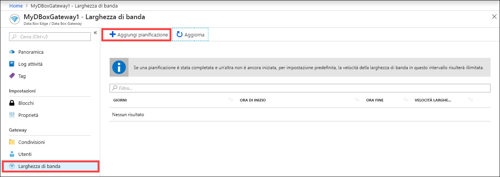
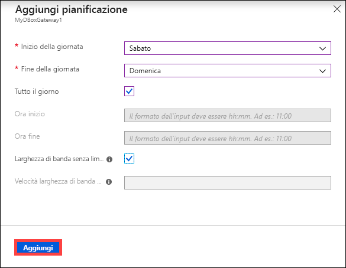
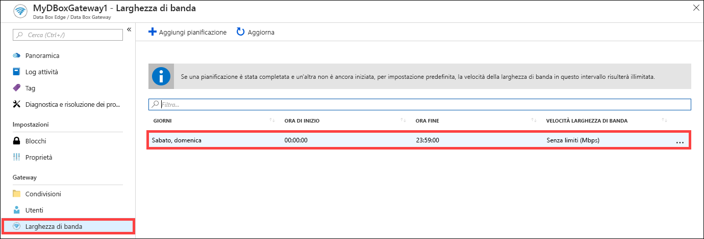
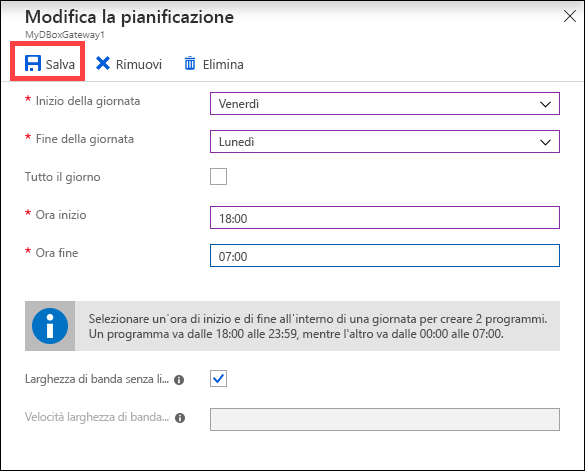
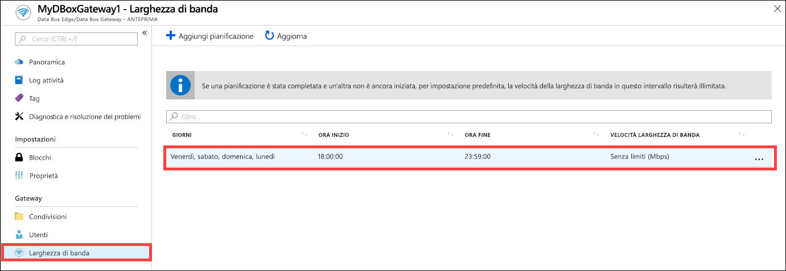
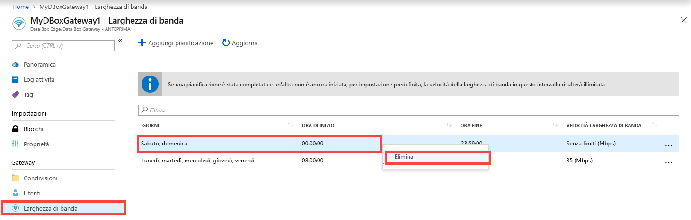

# Usare il portale di Azure per gestire le pianificazioni della larghezza di banda in Azure Data Box Gateway  

Questo articolo descrive come gestire gli utenti in Azure Data Box Gateway. Le pianificazioni della larghezza di banda consentono di configurare l'uso della larghezza di banda della rete in più pianificazioni orarie. Queste pianificazioni possono essere applicate alle operazioni di caricamento e download dal dispositivo al cloud. 

È possibile aggiungere, modificare o eliminare le pianificazioni della larghezza di banda per il Data Box Gateway dal portale di Azure.

> [!IMPORTANT]
> - Data Box Gateway è in anteprima. Rivedere le [condizioni del servizio per l'anteprima di Azure](https://azure.microsoft.com/support/legal/preview-supplemental-terms/) prima di ordinare e distribuire la soluzione.

In questo articolo viene spiegato come:

> [!div class="checklist"]
> * Aggiungere una pianificazione
> * Modificare una pianificazione
> * Eliminare una pianificazione 

## Aggiungere una pianificazione

Seguire questa procedura nel portale di Azure per aggiungere un utente.

1. Nel portale di Azure della risorsa Data Box Gateway, passare a **Larghezza di banda**.
2. Nel riquadro a destra fare clic su **+Aggiungi pianificazione**.

    

3. In **Aggiungi pianificazione**: 

    1. Indicare il **giorno di inizio**, il **giorno di fine**, l'**orario di inizio** e l'**orario di fine** della pianificazione. 
    2. Se questa pianificazione verrà eseguita tutto il giorno, sarà possibile selezionare l'opzione **Tutto il giorno**. 
    3. Per **Velocità larghezza di banda** si intende la larghezza di banda espressa in megabit al secondo (Mbps) usata dal dispositivo nelle operazioni che coinvolgono il cloud (sia caricamento sia download). Specificare un numero compreso tra 1 e 1000 per questo campo. 
    4. Selezionare una larghezza di banda **Senza limiti** se non si vuole limitare la data di caricamento e download. 
    5. Fare clic su **Aggiungi**.

    

3. Verrà creata una pianificazione con i parametri specificati. Questa pianificazione viene quindi visualizzata nell'elenco delle pianificazioni della larghezza di banda nel portale.

## Modificare la pianificazione

Eseguire la procedura seguente per modificare una pianificazione della larghezza di banda. 

1. Nel portale di Azure, selezionare la risorsa Data Box Gateway e quindi passare a Larghezza di banda. 
2. Nell'elenco delle pianificazioni della larghezza di banda, selezionare e fare clic su una pianificazione da modificare.
    

3. Apportare le modifiche desiderate e salvarle.

    

4. Dopo aver modificato la pianificazione, l'elenco di pianificazioni viene aggiornato per riflettere la pianificazione modificata.

    

## Eliminare una pianificazione

Usare la procedura seguente per eliminare una pianificazione della larghezza di banda associata al dispositivo Data Box Gateway.

1. Nel portale di Azure, selezionare la risorsa Data Box Gateway e quindi passare a **Larghezza di banda**.  

2. Nell'elenco delle pianificazioni della larghezza di banda, selezionare una pianificazione da eliminare. Fare clic con il pulsante destro del mouse per visualizzare il menu di scelta rapida e quindi fare clic su **Elimina**. 

   

3.  Dopo aver eliminato la pianificazione, l'elenco di pianificazioni viene aggiornato.

## Passaggi successivi

- Informazioni su come [gestire la larghezza di banda](data-box-gateway-manage-bandwidth-schedules.md).
