# Usare il portale di Azure per gestire le condivisioni in Azure Data Box Gateway 

Questo articolo descrive come gestire le condivisioni in Azure Data Box Gateway. È possibile gestire Azure Data Box Gateway dal portale di Azure o dall'interfaccia utente Web locale. Usare il portale di Azure per aggiungere, eliminare o aggiornare le condivisioni o per sincronizzare la chiave di archiviazione dell'account di archiviazione associato alle condivisioni.

## Informazioni sulle condivisioni

Per trasferire i dati in Azure, è necessario creare le condivisioni in Azure Data Box Gateway. Le condivisioni che si aggiungono nel dispositivo Azure Data Box Gateway sono condivisioni di cloud. I dati provenienti da queste condivisioni vengono caricati automaticamente nel cloud. Tutte le funzioni del cloud, ad esempio aggiornare e sincronizzare le chiavi di archiviazione, si applicano a queste condivisioni. Usare le condivisioni di cloud quando si vuole eseguire automaticamente il push dei dati del dispositivo nell'account di archiviazione nel cloud.

In questo articolo viene spiegato come:

> [!div class="checklist"]
> * Aggiungere una condivisione
> * Eliminare una condivisione
> * Aggiornare le condivisioni
> * Sincronizzare la chiave di archiviazione

## Aggiungere una condivisione

Eseguire i passaggi seguenti nel portale di Azure per creare una condivisione.

1. Nel portale di Azure, selezionare la risorsa Data Box Gateway e quindi passare a **Panoramica**. Fare clic su **+ Aggiungi condivisione** sulla barra dei comandi.
2. In **Aggiungi condivisione** specificare le impostazioni della condivisione. Specificare un nome univoco per la condivisione.

    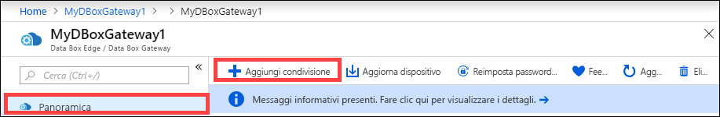

    I nomi di condivisioni possono contenere solo numeri, lettere minuscole e trattini. Il nome condivisione deve avere una lunghezza compresa fra 3 e 63 caratteri e iniziare con una lettera o un numero. Ogni trattino deve essere preceduto e seguito da un carattere diverso da un trattino.

3. Selezionare un **Tipo** per la condivisione. Il tipo può essere **SMB** o **NFS**. L'impostazione predefinita è SMB. SMB è l'opzione standard per i client Windows, mentre NFS è l'opzione usata per i client Linux. Le opzioni visualizzate variano leggermente a seconda che si scelgano condivisioni SMB o NFS.

4. Specificare un **account di archiviazione** in cui risiede la condivisione. Nell'account di archiviazione viene creato un contenitore con il nome della condivisione, se non esiste già. Se esiste già un contenitore, viene usato quello.

5. In **Servizio di archiviazione** selezionare BLOB in blocchi, BLOB di pagine o File. Il tipo di servizio scelto dipende dal formato che si vuole applicare ai dati che risiederanno in Azure. In questo esempio si vuole che i dati vengano trasferiti in Azure come **BLOB in blocchi**, quindi è questa l'opzione da selezionare. Se si sceglie **BLOB di pagine**, occorre verificare che i dati siano allineati su 512 byte. Ad esempio, VHDX è sempre allineato su 512 byte.

6. Questo passaggio varia a seconda che si stia creando una condivisione SMB o NFS.
    - **Se si crea una condivisione SMB**: nel campo **Utente locale con tutti i privilegi** selezionare **Crea nuovo** o **Usa esistente**. Se si crea un nuovo utente locale, compilare i campi **Nome utente**, **Password** e Conferma password. Vengono così assegnate le autorizzazioni all'utente locale. Dopo aver assegnato le autorizzazioni in questa fase, è possibile modificarle con Esplora file.

        

        Se si seleziona Consenti solo operazioni di lettura per i dati di questa condivisione, sarà possibile specificare utenti di sola lettura.
    - **Se si crea una condivisione NFS**: occorre specificare l'**indirizzo IP dei client autorizzati** ad accedere alla condivisione.

        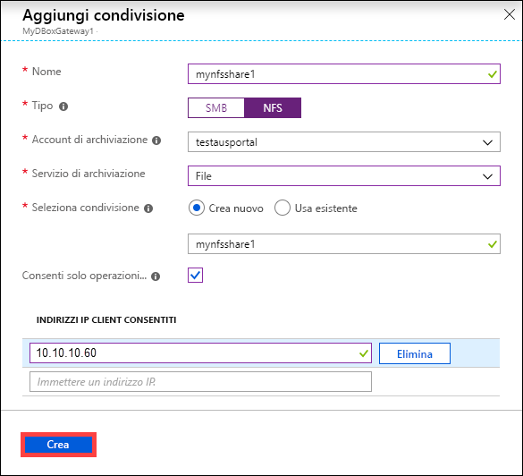

7. Fare clic su **Crea** per creare la condivisione. Viene ricevuta una notifica che indica che la creazione della condivisione è in corso. Dopo aver creato la condivisione con le impostazioni specificate, il pannello **Condivisioni** viene aggiornato per includere la nuova condivisione.
 
## Eliminare una condivisione

Eseguire i passaggi seguenti nel portale di Azure per eliminare una condivisione.

1. Nell'elenco delle condivisioni fare clic sulla condivisione da eliminare.

    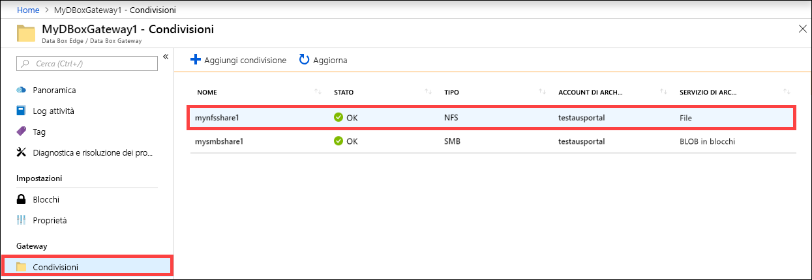

2. Fare clic su **Elimina**. 

    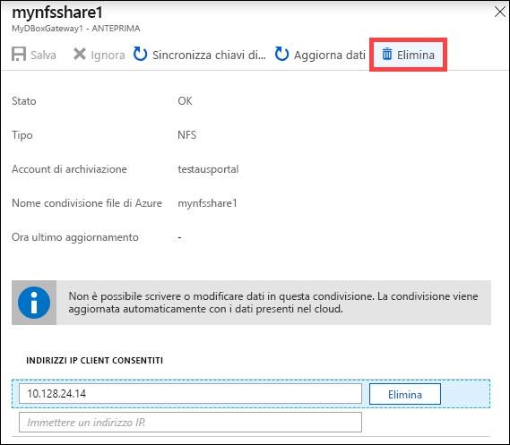

3. Alla richiesta di conferma fare clic su **Sì**.

    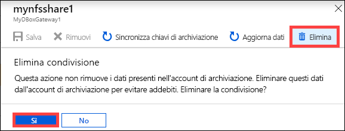

L'elenco di condivisioni viene aggiornato per riflettere l'eliminazione.

## Aggiornare le condivisioni

La funzionalità di aggiornamento consente di aggiornare il contenuto di una condivisione locale. Quando si aggiorna una condivisione, viene avviata una ricerca per trovare tutti gli oggetti Azure, inclusi BLOB e file che sono stati aggiunti al cloud dopo l'ultimo aggiornamento. Questi file aggiuntivi vengono quindi usati per aggiornare il contenuto della condivisione locale nel dispositivo. 

> [!NOTE]
> Le autorizzazioni e gli elenchi di controllo di accesso (ACL) non vengono mantenuti tra le operazioni di aggiornamento. 

Eseguire i passaggi seguenti nel portale di Azure per aggiornare una condivisione.

1.  Passare a **Condivisioni** nel portale di Azure. Fare clic sulla condivisione che si vuole aggiornare.

    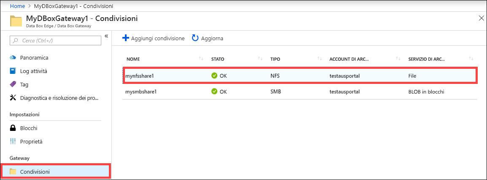

2.  Fare clic su **Aggiorna**. 

    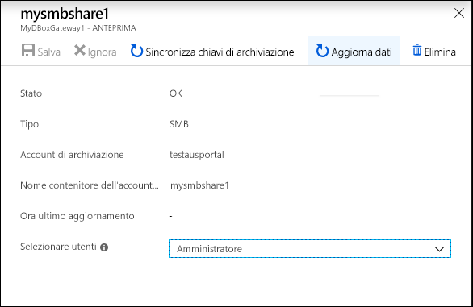
 
3.  Alla richiesta di conferma fare clic su **Sì**. Viene avviato un processo di aggiornamento del contenuto della condivisione locale. 

    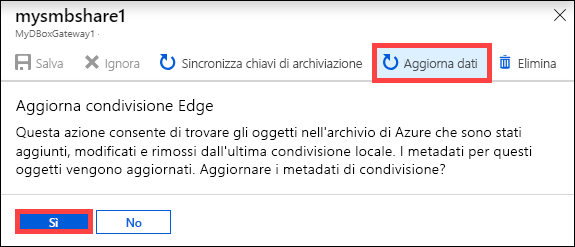
 
4.  Durante l'aggiornamento, l'opzione di aggiornamento non è disponibile nel menu di scelta rapida. Fare clic sulla notifica del processo per visualizzare lo stato del processo di aggiornamento.

5.  Il tempo necessario per aggiornare dipende dal numero di file nel contenitore di Azure, nonché dai file nel dispositivo. Dopo aver completato l'aggiornamento, viene aggiornato il timestamp di condivisione. Anche se l'aggiornamento include gli errori parziali, l'operazione è considerata riuscita e il timestamp viene aggiornato. 

    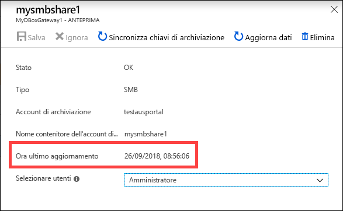
 
Se si verifica un errore, viene generato un avviso. L'avviso illustra in dettaglio la causa e i suggerimenti per correggere il problema. L'avviso contiene anche collegamenti a un file con il riepilogo completo degli errori, inclusi i file che non è stato possibile aggiornare o eliminare.

>[!IMPORTANT]
> In questa versione non aggiornare più di una singola condivisione alla volta.

## Sincronizzare le chiavi di archiviazione

Se le chiavi dell'account di archiviazione sono state ruotate, sarà necessario sincronizzare le chiavi di accesso alle risorse di archiviazione. La sincronizzazione consente al dispositivo di ottenere le chiavi più recenti per l'account di archiviazione.

Eseguire i passaggi seguenti nel portale di Azure per sincronizzare la chiave di accesso alle risorse di archiviazione.

1. Passare a **Panoramica** nella risorsa. 
2. Nell'elenco delle condivisioni, scegliere e fare clic su una condivisione associata all'account di archiviazione che è necessario sincronizzare. Fare clic su **Sincronizza chiavi di archiviazione**. 

     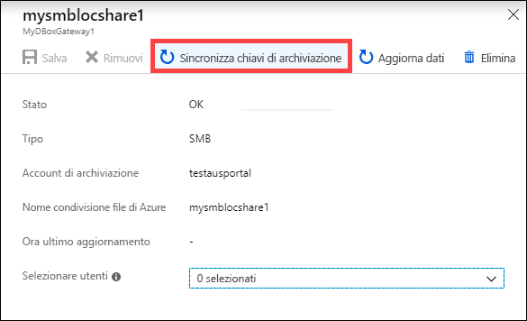

3. Fare clic sull'opzione **Sì** quando viene richiesta la conferma. Uscire dalla finestra di dialogo dopo aver completato la sincronizzazione.

     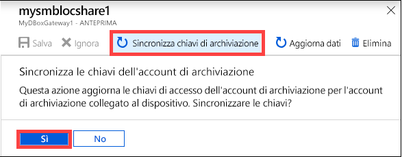

>[!NOTE]
> È sufficiente eseguire questa operazione una sola volta per un account di archiviazione specificato. Non è necessario ripetere questa azione per tutte le condivisioni associate allo stesso account di archiviazione.

## Passaggi successivi

- Informazioni su come [gestire gli utenti dal portale di Azure](data-box-gateway-manage-users.md).
