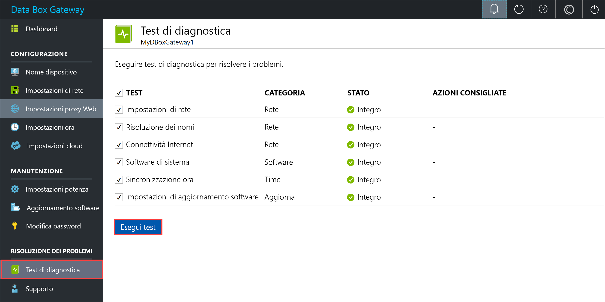
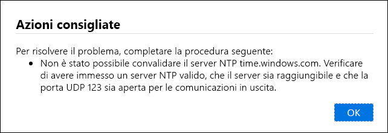
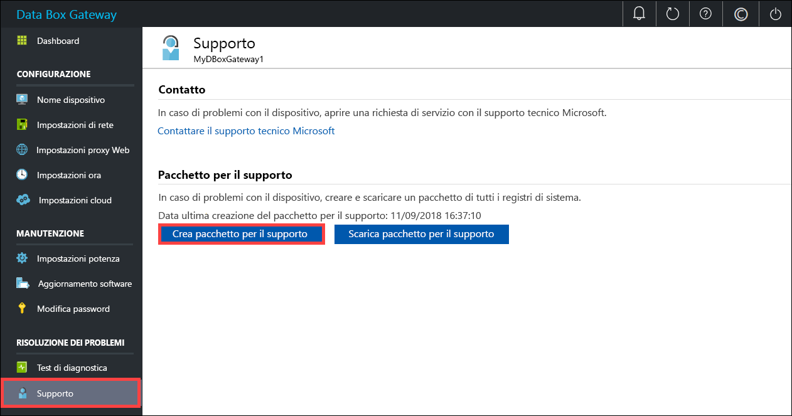
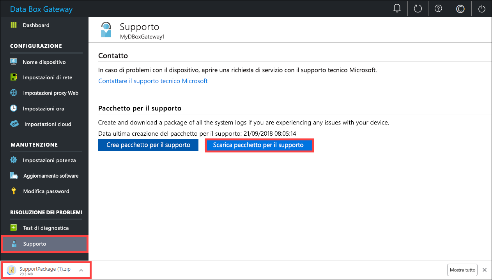

# <a name="troubleshoot-your-azure-data-box-gateway-issues"></a>Risolvere i problemi di Azure Data Box Gateway 

Questo articolo descrive come risolvere i problemi in Azure Data Box Gateway. In questo articolo viene spiegato come:

> [!div class="checklist"]
> * Eseguire la diagnostica
> * Ottenere il pacchetto per il supporto
> * Usare i log per risolvere i problemi


## <a name="run-diagnostics"></a>Eseguire la diagnostica

Per diagnosticare e risolvere gli errori di qualsiasi dispositivo, è possibile eseguire i test di diagnostica. Per eseguire i test di diagnostica, usare la procedura seguente nell'interfaccia utente Web locale.

1. Nell'interfaccia utente Web locale passare a **Risoluzione dei problemi > Test diagnostici**. Selezionare il test che si vuole eseguire e fare clic su **Esegui test**. Vengono eseguiti i test per diagnosticare eventuali problemi con la rete, il dispositivo, il proxy Web, l'ora o le impostazioni cloud. Si riceve una notifica in cui si comunica che il dispositivo sta eseguendo dei test.

    
 
2. Al termine dei test, vengono visualizzati i risultati. Se un test non riesce, viene visualizzato un URL per l'azione consigliata. Fare clic sull'URL per visualizzare l'azione consigliata. 
 
    


## <a name="collect-support-package"></a>Ottenere il pacchetto per il supporto

Un pacchetto di log è costituito da tutti i log rilevanti utili al supporto tecnico Microsoft nella risoluzione dei problemi del dispositivo. Un pacchetto di log può essere generato con l'interfaccia utente Web locale.

Per ottenere un pacchetto di supporto, usare la procedura seguente. 

1. Nell'interfaccia utente Web locale passare a **Risoluzione dei problemi > Supporto**. Fare clic su **Crea pacchetto per il supporto**. Il sistema inizia a ottenere il pacchetto per il supporto. Questa operazione potrebbe richiedere alcuni minuti.

    
 
2. Una volta completata la creazione del pacchetto di supporto, fare clic su **Scarica pacchetto per il supporto**. Un pacchetto compresso viene scaricato nel percorso selezionato. È possibile decomprimere il pacchetto.

    

## <a name="use-logs-to-troubleshoot"></a>Usare i log per risolvere i problemi

Gli eventuali errori riscontrati durante i processi di caricamento e aggiornamento vengono inclusi nei file di log degli errori corrispondenti.

1. Per visualizzare i file di log degli errori, fare clic sulla condivisione per visualizzarne il contenuto. 

      

2. Fare clic sulla cartella _Microsoft Data Box Gateway_. Questa cartella contiene due sottocartelle:

   - Una cartella di caricamento contenente i file di log per gli errori di caricamento
   - Una cartella di aggiornamento per gli errori durante l'aggiornamento

     Ecco come appare un file di log per l'aggiornamento:

     ```
     <root container="brownbag1" machine="VM15BS020663" timestamp="07/18/2018 00:11:10" />
     <file item="test.txt" local="False" remote="True" error="16001" />
     <summary runtime="00:00:00.0945320" errors="1" creates="2" deletes="0" insync="3" replaces="0" pending="9" />
     ``` 

3. Quando viene visualizzato un errore in questo file (evidenziato nell'esempio), annotare il codice di errore, che in questo caso è 16001. Cercare la descrizione di questo codice di errore con il riferimento di errore seguente.

    |     Codice di errore     |     Nome dell'eccezione                                         |     Descrizione dell'errore                                                                                                                                                                                                                     |
    |--------------------|------------------------------------------------------------|-------------------------------------------------------------------------------------------------------------------------------------------------------------------------------------------------------------------------------------------|
    |    100             |    ERROR_CONTAINER_OR_SHARE_NAME_LENGTH                    |    Il nome del contenitore o della condivisione deve avere una lunghezza compresa tra 3 e 63 caratteri.                                                                                                                                                                     |
    |    101             |    ERROR_CONTAINER_OR_SHARE_NAME_ALPHA_NUMERIC_DASH        |    Il nome del contenitore o della condivisione deve contenere solo lettere, numeri o trattini.                                                                                                                                                       |
    |    102             |    ERROR_CONTAINER_OR_SHARE_NAME_IMPROPER_DASH             |    Il nome del contenitore o della condivisione deve contenere solo lettere, numeri o trattini.                                                                                                                                                       |
    |    103             |    ERROR_BLOB_OR_FILE_NAME_CHARACTER_CONTROL               |    Il nome del BLOB o del file contiene caratteri di controllo non supportati.                                                                                                                                                                       |
    |    104             |    ERROR_BLOB_OR_FILE_NAME_CHARACTER_ILLEGAL               |    Il nome del BLOB o del file contiene caratteri illegali.                                                                                                                                                                                   |
    |    105             |    ERROR_BLOB_OR_FILE_NAME_SEGMENT_COUNT                   |    Il nome del BLOB o del file contiene troppi segmenti (ciascun segmento è separato da una barra, /).                                                                                                                                              |
    |    106             |    ERROR_BLOB_OR_FILE_NAME_AGGREGATE_LENGTH                |    Il nome del BLOB o del file è troppo lungo.                                                                                                                                                                                                     |
    |    107             |    ERROR_BLOB_OR_FILE_NAME_COMPONENT_LENGTH                |    Uno dei segmenti nel nome del blob o del file è troppo lungo.                                                                                                                                                                            |
    |    108             |    ERROR_BLOB_OR_FILE_SIZE_LIMIT                           |    Le dimensioni del file superano quelle massime consentite per il caricamento.                                                                                                                                                                              |
    |    109             |    ERROR_BLOB_OR_FILE_SIZE_ALIGNMENT                       |    Il blob o file è allineato in modo errato.                                                                                                                                                                                               |
    |    110             |    ERROR_NAME_NOT_VALID_UNICODE                            |    Il nome file o BLOB con codifica Unicode non è valido.                                                                                                                                                                                  |
    |    111             |    ERROR_RESERVED_NAME_NOT_ALLOWED                         |    Il nome o il prefisso del file o del BLOB è un nome riservato che non è supportato (ad esempio, COM1).                                                                                                                             |
    |    2000            |    ERROR_ETAG_MISMATCH                                     |    Una mancata corrispondenza degli Etag indica che si verifica un conflitto tra un BLOB in blocchi nel cloud e nel dispositivo. Per risolvere questo conflitto, eliminare uno di questi file, ovvero la versione nel cloud o la versione nel dispositivo.    |
    |    2001            |    ERROR_UNEXPECTED_FINALIZE_FAILURE                       |    Si è verificato un problema imprevisto durante l'elaborazione di un file dopo il caricamento.    Se viene visualizzato questo errore e l'errore persiste per oltre 24 ore, contattare il supporto tecnico.                                                      |
    |    2002            |    ERROR_ALREADY_OPEN                                      |    Il file è già aperto in un altro processo e non sarà possibile caricarlo fino alla chiusura dell'handle.                                                                                                                                       |
    |    2003            |    ERROR_UNABLE_TO_OPEN                                    |    Non è stato possibile aprire il file per il caricamento. Se viene visualizzato questo errore, contattare il supporto tecnico Microsoft.                                                                                                                                                |
    |    2004            |    ERROR_UNABLE_TO_CONNECT                                 |    Non è stato possibile connettersi al contenitore per il caricamento dei dati.                                                                                                                                                                             |
    |    2005            |    ERROR_INVALID_CLOUD_CREDENTIALS                         |    Non è stato possibile connettersi al contenitore perché le autorizzazioni dell'account sono errate o non aggiornate. Controllare l'accesso.                                                                                                               |
    |    2006            |    ERROR_CLOUD_ACCOUNT_DISABLED                            |    Non è stato possibile caricare i dati nell'account perché l'account o la condivisione sono disabilitati.                                                                                                                                                            |
    |    2007            |    ERROR_CLOUD_ACCOUNT_PERMISSIONS                         |    Non è stato possibile connettersi al contenitore perché le autorizzazioni dell'account sono errate o non aggiornate. Controllare l'accesso.                                                                                                               |
    |    2008            |    ERROR_CLOUD_CONTAINER_SIZE_LIMIT_REACHED                |    Non è stato possibile aggiungere nuovi dati perché il contenitore è pieno. Verificare le specifiche di Azure per le dimensioni del contenitore supportate in base al tipo. Ad esempio, File di Azure supporta solo dimensioni massime di 5 TB.                                     |
    |    2009            |    ERROR_CLOUD_CONTAINER_MISSING                |     Non è stato possibile caricare i dati perché il contenitore associato alla condivisione non esiste.                                     |    
    |    2997            |    ERROR_ITEM_CANCELED                                     |    Si è verificato un errore imprevisto. Si tratta di un errore temporaneo che si risolverà automaticamente.                                                                           |
    |    2998            |    ERROR_UNMAPPED_FAILURE                                  |    Si è verificato un errore imprevisto. L'errore potrebbe risolversi da solo, ma se persiste per oltre 24 ore, contattare il supporto tecnico Microsoft.                                                                                                     |
    |    16000           |    RefreshException                                        |    Non è stato possibile trasferire questo file.                                                                                                                                                                                                        |
    |    16001           |    RefreshAlreadyExistsException                           |    Non è stato possibile trasferire questo file perché è già presente nel sistema locale.                                                                                                                                                         |
    |    16002           |    RefreshWorkNeededException                              |    Non è stato possibile aggiornare questo file perché non è completamente caricato.                                                                                                                                                                          | 


## <a name="next-steps"></a>Passaggi successivi

- Altre informazioni sui [problemi noti in questa versione](data-box-gateway-release-notes.md).
