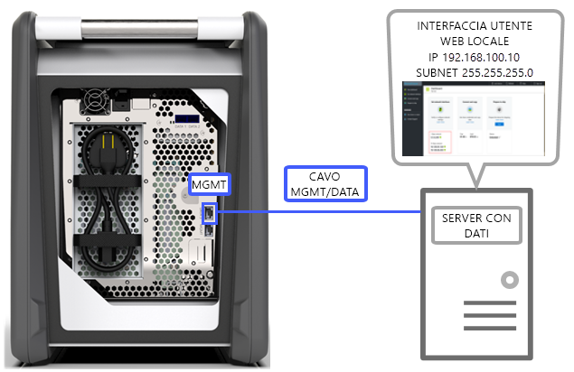
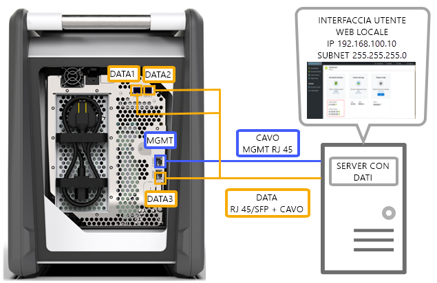
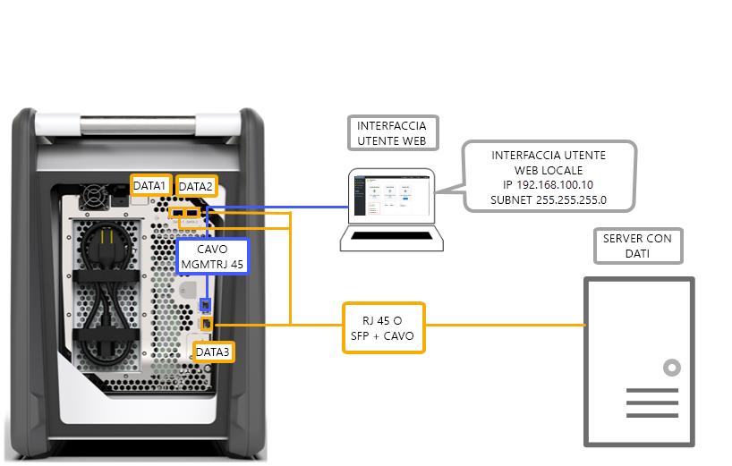
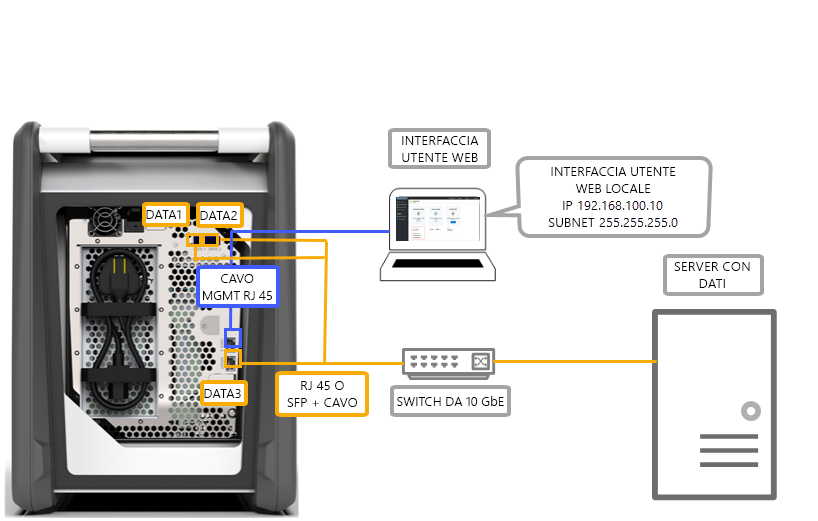
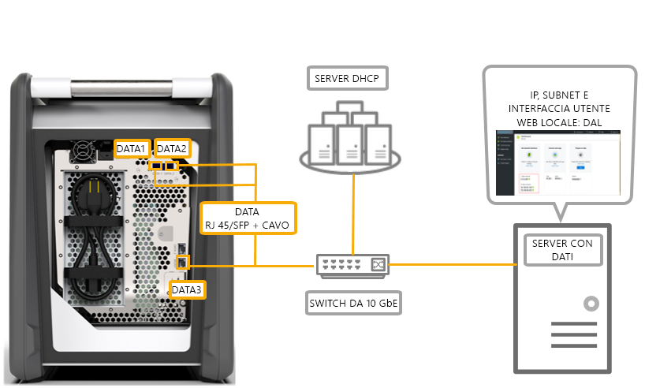

# Opzioni di cablaggio per Azure Data Box

Questo articolo descrive vari modi per cablare Azure Data Box per il trasferimento dei dati.

## Trasferimento tramite la porta MGMT

Questa opzione è la configurazione minima assoluta per Data Box. È possibile configurare solo la porta MGMT per la gestione e i dati.

Prima di iniziare, verificare di avere:

- Un cavo Ethernet RJ45 per la porta MGMT.
- Un'origine dati che esegue un [sistema operativo supportato](data-box-system-requirements.md#supported-operating-systems-for-clients).

Per cablare il dispositivo, eseguire la procedura seguente.

1. Usare un cavo RJ45 per connettere la porta MGMT al server che contiene i dati.

    

2. Nel server impostare:

    - L'**indirizzo IP** su 192.168.100.5
    - La **subnet** su 255.255.255.0

3. Accedere all'interfaccia utente Web locale del dispositivo all'indirizzo 192.168.100.10. Accedere e sbloccare Data Box usando la password di sblocco dal portale di Azure.

## Trasferimento tramite la porta DATA con indirizzi IP statici

È possibile configurare due porte per Data Box, la porta MGMT per il traffico di gestione e una delle porte dati per i dati. Le porte dati possono essere DATA 1, DATA 2 o DATA 3.

È consigliabile che se si configura solo una porta dati, questa deve essere una porta 10 GbE come DATA 1 o DATA 2. Una porta 1 GbE aumenterebbe in modo significativo il tempo necessario per il trasferimento dei dati.

Prima di iniziare, verificare di avere:

- Un cavo Ethernet RJ45 per la porta MGMT.
- Un cavo 10 GbE in rame SFP+ Twinax per ogni porta dati 10 GbE che si vuole connettere.
- Una o più origini dati che eseguono un [sistema operativo supportato](data-box-system-requirements.md#supported-operating-systems-for-clients).

### Opzione 1: Configurazione iniziale tramite server

Per cablare il dispositivo, eseguire la procedura seguente.

1. Usare un cavo Ethernet RJ45 dal server direttamente alla porta MGMT per la configurazione.
2. Usare l'interfaccia RJ45 per i cavi DATA 3 o SFP+ per connettere le porte DATA 1 o DATA 2 al server che funge da origine dati. Per assicurare prestazioni ottimali, è consigliabile usare le porte 10-GbE DATA 1 o DATA 2.
3. Nel server impostare:

    - L'**indirizzo IP** su 192.168.100.5
    - La **subnet** su 255.255.255.0

    

3. Accedere all'interfaccia utente Web locale del dispositivo all'indirizzo 192.168.100.10. Accedere e sbloccare Data Box usando la password di sblocco dal portale di Azure.
4. Assegnare indirizzi IP statici alle porte dati configurate.

### Opzione 2: Configurazione iniziale tramite un computer separato

Per cablare il dispositivo, eseguire la procedura seguente.

1. Usare un cavo Ethernet RJ45 dal server direttamente alla porta MGMT per la configurazione.
2. Usare l'interfaccia RJ45 per i cavi DATA 3 o SFP+ per connettere le porte DATA 1 o DATA 2 al server. Per assicurare prestazioni ottimali, è consigliabile usare le porte 10-GbE DATA 1 o DATA 2. Le porte dati vengono connesse tramite un commutatore 10 GbE al server con i dati.
3. Configurare la scheda Ethernet del portatile usato per connettersi al dispositivo con:

    - **Indirizzo IP** impostato su 192.168.100.5
    - **Subnet** impostata su 255.255.255.0

    

3. Accedere all'interfaccia utente Web locale del dispositivo all'indirizzo 192.168.100.10. Accedere e sbloccare Data Box usando la password di sblocco dal portale di Azure.
4. Identificare gli indirizzi IP assegnati dal server DHCP.

## Trasferimento tramite la porta DATA con indirizzi IP statici con un commutatore 

Usare questa configurazione per più origini dati nelle reti 1 GbE e 10 gbE.

Prima di iniziare, verificare di avere:

- Un cavo Ethernet RJ45 per la porta MGMT.
- Un cavo 10 GbE in rame SFP+ Twinax per ogni porta dati 10 GbE che si vuole connettere.
- Una o più origini dati che eseguono un [sistema operativo supportato](data-box-system-requirements.md#supported-operating-systems-for-clients). Queste origini dati possono trovarsi in reti diverse come 1 GbE o 10 GbE.

Per cablare il dispositivo, eseguire la procedura seguente.

1. Usare un cavo Ethernet RJ45 dal server direttamente alla porta MGMT per la configurazione.
2. Usare l'interfaccia RJ45 per i cavi DATA 3 o SFP+ per connettere le porte DATA 1 o DATA 2 al server. Per assicurare prestazioni ottimali, è consigliabile usare le porte 10-GbE DATA 1 o DATA 2.
3. Configurare la scheda Ethernet del portatile usato per connettersi al dispositivo con:

    - **Indirizzo IP** impostato su 192.168.100.5
    - **Subnet** impostata su 255.255.255.0

    

3. Accedere all'interfaccia utente Web locale del dispositivo all'indirizzo 192.168.100.10. Accedere e sbloccare Data Box usando la password di sblocco dal portale di Azure.
4. Assegnare indirizzi IP statici alle porte dati configurate.

## Trasferimento tramite la porta DATA in un ambiente DHCP

Usare questa configurazione se il dispositivo si trova in un ambiente DHCP.

Prima di iniziare, verificare di avere:

- Un cavo RJ45 se si vuole connettere una porta DATA 1.
- Un cavo 10 GbE in rame SFP+ Twinax per ogni porta dati 10 GbE che si vuole connettere.
- Una o più origini dati che eseguono un [sistema operativo supportato](data-box-system-requirements.md#supported-operating-systems-for-clients). Queste origini dati possono trovarsi in reti diverse come 1 GbE o 10 GbE.

Per cablare il dispositivo, eseguire la procedura seguente.

1. Usare un cavo RJ45 o SFP + tramite un commutatore (se il server DHCP è accessibile) per il server.

    
2. Usare un server DHCP o DNS per identificare l'indirizzo IP.
3. Da un server nella stessa rete accedere all'interfaccia utente Web locale del dispositivo usando l'indirizzo IP assegnato dal server DHCP. Accedere e sbloccare Data Box usando la password di sblocco dal portale di Azure.

## Passaggi successivi

- Dopo avere cablato il dispositivo, passare a [Copiare i dati in Azure Data Box](data-box-deploy-copy-data.md).
