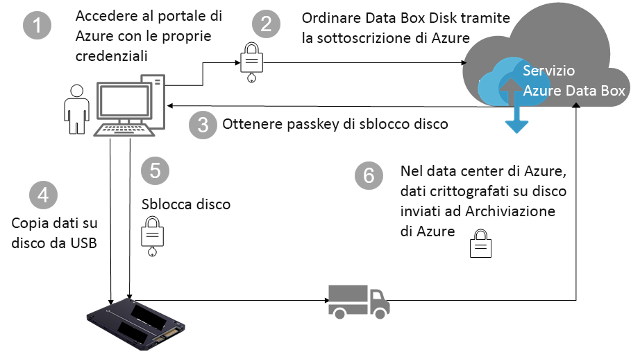

# Sicurezza e protezione dei dati per Azure Data Box Disk (anteprima)

Questo articolo descrive le funzionalità di sicurezza di Azure Data Box Disk che consentono di proteggere ciascuno dei componenti della soluzione Data Box e i dati archiviati su di essi. 

> [!IMPORTANT]
> Data Box Disk è disponibile in anteprima. Esaminare le [condizioni del servizio per l'anteprima di Azure](https://azure.microsoft.com/support/legal/preview-supplemental-terms/) prima di distribuire questa soluzione.

## Flusso dei dati nei vari componenti

La soluzione Microsoft Azure Data Box è costituita da quattro componenti principali che interagiscono tra loro:

- **Servizio Azure Data Box ospitato in Azure** - Il servizio di gestione usato per creare l'ordine dei dischi, configurare i dischi e quindi monitorare l'ordine fino al completamento.
- **Dischi di Data Box** - I dischi fisici che vengono spediti all'utente per importare i dati locali in Azure. 
- **Client/host connessi ai dischi** - Client nell'infrastruttura che si connettono al disco Data Box tramite USB e contengono i dati da proteggere.
- **Archiviazione cloud** – Posizione nel cloud di Azure in cui vengono archiviati i dati. In genere si tratta dell'account di archiviazione collegato alla risorsa di Azure Data Box creata.

Il diagramma seguente indica il flusso dei dati attraverso la soluzione Azure Data Box, dall'ambiente locale ad Azure.

## Funzionalità di sicurezza

Data Box Disk offre una soluzione sicura per la protezione dei dati, garantendo che solo le entità autorizzate possano visualizzare, modificare o eliminare i dati. Le funzionalità di sicurezza per questa soluzione riguardano sia i dischi che il servizio associato a garantire la sicurezza dei dati archiviati. 

### Protezione di Data Box Disk

Il servizio Data Box Disk è protetto dalle funzionalità seguenti:

- Crittografia BitLocker AES-128 bit per il disco sempre applicata.
- Funzionalità di aggiornamento sicuro per i dischi.
- I dischi vengono spediti in uno stato bloccato e possono essere sbloccati solo tramite lo strumento per lo sblocco dei dischi di Data Box. Lo strumento di sblocco è disponibile nel portale del servizio Data Box Disk.

### Protezione dei dati di Data Box Disk

I dati in ingresso e in uscita da Data Box Disk sono protetti dalle funzionalità seguenti:

- Crittografia BitLocker dei dati sempre applicata. 
- Cancellazione sicura dei dati dal disco dopo aver completato il caricamento dei dati in Azure. La cancellazione dei dati viene eseguita in conformità con gli standard NIST 800-88r1.

### Protezione del servizio Data Box

Il servizio Data Box è protetto dalle funzionalità seguenti.

- Per l'accesso al servizio Data Box Disk, l'organizzazione deve avere una sottoscrizione di Azure che include Data Box Disk. La sottoscrizione determina le funzionalità a cui si può accedere nel portale di Azure.
- Dato che il servizio Data Box è ospitato in Azure, viene protetto dalle funzionalità di sicurezza di Azure. Per altre informazioni sulle funzionalità di sicurezza fornite da Microsoft Azure, andare in [Centro protezione Microsoft Azure](https://www.microsoft.com/TrustCenter/Security/default.aspx). 
- Data Box Disk archivia la passkey del disco usata per sbloccare il disco nel servizio. 
- Il servizio Data Box Disk archivia i dettagli e lo stato dell'ordine nel servizio. Queste informazioni vengono eliminate quando l'ordine viene eliminato. 

## Gestione dei dati personali

[!INCLUDE [GDPR-related guidance](../../includes/gdpr-intro-sentence.md)]

Azure Data Box Disk raccoglie e visualizza informazioni personali nei principali casi seguenti nel servizio:

- **Impostazioni di notifica** - Quando si crea un ordine, si configura l'indirizzo di posta elettronica degli utenti nelle impostazioni di notifica. Queste informazioni possono essere visualizzate dell'amministratore. Queste informazioni vengono eliminate dal servizio quando il processo raggiunge lo stato terminale o quando si elimina l'ordine.

- **Dettagli dell'ordine** - Dopo aver creato l'ordine, l'indirizzo di spedizione, l'indirizzo di posta elettronica e le informazioni di contatto degli utenti vengono archiviate nel portale di Azure. Le informazioni salvate includono:

    - Nome del contatto
    - Numero di telefono
    - Email
    - Indirizzo
    - city
    - CAP
    - Stato
    - Paese/provincia/area geografica
    - ID unità
    - Numero di account del vettore
    - Numero di tracciabilità della spedizione

    Al termine del processo o quando si elimina l'ordine, i dettagli dell'ordine vengono eliminati dal servizio Data Box.

- **Indirizzo di spedizione** - Dopo l'inserimento dell'ordine, il servizio Data Box fornisce l'indirizzo di spedizione ai vettori di terze parti, ad esempio UPS o DHL. 

Per altre informazioni, consultare l'Informativa sulla privacy Microsoft nel [Centro protezione](https://www.microsoft.com/trustcenter).

## Passaggi successivi

- Rivedere i [requisiti per Data Box Disk](data-box-disk-system-requirements.md).
- Comprendere i [limiti di Data Box Disk](data-box-disk-limits.md).
- Distribuire rapidamente [Azure Data Box Disk](data-box-disk-quickstart-portal.md) nel portale di Azure.
