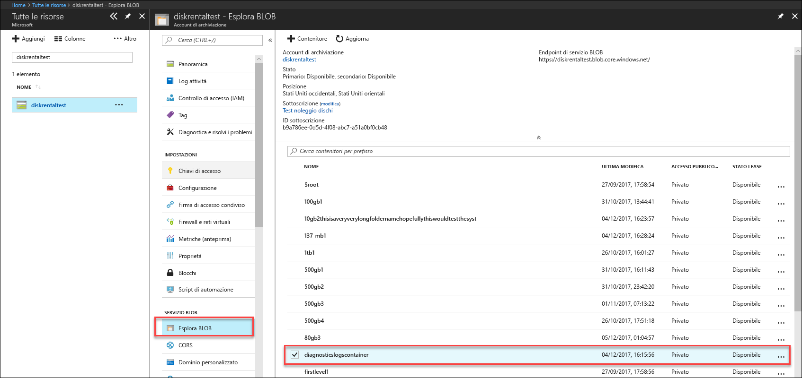
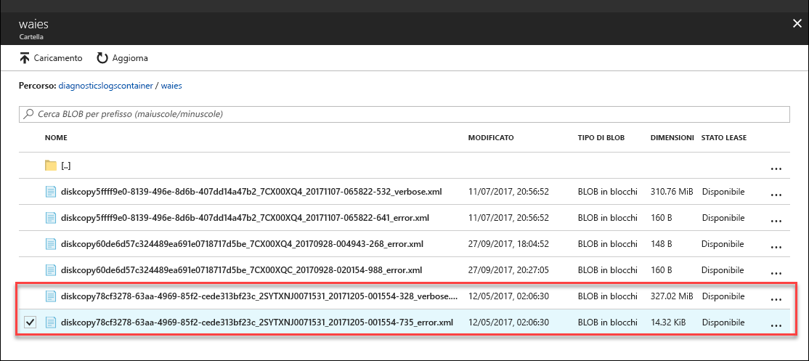

# Risoluzione dei problemi in Azure Data Box Disk

Questo articolo si applica a Microsoft Azure Data Box Disk e descrive i flussi di lavoro usati per risolvere eventuali problemi che emergono quando si distribuisce questa soluzione. 

L'articolo include le sezioni seguenti:

- Scaricare i log di diagnostica
- Eseguire query sui log attività
- Errori dello strumento di sblocco di Data Box Disk
- Errori dello strumento di divisione della copia di Data Box Disk

## Scaricare i log di diagnostica

Se si verificano errori durante il processo di copia dei dati, nel portale viene visualizzato il percorso della cartella in cui si trovano i log di diagnostica. 

I log di diagnostica possono essere:
- Log degli errori
- Log dettagliati  

Per spostarsi sul percorso per il log di copia, passare all'account di archiviazione associato all'ordine di Data Box. 

1.  Passare a **Generale > Dettagli ordine** e prendere nota dell'account di archiviazione associato all'ordine.
 

2.  Passare a **Tutte le risorse** e cercare l'account di archiviazione identificato nel passaggio precedente. Selezionare e fare clic sull'account di archiviazione.

    

3.  Passare a **Servizio BLOB > Esplora BLOB** e cercare il BLOB corrispondente all'account di archiviazione. Passare a **diagnosticslogcontainer > waies**. 

    

    Verranno visualizzati sia i log degli errori che i log dettagliati per la copia dei dati. Selezionare e fare clic su ogni file, quindi scaricare una copia locale.

## Eseguire query sui log attività

È possibile usare i log attività per trovare un errore durante la risoluzione dei problemi o per monitorare il modo in cui un utente dell'organizzazione ha modificato una risorsa. Con i log attività è possibile determinare:

- Le operazioni eseguite sulle risorse nella sottoscrizione.
- Chi ha avviato l'operazione. 
- Quando si è verificata l'operazione.
- Lo stato dell'operazione.
- I valori di altre proprietà che possono essere utili per ricerche sull'operazione.

Il log attività contiene tutte le operazioni di scrittura (ad esempio PUT, POST, DELETE) eseguite sulle risorse, ma non le operazioni di lettura (ad esempio GET). 

I registri attività vengono conservati per 90 giorni. È possibile eseguire query per qualsiasi intervallo di date, purché la data di inizio non risalga a più di 90 giorni prima. È anche possibile filtrare i dati usando una delle query predefinite in Insights. Ad esempio, fare clic su un errore e quindi selezionare e fare clic su errori specifici per comprendere la causa radice.

## Errori dello strumento di sblocco di Data Box Disk

| Messaggio di errore/Comportamento dello strumento      | Consigli                                                                                               |
|-------------------------------------------------------------------------------------------------------------------------------------|------------------------------------------------------------------------------------------------------|
| Nessuna  Arresto anomalo dello strumento di sblocco di Data Box Disk.                                                                            | BitLocker non è installato. Assicurarsi che BitLocker sia installato nel computer host che esegue lo strumento di sblocco di Data Box Disk.                                                                            |
| La versione corrente di .NET Framework non è supportata. Sono supportate la versione 4.5 e versioni successive.  Lo strumento viene chiuso con un messaggio.  | .NET 4.5 non è installato. Installare .NET 4.5 o versioni successive nel computer host che esegue lo strumento di sblocco di Data Box Disk.                                                                            |
| Impossibile sbloccare o verificare i volumi. Contattare il supporto Microsoft.    Lo strumento non riesce a sbloccare o verificare alcuna unità bloccata. | Lo strumento non è riuscito a sbloccare alcuna unità bloccata con la passkey fornita. Contattare il supporto tecnico Microsoft per i passaggi successivi.                                                |
| I volumi seguenti sono sbloccati e verificati.  Lettere di unità dei volumi: E: Impossibile sbloccare volumi con le passkey seguenti: werwerqomnf, qwerwerqwdfda   Lo strumento sblocca alcune unità ed elenca le lettere di unità per cui lo sblocco è riuscito o non è riuscito.| Operazione completata parzialmente. Impossibile sbloccare alcune delle unità con la passkey fornita. Contattare il supporto tecnico Microsoft per i passaggi successivi. |
| Impossibile trovare volumi bloccati. Verificare che il disco ricevuto da Microsoft sia connesso correttamente e sia in stato bloccato.          | Lo strumento non riesce a trovare unità bloccate. Le unità sono già sbloccate o non vengono rilevate. Assicurarsi che le unità siano collegate e bloccate.                                                           |
| Errore irreversibile: Parametro non valido Nome del parametro: invalid_arg SINTASSI: DataBoxDiskUnlock /PassKeys:<elenco_passkey_delimitato_da_punti_e_virgola>  Esempio: DataBoxDiskUnlock /PassKeys:passkey1;passkey2;passkey3 Esempio: DataBoxDiskUnlock /SystemCheck Esempio: DataBoxDiskUnlock /Help  /PassKeys:       ottenere questa passkey dall'ordine di Azure DataBox Disk. La passkey sblocca i dischi. /Help:           questa opzione offre informazioni sull'utilizzo e gli esempi per il cmdlet. /SystemCheck:    questa opzione controlla se il sistema soddisfa i requisiti per eseguire lo strumento.  Premere un tasto qualsiasi per uscire. | Immesso parametro non valido. I soli parametri consentiti sono /SystemCheck /PassKey e /Help.                                                                            |

## Errori dello strumento di divisione della copia di Data Box Disk

|Messaggio/avvisi di errore  |Consigli |
|---------|---------|
|[Informazioni] Recupero della password di bitlocker per il volume: m  [Errore] Eccezione rilevata durante il recupero delle chiave di bitlocker per il volume m:  La sequenza non contiene elementi.|Questo errore viene generato se il Data Box Disk di destinazione è offline.   Usare lo strumento `diskmgmt.msc` per mettere i dischi online.|
|Eccezione [Errore] generata: l'operazione WMI non è riuscita:  Metodo=UnlockWithNumericalPassword, ReturnValue=2150694965,  Win32Message=Il formato della password di ripristino fornita non è valido.  Le password di ripristino di BitLocker sono composte da 48 cifre.  Verificare che la password di ripristino sia nel formato corretto e ripetere l'operazione.|Usare lo strumento di sblocco del disco di Data Box per sbloccare prima i dischi, poi riprovare il comando. Per altre informazioni, vedere <li> [Sbloccare il Data Box Disk per i client Windows](data-box-disk-deploy-set-up.md#unlock-disks-on-windows-client). </li><li> [Sbloccare il Data Box Disk per i client Linux](data-box-disk-deploy-set-up.md#unlock-disks-on-linux-client). </li>|
|Eccezione [Errore] generata: esiste un file DriveManifest.xml nell'unità di destinazione.   Ciò indica che l'unità di destinazione potrebbe essere stata preparata con un file journal diverso.  Per aggiungere altri dati nella stessa unità, usare il file journal precedente. Per eliminare i dati esistenti e riutilizzare l'unità di destinazione per un nuovo processo di importazione, eliminare il file DriveManifest.xml nell'unità. Eseguire di nuovo questo comando con un nuovo file journal.| Questo errore si verifica quando si prova a usare lo stesso set di unità per più sessioni di importazione.   Usare un solo set di unità per un'unica sessione di divisione della copia.|
|Eccezione [Errore] generata: CopySessionId importdata-sept-test-1 si riferisce a una sessione di copia precedente e non può essere riusato per una nuova sessione di copia.|Questo errore viene segnalato quando si prova a usare lo stesso nome di un processo precedente già completato per un nuovo processo.  Assegnare un nome univoco al nuovo processo.|
|[Info] Nome del file o directory di destinazione supera la lunghezza massima NTFS. |Questo messaggio viene segnalato quando il file di destinazione è stato rinominato a causa di un percorso file troppo lungo.  Modificare l'opzione disposition nel file `config.json` per controllare questo comportamento.|
|Eccezione [Errore] generata: la sequenza di escape JSON non è corretta. |Questo messaggio viene segnalato quando il formato del file config.json non è valido.   Convalidare il file `config.json` con [JSONlint](https://jsonlint.com/) prima di salvare il file.|

## Problemi di distribuzione con Linux

Questa sezione illustra alcuni dei principali problemi riscontrati durante la distribuzione di Data Box Disk quando si usa un client Linux per la copia dei dati.

### Problema: Unità montata in modalità di sola lettura
 
**Causa** 

La causa probabile è un file system anomalo. 

Rimontare un'unità in modalità di lettura/scrittura impedisce il funzionamento con Data Box Disk. Questo scenario non è supportato da unità decrittografate da dislocker. Il dispositivo potrebbe essere stato rimontato con successo tramite il comando seguente: 

    `# mount -o remount, rw / mnt / DataBoxDisk / mountVol1 ß`

Anche se il rimontaggio avesse esito positivo, i dati non verranno mantenuti.

**Risoluzione**

Se viene visualizzato l'errore sopra riportato, provare una delle soluzioni seguenti:

- Installare [`ntfsfix`](https://linux.die.net/man/8/ntfsfix) (disponibile nel pacchetto `ntfsprogs`) ed eseguirlo sulla partizione corrispondente.

- Se si ha accesso a un sistema Windows

    - Caricare l'unità del sistema Windows.
    - Aprire un prompt dei comandi con privilegi di amministratore. Eseguire `chkdsk` nel volume.
    - Rimuovere il volume in modo sicuro e ripetere l'operazione.
 
### Problema: Errore con i dati non persistenti dopo la copia
 
**Causa** 

Se l'unità non dispone di dati dopo essere stata disinstallata (anche se i dati sono stati copiati all'interno della stessa), è possibile che sia stata rimontata in modalità di lettura/scrittura a seguito del montaggio in modalità di sola lettura.

**Risoluzione**
 
In questo caso, vedere la risoluzione per le [unità montate in sola lettura](#issue-drive-getting-mounted-as-read-only).

Se non era applicabile, copiare i log dalla cartella con lo strumento per sbloccare Data Box Disk e [contattare il supporto tecnico Microsoft](data-box-disk-contact-microsoft-support.md).

## Problemi di distribuzione con Microsoft

Questa sezione illustra alcuni dei principali problemi riscontrati durante la distribuzione di Data Box Disk quando si usa un client Windows per la copia dei dati

### Problema: Impossibile sbloccare l'unità da BitLocker
 
**Causa** 

È stata usata la password nella finestra di dialogo di BitLocker ed è avvenuto un tentativo di sbloccare il disco tramite la finestra di dialogo di sblocco unità di BitLocker. Questo metodo non funziona. 

**Risoluzione**

Per sbloccare i dispositivi Data Box disk, è necessario usare lo strumento di sblocco di Data Box Disk e fornire la password dal portale di Azure. Per altre informazioni, vedere l'[Esercitazione: Disimballare, collegare e sbloccare Azure Data Box Disk](data-box-disk-deploy-set-up.md#connect-to-disks-and-get-the-passkey).
 
### Problema: Impossibile sbloccare o verificare alcuni volumi. Contattare il supporto Microsoft.
 
**Causa** 

È possibile che venga visualizzato l'errore seguente nel log degli errori e che non si sia in grado di sbloccare o verificare alcuni volumi.

`Exception System.IO.FileNotFoundException: Could not load file or assembly 'Microsoft.Management.Infrastructure, Version=1.0.0.0, Culture=neutral, PublicKeyToken=31bf3856ad364e35' or one of its dependencies. The system cannot find the file specified.`
 
Ciò indica che probabilmente è assente la versione appropriata di Windows PowerShell nel client Windows.

**Risoluzione**

È possibile installare [Windows PowerShell versione 5.0](https://www.microsoft.com/download/details.aspx?id=54616) e ripetere l'operazione.
 
Se non è ancora possibile sbloccare i volumi, copiare i log dalla cartella con lo strumento per sbloccare Data Box Disk e [contattare il supporto tecnico Microsoft](data-box-disk-contact-microsoft-support.md).

## Passaggi successivi

- Informazioni su come [gestire Data Box Disk tramite il portale di Azure](data-box-portal-ui-admin.md).
