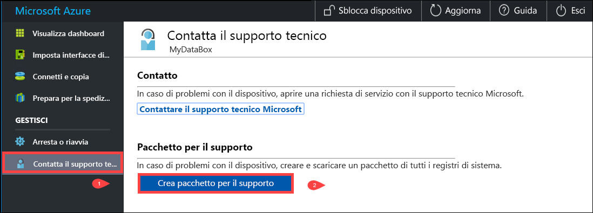
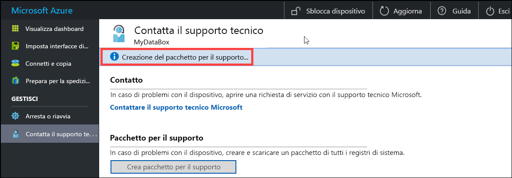
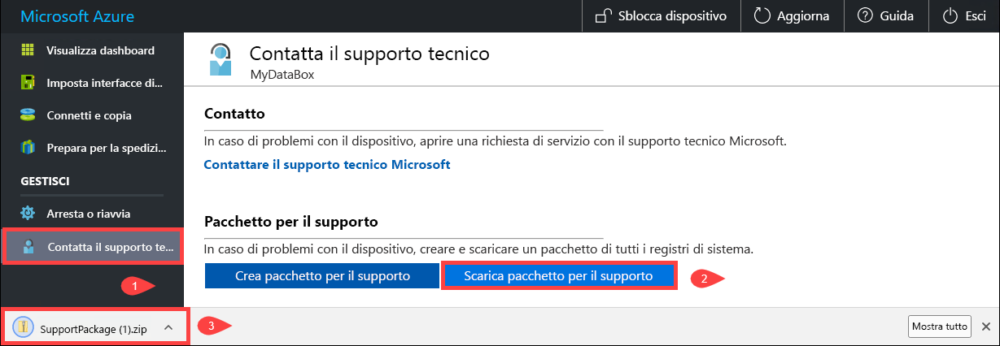
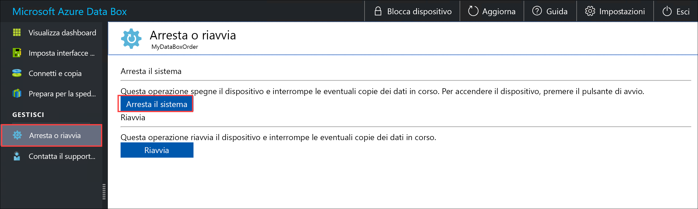
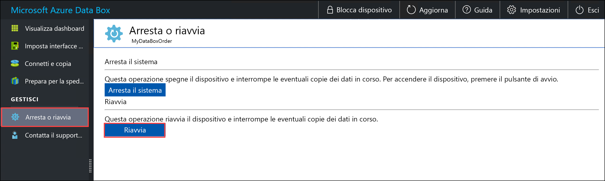
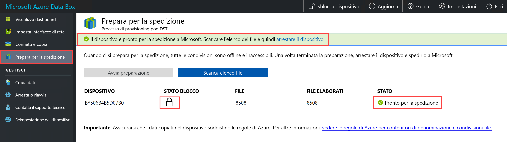
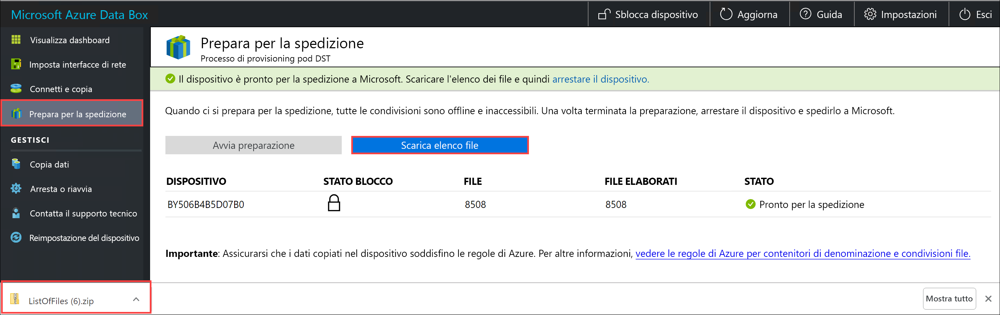
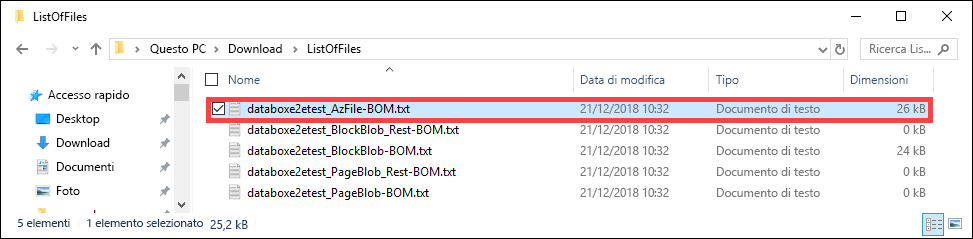
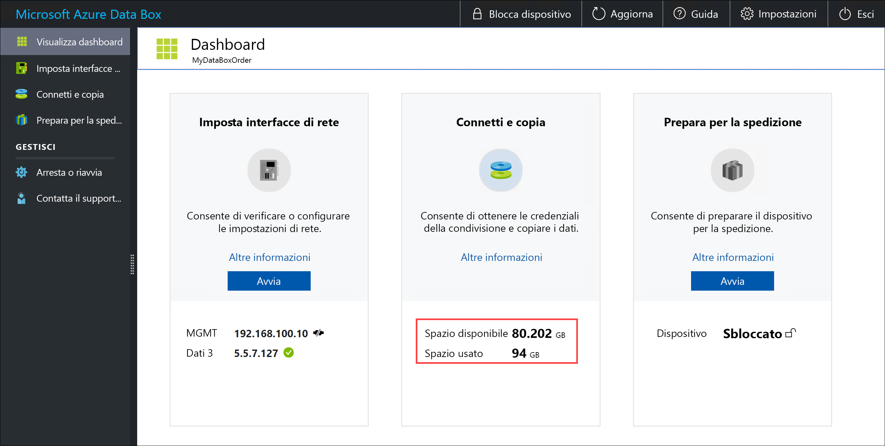
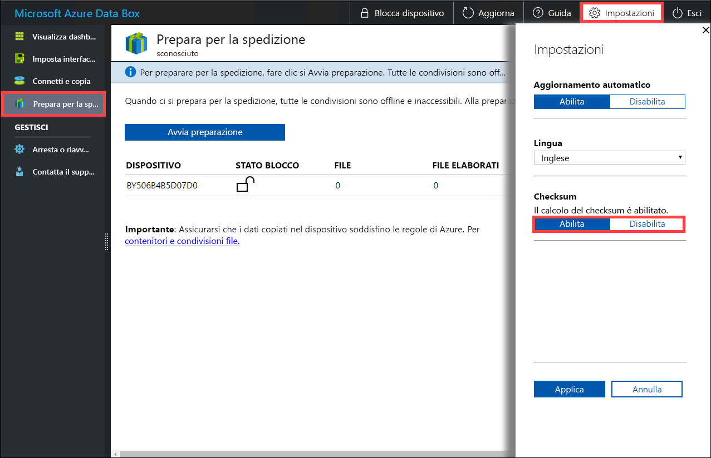

# <a name="use-the-local-web-ui-to-administer-your-data-box-and-data-box-heavy"></a>Usare l'interfaccia utente web locale per amministrare il Data Box e pesante finestra di dati

Questo articolo descrive alcune delle attività di configurazione e gestione che possono essere eseguite sui dispositivi Data Box e complessa di finestra di dati. È possibile gestire i dispositivi pesante finestra di dati e di Data Box tramite il portale di Azure dell'interfaccia utente e l'interfaccia utente web locale per il dispositivo. Questo articolo è incentrato sulle attività che è possibile eseguire con l'interfaccia utente Web locale.

Web locale dell'interfaccia utente per il Data Box e pesante finestra di dati viene usato per la configurazione iniziale del dispositivo. È anche possibile usare l'interfaccia utente web locale per arrestare o riavviare il dispositivo, eseguire i test diagnostici, aggiornare il software, visualizzare i log di copia e generare un pacchetto di log per il supporto tecnico Microsoft. In un dispositivo Data finestra pesante con due nodi indipendenti, è possibile accedere a due interfacce utente web locale separato corrispondente a ciascun nodo del dispositivo.

L'articolo include le esercitazioni seguenti:

- Creare un pacchetto di supporto
- Arrestare o riavviare il dispositivo
- Scaricare la distinta base o i file manifesto
- Visualizzare la capacità disponibile del dispositivo
- Ignorare la convalida di checksum

## <a name="generate-support-package"></a>Creare un pacchetto per il supporto

Se si verificano problemi al dispositivo, è possibile creare un pacchetto di supporto dai log di sistema. Il supporto tecnico Microsoft usa questo pacchetto per risolvere il problema. Per generare un pacchetto di supporto, procedere come segue:

1. Nell'interfaccia utente Web locale passare a **Contatta il supporto tecnico** e fare clic su **Crea pacchetto per il supporto**.

    

2. Viene raccolto un pacchetto di supporto. Il completamento dell'operazione richiede alcuni minuti.

    

3. Una volta completata la creazione del pacchetto di supporto, fare clic su **Scarica pacchetto per il supporto**. 

    

4. Individuare e scegliere il percorso di download. Aprire la cartella per visualizzarne il contenuto.

    


## <a name="shut-down-or-restart-your-device"></a>Arrestare o riavviare il dispositivo

È possibile arrestare o riavviare il dispositivo usando l'interfaccia utente web locale. Prima di riavviare, si consiglia di portare offline le condivisioni sull'host e quindi il dispositivo. Questa operazione consente di eliminare qualsiasi rischio di danneggiamento dei dati. Assicurarsi che al momento dell'arresto del dispositivo non sia in corso la copia dei dati.

Per arrestare il dispositivo, procedere come segue.

1. Nell'interfaccia utente Web locale passare a **Arresta o riavvia**.
2. Fare clic su **Spegni**.

    

3. Alla richiesta di conferma fare clic su **OK** per continuare.

    

Una volta arrestato il dispositivo, usare il pulsante di alimentazione sul pannello anteriore per accendere il dispositivo.

Per riavviare Data Box seguire questa procedura.

1. Nell'interfaccia utente Web locale passare a **Arresta o riavvia**.
2. Fare clic su **Restart**.

    

3. Alla richiesta di conferma fare clic su **OK** per continuare.

   Il dispositivo si arresta e quindi si riavvia.

## <a name="download-bom-or-manifest-files"></a>Scaricare la distinta base o i file manifesto

La fattura di materiale (BOM) o i file manifesto contengono l'elenco dei file che vengono copiati dati casella ingenti o Data Box. Questi file vengono generati quando si prepara il dispositivo per la spedizione.

Prima di iniziare, assicurarsi che il dispositivo è stata completata **Prepara per la spedizione** passaggio. Seguire questa procedura per scaricare la distinta base o i file manifesto:

1. Passare all'interfaccia utente Web locale per il dispositivo. Si noterà che il dispositivo è stata completata la preparazione per la spedizione. Al termine della preparazione, lo stato visualizzato per il dispositivo è **Pronto per la spedizione**.

    

2. Fare clic su **Scarica elenco file** per scaricare l'elenco dei file che sono stati copiati nel Data Box.

    

3. In Esplora file si noterà che vengono generati elenchi di file diversi a seconda del protocollo usato per la connessione al dispositivo e del tipo di archiviazione di Azure usata.

    

   Nella tabella seguente i nomi file sono associati al tipo di archiviazione di Azure e al protocollo di connessione usato.

    |Nome file  |Tipo di archiviazione di Azure  |Protocollo di connessione usato |
    |---------|---------|---------|
    |databoxe2etest_BlockBlob.txt     |BLOB in blocchi         |SMB/NFS         |
    |databoxe2etest_PageBlob.txt     |BLOB di pagine         |SMB/NFS         |
    |databoxe2etest_AzFile-BOM.txt    |File di Azure         |SMB/NFS         |
    |databoxe2etest_PageBlock_Rest-BOM.txt     |BLOB di pagine         |REST        |
    |databoxe2etest_BlockBlock_Rest-BOM.txt    |BLOB in blocchi         |REST         |
    |mydbmdrg1_MDisk-BOM.txt    |Managed Disks         |SMB/NFS         |
    |mydbmdrg2_MDisk-BOM.txt     |Managed Disks         |SMB/NFS         |

Usare questo elenco per verificare i file caricati nell'account di archiviazione di Azure dopo la restituzione del Data Box al data center di Azure. Di seguito è riportato un esempio di file manifesto.

> [!NOTE]
> In una finestra di dati intensivi, due set di elenco di file (BOM) sono presenti corrispondente a due nodi nel dispositivo.

```xml
<file size="52689" crc64="0x95a62e3f2095181e">\databox\media\data-box-deploy-copy-data\prepare-to-ship2.png</file>
<file size="22117" crc64="0x9b160c2c43ab6869">\databox\media\data-box-deploy-copy-data\connect-shares-file-explorer2.png</file>
<file size="57159" crc64="0x1caa82004e0053a4">\databox\media\data-box-deploy-copy-data\verify-used-space-dashboard.png</file>
<file size="24777" crc64="0x3e0db0cd1ad438e0">\databox\media\data-box-deploy-copy-data\prepare-to-ship5.png</file>
<file size="162006" crc64="0x9ceacb612ecb59d6">\databox\media\data-box-cable-options\cabling-dhcp-data-only.png</file>
<file size="155066" crc64="0x051a08d36980f5bc">\databox\media\data-box-cable-options\cabling-2-port-setup.png</file>
<file size="150399" crc64="0x66c5894ff328c0b1">\databox\media\data-box-cable-options\cabling-with-switch-static-ip.png</file>
<file size="158082" crc64="0xbd4b4c5103a783ea">\databox\media\data-box-cable-options\cabling-mgmt-only.png</file>
<file size="148456" crc64="0xa461ad24c8e4344a">\databox\media\data-box-cable-options\cabling-with-static-ip.png</file>
<file size="40417" crc64="0x637f59dd10d032b3">\databox\media\data-box-portal-admin\delete-order1.png</file>
<file size="33704" crc64="0x388546569ea9a29f">\databox\media\data-box-portal-admin\clone-order1.png</file>
<file size="5757" crc64="0x9979df75ee9be91e">\databox\media\data-box-safety\japan.png</file>
<file size="998" crc64="0xc10c5a1863c5f88f">\databox\media\data-box-safety\overload_tip_hazard_icon.png</file>
<file size="5870" crc64="0x4aec2377bb16136d">\databox\media\data-box-safety\south-korea.png</file>
<file size="16572" crc64="0x05b13500a1385a87">\databox\media\data-box-safety\taiwan.png</file>
<file size="999" crc64="0x3f3f1c5c596a4920">\databox\media\data-box-safety\warning_icon.png</file>
<file size="1054" crc64="0x24911140d7487311">\databox\media\data-box-safety\read_safety_and_health_information_icon.png</file>
<file size="1258" crc64="0xc00a2d5480f4fcec">\databox\media\data-box-safety\heavy_weight_hazard_icon.png</file>
<file size="1672" crc64="0x4ae5cfa67c0e895a">\databox\media\data-box-safety\no_user_serviceable_parts_icon.png</file>
<file size="3577" crc64="0x99e3d9df341b62eb">\databox\media\data-box-safety\battery_disposal_icon.png</file>
<file size="993" crc64="0x5a1a78a399840a17">\databox\media\data-box-safety\tip_hazard_icon.png</file>
<file size="1028" crc64="0xffe332400278f013">\databox\media\data-box-safety\electrical_shock_hazard_icon.png</file>
<file size="58699" crc64="0x2c411d5202c78a95">\databox\media\data-box-deploy-ordered\data-box-ordered.png</file>
<file size="46816" crc64="0x31e48aa9ca76bd05">\databox\media\data-box-deploy-ordered\search-azure-data-box1.png</file>
<file size="24160" crc64="0x978fc0c6e0c4c16d">\databox\media\data-box-deploy-ordered\select-data-box-option1.png</file>
<file size="115954" crc64="0x0b42449312086227">\databox\media\data-box-disk-deploy-copy-data\data-box-disk-validation-tool-output.png</file>
<file size="6093" crc64="0xadb61d0d7c6d4deb">\databox\data-box-cable-options.md</file>
<file size="6499" crc64="0x080add29add367d9">\databox\data-box-deploy-copy-data-via-nfs.md</file>
<file size="11089" crc64="0xc3ce6b13a4fe3001">\databox\data-box-deploy-copy-data-via-rest.md</file>
<file size="9126" crc64="0x820856b5a54321ad">\databox\data-box-overview.md</file>
<file size="10963" crc64="0x5e9a14f9f4784fd8">\databox\data-box-safety.md</file>
<file size="5941" crc64="0x8631d62fbc038760">\databox\data-box-security.md</file>
<file size="12536" crc64="0x8c8ff93e73d665ec">\databox\data-box-system-requirements-rest.md</file>
<file size="3220" crc64="0x7257a263c434839a">\databox\data-box-system-requirements.md</file>
<file size="2823" crc64="0x63db1ada6fcdc672">\databox\index.yml</file>
<file size="4364" crc64="0x62b5710f58f00b8b">\databox\data-box-local-web-ui-admin.md</file>
<file size="3603" crc64="0x7e34c25d5606693f">\databox\TOC.yml</file>
```

Questo file contiene l'elenco di tutti i file che sono stati copiati nel Data Box o pesante finestra di dati. In questo file il valore *crc64* è correlato al checksum generato per il file corrispondente.

## <a name="view-available-capacity-of-the-device"></a>Visualizzare la capacità disponibile del dispositivo

È possibile usare il dashboard del dispositivo per visualizzare la capacità disponibile e usata nel dispositivo.

1. Nell'interfaccia utente Web locale passare a **Visualizza dashboard**.
2. Sotto **Connetti e copia** viene visualizzato lo spazio libero e occupato sul dispositivo.

    

## <a name="skip-checksum-validation"></a>Ignorare la convalida di checksum

I checksum vengono generati per i dati per impostazione predefinita quando si prepara la spedizione. In alcuni casi rari, a seconda del tipo di dati (file di piccole dimensioni), le prestazioni potrebbero essere lente. In questi casi, è possibile ignorare i checksum.

È consigliabile non disabilitare i checksum, a meno che le prestazioni non subiscano un notevole peggioramento.

1. Nell'angolo in alto a destra del web locale dell'interfaccia utente del dispositivo, passare a **impostazioni**.

    

2. **Disabilitare** la convalida dei checksum
3. Fare clic su **Apply**.

## <a name="next-steps"></a>Passaggi successivi

- Informazioni su come [gestire il Data Box e pesante finestra di dati tramite il portale di Azure](data-box-portal-admin.md).

