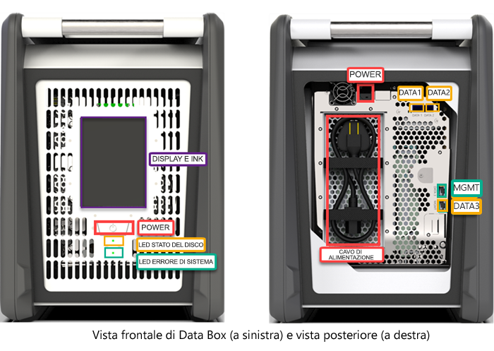
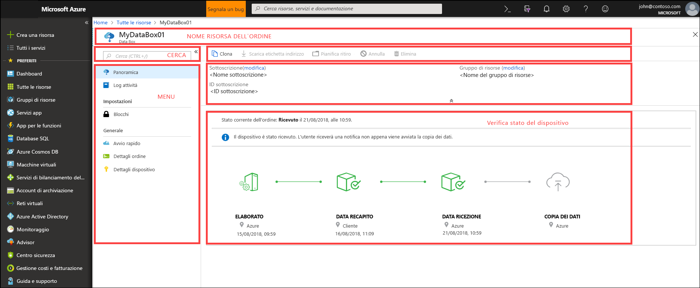
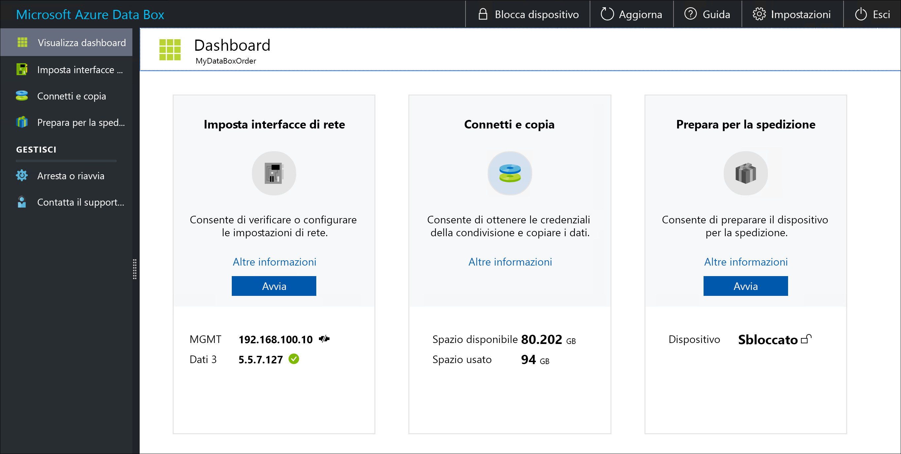

# Che cos'è Azure Data Box?

La soluzione cloud Microsoft Azure Data Box consente di inviare terabyte di dati ad Azure in modo rapido, economico e affidabile. Il trasferimento sicuro dei dati viene accelerato con la spedizione all'utente di un dispositivo di archiviazione Data Box. Ogni dispositivo di archiviazione ha una capacità di archiviazione massima utilizzabile di 80 TB e viene consegnato al data center dell'utente tramite un corriere locale. Il dispositivo è imballato in una scatola rigida per proteggere i dati durante il trasporto.

È possibile ordinare il dispositivo Data Box tramite il portale di Azure. Dopo avere ricevuto il dispositivo, lo si può configurare rapidamente usando l'interfaccia utente Web locale. Copiare i dati dai server in uso nel dispositivo e rispedire il dispositivo ad Azure. Nel data center di Azure i dati vengono caricati automaticamente dal dispositivo in Azure. L'intero processo viene monitorato per tutta la durata dal servizio Data Box nel portale di Azure.

## Casi d'uso

Data Box è ideale per trasferire dati con dimensioni superiori a 40 TB in scenari con connettività di rete limitata o assente. Lo spostamento dei dati può avvenire una tantum, periodicamente o può essere un trasferimento di dati in blocco iniziale seguito da trasferimenti periodici. Ecco i vari scenari in cui è possibile usare Data Box per il trasferimento dei dati.

 - **Migrazione una tantum**: quando si spostano grandi quantità di dati locali in Azure. 
     - Spostamento di una libreria multimediale da nastri offline in Azure per creare una libreria multimediale online.
     - Migrazione della farm della VM, di SQL Server e di applicazioni ad Azure
     - Spostamento dei dati cronologici in Azure per un'analisi approfondita e la generazione di report tramite HDInsight

 - **Trasferimento in blocco iniziale**: quando si esegue un trasferimento in blocco iniziale usando Data Box (valore di inizializzazione) seguito da trasferimenti incrementali sulla rete. 
     - Vengono ad esempio usati partner di soluzioni di backup, come Commvault e Data Box Heavy, per spostare il backup cronologico iniziale di grandi dimensioni in Azure. Al termine, i dati incrementali verranno trasferiti tramite la rete nella risorsa di archiviazione di Azure.

- **Caricamenti periodici**: quando vengono generate periodicamente grandi quantità di dati che devono essere spostate in Azure. Ad esempio nella prospezione di fonti energetiche, in cui viene generato contenuto video negli impianti di trivellazione e nelle installazioni di turbine a vento.      

## Vantaggi

Data Box è progettato per spostare in Azure grandi quantità di dati senza alcun impatto sulla rete. La soluzione offre i vantaggi seguenti:

- **Velocità**: Data Box usa interfacce di rete da 1 Gbps o 10 Gbps per spostare fino a 80 TB di dati in Azure.

- **Sicurezza**: Data Box è dotato di protezioni di sicurezza integrate per il dispositivo, i dati e il servizio.
    - Il dispositivo è imballato in una scatola rigida assicurata con viti e adesivi antimanomissione. 
    - I dati sul dispositivo sono sempre protetti con crittografia AES a 256 bit.
    - Il dispositivo può essere sbloccato solo con una password disponibile nel portale di Azure.
    - Il servizio è protetto dalle funzioni di sicurezza di Azure.
    - Dopo che i dati sono stati caricati in Azure, i dischi sul dispositivo verranno cancellati, in conformità con gli standard NIST 800-88r1.
    
    Per altre informazioni, vedere [Azure Data Box security and data protection](data-box-security.md) (Sicurezza e protezione dei dati in Azure Data Box).

## Funzionalità e specifiche

In questa versione il dispositivo Data Box include le funzionalità seguenti.

| Specifiche                                          | DESCRIZIONE              |
|---------------------------------------------------------|--------------------------|
| Peso                                                  | < 22 kg (50 libbre)                |
| Dimensioni                                              | Dispositivo: Larghezza: 309,0 mm Altezza: 430,4 mm Profondità: 502,0 mm |            
| Spazio nel rack                                              | 7 U quando inserito nel rack sul proprio lato (non può essere montato su rack)|
| Cavi necessari                                         | 1 cavo di alimentazione (incluso)   2 cavi RJ-45   2 cavi X SFP + in rame Twinax|
| Capacità di archiviazione                                        | 100 TB   Capacità utilizzabile di 80 TB dopo la protezione RAID 5|
| Interfacce di rete                                      | 2 interfacce 1 GbE: MGMT, DATA 3.   MGMT: per la gestione, non configurabile dall'utente, usata per la configurazione iniziale   DATA3: per i dati, configurabile dall'utente e dinamica per impostazione predefinita   Le interfacce MGMT e DATA 3 possono lavorare anche come 10 GbE   2 interfacce 10 GbE: DATA 1, DATA 2   Entrambe sono per i dati, possono essere configurate come statiche o dinamiche (impostazione predefinita) |
| Supporti per il trasferimento dati                                     | RJ-45, SFP+ 10 GbE Ethernet in rame  |
| Sicurezza                                                | Scatola rigida con viti personalizzate antimanomissione   Adesivi antimanomissione posizionati nella parte inferiore del dispositivo|
| Velocità di trasferimento dei dati                                      | Fino a 80 TB in un giorno su interfaccia di rete 10 GbE        |
| Gestione                                              | Interfaccia utente Web locale: installazione e configurazione iniziali da eseguire una sola volta   Portale di Azure: gestione del dispositivo quotidiana        |

## Componenti di Data Box

Data Box include i componenti seguenti:

* **Dispositivo Data Box**: un dispositivo fisico che offre uno spazio di archiviazione principale, gestisce la comunicazione con l'archiviazione nel cloud e garantisce la sicurezza e la riservatezza di tutti i dati che sono archiviati nel dispositivo. Il dispositivo Data Box ha una capacità di archiviazione utilizzabile di 80 TB. 

    

    
* **Servizio Data Box**: un'estensione del portale di Azure che consente di gestire un dispositivo Data Box da un'interfaccia Web a cui è possibile accedere da diverse posizioni geografiche. Usare il servizio Data Box per eseguire le attività di amministrazione quotidiane del dispositivo Data Box. Le attività del servizio includono la creazione e la gestione degli ordini, la visualizzazione e la gestione degli avvisi e la gestione delle condivisioni.  

    

    Per altre informazioni, vedere l'articolo relativo all'[uso del servizio Data Box per gestire il dispositivo Data Box](data-box-portal-ui-admin.md).

* **Interfaccia utente Web locale**: un'interfaccia utente basata sul Web usata per configurare il dispositivo in modo che possa connettersi alla rete locale e quindi registrare il dispositivo con il servizio Data Box. Usare l'interfaccia utente Web locale anche per arrestare e riavviare il dispositivo Data Box, visualizzare i log di copia e contattare il supporto tecnico Microsoft per inviare una richiesta di servizio.

    

    Per informazioni sull'uso dell'interfaccia utente basata sul Web, vedere l'articolo relativo all'[uso dell'interfaccia utente basata sul Web per amministrare Data Box](data-box-portal-ui-admin.md).

## Il flusso di lavoro

Il flusso di lavoro tipico è costituito dai passaggi seguenti:

1. **Ordine**: creare un ordine nel portale di Azure, fornire informazioni sulla spedizione e l'account di archiviazione di Azure a cui i dati sono destinati. Se il dispositivo è disponibile, Azure lo prepara e lo spedisce con un ID di verifica della spedizione.

2. **Ricezione**: dopo avere ricevuto il dispositivo, collegare i cavi di alimentazione e di rete usando i cavi specificati. Accendere il dispositivo ed eseguire la connessione. Configurare la rete del dispositivo e montare le condivisioni nel computer host da cui si intende copiare i dati.

3. **Copia dei dati**: copiare i dati nelle condivisioni di Data Box.

4. **Reso**: preparare il dispositivo, spegnerlo e rispedirlo al data center di Azure.

5. **Caricamento**: i dati vengono copiati automaticamente dal dispositivo in Azure. I dischi del dispositivo vengono cancellati in modo sicuro secondo le linee guida del National Institute of Standards and Technology (NIST).

Durante questo processo si riceve una notifica tramite posta elettronica a ogni cambiamento di stato. Per informazioni dettagliate sul flusso, passare a [Deploy Data Box in Azure portal](data-box-deploy-ordered.md) (Distribuire Data Box nel portale di Azure).

## Aree di disponibilità

Data Box può trasferire i dati in base all'area in cui è distribuito il servizio, al paese in cui viene spedito il dispositivo e all'account di archiviazione di Azure di destinazione in cui verranno trasferiti i dati. 

- **Disponibilità del servizio**: per questa versione, il servizio Data Box è disponibile nelle aree seguenti:
    - Tutte le aree negli Stati Uniti: Stati Uniti centro-occidentali, Stati Uniti occidentali 2, Stati Uniti occidentali, Stati Uniti centro-meridionali, Stati Uniti centrali, Stati Uniti centro-settentrionali, Stati Uniti orientali e Stati Uniti orientali 2.
    - Unione europea: Europa occidentale ed Europa settentrionale.
    - Regno Unito: Regno Unito meridionale e Regno Unito occidentale.
    - Francia: Francia centrale e Francia meridionale.

- **Account di archiviazione di destinazione**: gli account che archiviano i dati sono disponibili in tutte le aree di Azure in cui è disponibile il servizio.  

## Passaggi successivi

- Vedere i [requisiti di sistema per Data Box](data-box-system-requirements.md).
- Comprendere i [limiti di Data Box](data-box-limits.md).
- Distribuire rapidamente [Azure Data Box](data-box-quickstart-portal.md) nel portale di Azure.

