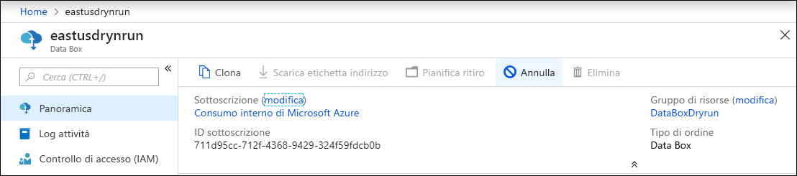
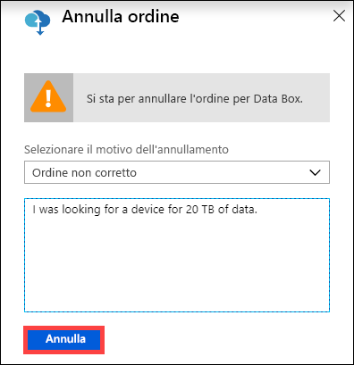
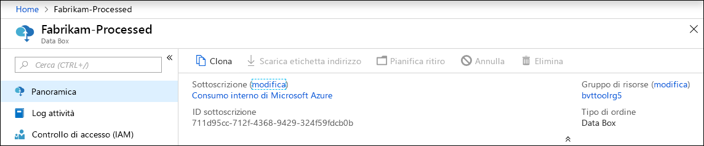
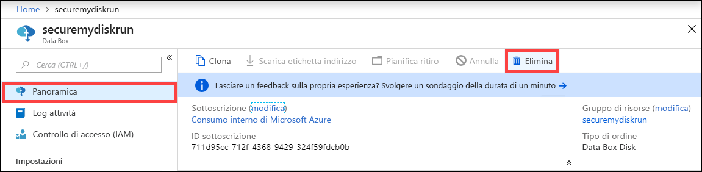
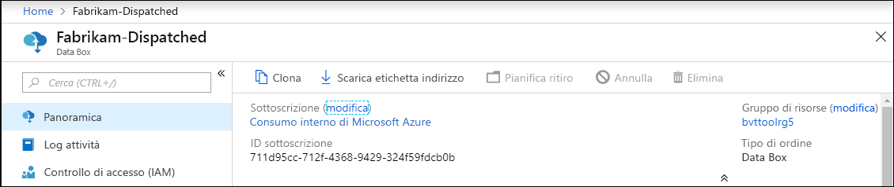
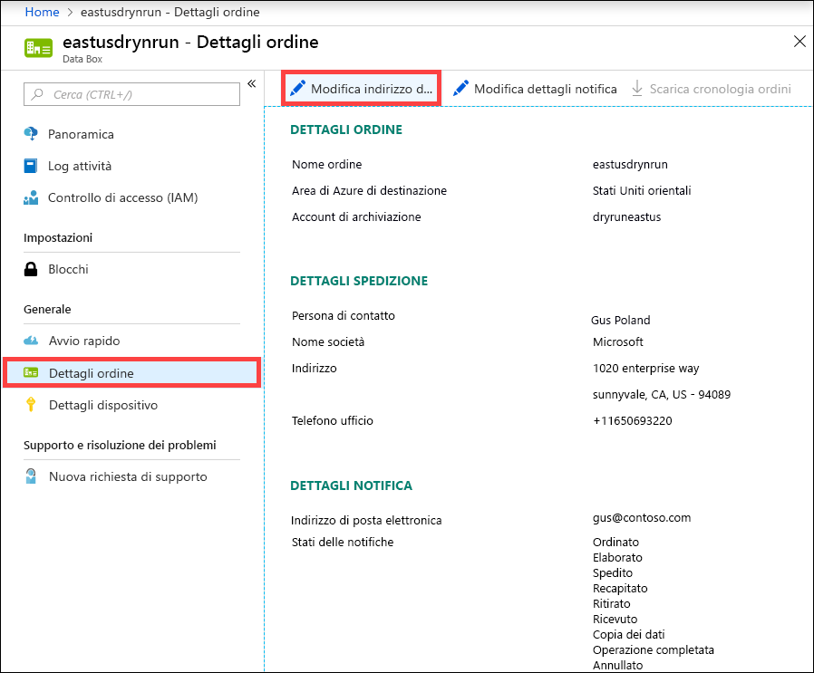
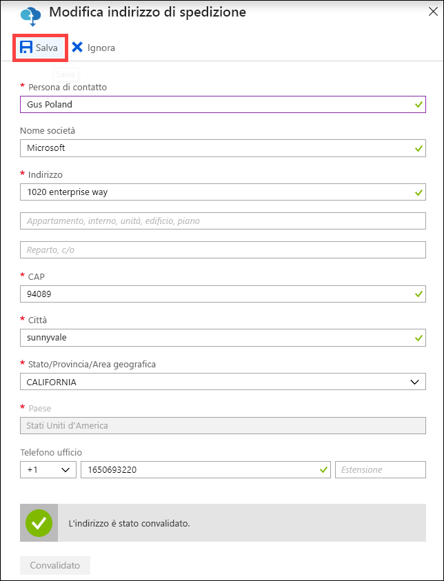
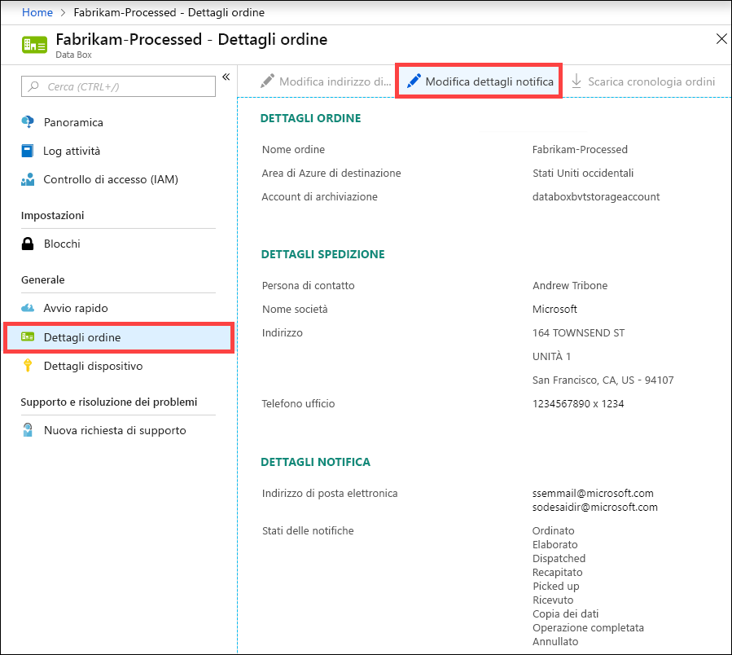
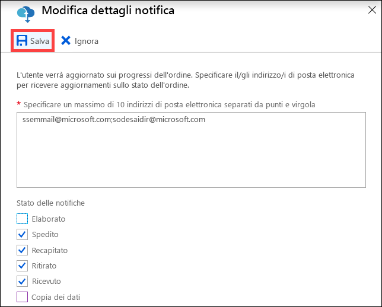

# Usare il portale di Azure per amministrare Data Box

Questo articolo illustra alcuni flussi di lavoro e attività di gestione complessi che è possibile eseguire in Data Box. È possibile gestire Data Box tramite il portale di Azure o l'interfaccia utente Web locale. 

Questo articolo è incentrato sulle attività che è possibile eseguire con il portale di Azure. Usare il portale di Azure per gestire gli ordini, gestire Data Box e monitorare lo stato dell'ordine man mano che procede verso il completamento.

## Annullare un ordine

Per vari motivi potrebbe essere necessario annullare un ordine effettuato. È possibile annullare l'ordine solo prima dell'elaborazione. Una volta che l'ordine è stato elaborato e che Data Box è stato preparato non è possibile annullare l'ordine. 

Seguire questa procedura per annullare un ordine.

1.  Passare a **Panoramica > Annulla**. 

    

2.  Immettere un motivo per l'annullamento dell'ordine.  

    

3.  Dopo l'annullamento dell'ordine il portale ne aggiorna lo stato e lo visualizza come **Annullato**. 

## Clonare un ordine

La clonazione è utile in determinate situazioni. Ad esempio, un utente ha usato Data Box per trasferire alcuni dati. Man mano che vengono generati altri dati, è necessario un altro Data Box per trasferire i dati in Azure. In questo caso è possibile semplicemente clonare lo stesso ordine.

Eseguire la procedura seguente per clonare un ordine.

1.  Passare a **Panoramica > Clona**. 

    

2.  Tutti i dettagli dell'ordine rimangono invariati. Il nome dell'ordine è quello dell'ordine originale con l'aggiunta di *-Clone*. Selezionare la casella di controllo per confermare di avere esaminato le informazioni sulla privacy. Fare clic su **Crea**.    

Il clone viene creato in pochi minuti e il portale viene aggiornato per mostrare il nuovo ordine.

## Eliminare un ordine

È possibile eliminare un ordine quando l'ordine è stato completato. L'ordine contiene informazioni personali, ad esempio nome e cognome, indirizzo e informazioni di contatto. Queste informazioni personali vengono eliminate quando l'ordine viene eliminato.

È possibile eliminare solo gli ordini completati o annullati. Eseguire la procedura seguente per eliminare un ordine.

1. Passare a **Tutte le risorse**. Cercare l'ordine.

2. Fare clic sull'ordine da eliminare e passare a **Panoramica**. Sulla barra dei comandi fare clic su **Elimina**.

    

3. Immettere il nome dell'ordine quando viene richiesto di confermare l'eliminazione dell'ordine. Fare clic su **Elimina**.

## Scaricare l'etichetta di spedizione

Potrebbe essere necessario scaricare l'etichetta indirizzo se la visualizzazione elettronica dell'etichetta del Data Box non funziona e non viene visualizzata l'etichetta indirizzo di restituzione. 

Eseguire la procedura seguente per scaricare un'etichetta di spedizione.
1.  Passare a **Panoramica > Scarica etichetta di spedizione**. Questa opzione è disponibile solo dopo la spedizione del dispositivo. 

    

2.  Questa azione scarica la seguente etichetta per la spedizione di ritorno. Salvare l'etichetta e stamparla. Piegare e inserire l'etichetta nella custodia trasparente sul dispositivo. Assicurarsi che l'etichetta sia visibile. Rimuovere tutti gli adesivi sul dispositivo relativi alla spedizione precedente.

    

## Modificare l'indirizzo di spedizione

Potrebbe essere necessario modificare l'indirizzo di spedizione dopo che è stato effettuato l'ordine. Questa opzione è disponibile solo fino alla spedizione del dispositivo. Dopo la spedizione del dispositivo, questa opzione non sarà più disponibile.

Eseguire la procedura seguente per modificare l'ordine.

1. Passare a **Dettagli ordine > Modifica indirizzo di spedizione**.

    

2. Modificare e convalidare l'indirizzo di spedizione e quindi salvare le modifiche.

    

## Modificare i dettagli della notifica

Potrebbe essere necessario cambiare gli utenti che riceveranno i messaggi di posta elettronica sullo stato dell'ordine. Ad esempio, un utente deve essere informato quando il dispositivo viene recapitato o ritirato. Potrebbe essere necessario informare un altro utente quando la copia dei dati è completa, in modo che possa verificare che i dati siano nell'account di archiviazione di Azure prima di eliminarli dall'origine. In questi casi è possibile modificare i dettagli di notifica.

Eseguire la procedura seguente per modificare i dettagli di notifica.

1. Passare a **Dettagli ordine > Modifica dettagli notifica**.

    

2. È possibile ora modificare i dettagli di notifica e quindi salvare le modifiche.
 
    

## Visualizzare lo stato dell'ordine

Quando viene modificato lo stato del dispositivo nel portale, si riceve una notifica tramite un messaggio di posta elettronica.

|Stato dell'ordine |DESCRIZIONE |
|---------|---------|
|Ordinato     | L'ordine è stato effettuato.  Se il dispositivo è disponibile, Microsoft identifica un dispositivo per la spedizione e ne prepara l'imballaggio.   Se il dispositivo non è immediatamente disponibile, l'ordine verrà elaborato quando il dispositivo risulterà nuovamente disponibile. L'ordine potrebbe richiedere da diversi giorni a due mesi per l'elaborazione. Se l'ordine non può essere soddisfatto entro 90 giorni, viene annullato e l'utente riceve una notifica.         |
|Elaborato     | L'elaborazione dell'ordine è stata completata. In base all'ordine, il dispositivo viene preparato per la spedizione nel data center.         |
|Spedito     | L'ordine è stato spedito. Usare l'ID di traccia visualizzato nell'ordine nel portale per tenere traccia della spedizione.        |
|Recapitato     | La spedizione è stata recapitata all'indirizzo specificato.        |
|Ritirato     |La spedizione di restituzione è stata prelevata e scansionata dal trasportatore.         |
|Ricevuto     | Il dispositivo viene ricevuto e scansionato nel data center di Azure.   Dopo il controllo della spedizione viene avviato il caricamento del dispositivo.      |
|Copia dati     | La copia dei dati è in corso. Tenere traccia dello stato della copia dell'ordine nel portale di Azure.   Attendere il completamento della copia dei dati. |
|Completed       |L'ordine è stato completato.  Verificare che i dati siano in Azure prima di eliminare i dati locali dai server.         |
|Operazione completata con errori| La copia dei dati è stata completata ma si sono verificati errori durante la copia.   Esaminare i log di copia usando il percorso specificato nel portale di Azure.   |
|Canceled            |L'ordine è stato annullato.   L'ordine è stato annullato o si è verificato un errore e il servizio ha annullato l'ordine. Se l'ordine non può essere soddisfatto entro 90 giorni, viene anche annullato e l'utente riceve una notifica.     |
|Eseguire la pulizia | I dati nei dischi del dispositivo vengono cancellati. La pulizia del dispositivo viene considerata completa quando il report sul log dell'ordine è disponibile nel portale di Azure.|

## Passaggi successivi

- Informazioni su come [risolvere i problemi relativi a Data Box](data-box-faq.md).
