# Usare il portale di Azure per amministrare Azure Data Box

Le esercitazioni in questo articolo si applicano a Microsoft Azure Data Box Disk in anteprima. Questo articolo illustra alcuni flussi di lavoro e attività di gestione complessi che è possibile eseguire in Data Box Disk. 

È possibile gestire Data Box Disk tramite il portale di Azure. Questo articolo è incentrato sulle attività che è possibile eseguire usando il portale di Azure. Usare il portale di Azure per gestire gli ordini, gestire i dischi e tenere traccia dello stato dell'ordine mano a mano che procede verso il completamento.

## Annullare un ordine

Per vari motivi potrebbe essere necessario annullare un ordine effettuato. È possibile annullare l'ordine solo prima dell'avvio della preparazione del disco. Non è possibile eseguire questa operazione dopo che i dischi sono stati preparati e l'ordine è stato elaborato. 

Seguire questa procedura per annullare un ordine.

1.  Passare a **Panoramica > Annulla**. 

    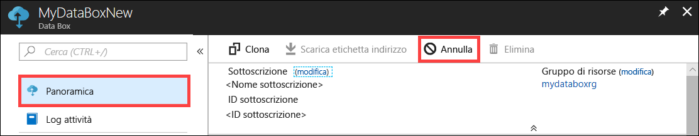

2.  Immettere un motivo per l'annullamento dell'ordine.  

    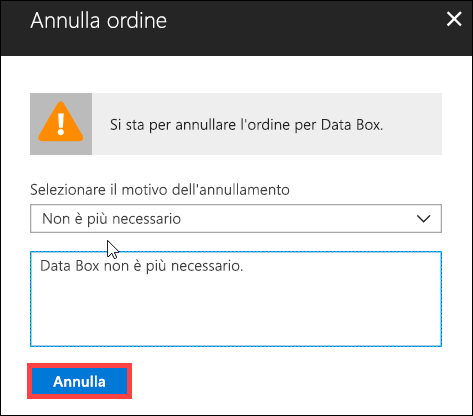

3.  Dopo l'annullamento dell'ordine il portale ne aggiorna lo stato e lo visualizza come **Annullato**.

    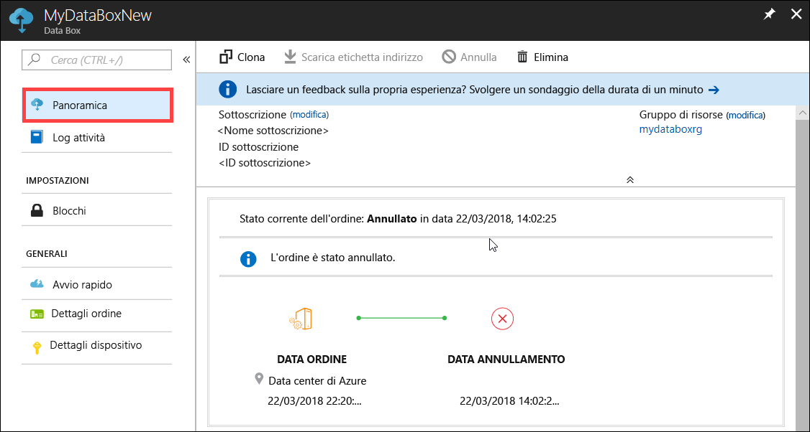

Non si riceve una notifica di posta elettronica quando l'ordine viene annullato.

## Clonare un ordine

La clonazione è utile in determinate situazioni. Ad esempio, un utente ha usato Data Box Disk per trasferire alcuni dati. Man mano che vengono generati altri dati, sono necessari più dischi per trasferire i dati in Azure. In questo caso è possibile semplicemente clonare lo stesso ordine.

Eseguire la procedura seguente per clonare un ordine.

1.  Passare a **Panoramica > Clona**. 

    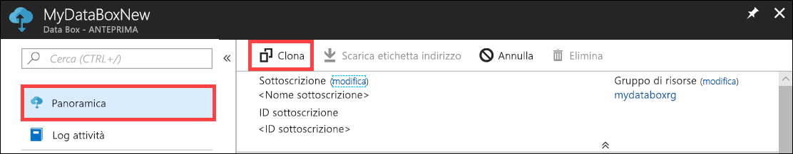

2.  Tutti i dettagli dell'ordine rimangono invariati. Il nome dell'ordine è quello dell'ordine originale con l'aggiunta di *-Clone*. Selezionare la casella di controllo per confermare di avere esaminato le informazioni sulla privacy. Fare clic su **Crea**.    

Il clone viene creato in pochi minuti e il portale viene aggiornato per mostrare il nuovo ordine.

[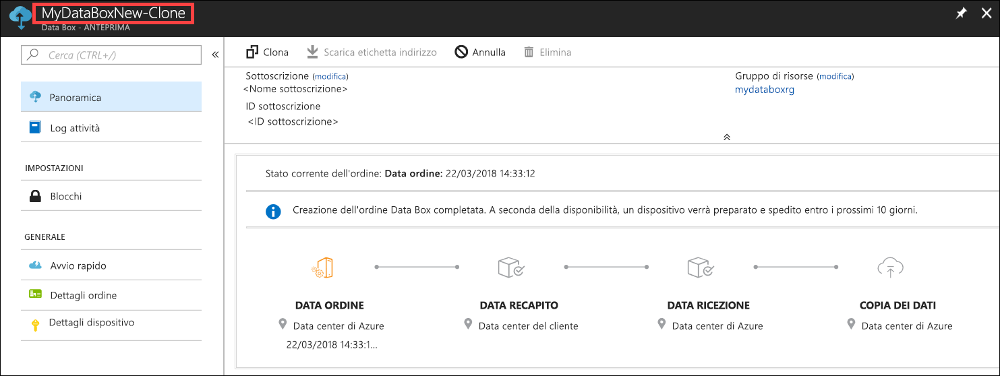](media/data-box-portal-ui-admin/clone-order3.png#lightbox) 

## Eliminare un ordine

È possibile eliminare un ordine quando l'ordine è stato completato. L'ordine contiene informazioni personali, ad esempio nome e cognome, indirizzo e informazioni di contatto. Queste informazioni personali vengono eliminate quando l'ordine viene eliminato.

È possibile eliminare solo gli ordini completati o annullati. Eseguire la procedura seguente per eliminare un ordine.

1. Passare a **Tutte le risorse**. Cercare l'ordine.

    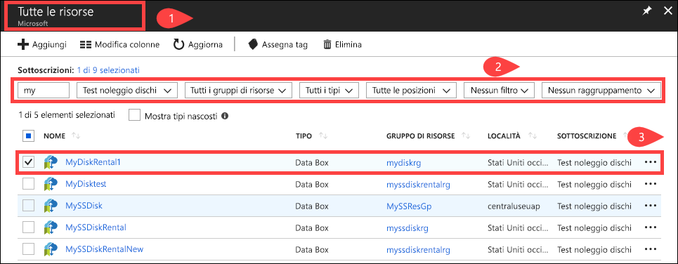

2. Fare clic sull'ordine da eliminare e passare a **Panoramica**. Sulla barra dei comandi fare clic su **Elimina**.

    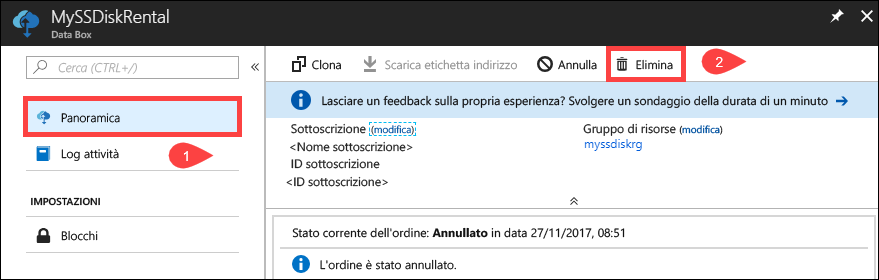

3. Immettere il nome dell'ordine quando viene richiesto di confermare l'eliminazione dell'ordine. Fare clic su **Elimina**.

     

## Scaricare l'etichetta di spedizione

Potrebbe essere necessario scaricare l'etichetta indirizzo se l'etichetta indirizzo di ritorno spedita con i dischi è stata smarrita o persa. 

Eseguire la procedura seguente per scaricare un'etichetta di spedizione.
1.  Passare a **Panoramica > Scarica etichetta di spedizione**. Questa opzione è disponibile solo dopo la spedizione del disco. 

    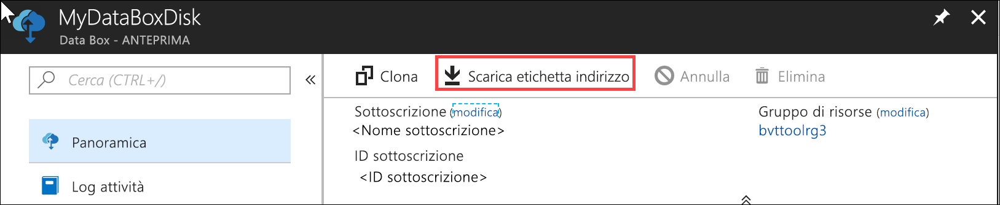

2.  Questa azione scarica la seguente etichetta per la spedizione di ritorno. Salvare l'etichetta, stamparla e apporla sulla spedizione di ritorno.

    

## Modificare l'indirizzo di spedizione

Potrebbe essere necessario modificare l'indirizzo di spedizione dopo che è stato effettuato l'ordine. Questa opzione è disponibile solo fino a quando non viene spedito il disco. Dopo che il disco è stato spedito, questa opzione non sarà più disponibile.

Eseguire la procedura seguente per modificare l'ordine.

1. Passare a **Dettagli ordine > Modifica indirizzo di spedizione**.

    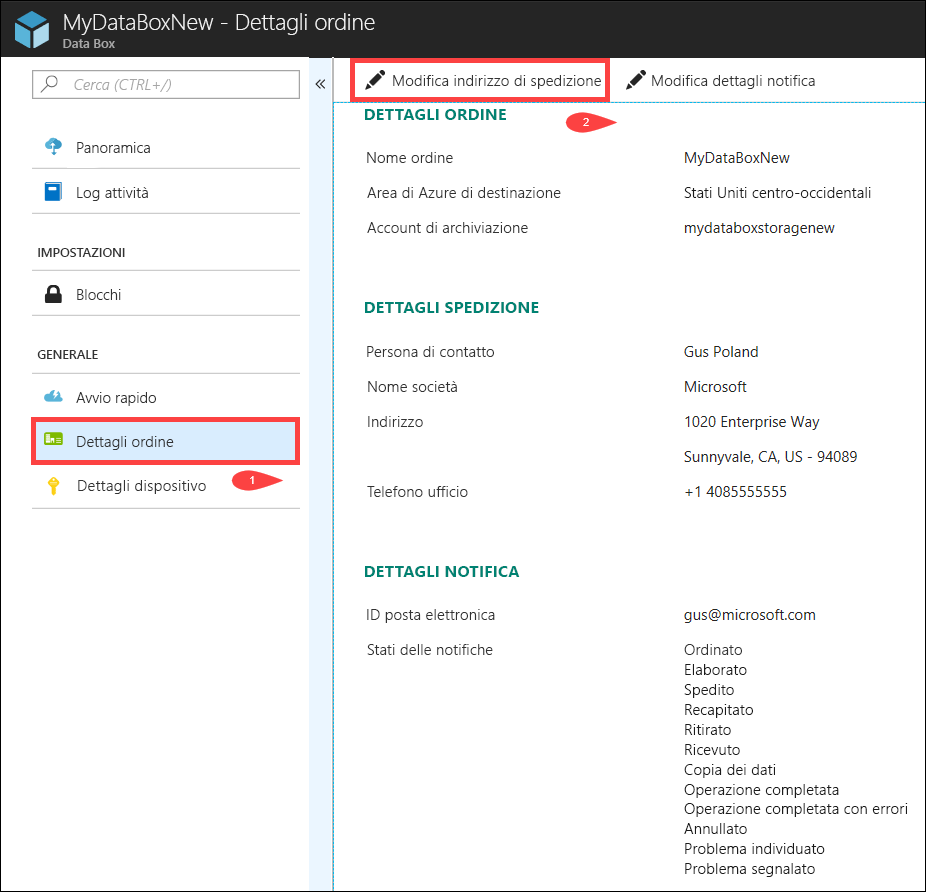

2. È ora possibile modificare l'indirizzo di spedizione e quindi salvare le modifiche.

    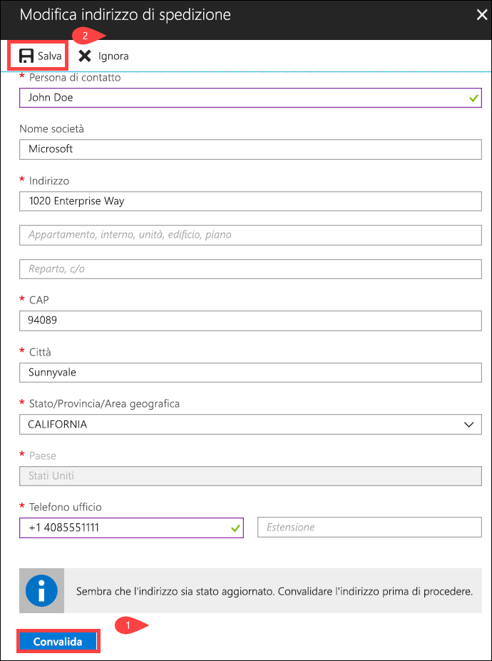

## Modificare i dettagli della notifica

Potrebbe essere necessario cambiare gli utenti che riceveranno i messaggi di posta elettronica sullo stato dell'ordine. Ad esempio, un utente deve essere informato quando il disco viene recapitato o ritirato. Potrebbe essere necessario informare un altro utente quando la copia dei dati è completata, in modo che possa verificare che i dati siano nell'account di archiviazione di Azure prima di eliminarli dall'origine. In questi casi è possibile modificare i dettagli di notifica.

Eseguire la procedura seguente per modificare i dettagli di notifica.

1. Passare a **Dettagli ordine > Modifica dettagli notifica**.

    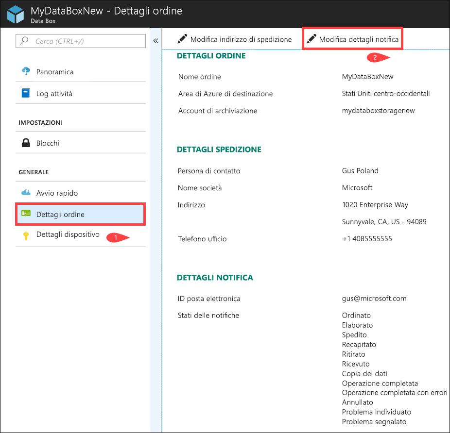

2. È possibile ora modificare i dettagli di notifica e quindi salvare le modifiche.
 
    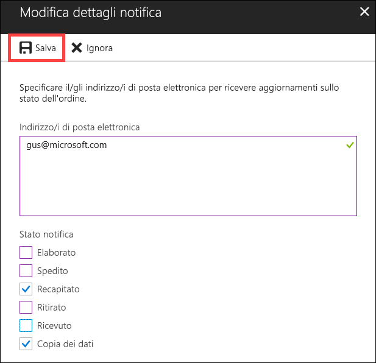

## Visualizzare lo stato dell'ordine

|Stato dell'ordine |DESCRIZIONE |
|---------|---------|
|Ordinato     | L'ordine è stato effettuato.   Se i dischi non sono disponibili, viene inviata una notifica.  Se i dischi sono disponibili, Microsoft identifica un disco per la spedizione e prepara l'imballaggio del disco.        |
|Elaborato     | L'elaborazione dell'ordine è stata completata.   Durante l'elaborazione dell'ordine si verificano le azioni seguenti:<li>I dischi vengono crittografati usando la crittografia BitLocker AES-128. </li> <li>Data Box Disk viene bloccato per impedire eventuali accessi non autorizzati.</li><li>Durante questo processo viene generata la passkey che sblocca i dischi.</li>        |
|Spedito     | L'ordine è stato spedito. Si dovrebbe ricevere l'ordine in 1-2 giorni.        |
|Recapitato     | L'ordine è stato recapitato all'indirizzo specificato.        |
|Ritirato     |La spedizione di ritorno è stata ritirata.   Dopo che la spedizione è stata ricevuta dal data center di Azure, i dati vengono caricati automaticamente in Azure.         |
|Ricevuto     | I dischi sono stati ricevuti nel data center di Azure. La copia dei dati inizierà a breve.        |
|Dati copiati     |La copia dei dati è in corso.  Attendere il completamento della copia dei dati.         |
|Completed       |L'ordine è stato completato.  Verificare che i dati siano in Azure prima di eliminare i dati locali dai server.         |
|Operazione completata con errori| La copia dei dati è stata completata ma si sono verificati errori.   Esaminare i log di copia usando il percorso specificato nella **Panoramica**. Per altre informazioni, passare a [Scaricare i log di diagnostica](data-box-disk-troubleshoot.md#download-diagnostic-logs).   |
|Canceled            |L'ordine è stato annullato.   L'ordine è stato annullato o si è verificato un errore e il servizio ha annullato l'ordine.     |

## Passaggi successivi

- Informazioni su come [risolvere i problemi relativi a Data Box Disk](data-box-disk-troubleshoot.md).
