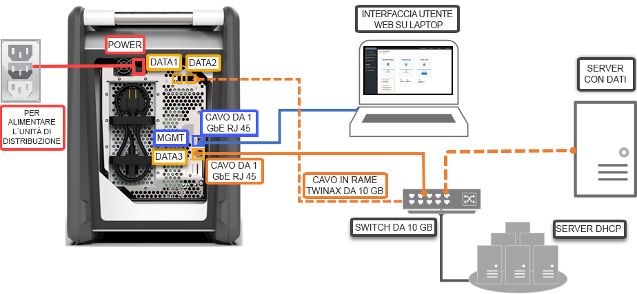

# Guida introduttiva: Distribuire Azure Data Box tramite il portale di Azure

Questa guida introduttiva descrive come distribuire Azure Data Box tramite il portale di Azure. I passaggi includono come cablare, configurare e copiare i dati in Data Box per il caricamento in Azure. La guida introduttiva viene eseguita nel portale di Azure e nell'interfaccia utente Web locale del dispositivo.

Per istruzioni dettagliate sulla distribuzione e sul monitoraggio, vedere [Tutorial: Order Azure Data Box](data-box-deploy-ordered.md) (Esercitazione: Ordinare Azure Data Box)

## Prerequisiti

Prima di iniziare:

- La sottoscrizione usata per il servizio Data Box sia di uno dei tipi seguenti:
    - Contratto Enterprise Microsoft. Altre informazioni sui [contratti Enterprise](https://azure.microsoft.com/pricing/enterprise-agreement/).
    - Cloud Solution Provider (CSP). Altre informazioni sul [programma Azure CSP](https://docs.microsoft.com/azure/cloud-solution-provider/overview/azure-csp-overview).
    - Con pagamento in base al consumo. Altre informazioni sulle [sottoscrizioni con pagamento in base al consumo](https://azure.microsoft.com/offers/ms-azr-0003p/) di Azure.
    - Microsoft Azure Sponsorship Altre informazioni sul [programma Azure Sponsorship](https://azure.microsoft.com/en-in/offers/ms-azr-0036p/). 

- Si abbia accesso alla sottoscrizione come proprietario o collaboratore per creare un ordine Data Box.
- Esaminare le [linee guida di sicurezza per Data Box](data-box-safety.md).
- Sia disponibile un computer host con i dati da copiare nel Data Box. Il computer host deve:
    - Eseguire un [sistema operativo supportato](data-box-system-requirements.md).
    - Essere connesso a una rete ad alta velocità. È consigliabile disporre di una connessione di almeno 10 GbE. In assenza di una connessione a questa velocità è possibile usare un collegamento dati a 1 GbE, ma la velocità dell'operazione di copia ne risentirà. 
- Si abbia accesso a una superficie piana su cui posizionare il Data Box. Per posizionare il dispositivo su uno scaffale standard, è necessario uno slot 7U nel rack del data center. È possibile posizionare il dispositivo in piano o in verticale nel rack.
- Si disponga dei cavi seguenti per collegare il Data Box al computer host.
    - Due cavi in rame SFP+ Twinax a 10 GbE (da usare con le interfacce di rete DATA 1, DATA 2)
    - Un cavo di rete RJ-45 CAT 6 (da usare con l'interfaccia di rete MGMT)
    - Un cavo di rete RJ-45 CAT 6A oppure RJ-45 CAT 6 (da usare con l'interfaccia di rete DATA 3 configurata rispettivamente come 10 Gbps o 1 Gbps)

## Accedere ad Azure

Accedere al portale di Azure all'indirizzo [http://portal.azure.com](http://portal.azure.com).

## Ordine

Questo passaggio richiede circa 5 minuti.

1. Creare una nuova risorsa Azure Data Box nel portale di Azure.
2. Selezionare una sottoscrizione esistente abilitata per questo servizio e scegliere **Importa** come tipo di trasferimento. Specificare il **paese di origine** in cui risiedono i dati e l'**area di destinazione di Azure** per il trasferimento dei dati.
3. Selezionare **Data Box**. La capacità massima utilizzabile è di 80 TB ed è possibile creare più ordini per dimensioni dei dati più grandi.
4. Immettere i dettagli dell'ordine e le informazioni per la spedizione. Se il servizio è disponibile nella propria area, specificare gli indirizzi di posta elettronica per le notifiche, controllare il riepilogo e quindi creare l'ordine.

Dopo aver creato l'ordine, il dispositivo verrà preparato per la spedizione.

## Cablare 

Questo passaggio richiede circa 10 minuti.

Quando si riceve il Data Box, procedere come segue per cablare e connettersi al dispositivo e per accenderlo. Questo passaggio richiede circa 10 minuti.

1. Qualora risulti che il dispositivo sia stato manomesso o danneggiato, non procedere. Contattare il supporto tecnico Microsoft per richiedere un dispositivo sostitutivo.
2. Prima di cablare il dispositivo, assicurarsi di avere i cavi seguenti:
    
    - Cavo di alimentazione a terra da 10 A o superiore (incluso) con un connettore IEC60320 C-13 a un'estremità per la connessione al dispositivo.
    - Un cavo di rete RJ-45 CAT 6 (da usare con interfaccia di rete MGMT)
    - Due cavi in rame SFP+ Twinax a 10 GbE (da usare con interfacce di rete DATA 1, DATA 2 a 10 Gbps)
    - Un cavo di rete RJ-45 CAT 6A o RJ-45 CAT 6 (da usare con l'interfaccia di rete DATA 3 configurata rispettivamente come 10 Gbps o 1 Gbps)

3. Rimuovere e posizionare il dispositivo su una superficie piana. 
    
4. Cablare il dispositivo come illustrato di seguito.  

      

    1. Collegare il cavo di alimentazione al dispositivo.
    2. Usare il cavo di rete RJ-45 CAT 6 per connettere il computer host alla porta di gestione sul dispositivo. 
    3. Usare il cavo di rame SFP+ Twinax per connettere almeno una interfaccia di rete a 10 Gbps (preferita rispetto a quella a 1 Gbps), DATA 1 o DATA 2 per i dati. 
    4. Accendere il dispositivo. Il pulsante di alimentazione è sul pannello anteriore del dispositivo.

## Connettere

Questa operazione richiede circa 5-7 minuti.

1. Per ottenere la password del dispositivo, passare a **Generale > Dettagli dispositivo** nel [portale di Azure](http://portal.azure.com).
2. Assegnare un indirizzo IP statico 192.168.100.5 e la subnet 255.255.255.0 alla scheda Ethernet nel computer usato per connettersi a Data Box. Accedere all'interfaccia utente Web locale del dispositivo all'indirizzo `https://192.168.100.10`. La connessione potrebbe richiedere fino a 5 minuti dopo l'accensione del dispositivo. 
3. Eseguire l'accesso usando la password dal portale di Azure. Viene visualizzato un errore in cui si indica che si è verificato un problema con il certificato di sicurezza del sito Web. Seguire le istruzioni specifiche del browser per passare alla pagina Web.
4. Per impostazione predefinita, le impostazioni di rete per l'interfaccia dati a 10 Gbps (o 1 Gbps) sono configurate come DHCP. Se necessario, è possibile configurare questa interfaccia come statica e specificare un indirizzo IP. 

## Copiare i dati

Il tempo per completare questa operazione dipende dalla dimensione dei dati e della velocità della rete.
 
1. Se si usa un host di Windows, usare uno strumento di copia file compatibile con SMB, ad esempio Robocopy. Per l'host NFS, usare il comando `cp` oppure `rsync` per copiare i dati. Connettere lo strumento al dispositivo e iniziare la copia dei dati nelle condivisioni. Per altre informazioni su come usare Robocopy per copiare i dati, visitare [Robocopy](https://technet.microsoft.com/library/ee851678.aspx).
2. Connettersi alle condivisioni usando il percorso: `\\<IP address of your device>\ShareName`. Per ottenere le credenziali di accesso alle condivisioni, passare alla pagina **Connetti e copia** nell'interfaccia utente Web locale di Data Box.
3. Accertarsi che i nomi delle condivisioni e delle cartelle e i dati seguano le linee guida descritte nei [limiti dei servizi Archiviazione di Azure e Data Box](data-box-limits.md).

## Spedire ad Azure 

Questa operazione richiede circa 10-15 minuti.

1. Passare alla pagina **Prepara per la spedizione** nell'interfaccia utente Web locale e avviare la preparazione della spedizione. 
2. Disattivare il dispositivo dall'interfaccia utente Web locale. Rimuovere i cavi dal dispositivo. 
3. L'etichetta indirizzo del reso deve essere visibile sullo schermo a inchiostro elettronico. Se l'etichetta non è visibile, scaricarla dal portale di Azure e inserirla nella busta trasparente applicata al dispositivo.
4. Chiudere la custodia e spedire a Microsoft. 

## Verificare i dati

Il tempo per completare questa operazione dipende dalla dimensione dei dati.

1. Quando il dispositivo Data Box viene connesso alla rete del data center di Azure, il caricamento dei dati in Azure si avvia automaticamente. 
2. Il servizio Azure Data Box invia notifica del completamento della copia dei dati tramite il portale di Azure. 

    1. Controllare i log degli errori per rilevare eventuali errori e intraprendere le azioni appropriate.
    2. Verificare la presenza dei dati negli account di archiviazione prima di eliminarli dall'origine.

## Pulire le risorse

Il completamento di questo passaggio richiede 2-3 minuti.

- È possibile annullare l'ordine di Data Box nel portale di Azure prima che venga elaborato. Dopo l'elaborazione, l'ordine non può essere annullato. L'ordine progredisce fino a raggiungere la fase di completamento. Per annullare l'ordine, passare a **Panoramica** e fare clic su **Annulla** dalla barra dei comandi.

- È possibile eliminare l'ordine quando lo stato risulta **Completato** oppure **Annullato** nel portale di Azure. Per eliminare l'ordine, passare a **Panoramica** e fare clic su **Elimina** dalla barra dei comandi.

## Passaggi successivi

In questa guida introduttiva è stato illustrato come distribuire Azure Data Box per facilitare l'importazione dei dati in Azure. Per altre informazioni sulla gestione di Azure Data Box, passare all'esercitazione seguente: 

> [!div class="nextstepaction"]
> [Use the Azure portal to administer Data Box](data-box-portal-admin.md) (Usare il portale di Azure per gestire Data Box)

