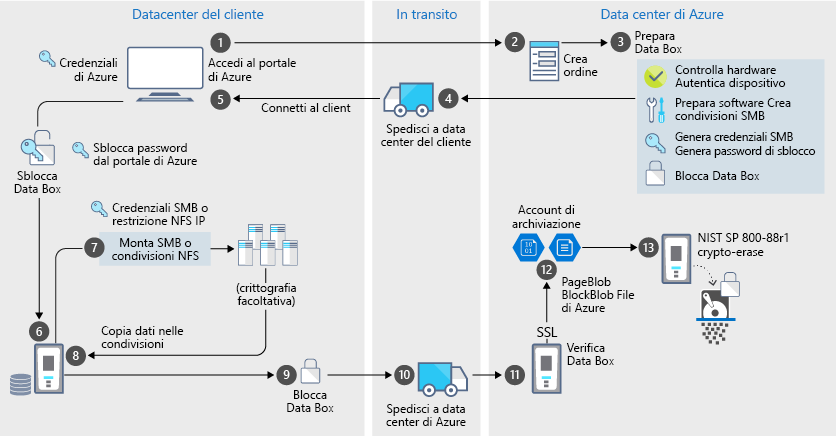

# Sicurezza e protezione dei dati di Azure Data Box

Data Box offre una soluzione sicura per la protezione dei dati, garantendo che solo le entità autorizzate possano visualizzare, modificare o eliminare i dati. Questo articolo descrive le funzionalità di sicurezza di Azure Data Box che consentono di proteggere ciascuno dei componenti della soluzione Data Box e i dati archiviati su di essi. 

[!INCLUDE [GDPR-related guidance](../../includes/gdpr-intro-sentence.md)]

## Flusso dei dati nei vari componenti

La soluzione Microsoft Azure Data Box è costituita da quattro componenti principali che interagiscono tra loro:

- **Servizio Azure Data Box ospitato in Azure**: il servizio di gestione usato per creare l'ordine del dispositivo, configurare il dispositivo e quindi monitorare l'ordine fino al completamento.
- **Dispositivo di Data Box**: il dispositivo di trasferimento spedito all'utente per l'importazione dei dati locali Azure. 
- **Client/host connessi al dispositivo**: i client nell'infrastruttura che si connettono al dispositivo Data Box tramite USB e che contengono i dati da proteggere.
- **Archiviazione cloud** – Posizione nel cloud di Azure in cui vengono archiviati i dati. In genere si tratta dell'account di archiviazione collegato alla risorsa di Azure Data Box creata.

Il diagramma seguente indica il flusso dei dati attraverso la soluzione Azure Data Box, dall'ambiente locale ad Azure.

Con il passaggio dei dati attraverso questa soluzione, vengono registrati eventi e vengono generati log. Per altre informazioni, vedere [Rilevamento e registrazione degli eventi per Azure Data Box](data-box-logs.md).

## Funzionalità di sicurezza

Data Box offre una soluzione sicura per la protezione dei dati, garantendo che solo le entità autorizzate possano visualizzare, modificare o eliminare i dati. Le funzionalità di sicurezza per questa soluzione riguardano sia i dischi che il servizio associato a garantire la sicurezza dei dati archiviati. 

### Protezione del dispositivo Data Box

Il dispositivo Data Box è protetto dalle funzionalità seguenti:

- Un involucro per dispositivi robusto che resiste a urti, trasporti difficili e condizioni ambientali. 
- Sigilli antimanomissione per indicare qualsiasi manomissione del dispositivo durante il transito.
- Rilevamento di manomissione dell'hardware e del software che impedisce altre operazioni del dispositivo.
- Esecuzione solo del software specifico di Data Box.
- Avvio in stato bloccato.
- Controllo dell'accesso al dispositivo mediante una password di sblocco del dispositivo.
- Credenziali di accesso per copiare dati da e nel dispositivo. Tutti gli accessi alla pagina **Credenziali dispositivo** nel portale di Azure vengono registrati nei [log attività](data-box-logs.md#query-activity-logs-during-setup).

### Protezione dei dati di Data Box

I dati in ingresso e in uscita da Data Box sono protetti dalle funzionalità seguenti:

- Crittografia AES a 256 bit dei dati inattivi.
- Per i dati in movimento è possibile usare i protocolli crittografati.
- Cancellazione sicura dei dati dal dispositivo dopo il completamento del caricamento dei dati in Azure. La cancellazione dei dati viene eseguita in conformità con gli standard NIST 800-88r1. L'evento di cancellazione dei dati viene registrato nella [cronologia ordini](data-box-logs.md#download-order-history).

### Protezione del servizio Data Box

Il servizio Data Box è protetto dalle funzionalità seguenti.

- Per l'accesso al servizio Data Box, l'organizzazione deve avere una sottoscrizione di Azure che include Data Box. La sottoscrizione determina le funzionalità a cui si può accedere nel portale di Azure.
- Dato che il servizio Data Box è ospitato in Azure, viene protetto dalle funzionalità di sicurezza di Azure. Per altre informazioni sulle funzionalità di sicurezza fornite da Microsoft Azure, andare in [Centro protezione Microsoft Azure](https://www.microsoft.com/TrustCenter/Security/default.aspx).
- L'accesso all'ordine di Data Box può essere controllato usando Controllo degli accessi in base al ruolo. Per altre informazioni, vedere [Impostare il controllo di accesso dell'ordine di Data Box](data-box-logs.md#set-up-access-control-on-the-order).
- La password di sblocco degli archivi del servizio Data Box usata per sbloccare il dispositivo nel servizio.
- Il servizio Data Box archivia i dettagli e lo stato dell'ordine nel servizio. Queste informazioni vengono eliminate quando l'ordine viene eliminato.

## Gestione dei dati personali

Azure Data Box raccoglie e visualizza informazioni personali nei principali casi seguenti nel servizio:

- **Impostazioni di notifica** - Quando si crea un ordine, si configura l'indirizzo di posta elettronica degli utenti nelle impostazioni di notifica. Queste informazioni possono essere visualizzate dell'amministratore. Queste informazioni vengono eliminate dal servizio quando il processo raggiunge lo stato terminale o quando si elimina l'ordine.

- **Dettagli dell'ordine** - Dopo aver creato l'ordine, l'indirizzo di spedizione, l'indirizzo di posta elettronica e le informazioni di contatto degli utenti vengono archiviate nel portale di Azure. Le informazioni salvate includono:

  - Nome del contatto
  - Numero di telefono
  - Email
  - Indirizzo
  - city
  - CAP
  - Stato
  - Paese/provincia/area geografica
  - Numero di account del vettore
  - Numero di tracciabilità della spedizione

    Al termine del processo o quando si elimina l'ordine, i dettagli dell'ordine vengono eliminati dal servizio Data Box.

- **Indirizzo di spedizione**: dopo l'inserimento dell'ordine, il servizio Data Box fornisce l'indirizzo di spedizione ai vettori di terze parti, ad esempio UPS o DHL. 

Per altre informazioni, consultare l'Informativa sulla privacy Microsoft nel [Centro protezione](https://www.microsoft.com/trustcenter).

## Riferimento delle linee guida sulla sicurezza

In Data Box sono implementate le seguenti linee guida sulla sicurezza: 

|Linee guida   |DESCRIZIONE   |
|---------|---------|
|[IEC 60529 IP52](https://www.iec.ch/)    | Per la protezione da acqua e polvere         |
|[ISTA 2A](https://ista.org/docs/2Aoverview.pdf)     | Per la resistenza a condizioni di trasporto avverse          |
|[NIST SP 800-147](https://nvlpubs.nist.gov/nistpubs/Legacy/SP/nistspecialpublication800-147.pdf)      | Per l'aggiornamento protetto del firmware         |
|[FIPS 140-2 livello 2](https://csrc.nist.gov/csrc/media/publications/fips/140/2/final/documents/fips1402.pdf)      | Per la protezione dei dati         |
|[NIST SP 800-88r1](https://nvlpubs.nist.gov/nistpubs/SpecialPublications/NIST.SP.800-88r1.pdf)      | Per la bonifica dei dati         |

## Passaggi successivi

- Rivedere i [requisiti per Data Box](data-box-system-requirements.md).
- Comprendere i [limiti di Data Box](data-box-limits.md).
- Distribuire rapidamente [Azure Data Box](data-box-quickstart-portal.md) nel portale di Azure.
