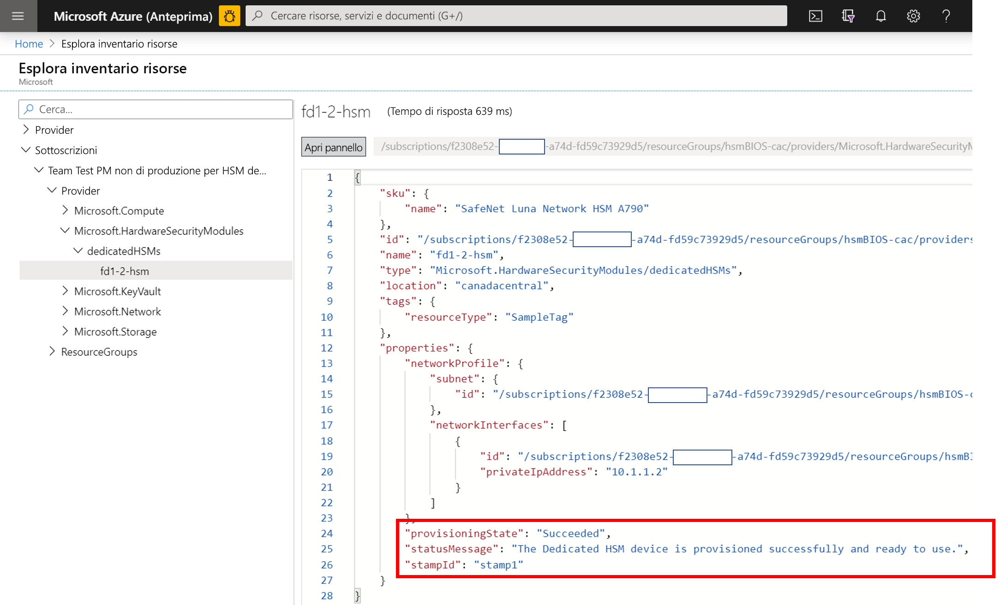
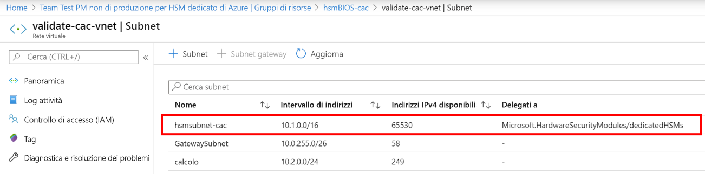
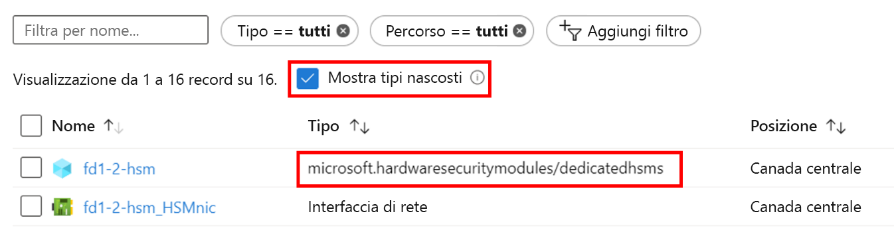

# <a name="troubleshooting-the-azure-dedicated-hsm-service"></a>Risoluzione dei problemi relativi al servizio HSM dedicato di Azure

Il servizio HSM dedicato di Azure prevede due aspetti distinti. In primo luogo, la registrazione e la distribuzione in Azure dei dispositivi HSM con i relativi componenti di rete sottostanti. In secondo luogo, la configurazione dei dispositivi HSM in preparazione per l'uso o l'integrazione con un carico di lavoro o un'applicazione specifica. Anche se i dispositivi HSM di Thales Luna Network in Azure sono gli stessi di quelli che si acquistano direttamente da Thales, il fatto che si tratti di una risorsa in Azure impone alcune considerazioni specifiche. Queste considerazioni e le risultanti informazioni dettagliate o procedura consigliata per la risoluzione dei problemi sono documentate in questo articolo per assicurare ampia visibilità e accesso a informazioni critiche. Quando il servizio è in uso, le informazioni definitive sono disponibili tramite richieste di supporto inviate direttamente a Microsoft o a Thales. 

> [!NOTE]
> Si noti che prima di eseguire qualsiasi configurazione in un dispositivo HSM appena distribuito, è consigliabile aggiornarlo con le patch pertinenti. Una patch necessaria specifica è [KB0019789](https://supportportal.gemalto.com/csm?id=kb_article_view&sys_kb_id=19a81c8bdb9a1fc8d298728dae96197d&sysparm_article=KB0019789), disponibile nel portale di supporto di Thales, che risolve un problema che si verifica quando il sistema non risponde più durante il riavvio.

## <a name="hsm-registration"></a>Registrazione di HSM

Il servizio HSM dedicato non è liberamente disponibile per l'uso, perché implica la distribuzione di risorse hardware nel cloud ed è quindi una risorsa importante che è necessario proteggere. Pertanto, è previsto un processo di inserimento nell'elenco elementi consentiti tramite posta elettronica usando l'indirizzo HSMrequest@microsoft.com. 

### <a name="getting-access-to-dedicated-hsm"></a>Ottenere l'accesso al servizio HSM dedicato

Se si ritiene che il servizio HSM dedicato soddisfi i propri requisiti di archiviazione delle chiavi, inviare un messaggio di posta elettronica a HSMrequest@microsoft.com per richiedere l'accesso. Descrivere l'applicazione, le aree in cui distribuire gli HSM e la quantità desiderata. Se si collabora con un rappresentante Microsoft, ad esempio un Account Executive o un Cloud Solution Architect, includere questa persona in qualsiasi richiesta.

## <a name="hsm-provisioning"></a>Provisioning di HSM

Il provisioning di dispositivi HSM in Azure può essere eseguito tramite l'interfaccia della riga di comando o PowerShell. Quando ci si registra al servizio, si riceverà un modello di Resource Manager di esempio, oltre all'assistenza necessaria per la personalizzazione iniziale. 

### <a name="hsm-deployment-failure-information"></a>Informazioni sugli errori di distribuzione di HSM

Il servizio HSM dedicato supporta l'interfaccia della riga di comando e PowerShell per la distribuzione, quindi le informazioni sugli errori basate sul portale sono limitate e non dettagliate. È possibile trovare informazioni più accurate tramite Esplora risorse. La home page del portale include un'apposita icona e sono disponibili informazioni più dettagliate. Queste informazioni risultano particolarmente utili se vengono incollate nelle richieste di supporto correlate a problemi di distribuzione.



### <a name="hsm-subnet-delegation"></a>Delega per la subnet di HSM
Nella maggior parte dei casi, gli errori di distribuzione si verificano perché non viene impostata la delega appropriata per la subnet definita dal cliente in cui verrà effettuato il provisioning degli HSM. L'impostazione di tale delega rientra nei prerequisiti della rete virtuale e della subnet per la distribuzione. Altre informazioni sono disponibili nelle esercitazioni.



### <a name="hsm-deployment-race-condition"></a>Race condition della distribuzione di HSM

Il modello di Resource Manager standard fornito per la distribuzione include risorse correlate di HSM e del gateway ExpressRoute. Le risorse di rete sono una dipendenza per la corretta distribuzione di HSM e la tempistica può essere cruciale.  Occasionalmente, sono stati osservati errori correlati a problemi di dipendenza, che spesso possono essere risolti eseguendo di nuovo la distribuzione. In caso contrario, in genere è sufficiente eliminare le risorse e quindi ripetere la distribuzione. Se dopo questi tentativi il problema persiste, generare una richieste di supporto nel portale di Azure segnalando problemi di configurazione dell'installazione di Azure.

### <a name="hsm-deployment-using-terraform"></a>Distribuzione di HSM tramite Terraform

Alcuni clienti hanno usato Terraform come ambiente di automazione invece dei modelli di Resource Manager forniti durante la registrazione a questo servizio. Gli HSM non possono essere distribuiti in questo modo, a differenza delle risorse di rete dipendenti. Terraform include un modulo per chiamare un modello di Resource Manager minimo che esegue solo la distribuzione di HSM.  In questa situazione è necessario prestare attenzione per assicurarsi che le risorse di rete, ad esempio il gateway ExpressRoute necessario, vengano completamente distribuite prima di distribuire gli HSM. Il comando seguente dell'interfaccia della riga di comando può essere usato per verificare se la distribuzione e l'integrazione sono state completate come previsto. Sostituire i segnaposto tra parentesi uncinate con i nomi specifici. Il risultato previsto è che provisioningState risulta "Succeeded"

```azurecli
az resource show --ids /subscriptions/<subid>/resourceGroups/<myresourcegroup>/providers/Microsoft.Network/virtualNetworkGateways/<myergateway>
```

### <a name="deployment-failure-based-on-quota"></a>Errore di distribuzione in base alla quota
Le distribuzioni possono non riuscire se si superano 2 HSM per stamp e 4 per area. Per evitare questa situazione, assicurarsi di aver eliminato le risorse delle distribuzioni precedentemente non riuscite prima di eseguire di nuovo la distribuzione. Per verificare le risorse, vedere la sezione "Come vengono visualizzati gli HSM" di seguito. Se si ritiene che sia necessario superare questa quota, che viene definita essenzialmente come salvaguardia, inviare un messaggio di posta elettronica a HSMrequest@microsoft.com con i dettagli.

### <a name="deployment-failure-based-on-capacity"></a>Errore di distribuzione in base alla capacità
Quando per uno specifico stamp o per un'area viene effettuato il provisioning di quasi tutti gli HSM disponibili, possono verificarsi errori di distribuzione. Per ogni stamp sono disponibili 11 HSM per i clienti, ovvero 22 per area, oltre a 3 dispositivi di riserva e uno di test. Se si ritiene di aver raggiunto un limite, inviare un messaggio di posta elettronica a HSMrequest@microsoft.com per informazioni sul livello di riempimento di stamp specifici.

###  <a name="how-do-i-see-hsms-when-provisioned"></a>Come vengono visualizzati gli HSM dopo il provisioning?
Dato che il servizio HSM dedicato è inserito nell'elenco elementi consentiti, nel portale di Azure viene considerato di tipo nascosto. Per visualizzare le risorse HSM, è necessario selezionare la casella di controllo "Mostra tipi nascosti" come illustrato di seguito. La risorsa scheda di interfaccia di rete segue sempre l'HSM e consente di trovare l'indirizzo IP dell'HSM prima di usare SSH per la connessione.



## <a name="networking-resources"></a>Risorse di rete

La distribuzione del servizio HSM dedicato presenta una dipendenza dalle risorse di rete e di conseguenza alcune limitazioni di cui tenere conto.

### <a name="provisioning-expressroute"></a>Provisioning di ExpressRoute

Il servizio HSM dedicato usa il gateway ExpressRoute come tunnel per la comunicazione tra lo spazio di indirizzi IP privati del cliente e l'HSM fisico disponibile in un data center di Azure.  Considerando che esiste una restrizione di un gateway per ogni rete virtuale, i clienti che richiedono la connessione alle loro risorse locali tramite ExpressRoute dovranno usare un'altra rete virtuale a questo scopo.  

### <a name="hsm-private-ip-address"></a>Indirizzo IP privato di HSM

I modelli di esempio forniti per il servizio HSM dedicato presuppongono che l'indirizzo IP dell'HSM verrà acquisito automaticamente da un intervallo di subnet specificato. È possibile specificare un indirizzo IP esplicito per l'HSM tramite un attributo "NetworkInterfaces" nel modello di Resource Manager. 


## <a name="hsm-initialization"></a>Inizializzazione di HSM

L'inizializzazione prepara un nuovo HSM per l'uso o uno esistente per il riutilizzo. L'inizializzazione dell'HSM deve essere completata prima di poter generare o archiviare oggetti, consentire ai client di connettersi o eseguire operazioni di crittografia.

### <a name="lost-credentials"></a>Credenziali perse

La perdita della password dell'amministratore della shell comporterà la perdita del materiale delle chiavi dell'HSM. È necessario effettuare una richiesta di supporto per reimpostare l'HSM.
Durante l'inizializzazione dell'HSM, archiviare le credenziali in modo sicuro. Le credenziali della shell e dell'HSM devono essere conservate in conformità ai criteri aziendali.

### <a name="failed-logins"></a>Accessi non riusciti

Se si specificano credenziali non corrette per gli HSM, possono verificarsi conseguenze distruttive. Di seguito sono riportati i comportamenti predefiniti per i ruoli HSM.

| Ruolo | Soglia (numero di tentativi) | Risultato di un numero eccessivo di tentativi di accesso non validi | Ripristino |
|--|--|--|--|
| HSM SO | 3 |  L'HSM viene azzerato (tutte le identità degli oggetti HSM e tutte le partizioni vanno perse)  |  L'HSM deve essere reinizializzato. I contenuti possono essere ripristinati dai backup. | 
| Partition SO | 10 |  La partizione viene azzerata. |  La partizione deve essere reinizializzata. I contenuti possono essere ripristinati da backup. |  
| Audit | 10 | Blocco | Lo sblocco avviene automaticamente dopo 10 minuti. |  
| Crypto Officer | 10 (riducibile) | Criterio HSM 15: l'opzione per abilitare la reimpostazione del PIN della partizione da parte del ruolo SO è impostata su 1 (abilitata), i ruoli CO e CU sono bloccati.<br>Criterio HSM 15: l'opzione per abilitare la reimpostazione del PIN della partizione da parte del ruolo SO è impostata su 0 (disabilitata), i ruoli CO e CU sono bloccati permanentemente e il contenuto della partizione non è più accessibile. Si tratta dell'impostazione predefinita. | Il ruolo CO deve essere sbloccato e le credenziali devono essere reimpostate dal ruolo Partition SO usando `role resetpw -name co`.<br>La partizione deve essere reinizializzata e il materiale delle chiavi deve essere ripristinato da un dispositivo di backup. |  

## <a name="hsm-configuration"></a>Configurazione di HSM 

Di seguito vengono descritte situazioni in cui gli errori di configurazione sono comuni o hanno un impatto da considerare:

### <a name="hsm-documentation-and-software"></a>Documentazione e software per HSM
Il software e la documentazione per i dispositivi HSM Thales SafeNet Luna 7 non sono disponibili presso Microsoft e devono essere scaricati direttamente da Thales. Per la registrazione è necessario usare l'ID cliente di Thales ricevuto durante il processo di registrazione. I dispositivi forniti da Microsoft hanno la versione del software 7.2 e la versione del firmware 7.0.3. All'inizio del 2020 Thales ha reso pubblica la documentazione, che è reperibile [qui](https://thalesdocs.com/gphsm/luna/7.2/docs/network/Content/Home_network.htm).  

### <a name="hsm-networking-configuration"></a>Configurazione di rete per HSM

Prestare attenzione quando si configura la rete all'interno dell'HSM.  L'HSM prevede una connessione diretta dallo spazio di indirizzi IP privati del cliente tramite gateway ExpressRoute.  Questo canale di comunicazione è riservato esclusivamente per la comunicazione dei clienti e non è accessibile per Microsoft. Se l'HSM configurato in modo tale da influire negativamente su questo percorso di rete, tutta la comunicazione con l'HSM viene rimossa.  In questa situazione, l'unica opzione disponibile consiste nel generare una richiesta di supporto tecnico Microsoft tramite il portale di Azure per chiedere la reimpostazione del dispositivo. Questa procedura di reimpostazione ripristina lo stato iniziale dell'HSM e tutta la configurazione e il materiale delle chiavi vanno persi.  La configurazione deve essere ricreata e, quando il dispositivo viene aggiunto al gruppo a disponibilità elevata, riceverà il materiale delle chiavi replicato.  

### <a name="hsm-device-reboot"></a>Riavvio dei dispositivi HSM

Per alcune modifiche di configurazione è necessario che il dispositivo HSM venga spento e riacceso o riavviato. I test svolti da Microsoft sul modulo di protezione hardware in Azure hanno rilevato che in alcuni casi il riavvio potrebbe smettere di rispondere. L'implicazione è che risulta necessario creare una richiesta di supporto nel portale di Azure chiedendo un riavvio a freddo, che potrebbe richiedere fino a 48 ore, considerando che si tratta di un processo manuale eseguito in un data center di Azure.  Per evitare questa situazione, assicurarsi di aver distribuito la patch di riavvio disponibile direttamente presso Thales. Per informazioni sulla patch consigliata per un problema che si verifica quando il sistema non risponde più durante il riavvio, vedere l'articolo [KB0019789](https://supportportal.gemalto.com/csm?sys_kb_id=d66911e2db4ffbc0d298728dae9619b0&id=kb_article_view&sysparm_rank=1&sysparm_tsqueryId=d568c35bdb9a4850d6b31f3b4b96199e&sysparm_article=KB0019789) nei download dell'HSM Thales Luna Network 7.2. Nota: per il download è necessario aver effettuato la registrazione nel portale di supporto di Thales.

### <a name="ntls-certificates-out-of-sync"></a>Certificati NTLS non sincronizzati
Un client potrebbe perdere la connettività a un HSM quando un certificato scade o è stato sovrascritto tramite aggiornamenti della configurazione. La configurazione client dello scambio di certificati dovrà essere riapplicata per ogni HSM.
Esempio di registrazione di NTLS con certificato non valido:

> NTLS[8508]: info : 0 : Incoming connection request... : 192.168.50.2/59415 NTLS[8508]: Error message from SSLAccept is : error:14094418:SSL routines:ssl3_read_bytes:tlsv1 alert unknown ca NTLS[8508]: Error during SSL accept ( RC_SSL_ERROR ) NTLS[8508]: info : 0xc0000711 : Fail to establish a secure channel with client : 192.168.50.2/59415 : RC_SSL_FAILED_HANDSHAKE NTLS[8508]: info : 0 : NTLS Client "Unknown host name" Connection instance removed : 192.168.50.2/59415

### <a name="failed-tcp-communication"></a>Comunicazione TCP non riuscita

Per la comunicazione tra l'installazione del client Luna e l'HSM, è necessaria almeno la porta TCP 1792. Considerare questo requisito se nell'ambiente vengono cambiate configurazioni di rete.

### <a name="failed-ha-group-member-doesnt-recover"></a>Mancato ripristino di un membro del gruppo a disponibilità elevata in errore

Se un membro del gruppo a disponibilità elevata in errore non viene ripristinato, è necessario ripristinarlo manualmente dal client Luna usando il comando hagroup recover.
Per abilitare il ripristino automatico, è necessario configurare un numero di tentativi per un gruppo a disponibilità elevata. Per impostazione predefinita, un gruppo a disponibilità elevata non proverà a ripristinare un membro al suo interno quando viene ripristinato.

### <a name="ha-group-doesnt-sync"></a>Il gruppo a disponibilità elevata non viene sincronizzato

Nel caso in cui le partizioni membro non abbiano lo stesso dominio di clonazione, il comando ha synchronize restituirà un messaggio analogo al seguente: Avviso: La sincronizzazione potrebbe non riuscire.  I membri nello slot 0 e nello slot 1 hanno impostazioni in conflitto per la clonazione della chiave privata.
È necessario aggiungere una nuova partizione con il dominio di clonazione corretto al gruppo a disponibilità elevata, quindi rimuovere la partizione configurata erroneamente.

## <a name="hsm-deprovisioning"></a>Deprovisioning di HSM 

Il deprovisioning di un HSM può essere effettuato solo quando è completamente terminato; a quel punto verrà reimpostato da Microsoft e riportato in un pool gratuito. 

### <a name="how-to-delete-an-hsm-resource"></a>Come eliminare una risorsa HSM

La risorsa di Azure per un HSM può essere eliminata solo quando il dispositivo è nello stato "azzerato".  Di conseguenza, prima di provare a eliminarlo come risorsa, è necessario aver eliminato tutto il materiale delle chiavi. Il modo più rapido per azzerarlo consiste nell'usare tre volte una password amministratore errata per l'HSM. Nota: non si tratta dell'amministratore dell'appliance ma dell'amministratore effettivo dell'HSM. La shell Luna prevede un comando `hsm -factoryreset` per l'azzeramento, ma può essere eseguito solo tramite console sulla porta seriale, a cui i clienti non hanno accesso.

## <a name="next-steps"></a>Passaggi successivi

Questo articolo ha fornito informazioni approfondite sugli aspetti del ciclo di vita della distribuzione di HSM in cui possono verificarsi problemi che richiedono la risoluzione o un'attenta valutazione. Questo articolo consente di evitare inutili ritardi e frustrazioni e, in caso di aggiunte o modifiche rilevanti, è possibile inviare una richiesta di supporto a Microsoft e segnalarle. 
