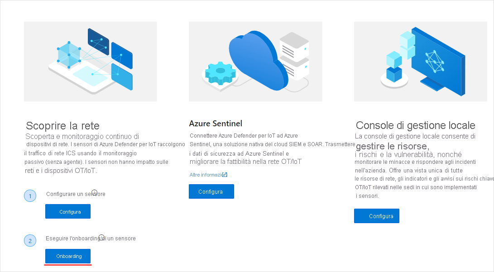
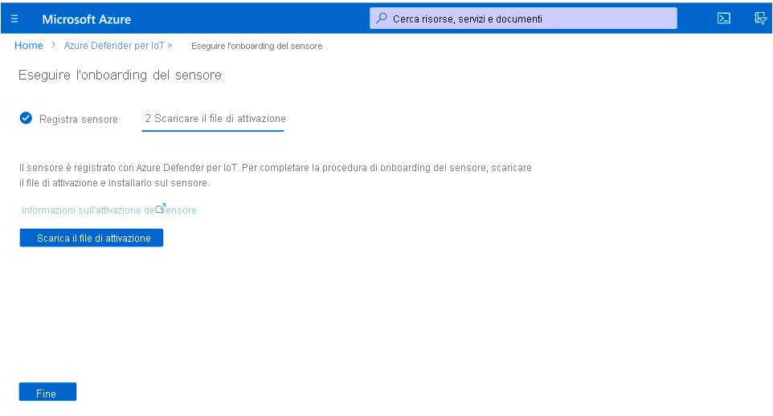
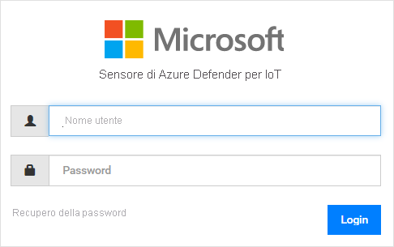
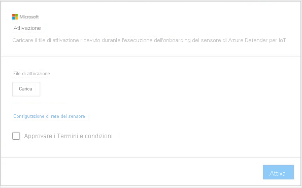
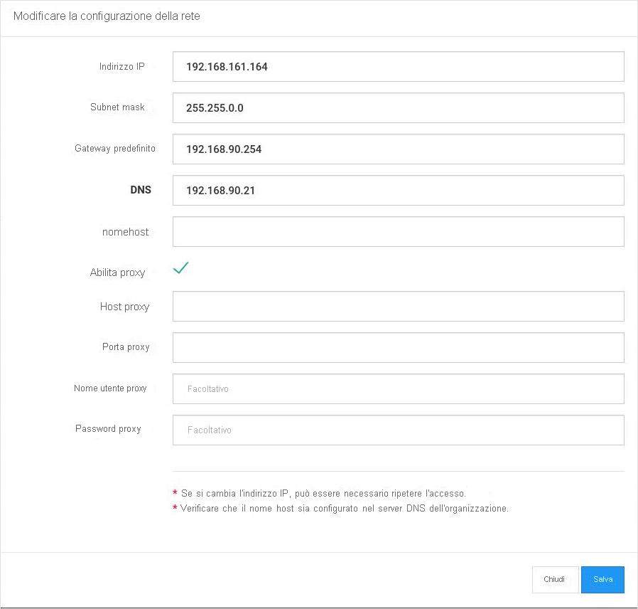

# Avvio rapido: Distribuire ed eseguire l'onboarding di un sensore

Questo articolo offre una panoramica del processo di distribuzione dei sensori. È necessario eseguire l'onboarding dei sensori nel portale di Azure Defender per IoT.

Questo processo richiede l'acquisizione di un sensore preconfigurato o di un'appliance sensore certificata, oltre all'installazione del software del sensore.

Se si usa un'appliance sensore certificata, è consigliabile consultare la [guida alle specifiche hardware di Azure Defender per IoT](https://aka.ms/AzureDefenderforIoTBareMetalAppliance) prima di iniziare.

> [!NOTE]
> Non è necessario eseguire l'onboarding della console di gestione locale di Azure Defender per IoT.

L'onboarding dei sensori consente di:

|||
|------ | ----------- |
| **Definire un nome per il sensore** | Assegnare un nome al sensore di cui eseguire l'onboarding e associarlo a un hub IoT o a una sottoscrizione.  Per altre informazioni, vedere **Eseguire l'onboarding dei sensori**.|
|**Scegliere una sottoscrizione e il numero di dispositivi impegnati**|Selezionare una sottoscrizione e il numero di dispositivi coperti dalla stessa. Immettere il numero in incrementi di 1000.|
| **Definire una modalità di gestione del sensore** | Definire dove verranno visualizzati gli asset, gli avvisi e altre informazioni rilevate dal sensore. Questa posizione viene determinata in base alla **modalità di gestione del sensore** definita.  **Modalità di gestione in locale**: le informazioni rilevate dal sensore vengono visualizzate nella relativa console. Le informazioni rilevate vengono inoltre condivise con la console di gestione locale, se è connessa al sensore.  **Modalità di gestione nel cloud**: le informazioni rilevate dal sensore vengono visualizzate nella relativa console. Inoltre, le informazioni sugli avvisi vengono distribuite tramite un hub IoT e possono essere condivise con altri servizi di Azure, ad esempio Azure Sentinel. Per altre informazioni, vedere **Eseguire l'onboarding dei sensori**. |
| **Acquisire un file di attivazione del sensore** | Per i sensori **gestiti in locale**, un file di attivazione viene usato per gestire i periodi di attivazione autorizzati del sensore.  Per i sensori **gestiti nel cloud**, un file di attivazione viene usato come connessione tra il sensore e un hub IoT. Per altre informazioni, vedere **Eseguire l'onboarding dei sensori**. |
| **Caricare un file di attivazione nel sensore** | I file di attivazione devono essere caricati nei sensori aziendali. Il monitoraggio di rete e l'accesso alle funzionalità della console dei sensori saranno disponibili solo quando verrà caricato il file di attivazione. Per altre informazioni, vedere **Caricare i file di attivazione dei sensori**. |
| **Aggiornare i parametri di rete del sensore prima dell'attivazione** | Aggiornare i parametri definiti durante l'installazione del sensore. Per altre informazioni, vedere **Caricare i file di attivazione dei sensori**.|

**Per distribuire un sensore:**

1. Passare ad Azure Defender per IoT dal portale di Azure.

2. Selezionare **Attività iniziali**.

3. Nella sezione **Discover your network** (Individua la rete) selezionare **Set up** (Configura).

   

4. Selezionare un'opzione per l'acquisizione di un sensore.

   

  - **Acquistare un sensore preconfigurato**: Microsoft e Arrow collaborano per fornire sensori preconfigurati. Per acquistare un sensore preconfigurato, contattare Arrow all'indirizzo <hardware.sales@arrow.com>. Il sensore verrà spedito alla propria sede. Viene installata la versione più recente.

  - **Usare la propria appliance (installazione ISO):** la soluzione viene eseguita su appliance certificate. Se si acquista l'appliance certificata, usare la [guida alle specifiche hardware di Azure Defender per IoT ](https://aka.ms/AzureDefenderforIoTBareMetalAppliance) come riferimento.

    - Scegliere una versione dal menu **Select version** (Seleziona versione).

    - Selezionare **Download** e salvare il file. Per informazioni sul download dell'immagine ISO e sull'installazione del software del sensore, vedere la **guida all'installazione di Azure Defender per IoT**.

5. Dopo aver installato il software nel sensore o aver ricevuto un sensore preconfigurato, eseguire le attività di configurazione della rete. Per informazioni dettagliate, vedere la [guida alla configurazione della rete](https://aka.ms/AzureDefenderForIoTNetworkSetup).

## Eseguire l'onboarding di un sensore

È necessario eseguire l'onboarding dei sensori nel portale di Azure Defender per IoT. L'onboarding viene eseguito in due fasi:

1. Registrare il sensore con il portale di Azure Defender per IoT.

2. Scaricare un file di attivazione per il sensore. Il file verrà poi caricato nel sensore.

**Per accedere alla pagina di onboarding:**

1. Passare alla pagina **Attività iniziali** di Microsoft Azure Defender per IoT.

2. Selezione **2) Onboard** in Azure Defender per IoT.

   

3. Viene visualizzata la pagina **Onboard sensor** (Onboarding del sensore). Questa pagina contiene le opzioni per registrare il sensore e scaricare il file di attivazione.

   

**Per registrare il sensore:**

1. Scegliere un nome per il sensore. Per i sensori gestiti nel cloud, il nome definito qui viene applicato al nome visualizzato nella console dei sensori. Questo nome non può essere cambiato nella console. Per i sensori gestiti in locale, il nome applicato qui verrà archiviato in Azure, ma può essere aggiornato nella console dei sensori. È consigliabile includere l'indirizzo IP del sensore installato come parte del nome o usare un nome facilmente identificabile. In questo modo ci si assicura una tracciabilità più semplice e una denominazione coerente tra il nome della registrazione nel portale di Azure Defender per IoT e l'indirizzo IP del sensore distribuito visualizzato nella console.

2. Selezionare una sottoscrizione nel menu a discesa corrispondente.
3. Nel campo **Committed devices** (Dispositivi impegnati) immettere il numero di dispositivi coperti dalla sottoscrizione. È necessario immettere nuovamente questo numero per ogni sensore di cui eseguire l'onboarding associato alla stessa sottoscrizione.  Se ad esempio la sottoscrizione "A" è associata a 6000 dispositivi, immettere 6000 per ogni sensore associato.   
4. Scegliere una modalità di gestione dei sensori usando l'interruttore **Cloud connect** (Connetti al cloud). Se l'interruttore è attivato, il sensore viene **gestito nel cloud**. Se l'interruttore è disattivato, il sensore viene **gestito in locale**.

| Modalità di gestione del sensore | Descrizione                                                |
| ---------------------- | ---------------------------------------------------------  |
| **Gestione nel cloud**          | Le informazioni rilevate dal sensore vengono visualizzate nella relativa console. Inoltre, le informazioni sugli avvisi vengono distribuite tramite un hub IoT e possono essere condivise con altri servizi di Azure, ad esempio Azure Sentinel.  Scegliere un hub IoT da associare a questo sensore.  Sarà necessario caricare nel sensore un file di attivazione per la gestione nel cloud.  Per i dettagli, vedere **Caricare i file di attivazione dei sensori**. |
| **Gestione in locale**        | Le informazioni rilevate dai sensori gestiti in locale vengono visualizzate nella relativa console. Se si lavora in una rete air-gapped e si vuole avere una visualizzazione unificata di tutte le informazioni rilevate da più sensori gestiti in locale, usare la console di gestione locale.  I sensori *gestiti in locale* sono associati a una sottoscrizione di Azure e contengono le istruzioni sul periodo di scadenza dell'attivazione.  Scegliere una sottoscrizione da associare al sensore.  Sarà necessario caricare in ogni sensore un file di attivazione per la gestione in locale. Per i dettagli, vedere **Caricare i file di attivazione dei sensori**. |

5. Selezionare **Registra**.

6. Nella pagina di download del file di attivazione, selezionare **Download activation file** (Scarica file di attivazione).

   

7. Salvare il file. Il formato del nome file è `<hub_name>_<sensor_name>`. Il nome del sensore fa riferimento al nome definito in precedenza.

8. Selezionare **Fine**.

9. Per completare il processo di onboarding del sensore, caricare il file dalla console di Azure Defender per IoT.
 
## Caricare un file di attivazione del sensore

Questo articolo descrive come caricare un file di attivazione nel sensore. Il file dovrebbe essere stato ricevuto durante l'onboarding del sensore.

**File di attivazione per la gestione in locale**

I sensori gestiti in locale sono associati a una sottoscrizione di Azure.  Il file di attivazione per i sensori gestiti in locale contiene una data di scadenza. Un mese prima di questa data, nella parte superiore della console dei sensori viene visualizzato un messaggio di avviso. L'avviso rimane visualizzato finché non si aggiorna il file di attivazione.

Dopo la scadenza del file di attivazione, è possibile continuare a usare le funzionalità di Azure Defender per IoT.

**File di attivazione per la gestione nel cloud**

I sensori gestiti nel cloud sono associati a un hub IoT di Azure. Per questi sensori non sono previsti limiti temporali per il file di attivazione. Il file di attivazione per i sensori gestiti nel cloud viene usato per garantire la connessione all'hub IoT.

Per i dettagli sugli hub IoT, vedere [Informazioni sull'hub IoT](../iot-hub/about-iot-hub.md).

**Per caricare il file di attivazione:**

1. Verificare di avere:

   - L'indirizzo IP del sensore, definito durante l'installazione

   - Le credenziali di accesso utente necessarie per il sensore

2. Accedere alla console di Azure Defender per IoT dal browser usando l'indirizzo IP del sensore.

3. Accedere alla console dei sensori di Azure Defender per IoT.

   

4. Una volta eseguito l'accesso, viene visualizzata la schermata di attivazione. Selezionare Upload (Carica) e scegliere il file di attivazione salvato.

   

5. Approvare i termini e le condizioni per l'utilizzo.

6. Selezionare **Attiva**. I parametri di configurazione di rete del sensore sono stati definiti durante l'installazione del software o quando è stato acquistato un sensore preconfigurato. Sono stati definiti i parametri seguenti:
   - Indirizzo IP
   - DNS  
   - Gateway predefinito
   - Subnet mask
   - Nome host
 
   È consigliabile aggiornare queste informazioni prima di attivare il sensore per i motivi seguenti:
   - È necessario cambiare i parametri preconfigurati definiti  
   - Si vogliono riconfigurare i parametri di rete dopo l'installazione. È anche possibile definire impostazioni proxy prima di attivare il sensore.

7. Selezionare **Sensor Network Configuration** (Configurazione di rete del sensore) nella finestra di dialogo di attivazione.  

   

8. Vengono visualizzati i parametri definiti durante l'installazione. È anche disponibile un'opzione per definire il proxy. Aggiornare le opzioni necessarie e selezionare **Salva**.
 
 
## Passaggi successivi

In questo articolo si è appreso come distribuire ed eseguire l'onboarding dei sensori. Per altre informazioni su come iniziare, vedere l'articolo seguente:

- [Introduzione](getting-started.md)
