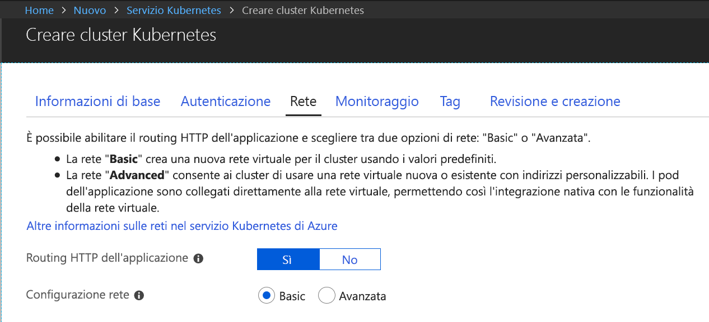
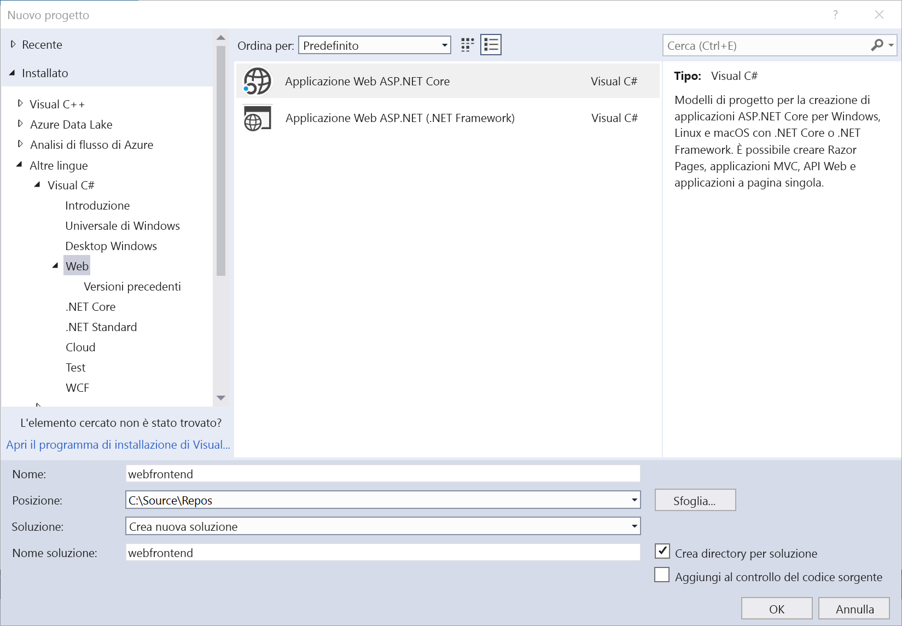
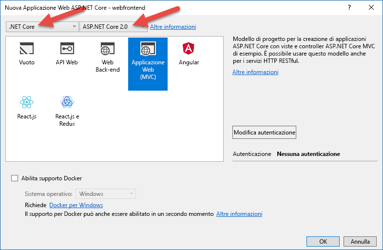
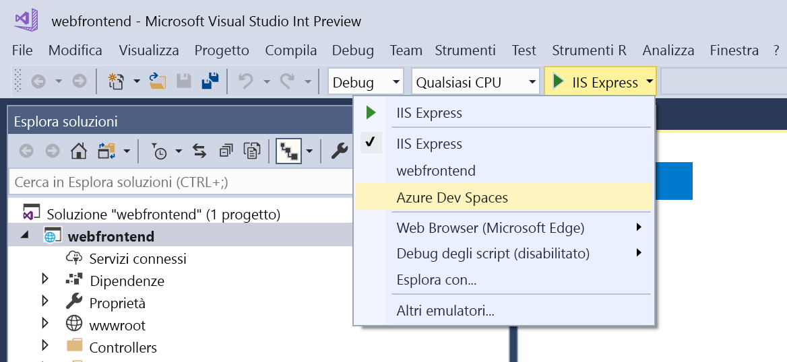
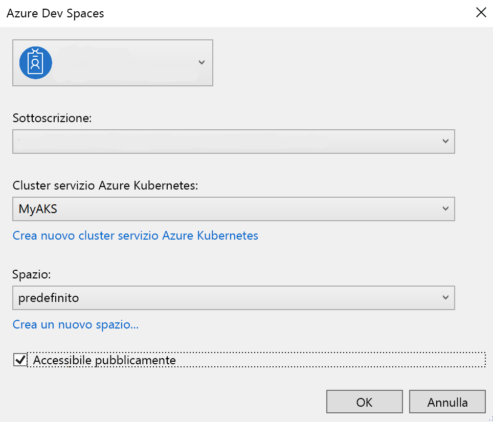
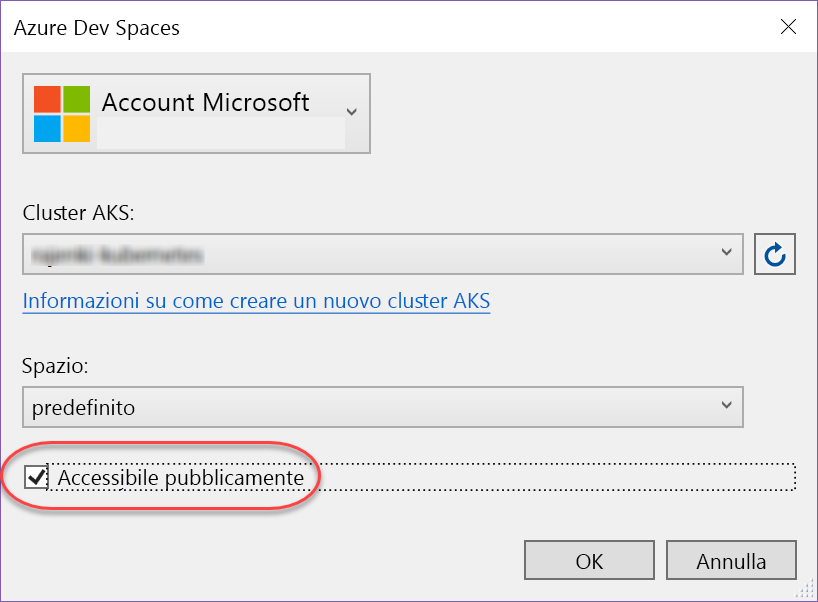
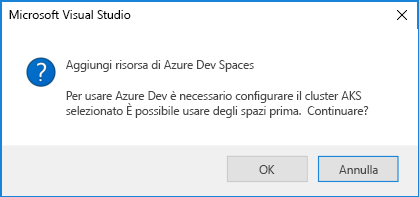
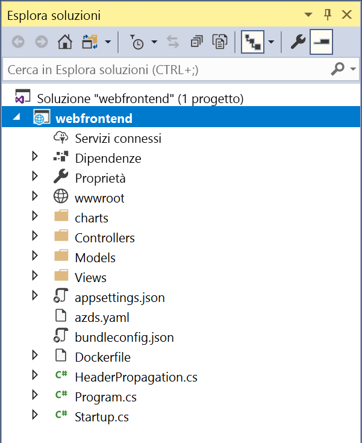

# Guida introduttiva ad Azure Dev Spaces con .NET Core e Visual Studio

In questa guida si apprenderà come:

- Configurare Azure Dev Spaces con un cluster Kubernetes gestito in Azure.
- Sviluppare codice in modo iterativo nei contenitori con Visual Studio.
- Sviluppare in modo indipendente due servizi distinti e utilizzare l'individuazione del servizio DNS di Kubernetes per effettuare una chiamata a un altro servizio.
- Sviluppare e testare il codice in modo produttivo in un ambiente di team.

> [!Note]
> **In caso di problemi** in qualsiasi momento, vedere la sezione [Risoluzione dei problemi](troubleshooting.md) o inserire un commento in questa pagina.

## Creare un cluster Kubernetes abilitato per Azure Dev Spaces

1. Accedere al portale di Azure all'indirizzo http://portal.azure.com.
1. Scegliere **Crea una risorsa** > cercare **Kubernetes** > selezionare **Kubernetes Service** > **Crea**.

   Completare i passaggi seguenti in ogni intestazione del modulo per la creazione di un cluster del servizio contenitore di Azure.

    - **PROJECT DETAILS** (DETTAGLI PROGETTO): selezionare una sottoscrizione di Azure e un gruppo di risorse di Azure nuovo o esistente.
    - **CLUSTER DETAILS** (DETTAGLI CLUSTER): immettere nome, area (attualmente è possibile scegliere Stati Uniti orientali, Stati Uniti centrali, Europa occidentale, Stati Uniti occidentali 2, Canada centrale o Canada orientale), versione e prefisso del nome DNS per il cluster nel servizio contenitore di Azure.
    - **SCALE** (SCALABILITÀ): selezionare le dimensioni della macchina virtuale per i nodi agente AKS e il numero di nodi. Se si sta iniziando a usare Azure Dev Spaces, un nodo è sufficiente per esplorare tutte le funzionalità. Il numero di nodi può essere modificato facilmente in qualsiasi momento dopo la distribuzione del cluster. Le dimensioni della macchina virtuale non possono essere modificate dopo la creazione del cluster AKS. Tuttavia, se è necessario aumentare le prestazioni, dopo la distribuzione del cluster AKS è possibile facilmente creare un nuovo cluster AKS con macchine virtuali di dimensioni maggiori e usare Dev Spaces per la ridistribuzione nel cluster più grande.

   Assicurarsi di scegliere Kubernetes versione 1.9.6 o versioni successive.

   

   Al termine, selezionare **Avanti: autenticazione**.

1. Scegliere l'impostazione desiderata per il controllo degli accessi in base al ruolo. Azure Dev Spaces supporta i cluster con il controllo degli accessi in base al ruolo abilitato o disabilitato.

    

1. Assicurarsi che il routing dell'applicazione Http sia abilitato.

   

    > [!Note]
    > Per abilitare il [Routing HTTP dell'applicazione](/azure/aks/http-application-routing) in un cluster esistente, usare il comando: `az aks enable-addons --resource-group myResourceGroup --name myAKSCluster --addons http_application_routing`

1. Al termine dell'operazione, selezionare **Review + create** (Esamina + crea) e quindi **Create** (Crea).

## Ottenere gli strumenti di Visual Studio
1. Installare l'ultima versione di [Visual Studio 2017](https://www.visualstudio.com/vs/)
1. Nel programma di installazione di Visual Studio assicurarsi che sia selezionato il carico di lavoro seguente:
    * Sviluppo Web e ASP.NET
1. Installare [Visual Studio Tools per Kubernetes](https://aka.ms/get-azds-visualstudio)

## Creare un'app Web in esecuzione in un contenitore

In questa sezione si creerà un'app Web ASP.NET Core e si eseguirà tale app in un contenitore in Kubernetes.

### Creare un'app Web ASP.NET

In Visual Studio 2017 creare un nuovo progetto. Attualmente deve trattarsi di un progetto **Applicazione Web ASP.NET Core**. Assegnare al progetto il nome "**webfrontend**".

Selezionare il modello **Applicazione Web (MVC)** e assicurarsi che nei due elenchi a discesa nella parte superiore della finestra di dialogo siano selezionati **.NET Core** e **ASP.NET Core 2.0**. Fare clic su **OK** per creare il progetto.

### Abilitare Dev Spaces per un cluster AKS

Con il progetto appena creato, selezionare **Azure Dev Spaces** nell'elenco a discesa delle impostazioni di avvio, come mostrato di seguito.

Nella finestra di dialogo che viene quindi visualizzata verificare di aver effettuato l'accesso con l'account appropriato e quindi selezionare un cluster Kubernetes esistente.

Per il momento, nell'elenco a discesa **Spazio** lasciare l'impostazione predefinita `default`. Questa opzione verrà approfondita in seguito. Selezionare la casella di controllo **Publicly Accessible** (Accessibile pubblicamente) affinché l'app Web sia accessibile tramite un endpoint pubblico. Questa impostazione non è obbligatoria, ma sarà utile per illustrare alcuni concetti più avanti in questa procedura dettagliata. In ogni caso sarà comunque possibile eseguire il debug del sito Web con Visual Studio.

Fare clic su **OK** per selezionare o creare il cluster.

Se si sceglie un cluster che non è stato abilitato per l'uso di Azure Dev Spaces, verrà visualizzato un messaggio che chiede se si vuole eseguire la configurazione.

Scegliere **OK**.

 Verrà avviata un'attività in background a tale scopo. Il completamento dell'attività richiederà alcuni minuti. Per verificare se è ancora in corso la creazione, passare il puntatore sull'icona **Attività in background** nell'angolo inferiore sinistro della barra di stato, come illustrato nell'immagine seguente.

> [!Note]
> Finché non viene completata la creazione dello spazio di sviluppo, non è possibile eseguire il debug dell'applicazione.

### Esaminare i file aggiunti al progetto
Mentre si attende che venga creato lo spazio di sviluppo, esaminare i file che sono stati aggiunti al progetto quando si è scelto di usare uno spazio di sviluppo.

Per prima cosa, è possibile osservare che è stata aggiunta una cartella denominata `charts` e che in tale cartella è stato eseguito lo scaffolding di un [chart Helm](https://docs.helm.sh) per l'applicazione. Questi file vengono usati per distribuire l'applicazione nello spazio di sviluppo.

Si noterà che è stato aggiunto un file denominato `Dockerfile`, che contiene le informazioni necessarie per creare un pacchetto dell'applicazione nel formato Docker standard.

Si noterà infine in file denominato `azds.yaml` che contiene la configurazione in fase di sviluppo necessaria per lo spazio di sviluppo.

## Eseguire il debug di un contenitore in Kubernetes
Al termine della creazione dello spazio di sviluppo, è possibile eseguire il debug dell'applicazione. Impostare un punto di interruzione nel codice, ad esempio alla riga 20 del file `HomeController.cs` in cui viene impostata la variabile `Message`. Premere **F5** per avviare il debug. 

Visual Studio comunicherà con lo spazio di sviluppo per compilare e distribuire l'applicazione e quindi aprire un browser con l'app Web in esecuzione. Potrebbe sembrare che il contenitore sia in esecuzione in locale, ma in realtà viene eseguito nello spazio di sviluppo in Azure. L'indirizzo localhost viene usato perché Azure Dev Spaces crea un tunnel SSH temporaneo per il contenitore in esecuzione in AKS.

Fare clic sul collegamento **About** nella parte superiore della pagina per attivare il punto di interruzione. Le informazioni di debug, come stack di chiamate, variabili locali, informazioni sulle eccezioni e così via, sono completamente accessibili come in caso di esecuzione del codice in locale.

## Sviluppare in modo iterativo il codice

Azure Dev Spaces consente non solo di eseguire codice in Kubernetes, ma anche di visualizzare in modo rapido e iterativo l'applicazione delle modifiche apportate al codice in un ambiente Kubernetes nel cloud.

### Aggiornare un file di contenuto
1. Individuare il file `./Views/Home/Index.cshtml` e apportare una modifica al codice HTML. Ad esempio, modificare la riga 70 contenente `<h2>Application uses</h2>` come segue: `<h2>Hello k8s in Azure!</h2>`
1. Salvare il file.
1. Passare al browser e aggiornare la pagina. Nella pagina Web verrà visualizzato il codice HTML aggiornato.

Che cosa è successo? Poiché le modifiche apportate ai file di contenuto, come HTML e CSS, non richiedono la ricompilazione in un'app Web .NET Core, una sessione F5 attiva sincronizza automaticamente tutti i file di contenuto modificati nel contenitore in esecuzione in AKS, permettendo di visualizzare le modifiche di contenuto immediatamente.

### Aggiornare un file di codice
L'aggiornamento di file di codice richiede alcune operazioni aggiuntive, perché un'app .NET Core deve essere ricompilata e deve generare i file binari dell'applicazione aggiornati.

1. Arrestare il debugger in Visual Studio.
1. Aprire il file di codice denominato `Controllers/HomeController.cs` e modificare il messaggio che verrà visualizzato nella pagina About: `ViewData["Message"] = "Your application description page.";`
1. Salvare il file.
1. Premere **F5** per avviare di nuovo il debug. 

Invece di ricompilare e ridistribuire una nuova immagine del contenitore ogni volta che vengono apportate modifiche al codice, operazione che spesso richiede una notevole quantità di tempo, Azure Dev Spaces ricompilerà in modo incrementale il codice nel contenitore esistente in modo da velocizzare il ciclo di modifica/debug.

Aggiornare l'app Web nel browser e passare alla pagina delle informazioni. Nell'interfaccia utente verrà visualizzato il messaggio personalizzato.

## Passaggi successivi

> [!div class="nextstepaction"]
> [Informazioni sui team di sviluppo](team-development-netcore-visualstudio.md)
