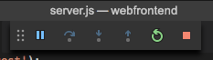

# <a name="get-started-on-azure-dev-spaces-with-nodejs"></a>Guida introduttiva ad Azure Dev Spaces con Node.js

In questa guida si apprenderà come:

- Creare un ambiente basato su Kubernetes in Azure ottimizzato per lo sviluppo, ovvero uno _spazio di sviluppo_.
- Sviluppare codice in modo iterativo nei contenitori con VS Code e la riga di comando.
- Sviluppare e testare il codice in modo produttivo in un ambiente di team.

> [!Note]
> **In caso di problemi** in qualsiasi momento, vedere la sezione [Risoluzione dei problemi](troubleshooting.md) o inserire un commento in questa pagina.

È ora possibile creare un ambiente di sviluppo basato su Kubernetes in Azure.

## <a name="install-the-azure-cli"></a>Installare l'interfaccia della riga di comando di Azure
Azure Dev Spaces richiede un'installazione minima nel computer locale. La maggior parte della configurazione dello spazio di sviluppo viene archiviata nel cloud ed è condivisibile con altri utenti. Il computer locale può eseguire Windows, Mac o Linux. Per Linux, sono supportate le distribuzioni seguenti: Ubuntu (18.04, 16.04 e 14.04), Debian 8 e 9, RHEL 7, Fedora 26+, CentOS 7, openSUSE 42.2 e SLES 12.

Per iniziare, scaricare ed eseguire l'[interfaccia della riga di comando di Azure](/cli/azure/install-azure-cli?view=azure-cli-latest). 

> [!IMPORTANT]
> Se l'interfaccia della riga di comando di Azure è già installata, assicurarsi di usare la versione 2.0.43 o una versione successiva.

### <a name="sign-in-to-azure-cli"></a>Accedere all'interfaccia della riga di comando di Azure
Accedere ad Azure. Digitare il comando seguente in una finestra del terminale:

```cmd
az login
```

> [!Note]
> Se non si ha una sottoscrizione di Azure, è possibile creare un [account gratuito](https://azure.microsoft.com/free).

#### <a name="if-you-have-multiple-azure-subscriptions"></a>Se sono disponibili più sottoscrizioni di Azure...
È possibile visualizzare le sottoscrizioni eseguendo: 

```cmd
az account list
```
Individuare la sottoscrizione con `isDefault: true` nell'output JSON.
Se non si tratta della sottoscrizione che si vuole usare, è possibile modificare la sottoscrizione predefinita:

```cmd
az account set --subscription <subscription ID>
```

## <a name="create-a-kubernetes-cluster-enabled-for-azure-dev-spaces"></a>Creare un cluster Kubernetes abilitato per Azure Dev Spaces

Al prompt dei comandi creare il gruppo di risorse in un'[area che supporti Azure Dev Spaces](https://docs.microsoft.com/azure/dev-spaces/#a-rapid,-iterative-kubernetes-development-experience-for-teams).

```cmd
az group create --name MyResourceGroup --location <region>
```

Usare il comando seguente per creare un cluster Kubernetes:

```cmd
az aks create -g MyResourceGroup -n MyAKS --location <region> --generate-ssh-keys
```

La creazione del cluster richiede alcuni minuti.

### <a name="configure-your-aks-cluster-to-use-azure-dev-spaces"></a>Configurare il cluster servizio Azure Kubernetes per l'uso di Azure Dev Spaces

Immettere il comando seguente dell'interfaccia della riga di comando di Azure, usando il gruppo di risorse contenente il cluster servizio Azure Kubernetes e il nome del cluster servizio Azure Kubernetes. Il comando configura il cluster con il supporto per gli spazi Azure Dev Spaces.

   ```cmd
   az aks use-dev-spaces -g MyResourceGroup -n MyAKS
   ```

> [!IMPORTANT]
> Il processo di configurazione di Azure Dev Spaces rimuoverà lo spazio dei nomi `azds` nel cluster, se presente.

## <a name="get-kubernetes-debugging-for-vs-code"></a>Ottenere funzionalità di debug Kubernetes per VS Code
Per gli sviluppatori di .NET Core e Node.js che usano VS Code sono disponibili funzionalità avanzate, come il debug Kubernetes.

1. Se [VS Code](https://code.visualstudio.com/Download) non è disponibile, installarlo.
1. Scaricare e installare l'[estensione Azure Dev Spaces di Visual Studio](https://marketplace.visualstudio.com/items?itemName=azuredevspaces.azds). Fare clic su Installa nella pagina del Marketplace dell'estensione e di nuovo in VS Code. 

## <a name="create-a-nodejs-container-in-kubernetes"></a>Creare un contenitore Node.js in Kubernetes

In questa sezione si creerà un'app Web Node.js e si eseguirà tale app in un contenitore in Kubernetes.

### <a name="create-a-nodejs-web-app"></a>Creare un'app Web Node.js
Scaricare il codice da GitHub passando a https://github.com/Azure/dev-spaces e selezionando **Clone or Download** (Clona o scarica) per scaricare il repository GitHub nell'ambiente locale. Il codice per questa guida è disponibile in `samples/nodejs/getting-started/webfrontend`.

## <a name="prepare-code-for-docker-and-kubernetes-development"></a>Preparare il codice per lo sviluppo in Docker e Kubernetes
Fino a questo punto, si ha un'app Web di base che è possibile eseguire in locale. Ora si tratta di racchiuderla in un contenitore mediante la creazione di asset che definiscono il contenitore dell'applicazione e la modalità con cui verrà distribuita a Kubernetes. Questa operazione è semplice da eseguire con Azure Dev Spaces: 

1. Avviare VS Code e aprire la cartella `webfrontend`. Le richieste, visualizzate per impostazione predefinita, di aggiungere risorse di debug o di ripristinare il progetto possono essere ignorate.
1. Aprire il terminale integrato di VS Code usando il menu **Visualizza > Terminale integrato**.
1. Eseguire questo comando assicurandosi che **webfrontend** sia la cartella corrente:

    ```cmd
    azds prep --public
    ```

Il comando `azds prep` dell'interfaccia della riga di comando di Azure genera gli asset Docker e Kubernetes con le impostazioni predefinite:
* `./Dockerfile` descrive l'immagine del contenitore dell'app e come il codice sorgente viene compilato ed eseguito all'interno del contenitore.
* Un [grafico Helm](https://docs.helm.sh) in `./charts/webfrontend` descrive come distribuire il contenitore a Kubernetes.

Per il momento non è necessario comprendere l'intero contenuto di questi file. Vale la pena sottolineare, tuttavia, che **gli stessi asset configuration-as-code Kubernetes e Docker possono essere utilizzati dallo sviluppo alla produzione, in modo da garantire una maggiore coerenza tra ambienti diversi.**
 
Dal comando `prep` viene generato anche un file denominato `./azds.yaml` ed è il file di configurazione per Azure Dev Spaces. Completa gli elementi Docker e Kubernetes con elementi di configurazione aggiuntivi che consentono di creare un'esperienza di sviluppo iterativo in Azure.

## <a name="build-and-run-code-in-kubernetes"></a>Compilare ed eseguire codice in Kubernetes
Eseguire il codice. Nella finestra del terminale, eseguire questo comando dalla **cartella radice del codice**, webfrontend:

```cmd
azds up
```

Monitorare l'output del comando; si noteranno varie cose importanti man mano che avanza:
- Il codice sorgente viene sincronizzato con lo spazio di sviluppo in Azure.
- Un'immagine del contenitore viene compilata in Azure, come specificato dagli asset di Docker nella cartella del codice.
- Vengono creati oggetti Kubernetes che usano l'immagine del contenitore come specificato dal grafico Helm nella cartella del codice.
- Vengono visualizzate informazioni sull'endpoint del contenitore. In questo caso, è previsto un URL HTTP pubblico.
- Presupponendo che le fasi precedenti siano state completate correttamente, si dovrebbe iniziare a visualizzare l'output `stdout` (e `stderr`) all'avvio del contenitore.

> [!Note]
> Questi passaggi richiederanno più tempo la prima volta che viene eseguito il comando `up`, ma le esecuzioni successive dovrebbero essere più rapide.

### <a name="test-the-web-app"></a>Testare l'app Web
Analizzare l'output della console per informazioni sull'URL pubblico che è stato creato con il comando `up`. Sarà nel formato: 

```
(pending registration) Service 'webfrontend' port 'http' will be available at <url>
Service 'webfrontend' port 80 (TCP) is available at 'http://localhost:<port>'
```

Aprire l'URL in una finestra del browser; si dovrebbe visualizzare il caricamento dell'applicazione Web. Durante l'esecuzione del contenitore, l'output `stdout` e `stderr` vengono trasmessi nella finestra del terminale.

> [!Note]
> Alla prima esecuzione, possono essere necessari alcuni minuti prima che il DNS pubblico sia pronto. Se l'URL pubblico non viene risolto, è possibile usare l'URL alternativo `http://localhost:<portnumber>` visualizzato nell'output della console. Se si usa l'URL localhost, potrebbe sembrare che il contenitore sia in esecuzione in locale, ma in realtà viene eseguito in servizio Azure Kubernetes. Per motivi di praticità e per semplificare l'interazione con il servizio nel computer locale, Azure Dev Spaces crea un tunnel SSH temporaneo al contenitore in esecuzione in Azure. È possibile tornare in seguito per tentare di usare l'URL pubblico quando il record DNS sarà pronto.

### <a name="update-a-content-file"></a>Aggiornare un file di contenuto
Azure Dev Spaces consente non solo di eseguire codice in Kubernetes, ma anche di visualizzare in modo rapido e iterativo l'applicazione delle modifiche apportate al codice in un ambiente Kubernetes nel cloud.

1. Individuare il file `./public/index.html` e apportare una modifica al codice HTML. Ad esempio, modificare il colore di sfondo della pagina impostandolo su una sfumatura di blu:

    ```html
    <body style="background-color: #95B9C7; margin-left:10px; margin-right:10px;">
    ```

2. Salvare il file. Poco dopo, nella finestra del terminale verrà visualizzato un messaggio che informa che un file nel contenitore in esecuzione è stato aggiornato.
1. Passare al browser e aggiornare la pagina. Verrà visualizzato l'aggiornamento del colore.

Che cosa è successo? Le modifiche ai file di contenuto, come HTML e CSS, non richiedono il riavvio del processo Node.js, di conseguenza un comando `azds up` attivo sincronizzerà automaticamente qualsiasi file di contenuto modificato direttamente nel contenitore in esecuzione in Azure, offrendo così un modo rapido per visualizzare le modifiche apportate al contenuto.

### <a name="test-from-a-mobile-device"></a>Eseguire test da un dispositivo mobile
Aprire l'app Web in un dispositivo mobile usando l'URL pubblico per webfrontend. È possibile copiare e inviare l'URL dal desktop al dispositivo, per evitare l'immissione dell'indirizzo lungo. Se l'app Web viene caricata in un dispositivo mobile di piccole dimensioni, si noterà che l'interfaccia utente non viene visualizzata correttamente.

Per risolvere questo problema, si aggiungerà un tag META `viewport`:
1. Aprire il file `./public/index.html`
1. Aggiungere un tag META `viewport` nell'elemento `head` esistente:

    ```html
    <head>
        <!-- Add this line -->
        <meta name="viewport" content="width=device-width, initial-scale=1">
    </head>
    ```

1. Salvare il file.
1. Aggiornare il browser del dispositivo. Il rendering dell'app Web dovrebbe ora essere visualizzato correttamente. 

Questo esempio mostra che alcuni problemi non sono rilevabili finché non si eseguono test sui dispositivi in cui si prevede di usare l'app. Con Azure Dev Spaces, è possibile eseguire rapidamente l'iterazione del codice e convalidare le modifiche sui dispositivi di destinazione.

### <a name="update-a-code-file"></a>Aggiornare un file di codice
L'aggiornamento di file di codice sul lato server richiede alcune operazioni aggiuntive, perché un'app Node.js deve essere riavviata.

1. Nella finestra del terminale premere `Ctrl+C` per arrestare `azds up`.
1. Aprire il file di codice denominato `server.js` e modificare il messaggio Hello del servizio: 

    ```javascript
    res.send('Hello from webfrontend running in Azure!');
    ```

3. Salvare il file.
1. Eseguire `azds up` nella finestra del terminale. 

Questo comando ricompila l'immagine del contenitore e ridistribuisce il grafico Helm. Ricaricare la pagina del browser per visualizzare l'applicazione delle modifiche apportate al codice.

Esiste tuttavia un *metodo ancora più rapido* per lo sviluppo di codice, che verrà esaminato nella sezione successiva. 

## <a name="debug-a-container-in-kubernetes"></a>Eseguire il debug di un contenitore in Kubernetes

In questa sezione si userà VS Code per eseguire direttamente il debug del contenitore in esecuzione in Azure. Si apprenderà anche come eseguire più rapidamente un ciclo modifica-esecuzione-test.


> [!Note]
> **In caso di problemi** in qualsiasi momento, vedere la sezione [Risoluzione dei problemi](troubleshooting.md) o inserire un commento in questa pagina.

### <a name="initialize-debug-assets-with-the-vs-code-extension"></a>Inizializzare gli asset di debug con l'estensione VS Code
Per prima cosa è necessario configurare il progetto di codice in modo che Visual Studio Code comunichi con lo spazio di sviluppo in Azure. L'estensione Visual Studio Code per Azure Dev Spaces offre un comando helper per l'impostazione della configurazione di debug. 

Aprire il **riquadro comandi** (usando il menu **Visualizza | Riquadro comandi**) e usare il completamento automatico per digitare e selezionare questo comando: `Azure Dev Spaces: Prepare configuration files for Azure Dev Spaces`. 

In questo modo viene aggiunta la configurazione di debug per Azure Dev Spaces nella cartella `.vscode`. Questo comando non deve essere confuso con il comando `azds prep` che configura il progetto per la distribuzione.


### <a name="select-the-azds-debug-configuration"></a>Selezionare la configurazione di debug di AZDS
1. Per aprire la visualizzazione Debug, fare clic sull'icona Debug nella **barra attività** sul lato di VS Code.
1. Selezionare **Launch Program (AZDS)** (Avvia programma - AZDS) come configurazione di debug attiva.


> [!Note]
> Se nel riquadro comandi non vengono visualizzati comandi di Azure Dev Spaces, assicurarsi di aver [installato l'estensione di VS Code per Azure Dev Spaces](get-started-nodejs.md#get-kubernetes-debugging-for-vs-code).

### <a name="debug-the-container-in-kubernetes"></a>Eseguire il debug del contenitore in Kubernetes
Premere **F5** per eseguire il debug del codice in Kubernetes.

Analogamente a quanto avviene con il comando `up`, all'avvio del debug viene sincronizzato il codice con l'ambiente di sviluppo e viene compilato e distribuito un contenitore in Kubernetes. In questo caso, il debugger è associato al contenitore remoto.

> [!Tip]
> La barra di stato di VS Code visualizza un URL selezionabile.


Impostare un punto di interruzione in un file di codice sul lato server, ad esempio `app.get('/api'...` in `server.js`. Aggiornare la pagina del browser oppure fare clic sul pulsante "Say It Again" (Ripeti). Si raggiungerà il punto di interruzione e sarà possibile scorrere il codice.

Le informazioni di debug, come stack di chiamate, variabili locali, informazioni sulle eccezioni e così via, sono completamente accessibili come in caso di esecuzione del codice in locale.

### <a name="edit-code-and-refresh-the-debug-session"></a>Modificare il codice e aggiornare la sessione di debug
Con il debugger attivo, apportare una modifica al codice. Ad esempio, modificare di nuovo il messaggio Hello:

```javascript
app.get('/api', function (req, res) {
    res.send('**** Hello from webfrontend running in Azure! ****');
});
```

Salvare il file e quindi nel **riquadro delle azioni di debug** fare clic sul pulsante **Aggiorna**. 



Invece di ricompilare e ridistribuire una nuova immagine del contenitore ogni volta che vengono apportate modifiche al codice, operazione che spesso richiede una notevole quantità di tempo, Azure Dev Spaces riavvierà il processo Node.js tra le sessioni di debug in modo da velocizzare il ciclo di modifica/debug.

Aggiornare l'app Web nel browser oppure fare clic sul pulsante *Say It Again* (Ripeti). Nell'interfaccia utente verrà visualizzato il messaggio personalizzato.

### <a name="use-nodemon-to-develop-even-faster"></a>Usare nodemon per velocizzare ulteriormente lo sviluppo
*nodemon* è uno strumento diffuso usato dagli sviluppatori Node.js per lo sviluppo rapido. Invece di riavviare manualmente il processo Node ogni volta che viene apportata una modifica al codice sul lato server, gli sviluppatori spesso configurano il progetto Node in modo che *nodemon* monitori le modifiche ai file e riavvii automaticamente il processo server. Con questo stile di lavoro, lo sviluppatore dopo aver apportato una modifica al codice si limita ad aggiornare il browser.

Con Azure Dev Spaces è possibile usare molti dei flussi di lavoro di sviluppo usati nello sviluppo in locale. Per illustrare questo aspetto, il progetto `webfrontend` di esempio è stato configurato per l'uso di *nodemon* (configurato come dipendenza di sviluppo in `package.json`).

Attenersi alla procedura seguente:
1. Arrestare il debugger di VS Code.
1. Fare clic sull'icona Debug nella **barra attività** sul lato di VS Code. 
1. Selezionare **Attach (AZDS)** (Associa - AZDS) come configurazione di debug attiva.
1. Premere F5.

In questa configurazione, il contenitore è configurato per avviare *nodemon*. Quando vengono apportate modifiche al codice del server, *nodemon* riavvia automaticamente il processo Node esattamente come in caso di sviluppo in locale. 
1. Modificare di nuovo il messaggio Hello in `server.js` e salvare il file.
1. Aggiornare il browser oppure fare clic sul pulsante *Say It Again* (Ripeti) per visualizzare l'applicazione delle modifiche.

**È ora possibile usare questo metodo per eseguire rapidamente l'iterazione e il debug di codice direttamente in Kubernetes.** Successivamente, si vedrà come è possibile creare e chiamare un secondo contenitore.

## <a name="next-steps"></a>Passaggi successivi

> [!div class="nextstepaction"]
> [Informazioni sullo sviluppo multiservizio](multi-service-nodejs.md)

