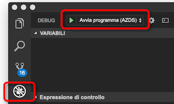

# <a name="how-azure-dev-spaces-works-and-is-configured"></a>Il funzionamento degli spazi di sviluppo di Azure e viene configurato

Sviluppo di un'applicazione Kubernetes può risultare complesso. Sono necessari file di configurazione di Docker e Kubernetes. È necessario capire come testare l'applicazione in locale e interagire con altri servizi dipendenti. Potrebbe essere necessario gestire lo sviluppo e test su più servizi in una sola volta e con un team di sviluppatori.

Spazi di sviluppo Azure consente di sviluppare, distribuire e il debug delle applicazioni Kubernetes direttamente in Azure Kubernetes Service (AKS). Spazi di sviluppo Azure consente inoltre di un team per condividere lo spazio di sviluppo. La condivisione di uno spazio di sviluppo in un team consente a singoli membri del team sviluppare in isolamento senza la necessità di replicare o simulare dipendenze o da altre applicazioni nel cluster.

Spazi di sviluppo Azure crea e Usa un file di configurazione per la distribuzione, in esecuzione e debug delle applicazioni Kubernetes nel servizio contenitore di AZURE. Questo file di configurazione si trova con il codice dell'applicazione e può essere aggiunti al sistema di controllo delle versioni.

Questo articolo descrive i processi che spazi di sviluppo di Azure power e come tali processi vengono configurati nel file di configurazione di spazi di sviluppo di Azure. Per ottenere Azure Dev spazi rapidità e visualizzarlo in pratica, completare una delle guide introduttive:

* [Java con Visual Studio Code e CLI](quickstart-java.md)
* [.NET core con Visual Studio Code e CLI](quickstart-netcore.md)
* [.NET core con Visual Studio](quickstart-netcore-visualstudio.md)
* [Node. js con Visual Studio Code e CLI](quickstart-nodejs.md)

## <a name="how-azure-dev-spaces-works"></a>Come funziona Azure Dev spazi

Azure Dev locali presenta due componenti distinti che si interagiscono con: il controller e gli strumenti lato client.


Il controller esegue le azioni seguenti:

* Gestisce la creazione dello spazio di sviluppo e di selezione.
* Installa chart Helm dell'applicazione e crea gli oggetti Kubernetes.
* Compila l'immagine del contenitore dell'applicazione.
* Consente di distribuire l'applicazione al servizio contenitore di AZURE.
* Esegue le compilazioni incrementali e viene riavviato quando viene modificato il codice sorgente.
* Gestisce i registri e le tracce HTTP.
* Inoltra stdout e stderr per gli strumenti lato client.
* Consente ai membri del team creare spazi di sviluppo figlio derivati da uno spazio di sviluppo padre.
* Consente di configurare il routing per le applicazioni all'interno di uno spazio, ma anche gli spazi padre e figlio.

Il controller si trova di fuori servizio contenitore di AZURE. Gestisce infatti il comportamento e la comunicazione tra gli strumenti lato client e il cluster AKS. Il controller viene abilitato tramite la CLI di Azure durante la preparazione del cluster per usare gli spazi di sviluppo di Azure. Dopo essere stata attivata, è possibile interagire con esso tramite gli strumenti lato client.

Gli strumenti lato client consentono all'utente:
* Generare un Dockerfile, il grafico Helm e file di configurazione di spazi di sviluppo di Azure per l'applicazione.
* Creare spazi di sviluppo padre e figlio.
* Indicare il controller per compilare e avviare l'applicazione.

Mentre l'applicazione è in esecuzione, del lato client, anche gli strumenti:
* Riceve e Visualizza stdout e stderr dall'applicazione in esecuzione nel servizio contenitore di AZURE.
* Viene utilizzato [porta-forward](https://kubernetes.io/docs/tasks/access-application-cluster/port-forward-access-application-cluster/) per consentire l'accesso web all'applicazione tramite http:\//localhost.
* Collega un debugger all'applicazione in esecuzione nel servizio contenitore di AZURE.
* Esegue la sincronizzazione nel codice sorgente per lo spazio di sviluppo quando viene rilevata una modifica per le compilazioni incrementali, consentendo una rapida iterazione.

È possibile usare il lato client degli strumenti da riga di comando come parte di `azds` comando. È anche possibile usare il lato client degli strumenti con:

* Visual Studio Code usando il [estensione Azure Dev spazi](https://marketplace.visualstudio.com/items?itemName=azuredevspaces.azds).
* Visual Studio con [Visual Studio Tools per Kubernetes](https://aka.ms/get-vsk8stools).

Ecco il flusso di base per la configurazione e uso di spazi di sviluppo di Azure:
1. Preparare il cluster AKS per spazi di sviluppo di Azure
1. Preparare il codice per l'esecuzione in Azure Dev spazi
1. Eseguire il codice in uno spazio di sviluppo
1. Il debug del codice in uno spazio di sviluppo
1. Condividere lo spazio di sviluppo

Illustreremo altri dettagli del funzionamento di spazi di sviluppo di Azure in ognuna delle sezioni seguenti.

## <a name="prepare-your-aks-cluster"></a>Preparare il cluster AKS

Preparazione del cluster AKS include:
* Verifica per determinare se il servizio contenitore di AZURE cluster si trovi in un'area [supportati da Azure Dev spazi](https://docs.microsoft.com/azure/dev-spaces/#a-rapid,-iterative-kubernetes-development-experience-for-teams).
* Verifica per determinare se si esegue Kubernetes 1.10.3 o versione successiva.
* L'abilitazione di spazi di sviluppo di Azure nel cluster usando `az aks use-dev-spaces`

Per altre informazioni su come creare e configurare un cluster del servizio contenitore di AZURE per gli spazi di sviluppo di Azure, vedere uno del guide introduttive:
* [Iniziare con spazi di sviluppo di Azure con Java](get-started-java.md)
* [Iniziare con spazi di sviluppo di Azure con .NET Core e Visual Studio](get-started-netcore-visualstudio.md)
* [Iniziare con spazi di sviluppo di Azure con .NET Core](get-started-netcore.md)
* [Iniziare con spazi di sviluppo di Azure con Node. js](get-started-nodejs.md)

Quando gli spazi di sviluppo di Azure è abilitato nel cluster AKS, viene installato il controller per il cluster. Il controller è una risorsa di Azure separata all'esterno del cluster ed esegue le operazioni seguenti per le risorse del cluster:

* Crea o definisce uno spazio dei nomi Kubernetes da usare come uno spazio di sviluppo.
* Rimuove qualsiasi spazio dei nomi Kubernetes denominato *azds*, se presente e ne crea uno nuovo.
* Consente di distribuire una configurazione di webhook di Kubernetes.
* Consente di distribuire un server di ricovero di webhook.
    

Usa inoltre la stessa entità servizio usati dal cluster servizio contenitore di AZURE per effettuare chiamate di assistenza agli altri componenti di spazi di sviluppo di Azure.


Per usare Azure Dev spazi, deve esistere almeno uno spazio di sviluppo. Spazi di sviluppo Azure Usa gli spazi dei nomi Kubernetes all'interno del cluster servizio contenitore di AZURE per gli spazi di sviluppo. Quando viene installato un controller, viene richiesto di creare un nuovo spazio dei nomi Kubernetes o sceglierne uno spazio dei nomi esistente da utilizzare come il primo spazio di sviluppo. Quando uno spazio dei nomi verrà designato come uno spazio di sviluppo, il controller aggiunge il *azds.io/space=true* etichetta allo spazio dei nomi per identificarla come uno spazio di sviluppo. Lo spazio di sviluppo iniziale è creare o designare è selezionato per impostazione predefinita, dopo aver preparato il cluster. Quando viene selezionato uno spazio, viene utilizzato da spazi di sviluppo di Azure per la creazione di nuovi carichi di lavoro.

Per impostazione predefinita, il controller crea uno spazio di sviluppo denominato *predefinite* eseguendo l'aggiornamento esistenti *predefinita* dello spazio dei nomi Kubernetes. È possibile utilizzare gli strumenti lato client per creare nuovi spazi di sviluppo e rimuovere gli spazi di sviluppo esistente. A causa di una limitazione in Kubernetes, il *predefinito* dev spazio non può essere rimosso. Il controller rimuove anche gli spazi dei nomi Kubernetes esistente denominato *azds* per evitare conflitti con i `azds` comando usato dagli strumenti lato client.

Il server di ammissione Kubernetes webhook viene usato per inserire i POD con tre contenitori durante la distribuzione per la strumentazione: un contenitore per il proxy devspaces, un contenitore devspaces-proxy-init e un contenitore devspaces-compilazione. **Tutte e tre questi contenitori vengono eseguiti con accesso radice nel cluster AKS.** È anche possibile usare la stessa entità servizio usati dal cluster servizio contenitore di AZURE per effettuare chiamate di assistenza agli altri componenti di spazi di sviluppo di Azure.


Il contenitore devspaces proxy è un contenitore sidecar che gestisce tutto il traffico TCP da e verso il contenitore di applicazioni e consente di eseguono il routing. Il contenitore devspaces proxy reindirizza i messaggi HTTP se vengono utilizzati alcuni spazi. Ad esempio, consente di instradare i messaggi HTTP tra le applicazioni in spazi padre e figlio. Tutto il traffico HTTP non passa attraverso devspaces-proxy senza modificato. Inoltre, il contenitore devspaces proxy registra tutti i messaggi HTTP in ingresso e in uscita e li invia a lato client degli strumenti come tracce. È possibile visualizzare queste tracce dallo sviluppatore per controllare il comportamento dell'applicazione.

Il contenitore devspaces-proxy-init è un' [init contenitore](https://kubernetes.io/docs/concepts/workloads/pods/init-containers/) che consente di aggiungere ulteriori regole di routing basate su gerarchia di spazi al contenitore dell'applicazione. Aggiunge le regole di routing mediante l'aggiornamento del contenitore dell'applicazione */etc/resolv.conf* iptables e file di configurazione prima che venga avviato. Gli aggiornamenti al */etc/resolv.conf* Consenti per la risoluzione DNS dei servizi in spazi padre. Gli aggiornamenti della configurazione iptables assicurarsi che tutto il traffico TCP in e dal contenitore dell'applicazione vengono instradati tuttavia devspaces-proxy. Tutti gli aggiornamenti da devspaces-proxy-init vengono eseguiti oltre alle regole che Kubernetes aggiunge.

Il contenitore devspaces-build è un contenitore di init e dispone di un socket di Docker montato e il codice sorgente del progetto. Il codice sorgente del progetto e l'accesso a Docker consente al contenitore dell'applicazione per la compilazione direttamente nel pod.

> [!NOTE]
> Spazi di sviluppo Azure Usa lo stesso nodo per creare il contenitore dell'applicazione ed eseguirla. Di conseguenza, gli spazi di sviluppo di Azure non è necessario un registro contenitori di esterni per compilare ed eseguire l'applicazione.

È in ascolto il server di ammissione Kubernetes webhook per qualsiasi nuovo pod creato nel cluster AKS. Se quel pod viene distribuita a qualsiasi spazio dei nomi con il *azds.io/space=true* etichetta, inserisce il pod con i contenitori aggiuntivi. Il contenitore devspaces-build viene inserito solo se il contenitore dell'applicazione viene eseguito usando gli strumenti lato client.

Dopo aver preparato il cluster AKS, è possibile usare gli strumenti lato client per preparare ed eseguire il codice nello spazio di sviluppo.

## <a name="prepare-your-code"></a>Preparare il codice

Per eseguire l'applicazione in uno spazio di sviluppo, è necessario essere in contenitori ed è necessario definire come deve essere distribuito in Kubernetes. Per distribuire l'applicazione in un contenitore, è necessario un Dockerfile. Per definire la modalità con cui l'applicazione viene distribuita in Kubernetes, è necessario un [grafico Helm](https://docs.helm.sh/). Per semplificare la creazione di un grafico Helm sia il Dockerfile per l'applicazione, gli strumenti lato client includono il `prep` comando:

```cmd
azds prep --public
```

Il `prep` comando cercherà i file nel progetto e provare a creare il grafico Helm e Dockerfile per l'esecuzione dell'applicazione in Kubernetes. Attualmente, il `prep` comando genera un grafico Helm e Dockerfile con le seguenti lingue:

* Java
* Node.js
* .NET Core

Si *devono* eseguire il `prep` comando da una directory che contiene il codice sorgente. Esegue il `prep` comando dalla directory corretta consente a strumenti lato client identificare la lingua e creare un Dockerfile per distribuire l'applicazione in un contenitore appropriato. È anche possibile eseguire la `prep` comando da una directory che contiene un *POM. XML* file per i progetti Java.

Se si esegue il `prep` comando dalla directory che non contiene codice sorgente, gli strumenti lato client non verrà generato un Dockerfile. Verrà anche visualizzato un errore che segnala che: *Impossibile generare un file Docker a causa di un linguaggio non supportato*. Questo errore si verifica anche se gli strumenti lato client non riconoscono il tipo di progetto.

Quando si esegue la `prep` comando, è possibile scegliere di specificare il `--public` flag. Questo flag indica il controller per creare un endpoint accessibile da internet per questo servizio. Se non si specifica questo flag, il servizio è accessibile solo da all'interno del cluster o usando il tunnel localhost creato dagli strumenti lato client. È possibile abilitare o disabilitare questo comportamento dopo l'esecuzione di `prep` comando aggiornando il grafico Helm generato.

Il `prep` comando non sostituisce eventuali grafici Dockerfile o Helm esistenti nel progetto presente. Se un grafico Helm o Dockerfile esistente Usa la stessa convenzione di denominazione come i file generati dal `prep` comando, il `prep` comando ignorerà la generazione di tali file. In caso contrario, il `prep` comando genererà un proprio file Dockerfile o un grafico Helm lateralmente i file esistenti.

Il `prep` comando genererà inoltre un `azds.yaml` file nella radice del progetto. Spazi di sviluppo Azure Usa questo file per compilare, installare, configurare ed eseguire l'applicazione. Questo file di configurazione viene indicato il percorso del grafico Helm e Dockerfile e fornisce inoltre configurazioni aggiuntive su tali elementi.

Ecco un esempio di file azds.yaml creato usando [applicazione di esempio .NET Core](https://github.com/Azure/dev-spaces/tree/master/samples/dotnetcore/getting-started/webfrontend):

```yaml
kind: helm-release
apiVersion: 1.1
build:
  context: .
  dockerfile: Dockerfile
install:
  chart: charts/webfrontend
  values:
  - values.dev.yaml?
  - secrets.dev.yaml?
  set:
    replicaCount: 1
    image:
      repository: webfrontend
      tag: $(tag)
      pullPolicy: Never
    ingress:
      annotations:
        kubernetes.io/ingress.class: traefik-azds
      hosts:
        # This expands to [space.s.][rootSpace.]webfrontend.<random suffix>.<region>.azds.io
        # Customize the public URL by changing the 'webfrontend' text between the $(rootSpacePrefix) and $(hostSuffix) tokens
        # For more information see https://aka.ms/devspaces/routing
        - $(spacePrefix)$(rootSpacePrefix)webfrontend$(hostSuffix)
configurations:
  develop:
    build:
      dockerfile: Dockerfile.develop
      useGitIgnore: true
      args:
        BUILD_CONFIGURATION: ${BUILD_CONFIGURATION:-Debug}
    container:
      sync:
      - "**/Pages/**"
      - "**/Views/**"
      - "**/wwwroot/**"
      - "!**/*.{sln,csproj}"
      command: [dotnet, run, --no-restore, --no-build, --no-launch-profile, -c, "${BUILD_CONFIGURATION:-Debug}"]
      iterate:
        processesToKill: [dotnet, vsdbg]
        buildCommands:
        - [dotnet, build, --no-restore, -c, "${BUILD_CONFIGURATION:-Debug}"]
```

Il `azds.yaml` generati dal file la `prep` comando dovrebbe funzionare correttamente per uno scenario di sviluppo semplice, singolo progetto. Se il progetto specifico è aumentato di complessità, si potrebbe essere necessario aggiornare questo file dopo l'esecuzione di `prep` comando. Ad esempio, il progetto potrebbe richiedono alcune modifiche alla compilazione o avviare il processo di base di sviluppo o debug alle esigenze. Potrebbe essere anche più applicazioni nel progetto, che richiedono più processi di compilazione o il contenuto una build diversa.

## <a name="run-your-code"></a>Eseguire il codice

Per eseguire il codice in uno spazio di sviluppo, eseguire la `up` comando nella stessa directory di `azds.yaml` file:

```cmd
azds up
```

Il `up` comando Carica i file di origine dell'applicazione e altri elementi necessari per compilare ed eseguire il progetto per lo spazio di sviluppo. Da qui, il controller nello spazio di sviluppo:

1. Crea gli oggetti Kubernetes per distribuire l'applicazione.
1. Compila il contenitore per l'applicazione.
1. Consente di distribuire l'applicazione per lo spazio di sviluppo.
1. Crea un nome DNS accessibile pubblicamente per l'endpoint dell'applicazione se configurato.
1. Viene utilizzato *porta-forward* per fornire l'accesso all'endpoint di applicazione usando http://locahost.
1. Inoltra stdout e stderr per gli strumenti lato client.


### <a name="starting-a-service"></a>Avvio di un servizio

Quando si avvia un servizio in uno spazio di sviluppo, il controller e gli strumenti lato client lavorare insieme per sincronizzare i file di origine, creare il contenitore e gli oggetti Kubernetes ed eseguire l'applicazione.

A un livello più granulare, ecco cosa accade quando si esegue `azds up`:

1. I file vengono sincronizzati da computer dell'utente a una risorsa di archiviazione di file di Azure che è univoco per il cluster AKS dell'utente. Il codice sorgente, grafico Helm e i file di configurazione vengono caricati. Altre informazioni sul processo di sincronizzazione sono disponibili nella sezione successiva.
1. Il controller crea una richiesta per avviare una nuova sessione. Questa richiesta contiene diverse proprietà, incluso un ID univoco, nome dello spazio, percorso di codice sorgente e un flag di debug.
1. Sostituisce il controller i *$(tag)* segnaposto nel grafico Helm con l'ID di sessione univoco e le installazioni del grafico di Helm per il servizio. Aggiunta di che un riferimento all'ID di sessione univoco per il grafico Helm consente al contenitore distribuito nel cluster AKS per questa sessione specifica essere collegate alla richiesta di sessione e informazioni associate.
1. Durante l'installazione del grafico Helm, il server di ammissione webhook Kubernetes aggiunge altri contenitori POD dell'applicazione per l'accesso al codice sorgente del progetto e di strumentazione. I contenitori di devspaces-proxy-init e devspaces proxy vengono aggiunti per fornire la traccia HTTP e il routing di spazio. Il contenitore devspaces-build viene aggiunta per fornire il pod con accesso all'istanza di Docker e al codice sorgente del progetto per la creazione di contenitori dell'applicazione.
1. Quando viene avviato il pod dell'applicazione, il contenitore devspaces-compilazione e il contenitore devspaces-proxy-init vengono utilizzati per creare il contenitore dell'applicazione. Vengono quindi avviati il contenitore di applicazioni e contenitori devspaces-proxy.
1. Dopo aver avviato il contenitore dell'applicazione, la funzionalità lato client Usa di Kubernetes *porta-forward* funzionalità per fornire l'accesso HTTP all'applicazione tramite http://localhost. Questo port forwarding si connette il computer di sviluppo per il servizio nello spazio di sviluppo.
1. Quando tutti i contenitori nel pod è sono avviata, il servizio è in esecuzione. A questo punto, la funzionalità lato client inizia a trasmettere le tracce HTTP, stdout e stderr. Queste informazioni vengono visualizzate dalla funzionalità lato client per gli sviluppatori.

### <a name="updating-a-running-service"></a>Aggiornamento di un servizio in esecuzione

Mentre un servizio è in esecuzione, gli spazi di sviluppo di Azure ha la possibilità di aggiornare tale servizio, se uno dei file di origine del progetto viene modificato. Spazi di sviluppo gestisce anche l'aggiornamento del servizio in modo diverso a seconda del tipo di file che è stato modificato. Esistono tre modi che DEV spazi può aggiornare un servizio in esecuzione:

* Direttamente l'aggiornamento di un file
* La ricompilazione e riavviare il processo dell'applicazione all'interno del contenitore dell'applicazione in esecuzione
* Ricompilare e ridistribuire il contenitore dell'applicazione


Alcuni file di progetto che sono gli asset statici, ad esempio html, css e file con estensione cshtml, possono essere aggiornati direttamente nel contenitore dell'applicazione senza riavviare alcunché. Se viene modificato un asset statico, il nuovo file viene sincronizzato con lo spazio di sviluppo e quindi utilizzato dal contenitore in esecuzione.

Modifiche ai file, ad esempio codice sorgente o i file di configurazione dell'applicazione possono essere applicate riavviando il processo dell'applicazione all'interno del contenitore in esecuzione. Quando questi file sono sincronizzati, il processo dell'applicazione viene riavviato entro il contenitore in esecuzione con il *devhostagent* processo. Quando si crea inizialmente il contenitore dell'applicazione, il controller sostituisce il comando di avvio per l'applicazione con un altro processo chiamato *devhostagent*. Il processo dell'applicazione effettiva viene quindi eseguito come processo figlio sotto *devhostagent*, e il relativo output viene reindirizzato utilizzando *devhostagent*di output. Il *devhostagent* processo fa anche parte di spazi di sviluppo e può eseguire comandi in contenitore in esecuzione per conto di spazi di sviluppo. Quando si esegue un riavvio *devhostagent*:

* Arresta il processo corrente o i processi associati all'applicazione
* Consente di ricompilare l'applicazione
* Riavvia il processo o i processi associati all'applicazione

Il modo *devhostagent* esegue precedenti passaggi è configurato nel `azds.yaml` file di configurazione. Questa configurazione è descritta in dettaglio in una sezione successiva.

Aggiornamenti ai file di progetto, ad esempio i Dockerfile, i file csproj o qualsiasi parte del grafico Helm richiedono contenitore dell'applicazione sia ricompilata e ridistribuita. Quando uno di questi file viene sincronizzato con lo spazio di sviluppo, il controller viene eseguito il [aggiornamento helm](https://helm.sh/docs/helm/#helm-upgrade) comando e il contenitore dell'applicazione viene ricompilata e ridistribuita.

### <a name="file-synchronization"></a>Sincronizzazione dei file

La prima volta che viene avviata un'applicazione in uno spazio di sviluppo, vengono caricati i file di origine dell'applicazione. Mentre l'applicazione è in esecuzione e sui riavvii successive, vengono caricati solo i file modificati. Per il coordinamento di questo processo vengono usati due file: un file lato client e un file del controller.

Il file lato client viene archiviato in una directory temporanea e viene denominato in base a un hash della directory del progetto che si eseguono in spazi di sviluppo. Ad esempio, in Windows è necessario un file, ad esempio *Users\USERNAME\AppData\Local\Temp\1234567890abcdef1234567890abcdef1234567890abcdef1234567890abcdef.synclog* per il progetto. In Linux, è archiviato il file lato client nel */tmp* directory. È possibile trovare la directory in macOS eseguendo il `echo $TMPDIR` comando.

Questo file è in formato JSON e contiene:

* Una voce per ogni file di progetto che viene sincronizzato con lo spazio di sviluppo
* Un ID di sincronizzazione
* Il timestamp dell'ultima operazione di sincronizzazione

Ogni voce del file di progetto contiene un percorso del file e al relativo timestamp.

Il file lato controller viene archiviato nel cluster AKS. Contiene l'ID di sincronizzazione e il timestamp dell'ultima sincronizzazione.

Una sincronizzazione si verifica quando i timestamp di sincronizzazione non corrispondono tra il lato client e i file sul lato controller. Durante una sincronizzazione, gli strumenti lato client scorre le voci del file nel file lato client. Se il timestamp del file si trova dopo il timestamp di sincronizzazione, tale file viene sincronizzato con lo spazio di sviluppo. Una volta completata la sincronizzazione, i timestamp di sincronizzazione vengono aggiornati in entrambi i file lato client e lato controller.

Tutti i file di progetto vengono sincronizzati se il file lato client non è presente. Questo comportamento consente di forzare una sincronizzazione completa per l'eliminazione del file lato client.

### <a name="how-routing-works"></a>Funzionamento del routing

Uno spazio di sviluppo è basato sul servizio contenitore di AZURE e Usa lo stesso [informazioni sulla rete](../aks/concepts-network.md). Spazi di sviluppo Azure ha anche un centralizzato *ingressmanager* del servizio e distribuisce il proprio Controller di ingresso per il cluster AKS. Il *ingressmanager* monitoraggi AKS cluster con spazi di sviluppo e integra il Controller di ingresso di spazi di sviluppo di Azure nel cluster con gli oggetti di traffico in ingresso per il routing per i POD dell'applicazione del servizio. Il contenitore devspaces-proxy in ogni pod aggiunge un `azds-route-as` intestazione HTTP per il traffico HTTP a uno spazio di sviluppo basato sull'URL. Ad esempio, una richiesta all'URL *http://azureuser.s.default.serviceA.fedcba09...azds.io* otterrebbe un'intestazione HTTP con `azds-route-as: azureuser`. Il contenitore devspaces proxy non aggiungerà un `azds-route-as` intestazione se già presente.

Quando viene effettuata una richiesta HTTP a un servizio dall'esterno del cluster, la richiesta viene inviata al controller in ingresso. Il controller di ingresso instrada la richiesta direttamente al pod appropriato in base agli oggetti di traffico in ingresso e regole. Il contenitore per il proxy devspaces nel pod riceve la richiesta, aggiunge il `azds-route-as` intestazione basata sull'URL e quindi indirizza la richiesta al contenitore dell'applicazione.

Quando viene effettuata una richiesta HTTP a un servizio da un altro servizio all'interno del cluster, la richiesta passa innanzitutto attraverso contenitore devspaces proxy del servizio chiamata. Il contenitore devspaces proxy esamina la richiesta HTTP e verifica il `azds-route-as` intestazione. In base all'intestazione, il contenitore per il proxy devspaces cercherà l'indirizzo IP del servizio associato al valore di intestazione. Se viene trovato un indirizzo IP, il contenitore devspaces proxy reindirizza la richiesta a tale indirizzo IP. Se non viene trovato un indirizzo IP, il contenitore per il proxy devspaces instrada la richiesta al contenitore dell'applicazione padre.

Ad esempio, le applicazioni *serviceA* e *serviceB* vengono distribuite in uno spazio di sviluppo padre denominato *predefinito*. *serviceA* basa *serviceB* ed effettua chiamate HTTP a esso. Utente di Azure crea uno spazio di sviluppo figlio in base il *predefinite* chiamato spazio *azureuser*. Utente di Azure distribuisce anche la propria versione di *serviceA* al proprio spazio figlio. Quando viene effettuata una richiesta al *http://azureuser.s.default.serviceA.fedcba09...azds.io*:


1. Cerca l'indirizzo IP per il pod associato con l'URL, ovvero il controller di Ingress *serviceA.azureuser*.
1. Il controller di ingresso consente di trovare l'indirizzo IP per i pod in uno spazio di sviluppo dell'utente di Azure e indirizza la richiesta per il *serviceA.azureuser* pod.
1. Il contenitore devspaces-proxy nel *serviceA.azureuser* pod riceve la richiesta e aggiunge `azds-route-as: azureuser` come un'intestazione HTTP.
1. Il contenitore devspaces-proxy nel *serviceA.azureuser* pod instrada la richiesta per il *serviceA* contenitore di applicazioni nel *serviceA.azureuser* pod.
1. Il *serviceA* dell'applicazione nel *serviceA.azureuser* pod effettua una chiamata al *serviceB*. Il *serviceA* dell'applicazione contiene anche il codice per mantenere esistente `azds-route-as` intestazione, che in questo caso è `azds-route-as: azureuser`.
1. Il contenitore devspaces-proxy nel *serviceA.azureuser* pod riceve la richiesta e Cerca l'indirizzo IP del *serviceB* in base al valore della `azds-route-as` intestazione.
1. Il contenitore devspaces-proxy nel *serviceA.azureuser* pod non viene trovato un indirizzo IP per *serviceB.azureuser*.
1. Il contenitore devspaces-proxy nel *serviceA.azureuser* pod Cerca l'indirizzo IP *serviceB* nell'area di padre, ovvero *serviceB.default*.
1. Il contenitore devspaces-proxy nel *serviceA.azureuser* pod consente di trovare l'indirizzo IP per *serviceB.default* e indirizza la richiesta per il *serviceB.default* pod.
1. Il contenitore devspaces-proxy nel *serviceB.default* pod riceve la richiesta e indirizza la richiesta per il *serviceB* contenitore di applicazioni nel *serviceB.default*pod.
1. Il *serviceB* dell'applicazione nel *serviceB.default* pod restituisce una risposta per il *serviceA.azureuser* pod.
1. Contenitore devspaces-proxy nel *serviceA.azureuser* pod riceve la risposta e indirizza la risposta per il *serviceA* contenitore di applicazioni nel *serviceA.azureuser* pod.
1. Il *serviceA* applicazione riceve la risposta e quindi restituisce la propria risposta.
1. Il contenitore devspaces-proxy nel *serviceA.azureuser* pod riceve la risposta dalle *serviceA* contenitore di applicazioni e indirizza la risposta al chiamante originale di fuori del cluster.

Tutte le altre TCP il traffico non HTTP passa attraverso i controller di ingresso e i contenitori devspaces proxy senza modificati.

### <a name="how-running-your-code-is-configured"></a>La modalità di esecuzione del codice è configurato

Spazi di sviluppo Azure Usa il `azds.yaml` file per installare e configurare il servizio. Il controller Usa il `install` proprietà nel `azds.yaml` file per installare il grafico Helm e creare gli oggetti Kubernetes:

```yaml
...
install:
  chart: charts/webfrontend
  values:
  - values.dev.yaml?
  - secrets.dev.yaml?
  set:
    replicaCount: 1
    image:
      repository: webfrontend
      tag: $(tag)
      pullPolicy: Never
    ingress:
      annotations:
        kubernetes.io/ingress.class: traefik-azds
      hosts:
      # This expands to [space.s.][rootSpace.]webfrontend.<random suffix>.<region>.azds.io
      # Customize the public URL by changing the 'webfrontend' text between the $(rootSpacePrefix) and $(hostSuffix) tokens
      # For more information see https://aka.ms/devspaces/routing
      - $(spacePrefix)$(rootSpacePrefix)webfrontend$(hostSuffix)
...
```

Per impostazione predefinita, il `prep` comando genererà il grafico Helm. Imposta anche il *install.chart* proprietà nella directory del grafico Helm. Se si vuole usare un grafico di Helm in un percorso diverso, è possibile aggiornare questa proprietà per l'utilizzo di tale percorso.

Quando si installano i grafici di Helm, spazi di sviluppo di Azure fornisce un modo per eseguire l'override di valori nel grafico Helm. Inclusi tra i valori predefiniti per il grafico Helm `charts/APP_NAME/values.yaml`.

Usando il *install.values* proprietà, è possibile elencare uno o più file che definiscono i valori desiderati sostituito nel grafico Helm. Ad esempio, se si desidera una configurazione nome host o un database, in particolare quando si esegue l'applicazione in uno spazio di sviluppo, è possibile usare questa funzionalità di sostituzione. È anche possibile aggiungere un *?* alla fine di uno qualsiasi dei nomi di file da impostata come facoltativa.

Il *install.set* proprietà consente di configurare uno o più valori da sostituire nel grafico Helm. Eventuali valori configurati nelle *install.set* sostituirà i valori configurati nel file elencati *install.values*. Le proprietà disponibili in *install.set* dipendono i valori nel grafico Helm e potrebbe essere diverso a seconda del grafico Helm generato.

Nell'esempio precedente, il *install.set.replicaCount* proprietà indica il controller di quante istanze dell'applicazione per l'esecuzione nello spazio di sviluppo. A seconda dello scenario, è possibile aumentare questo valore, ma avrà un impatto sulle allegare un debugger al pod dell'applicazione. Per altre informazioni, vedere la [risoluzione dei problemi di articolo](troubleshooting.md).

Nel grafico Helm generato, l'immagine del contenitore è impostata su *{{. Values.Image.repository}} :{{. Values.Image.tag}}*. Il `azds.yaml` file definisce *install.set.image.tag* la proprietà *$(tag)* per impostazione predefinita, che viene usato come valore per *{{. Values.Image.tag}}*. Impostando il *install.set.image.tag* proprietà in questo modo, consente l'immagine del contenitore per l'applicazione deve essere contrassegnato in modo distinto durante l'esecuzione di spazi di sviluppo di Azure. In questo caso specifico, l'immagine viene contrassegnato come  *\<valore image.repository >: $(tag)*. È necessario usare il *$(tag)* variabile come valore di *install.set.image.tag* affinché Dev spazi riconoscere e individuare il contenitore nel cluster AKS.

Nell'esempio sopra riportato `azds.yaml` definisce *install.set.ingress.hosts*. Il *install.set.ingress.hosts* proprietà definisce un formato di nome host per gli endpoint pubblici. Questa proprietà Usa anche *$(spacePrefix)*, *$(rootSpacePrefix)*, e *$(hostSuffix)*, quali sono i valori forniti dal controller. 

Il *$(spacePrefix)* è il nome dello spazio di sviluppo figlio, che assume la forma *SPACENAME.s*. Il *$(rootSpacePrefix)* è il nome dello spazio padre. Ad esempio, se *azureuser* tratta un figlio dello spazio degli *predefinita*, il valore di *$(rootSpacePrefix)* è *predefinito* e il valore di *$(spacePrefix)* viene *azureuser.s*. Se lo spazio non è uno spazio, figlio *$(spacePrefix)* è vuoto. Ad esempio, se il *predefinito* spazio non dispone di alcun spazio padre, il valore per *$(rootSpacePrefix)* viene *predefinito* e il valore di *$(spacePrefix)* è vuoto. Il *$(hostSuffix)* è un suffisso DNS che punta al controller in ingresso Dev spazi per Azure che viene eseguito nel cluster AKS. Questo suffisso DNS corrisponde a una voce DNS con caratteri jolly, ad esempio  *\*. RANDOM_VALUE.EUS.azds.IO*, che è stata creata quando è stato aggiunto il controller di spazi di sviluppo di Azure nel cluster AKS.

Nell'esempio precedente `azds.yaml` file, è anche possibile aggiornare *install.set.ingress.hosts* per modificare il nome host dell'applicazione. Ad esempio, se si vuole semplificare il nome host dell'applicazione tra *$(spacePrefix)$(rootSpacePrefix)webfrontend$(hostSuffix)* a *$(spacePrefix)$(rootSpacePrefix)web$(hostSuffix)*.

Per creare il contenitore per l'applicazione, il controller Usa il sotto le sezioni del `azds.yaml` file di configurazione:

```yaml
build:
  context: .
  dockerfile: Dockerfile
...
configurations:
  develop:
    build:
      dockerfile: Dockerfile.develop
      useGitIgnore: true
      args:
        BUILD_CONFIGURATION: ${BUILD_CONFIGURATION:-Debug}
...
```

Il controller Usa un Dockerfile per compilare ed eseguire l'applicazione.

Il *build.context* elenchi delle proprietà della directory in cui sono presenti i Dockerfile. Il *build.dockerfile* proprietà definisce il nome del Dockerfile per creare la versione di produzione dell'applicazione. Il *configurations.develop.build.dockerfile* proprietà configura il nome del Dockerfile per la versione di sviluppo dell'applicazione.

Presenza di un Dockerfile diverso per lo sviluppo e produzione consente di abilitare determinati aspetti durante lo sviluppo e disabilitare gli elementi per le distribuzioni di produzione. Ad esempio, è possibile abilitare il debug o la registrazione più dettagliata durante lo sviluppo e disable in un ambiente di produzione. È possibile aggiornare queste proprietà anche se i Dockerfile vengono denominati in modo diverso o si trovano in un percorso diverso.

Per agevolare l'iterazione rapida durante lo sviluppo, gli spazi di sviluppo di Azure verrà sincronizzare le modifiche dal progetto locale e in modo incrementale aggiorna l'applicazione. La seguente sezione nel `azds.yaml` file di configurazione viene usato per configurare la sincronizzazione e aggiornare:

```yaml
...
configurations:
  develop:
    ...
    container:
      sync:
      - "**/Pages/**"
      - "**/Views/**"
      - "**/wwwroot/**"
      - "!**/*.{sln,csproj}"
      command: [dotnet, run, --no-restore, --no-build, --no-launch-profile, -c, "${BUILD_CONFIGURATION:-Debug}"]
      iterate:
        processesToKill: [dotnet, vsdbg]
        buildCommands:
        - [dotnet, build, --no-restore, -c, "${BUILD_CONFIGURATION:-Debug}"]
...
```

Sono elencate i file e directory in cui le modifiche verranno sincronizzate le *configurations.develop.container.sync* proprietà. Queste directory vengono sincronizzate inizialmente quando si esegue il `up` comando, nonché quando vengono rilevate modifiche. Se sono presenti aggiuntive o diverse directory desiderato sincronizzato con lo spazio di sviluppo, è possibile modificare questa proprietà.

Il *configurations.develop.container.iterate.buildCommands* proprietà specifica la modalità compilare l'applicazione in uno scenario di sviluppo. Il *configurations.develop.container.command* proprietà fornisce il comando per l'esecuzione dell'applicazione in uno scenario di sviluppo. È possibile aggiornare queste proprietà, se sono presenti parametri da usare durante lo sviluppo o i flag di compilazione o di runtime aggiuntivi.

Il *configurations.develop.container.iterate.processesToKill* sono elencati i processi da terminare per arrestare l'applicazione. È possibile aggiornare questa proprietà se si desidera modificare il comportamento di riavvio dell'applicazione durante lo sviluppo. Ad esempio, se è stato aggiornato il *configurations.develop.container.iterate.buildCommands* oppure *configurations.develop.container.command* proprietà per modificare la modalità con cui l'applicazione viene compilata o avviato, potrebbe essere necessario modificare i processi che sono stati arrestati.

Quando si prepara il codice usando il `azds prep` comando, hai la possibilità di aggiungere il `--public` flag. Aggiunta di `--public` flag crea un URL accessibile pubblicamente per l'applicazione. Se si omette questo flag, l'applicazione accessibile solo all'interno del cluster o usando il tunnel di localhost. Dopo aver eseguito il `azds prep` comando, è possibile modificare questa impostazione modifica il *ingress.enabled* proprietà `charts/APPNAME/values.yaml`:

```yaml
ingress:
  enabled: true
```

## <a name="debug-your-code"></a>Il debug del codice

Per le applicazioni Java, .NET e Node. js, è possibile eseguire il debug dell'applicazione in esecuzione direttamente nello spazio di sviluppo usando Visual Studio Code o Visual Studio. Visual Studio Code e Visual Studio fornisce strumenti per la connessione all'area di sviluppo, avviare l'applicazione e collegare un debugger. Dopo aver eseguito `azds prep`, è possibile aprire il progetto in Visual Studio Code o Visual Studio. Visual Studio Code o Visual Studio genera i propri file di configurazione per la connessione che si distinguono dalle esecuzione `azds prep`. All'interno di Visual Studio Code o Visual Studio, è possibile impostare punti di interruzione e avviare l'applicazione nello spazio di sviluppo.



Quando si avvia l'applicazione usando Visual Studio Code o Visual Studio per eseguire il debug, gestiscono l'avvio e la connessione all'area di sviluppo nello stesso modo come in esecuzione `azds up`. Gli strumenti lato client in Visual Studio Code e Visual Studio forniscono anche un parametro aggiuntivo con informazioni specifiche per il debug. Il parametro contiene il nome dell'immagine del debugger, il percorso del debugger nell'immagine del debugger e l'indirizzo di destinazione nel contenitore dell'applicazione per montare la cartella di debugger. 

L'immagine del debugger viene determinato automaticamente dagli strumenti lato client. Usa un metodo simile a quello usato durante il Dockerfile e grafico Helm generare durante l'esecuzione `azds prep`. Dopo aver montato il debugger nell'immagine dell'applicazione, viene eseguito utilizzando `azds exec`.

## <a name="sharing-a-dev-space"></a>La condivisione di uno spazio di sviluppo

Quando si lavora con un team, è possibile [condividono uno spazio di sviluppo in un intero team](how-to/share-dev-spaces.md) creare spazi di dev derivata. Uno spazio di sviluppo è utilizzabile da qualsiasi utente con accesso come collaboratore al gruppo di risorse dell'area di sviluppo.

È anche possibile creare un nuovo spazio di sviluppo che è derivato da un altro spazio di sviluppo. Quando si crea uno spazio derivata dev, il *azds.io/padre-spazio = nome-spazio-padre* etichetta viene aggiunta allo spazio dei nomi dell'area dev derivata. Inoltre, lo spazio di sviluppo padre di tutte le applicazioni vengono condivisi con lo spazio dev derivata. Se si distribuisce una versione aggiornata di un'applicazione per lo spazio di sviluppo derivate, disponibile solo nella situazione dello sviluppo derivato e lo spazio di sviluppo padre rimarranno invariato. È possibile avere un massimo di tre livelli di spazi di dev derivata o *nonno* spazi.

Lo spazio dev derivata indirizzerà anche in modo intelligente le richieste tra le applicazioni e delle applicazioni condivise dal relativo elemento padre. Il funzionamento del routing tenta di instradare la richiesta a un'applicazione in situazione dello sviluppo derivata e eseguire il fallback per l'applicazione condiviso dallo spazio di sviluppo padre. Il routing eseguirà il fallback all'applicazione condiviso nello spazio padre del padre se l'applicazione non è incluso nello spazio padre.

Ad esempio:
* Lo spazio dev *predefinite* dispone di applicazioni *serviceA* e *serviceB* .
* Lo spazio dev *azureuser* è derivato da *predefinita*.
* Una versione aggiornata del *serviceA* viene distribuita *azureuser*.

Quando si usa *azureuser*, tutte le richieste al *serviceA* verrà indirizzato alla versione aggiornata nella *azureuser*. Una richiesta al *serviceB* tenta innanzitutto di essere indirizzati al *azureuser* versione di *serviceB*. Poiché non esiste, verrà indirizzato per il *predefiniti* versione di *serviceB*. Se il *azureuser* versione di *serviceA* viene rimosso, tutte le richieste al *serviceA* eseguirà il fallback usando la *predefinito* versione di *serviceA*.

## <a name="next-steps"></a>Passaggi successivi

Per iniziare a usare gli spazi di sviluppo di Azure, vedere le guide introduttive seguenti:

* [Java con Visual Studio Code e CLI](quickstart-java.md)
* [.NET core con Visual Studio Code e CLI](quickstart-netcore.md)
* [.NET core con Visual Studio](quickstart-netcore-visualstudio.md)
* [Node. js con Visual Studio Code e CLI](quickstart-nodejs.md)

Per iniziare a usare lo sviluppo in team, vedere gli articoli sulle procedure seguenti:

* [Team di sviluppo - Java con Visual Studio Code e CLI](team-development-java.md)
* [Team di sviluppo - .NET Core con Visual Studio Code e CLI](team-development-netcore.md)
* [Team di sviluppo - .NET Core con Visual Studio](team-development-netcore-visualstudio.md)
* [Team di sviluppo - Node. js con Visual Studio Code e CLI](team-development-nodejs.md)
