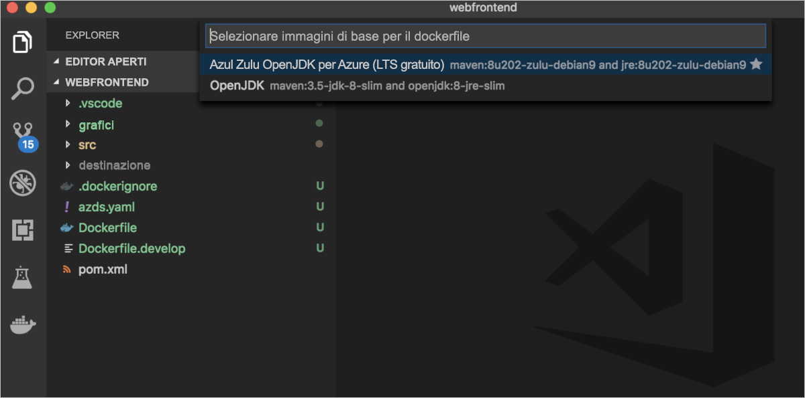
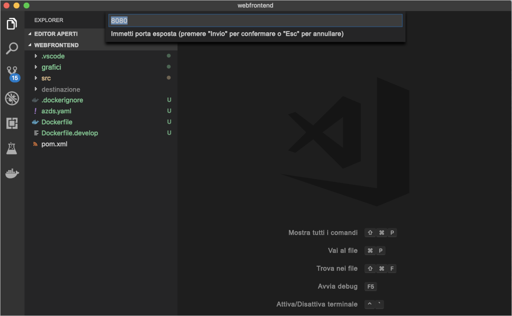
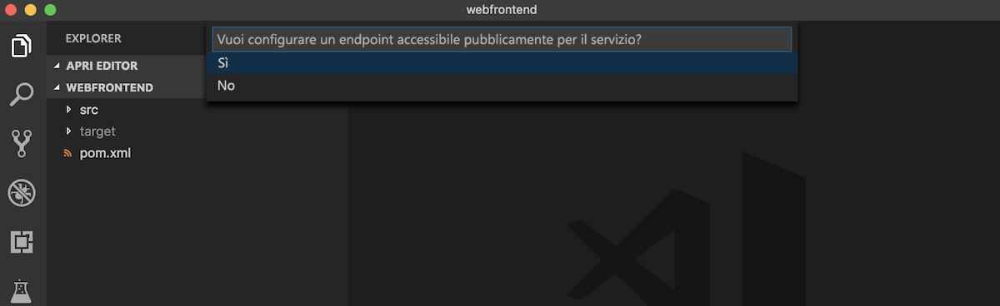
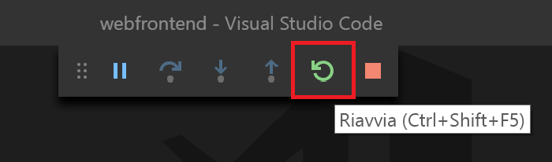

# <a name="quickstart-debug-and-iterate-with-visual-studio-code-and-java-on-kubernetes-using-azure-dev-spaces"></a>Guida introduttiva: Debug e iterazione con Visual Studio Code e Java in Kubernetes usando Azure Dev Spaces

In questa guida si apprenderà come:

- Configurare Azure Dev Spaces con un cluster Kubernetes gestito in Azure.
- Sviluppare codice in modo iterativo nei contenitori con Visual Studio Code.
- Eseguire il debug del codice nello spazio di Dev Spaces da Visual Studio Code.


## <a name="prerequisites"></a>Prerequisiti

- Una sottoscrizione di Azure. Se non si ha un account, è possibile [crearne uno gratuito](https://azure.microsoft.com/free).
- [Visual Studio Code installato](https://code.visualstudio.com/download).
- Le estensioni [Azure Dev Spaces](https://marketplace.visualstudio.com/items?itemName=azuredevspaces.azds) e [Java Debugger for Azure Dev Spaces](https://marketplace.visualstudio.com/items?itemName=vscjava.vscode-java-debugger-azds) per Visual Studio Code installate.
- [L'interfaccia della riga di comando di Azure installata](/cli/azure/install-azure-cli?view=azure-cli-latest).
- [Maven installato e configurato](https://maven.apache.org).

## <a name="create-an-azure-kubernetes-service-cluster"></a>Creare un cluster del servizio Azure Kubernetes

È necessario creare un cluster del servizio Azure Kubernetes in un'[area supportata][supported-regions]. I comandi seguenti creano un gruppo di risorse denominato *MyResourceGroup* e un cluster del servizio Azure Kubernetes denominato *MyAKS*.

```cmd
az group create --name MyResourceGroup --location eastus
az aks create -g MyResourceGroup -n MyAKS --location eastus --node-vm-size Standard_DS2_v2 --node-count 1 --disable-rbac --generate-ssh-keys
```

## <a name="enable-azure-dev-spaces-on-your-aks-cluster"></a>Abilitare Azure Dev Spaces nel cluster del servizio Azure Kubernetes

Usare il comando `use-dev-spaces` per abilitare Dev Spaces nel cluster del servizio Azure Kubernetes e seguire i prompt. Il comando seguente abilita Dev Spaces nel cluster *MyAKS* all'interno del gruppo *MyResourceGroup* e crea uno spazio *predefinito*.

```cmd
$ az aks use-dev-spaces -g MyResourceGroup -n MyAKS

'An Azure Dev Spaces Controller' will be created that targets resource 'MyAKS' in resource group 'MyResourceGroup'. Continue? (y/N): y

Creating and selecting Azure Dev Spaces Controller 'MyAKS' in resource group 'MyResourceGroup' that targets resource 'MyAKS' in resource group 'MyResourceGroup'...2m 24s

Select a dev space or Kubernetes namespace to use as a dev space.
 [1] default
Type a number or a new name: 1

Kubernetes namespace 'default' will be configured as a dev space. This will enable Azure Dev Spaces instrumentation for new workloads in the namespace. Continue? (Y/n): Y

Configuring and selecting dev space 'default'...3s

Managed Kubernetes cluster 'MyAKS' in resource group 'MyResourceGroup' is ready for development in dev space 'default'. Type `azds prep` to prepare a source directory for use with Azure Dev Spaces and `azds up` to run.
```

## <a name="get-sample-application-code"></a>Ottenere il codice dell'applicazione di esempio

In questo articolo verrà usata l'[applicazione di esempio Azure Dev Spaces](https://github.com/Azure/dev-spaces) per dimostrare l'uso di Azure Dev Spaces.

Clonare l'applicazione da GitHub.

```cmd
git clone https://github.com/Azure/dev-spaces
```

## <a name="prepare-the-sample-application-in-visual-studio-code"></a>Preparare l'applicazione di esempio in Visual Studio Code

Aprire Visual Studio Code, fare clic su *File*, quindi su *Apri*, passare alla directory *dev-spaces/samples/java/getting-started/webfrontend* e fare clic su *Apri*.

In Visual Studio Code è ora aperto il progetto *webfrontend*. Per eseguire l'applicazione nello spazio di sviluppo, generare gli asset per grafici Helm e Docker usando l'estensione Azure Dev Spaces nel riquadro comandi.

Per aprire il riquadro comandi in Visual Studio Code, fare clic su *Visualizza* e quindi su *Riquadro comandi*. Iniziare a digitare `Azure Dev Spaces` e fare clic su `Azure Dev Spaces: Prepare configuration files for Azure Dev Spaces`.


Quando Visual Studio Code richiede anche di configurare le immagini di base, la porta esposta e l'endpoint pubblico, scegliere `Azul Zulu OpenJDK for Azure (Free LTS)` per l'immagine di base `8080` per la porta esposta e `Yes` per abilitare un endpoint pubblico.







Questo comando consente di preparare il progetto per l'esecuzione in Azure Dev Spaces generando un Dockerfile e un grafico Helm. Genera inoltre una directory *.vscode* con la configurazione di debug alla radice del progetto.

## <a name="build-and-run-code-in-kubernetes-from-visual-studio"></a>Compilare ed eseguire il codice in Kubernetes da Visual Studio

Fare clic sull'icona *Debug* a sinistra e quindi su *Launch Java Program (AZDS)* (Avvia programma Java AZDS) nella parte superiore.


Questo comando compila ed esegue il servizio in Azure Dev Spaces. La finestra del *terminale* nella parte inferiore visualizza l'output della compilazione e gli URL per il servizio che esegue Azure Dev Spaces. La *Console di debug* visualizza l'output del log.

> [!Note]
> Se nel *riquadro comandi* non vengono visualizzati comandi di Azure Dev Spaces, assicurarsi di aver installato l'[estensione Visual Studio Code per Azure Dev Spaces](https://marketplace.visualstudio.com/items?itemName=azuredevspaces.azds). Verificare inoltre di aver aperto la directory *dev-spaces/samples/java/getting-started/webfrontend* in Visual Studio Code.

Per vedere il servizio in esecuzione, aprire l'URL pubblico.

Fare clic su *Debug* e quindi su *Arresta debug* per arrestare il debugger.

## <a name="update-code"></a>Aggiornare il codice

Per distribuire una versione aggiornata del servizio, è possibile aggiornare qualsiasi file del progetto ed eseguire di nuovo *Launch Java Program (AZDS)* (Avvia programma Java AZDS). Ad esempio:

1. Se l'applicazione è ancora in esecuzione, fare clic su *Debug* e quindi su *Arresta debug* per arrestarla.
1. Aggiornare la [riga 19 di `src/main/java/com/ms/sample/webfrontend/Application.java`](https://github.com/Azure/dev-spaces/blob/master/samples/java/getting-started/webfrontend/src/main/java/com/ms/sample/webfrontend/Application.java#L19) in:
    
    ```java
    return "Hello from webfrontend in Azure!";
    ```

1. Salvare le modifiche.
1. Eseguire di nuovo *Launch Java Program (AZDS)* (Avvia programma Java AZDS).
1. Passare al servizio in esecuzione e osservare le modifiche.
1. Fare clic su *Debug* e quindi su *Arresta debug* per arrestare l'applicazione.

## <a name="setting-and-using-breakpoints-for-debugging"></a>Impostazione e uso di punti di interruzione per il debug

Avviare il servizio usando *Launch Java Program (AZDS)* (Avvia programma Java AZDS). Questo comando consente anche di eseguire il servizio in modalità di debug.

Tornare nella visualizzazione *Explorer* facendo clic su *Visualizza* e quindi su *Explorer*. Aprire `src/main/java/com/ms/sample/webfrontend/Application.java` e fare clic in un punto della riga 19 per posizionarvi il cursore. Per impostare un punto di interruzione premere *F9* oppure fare clic su *Debug* e quindi su *Attiva/Disattiva punto di interruzione*.

Aprire il servizio in un browser e notare che non vengono visualizzati messaggi. Tornare in Visual Studio Code e notare che la riga 19 è evidenziata. Il punto di interruzione impostato ha sospeso il servizio in corrispondenza della riga 19. Per riprendere il servizio, premere *F5* oppure fare clic su *Debug* e quindi su *Continua*. Tornare nel browser e notare che ora il messaggio è visualizzato.

Durante l'esecuzione del servizio in Kubernetes con un debugger collegato, si ha accesso completo alle informazioni di debug, ad esempio su stack di chiamate, variabili locali ed eccezioni.

Rimuovere il punto di interruzione posizionando il cursore sulla riga 19 di `src/main/java/com/ms/sample/webfrontend/Application.java` e premendo *F9*.

## <a name="update-code-from-visual-studio-code"></a>Aggiornare il codice da Visual Studio Code

Mentre il servizio è in esecuzione in modalità debug, aggiornare la riga 19 di `src/main/java/com/ms/sample/webfrontend/Application.java`. Ad esempio:
```java
return "Hello from webfrontend in Azure while debugging!";
```

Salvare il file. Fare clic su *Debug*, quindi su *Riavvia debug* oppure premere il pulsante *Riavvia debug* sulla barra degli strumenti *Debug*.



Aprire il servizio in un browser e notare che è visualizzato il messaggio aggiornato.

Invece di ricompilare e ridistribuire una nuova immagine del contenitore ogni volta che vengono apportate modifiche al codice, Azure Dev Spaces ricompila in modo incrementale il codice nel contenitore esistente in modo da velocizzare il ciclo di modifica/debug.

## <a name="clean-up-your-azure-resources"></a>Pulire le risorse di Azure

```cmd
az group delete --name MyResourceGroup --yes --no-wait
```

## <a name="next-steps"></a>Passaggi successivi

Informazioni su come Azure Dev Spaces consente di sviluppare applicazioni più complesse in più contenitori e su come è possibile semplificare lo sviluppo collaborativo usando versioni o rami diversi del codice in spazi diversi.

> [!div class="nextstepaction"]
> [Uso di più contenitori e sviluppo in team](multi-service-java.md)


[supported-regions]: about.md#supported-regions-and-configurations
