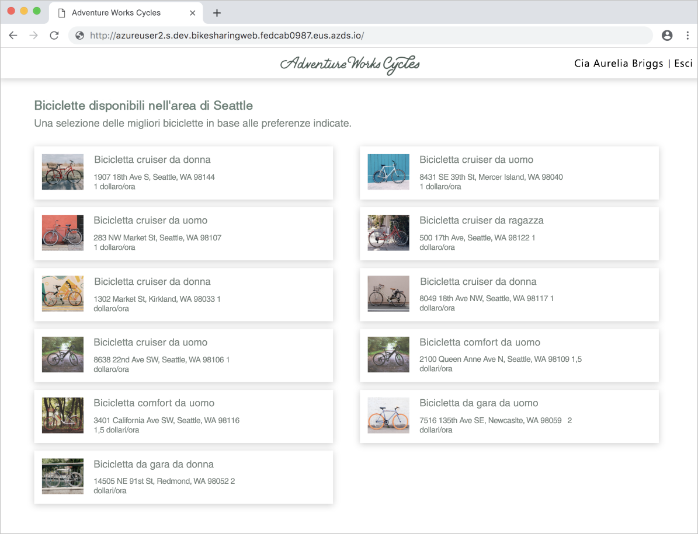

# <a name="quickstart-team-development-on-kubernetes-using-azure-dev-spaces"></a>Guida introduttiva: Sviluppo in team in Kubernetes tramite Azure Dev Spaces

In questa guida si apprenderà come:

- Configurare Azure Dev Spaces in un cluster Kubernetes gestito in Azure.
- Distribuire un'applicazione di grandi dimensioni con più microservizi in uno spazio di sviluppo.
- Testare un singolo microservizio in uno spazio di sviluppo isolato all'interno del contesto dell'applicazione completa.


## <a name="prerequisites"></a>Prerequisiti

- Una sottoscrizione di Azure. Se non si ha una sottoscrizione di Azure, è possibile creare un [account gratuito](https://azure.microsoft.com/free).
- [L'interfaccia della riga di comando di Azure installata](/cli/azure/install-azure-cli?view=azure-cli-latest).
- [Helm 2.13 o versioni successive installato](https://github.com/helm/helm/blob/master/docs/install.md).

## <a name="create-an-azure-kubernetes-service-cluster"></a>Creare un cluster del servizio Azure Kubernetes

È necessario creare un cluster del servizio Azure Kubernetes in un'[area supportata][supported-regions]. I comandi seguenti creano un gruppo di risorse denominato *MyResourceGroup* e un cluster del servizio Azure Kubernetes denominato *MyAKS*.

```cmd
az group create --name MyResourceGroup --location eastus
az aks create -g MyResourceGroup -n MyAKS --location eastus --node-vm-size Standard_DS2_v2 --node-count 1 --disable-rbac --generate-ssh-keys
```

Il cluster *MyAKS* viene creato anche con un nodo usando la dimensione *Standard_DS2_v2* e con Controllo degli accessi in base al ruolo disabilitato.

## <a name="enable-azure-dev-spaces-on-your-aks-cluster"></a>Abilitare Azure Dev Spaces nel cluster del servizio Azure Kubernetes

Usare il comando `use-dev-spaces` per abilitare Dev Spaces nel cluster del servizio Azure Kubernetes e seguire i prompt. Il comando seguente abilita Dev Spaces nel cluster *MyAKS* all'interno del gruppo *MyResourceGroup* e crea uno spazio di sviluppo denominato *dev*.

```cmd
az aks use-dev-spaces -g MyResourceGroup -n MyAKS --space dev --yes
```

## <a name="get-sample-application-code"></a>Ottenere il codice dell'applicazione di esempio

In questo articolo verrà usata l'[applicazione di esempio Bike Sharing di Azure Dev Spaces](https://github.com/Azure/dev-spaces/tree/master/samples/BikeSharingApp) per illustrare l'uso di Azure Dev Spaces.

Clonare l'applicazione da GitHub e passare alla relativa directory:

```cmd
git clone https://github.com/Azure/dev-spaces
cd dev-spaces/samples/BikeSharingApp/
```

## <a name="retrieve-the-hostsuffix-for-dev"></a>Recuperare il valore HostSuffix per *dev*

Usare il comando `azds show-context` per visualizzare il valore HostSuffix per *dev*.

```cmd
$ azds show-context

Name                ResourceGroup     DevSpace  HostSuffix
------------------  ----------------  --------  -----------------------
MyAKS               MyResourceGroup   dev       fedcab0987.eus.azds.io
```

## <a name="update-the-helm-chart-with-your-hostsuffix"></a>Aggiornare il grafico Helm con il valore HostSuffix

Aprire [charts/values.yaml](https://github.com/Azure/dev-spaces/blob/master/samples/BikeSharingApp/charts/values.yaml) e sostituire tutte le istanze di `<REPLACE_ME_WITH_HOST_SUFFIX>` con il valore HostSuffix recuperato in precedenza. Salvare le modifiche e chiudere il file.

## <a name="run-the-sample-application-in-kubernetes"></a>Eseguire l'applicazione di esempio in Kubernetes

I comandi per l'esecuzione dell'applicazione di esempio in Kubernetes fanno parte di un processo esistente e non presentano alcuna dipendenza dagli strumenti di Azure Dev Spaces. In questo caso, Helm è lo strumento usato per eseguire questa applicazione di esempio, ma potrebbero essere usati altri strumenti per eseguire l'intera applicazione in uno spazio dei nomi all'interno di un cluster. La destinazione dei comandi di Helm è lo spazio di sviluppo denominato *dev* creato in precedenza, ma questo spazio è anche uno spazio dei nomi Kubernetes. Di conseguenza, gli spazi di sviluppo possono essere la destinazione di altri strumenti come altri spazi dei nomi.

È possibile usare Azure Dev Spaces per lo sviluppo in team quando un'applicazione è in esecuzione in un cluster indipendentemente dagli strumenti usati per la distribuzione.

Usare i comandi `helm init` e `helm install` per configurare e installare l'applicazione di esempio in un cluster.

```cmd
cd charts/
helm init --wait
helm install -n bikesharing . --dep-up --namespace dev --atomic 
```
> [!Note]
> **Se si usa un cluster abilitato per il controllo degli accessi in base al ruolo**, è necessario configurare un [account del servizio per Tiller](https://helm.sh/docs/using_helm/#role-based-access-control). In caso contrario i comandi `helm` non funzionano.

Il completamento del comando `helm install` può richiedere alcuni minuti. L'output del comando mostra lo stato di tutti i servizi che ha distribuito nel cluster una volta completato:

```cmd
$ cd charts/
$ helm init --wait
...
Happy Helming!

$ helm install -n bikesharing . --dep-up --namespace dev --atomic

Hang tight while we grab the latest from your chart repositories...
...
NAME               READY  UP-TO-DATE  AVAILABLE  AGE
bikes              1/1    1           1          4m32s
bikesharingweb     1/1    1           1          4m32s
billing            1/1    1           1          4m32s
gateway            1/1    1           1          4m32s
reservation        1/1    1           1          4m32s
reservationengine  1/1    1           1          4m32s
users              1/1    1           1          4m32s
```

Dopo l'installazione dell'applicazione di esempio nel cluster e l'abilitazione di Dev Spaces nel cluster, usare il comando `azds list-uris` per visualizzare gli URL per l'applicazione di esempio nello spazio di sviluppo *dev* attualmente selezionato.

```cmd
$ azds list-uris
Uri                                                 Status
--------------------------------------------------  ---------
http://dev.bikesharingweb.fedcab0987.eus.azds.io/  Available
http://dev.gateway.fedcab0987.eus.azds.io/         Available
```

Passare al servizio *bikesharingweb* aprendo l'URL pubblico dal comando `azds list-uris`. Nell'esempio precedente l'URL pubblico per il servizio *bikesharingweb* è `http://dev.bikesharingweb.fedcab0987.eus.azds.io/`. Selezionare *Aurelia Briggs (customer)* come utente. Verificare che venga visualizzato il testo *Hi Aurelia Briggs | Sign out* nella parte superiore.



## <a name="create-child-dev-spaces"></a>Creare spazi di sviluppo figlio

Usare il comando `azds space select` per creare due spazi figlio al di sotto dello spazio di sviluppo *dev*:

```cmd
azds space select -n dev/azureuser1 -y
azds space select -n dev/azureuser2 -y
```

I comandi precedenti creano due spazi figlio al di sotto di *dev* denominati *azureuser1* e *azureuser2*. Questi due spazi figlio rappresentano spazi di sviluppo distinti per *azureuser1* e *azureuser2* degli sviluppatori da usare per apportare modifiche all'applicazione di esempio.

Usare il comando `azds space list` per elencare tutti gli spazi di sviluppo e verificare che *dev/azureuser2* sia selezionato.

```cmd
$ azds space list
Name            Selected
--------------  --------
default         False
dev             False
dev/azureuser1  False
dev/azureuser2  True
```

Usare `azds list-uris` per visualizzare gli URL per l'applicazione di esempio nello spazio attualmente selezionato, ovvero *dev/azureuser2*.

```cmd
$ azds list-uris
Uri                                                             Status
--------------------------------------------------              ---------
http://azureuser2.s.dev.bikesharingweb.fedcab0987.eus.azds.io/  Available
http://azureuser2.s.dev.gateway.fedcab0987.eus.azds.io/         Available
```

Verificare che gli URL visualizzati con il comando `azds list-uris` abbiano il prefisso *azureuser2.s.dev*. Questo prefisso conferma che lo spazio corrente selezionato è *azureuser2*, che è uno spazio figlio di *dev*.

Passare al servizio *bikesharingweb* per lo spazio di sviluppo *dev/azureuser2* aprendo l'URL pubblico dal comando `azds list-uris`. Nell'esempio precedente l'URL pubblico per il servizio *bikesharingweb* è `http://azureuser2.s.dev.bikesharingweb.fedcab0987.eus.azds.io/`. Selezionare *Aurelia Briggs (customer)* come utente. Verificare che venga visualizzato il testo *Hi Aurelia Briggs | Sign out* nella parte superiore.

## <a name="update-code"></a>Aggiornare il codice

Aprire *BikeSharingWeb/components/Header.js* con un editor di testo e modificare il testo nell'[elemento span usando il valore di className `userSignOut`](https://github.com/Azure/dev-spaces/blob/master/samples/BikeSharingApp/BikeSharingWeb/components/Header.js#L16).

```html
<span className="userSignOut">
    <Link href="/devsignin"><span tabIndex="0">Welcome {props.userName} | Sign out</span></Link>
</span>
```

Salvare le modifiche e chiudere il file.

## <a name="build-and-run-the-updated-bikesharingweb-service-in-the-devazureuser2-dev-space"></a>Compilare ed eseguire il servizio aggiornato bikesharingweb nello spazio di sviluppo *dev/azureuser2*

Passare alla directory *BikeSharingWeb/* ed eseguire il comando `azds up`.

```cmd
$ cd ../BikeSharingWeb/
$ azds up

Using dev space 'dev/azureuser2' with target 'MyAKS'
Synchronizing files...2s
...
Service 'bikesharingweb' port 'http' is available at http://azureuser2.s.dev.bikesharingweb.fedcab0987.eus.azds.io/
Service 'bikesharingweb' port 80 (http) is available at http://localhost:54256
...
```

Il comando crea ed esegue il servizio *bikesharingweb* nello spazio di sviluppo *dev/azureuser2*. Questo servizio viene eseguito oltre al servizio *bikesharingweb* in esecuzione nello spazio di sviluppo *dev* e viene usato solo per le richieste con il prefisso di URL *azureuser2.s*. Per altre informazioni sul funzionamento del routing tra spazi di sviluppo padre e figlio, vedere [Funzionamento e configurazione di Azure Dev Spaces](how-dev-spaces-works.md).

Passare al servizio *bikesharingweb* per lo spazio di sviluppo *dev/azureuser2* aprendo l'URL pubblico visualizzato nell'output del comando `azds up`. Selezionare *Aurelia Briggs (customer)* come utente. Verificare che in alto a destra sia visualizzato il testo aggiornato. Se questa modifica non è immediatamente visibile, potrebbe essere necessario aggiornare la pagina o cancellare la cache del browser.


## <a name="verify-other-dev-spaces-are-unchanged"></a>Verificare che gli altri spazi di sviluppo siano rimasti invariati

Se il comando `azds up` è ancora in esecuzione, premere *CTRL+C*.

```cmd
$ azds list-uris --all
Uri                                                             Status
--------------------------------------------------              ---------
http://azureuser1.s.dev.bikesharingweb.fedcab0987.eus.azds.io/  Available
http://azureuser1.s.dev.gateway.fedcab0987.eus.azds.io/         Available
http://azureuser2.s.dev.bikesharingweb.fedcab0987.eus.azds.io/  Available
http://azureuser2.s.dev.gateway.fedcab0987.eus.azds.io/         Available
http://dev.bikesharingweb.fedcab0987.eus.azds.io/               Available
http://dev.gateway.fedcab0987.eus.azds.io/                      Available
```

Passare alla versione *dev* di *bikesharingweb* nel browser, scegliere *Aurelia Briggs (customer)* come utente e verificare che in alto a destra venga visualizzato il testo originale. Ripetere questi passaggi con l'URL *dev/azureuser1*. Si noti che le modifiche vengono applicate solo alla versione *dev/azureuser2* di *bikesharingweb*. Questo isolamento delle modifiche apportate a *dev/azureuser2* consente ad *azureuser2* di apportare modifiche senza effetti su *azureuser1*.

Affinché queste modifiche vengano applicate a *dev* e *dev/azureuser1*, è necessario seguire la pipeline CI/CD o il flusso di lavoro esistente del team. Ad esempio, questo flusso di lavoro può richiedere il commit della modifica nel sistema di controllo delle versioni e la distribuzione dell'aggiornamento tramite una pipeline CI/CD o strumenti come Helm.

## <a name="clean-up-your-azure-resources"></a>Pulire le risorse di Azure

```cmd
az group delete --name MyResourceGroup --yes --no-wait
```

## <a name="next-steps"></a>Passaggi successivi

Informazioni su come Azure Dev Spaces consente di sviluppare app più complesse in più contenitori e su come è possibile semplificare lo sviluppo collaborativo usando versioni o rami diversi del codice in spazi diversi.

> [!div class="nextstepaction"]
> [Uso di più contenitori e sviluppo in team](multi-service-nodejs.md)


[supported-regions]: about.md#supported-regions-and-configurations
