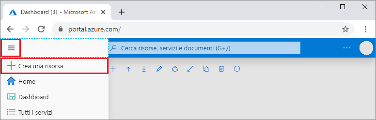
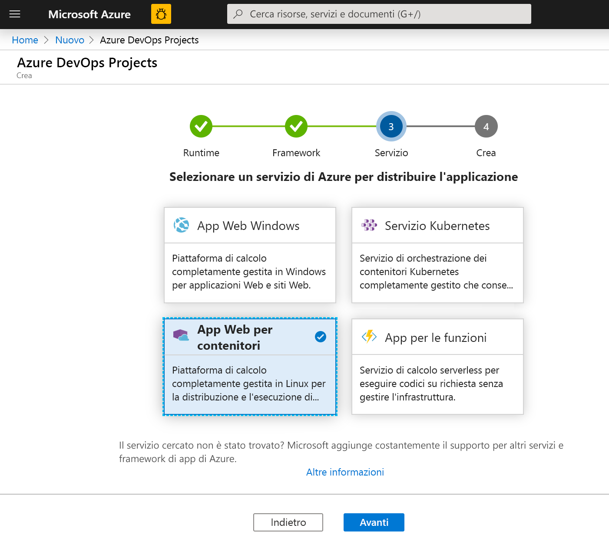
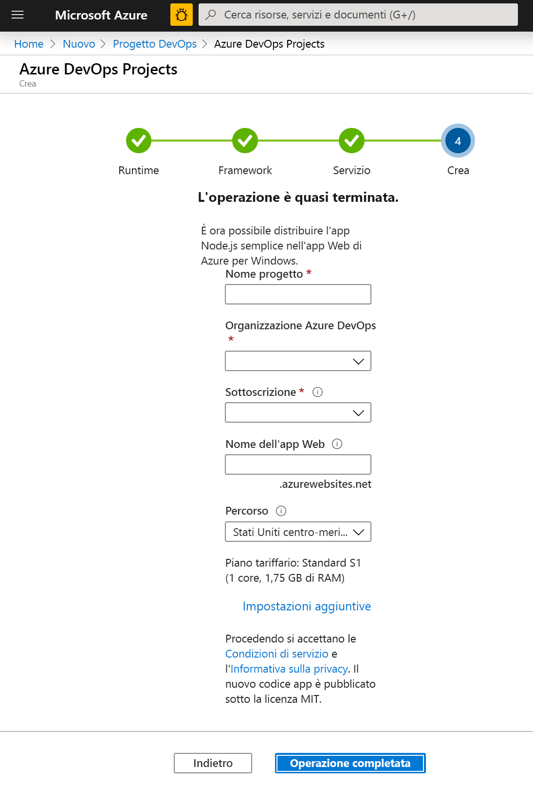
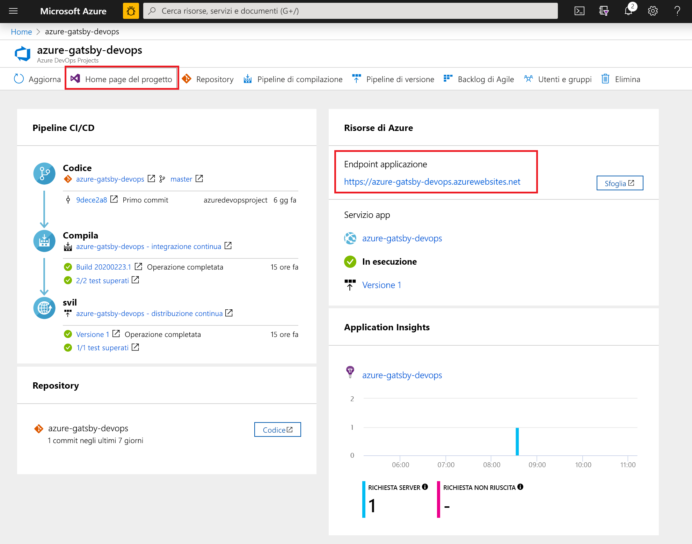
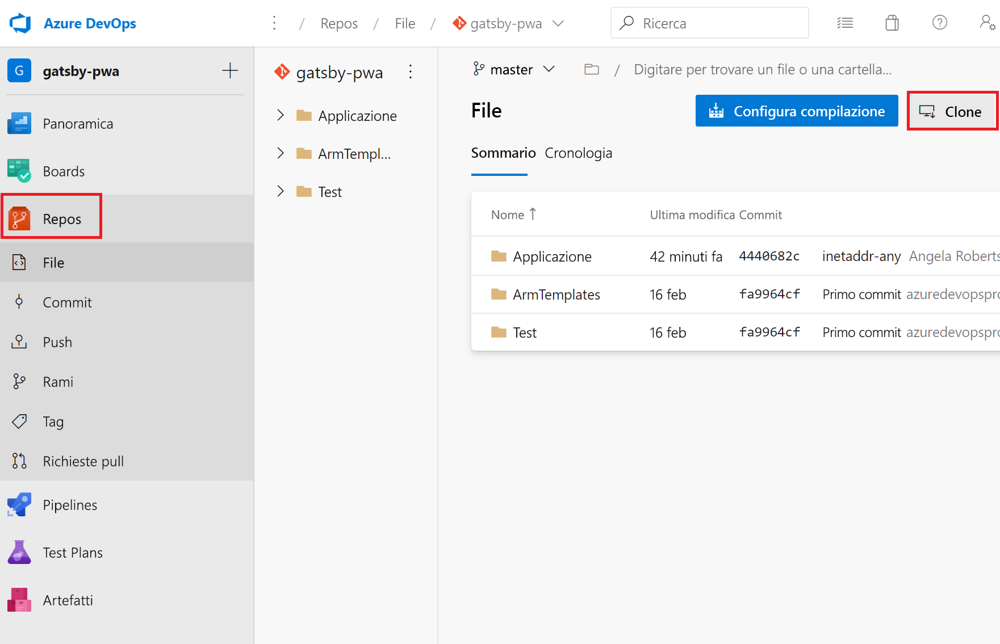
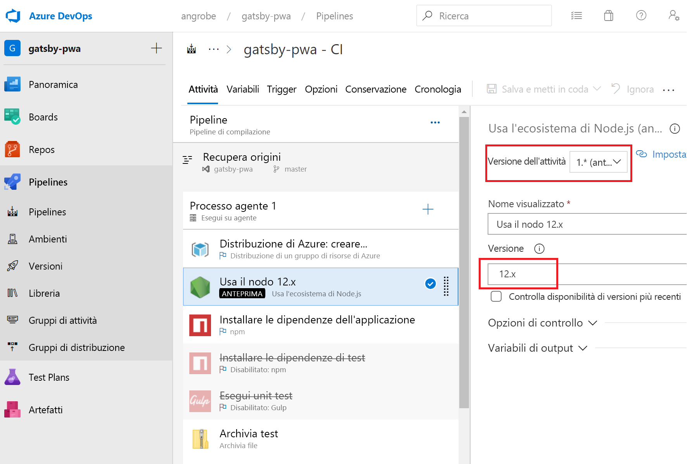
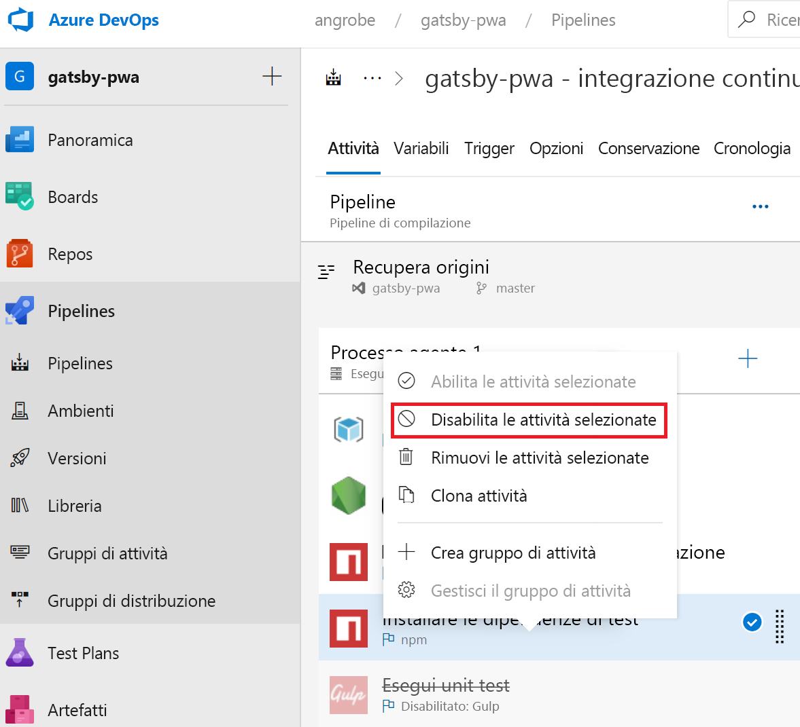
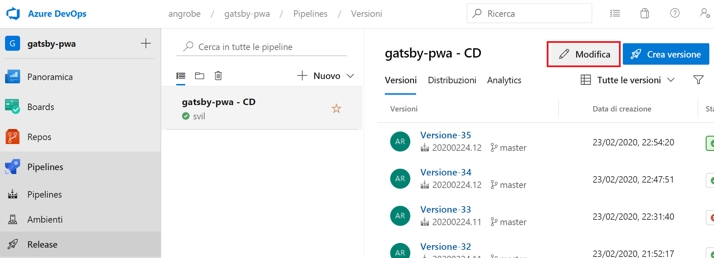
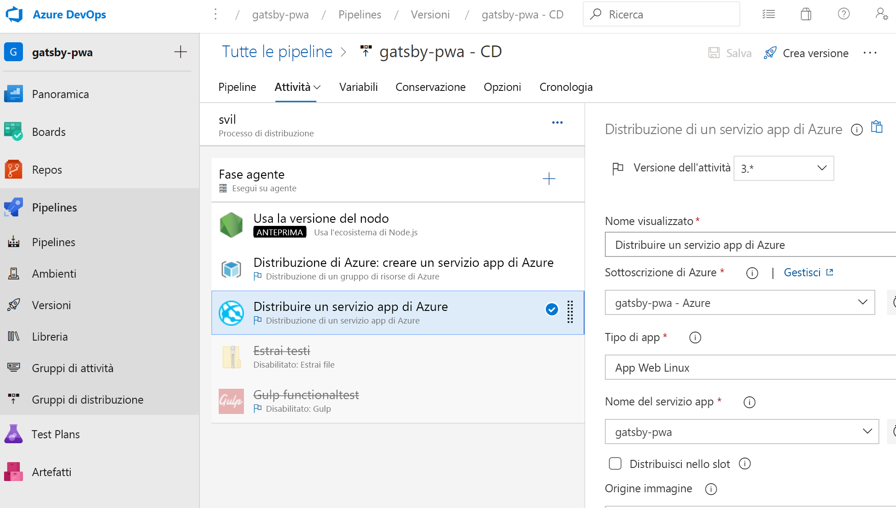

# <a name="create-a-cicd-pipeline-in-azure-pipelines-for-nodejs-with-azure-devops-starter"></a>Creare una pipeline CI/CD in Azure Pipelines per Node.js con Azure DevOps Starter

Questa guida di avvio rapido illustra come creare un'app Web progressiva usando [GatsbyJS](https://www.gatsbyjs.org/) e l'esperienza di creazione semplificata di creazione di Azure DevOps Starter. Al termine, sarà disponibile una pipeline di integrazione continua e distribuzione continua (CI/CD) per l'app Web progressiva in Azure Pipelines. Azure DevOps Starter configura tutto il necessario per lo sviluppo, la distribuzione e il monitoraggio.

## <a name="prerequisites"></a>Prerequisiti

- Un account Azure con una sottoscrizione attiva. [Creare un account gratuitamente](https://azure.microsoft.com/free/?ref=microsoft.com&utm_source=microsoft.com&utm_medium=docs&utm_campaign=visualstudio). 
- Un'organizzazione di [Azure DevOps](https://azure.microsoft.com/services/devops/).

## <a name="sign-in-to-the-azure-portal"></a>Accedere al portale di Azure

DevOps Starter crea una pipeline CI/CD in Azure Pipelines. È possibile creare una nuova organizzazione di Azure DevOps o usare un'organizzazione esistente. DevOps Starter crea anche risorse di Azure nella sottoscrizione di Azure selezionata.

1. Accedere al [portale di Azure](https://portal.azure.com) e, nel riquadro sinistro, selezionare **Crea una risorsa**. 

   

1. Nella casella di ricerca digitare **DevOps Starter** e quindi selezionare. Fare clic su **Aggiungi** per crearne una nuova.

    

## <a name="select-a-sample-application-and-azure-service"></a>Selezionare un'applicazione di esempio e un servizio di Azure

1. Selezionare l'applicazione di esempio Node.js.   

     

1. Il framework di esempio predefinito è **Express.js**. Modificare la selezione impostandola su **App Node.js semplice** e quindi selezionare **Avanti**. 

     

1. Le destinazioni di distribuzione disponibili in questo passaggio sono determinate dal framework applicazione selezionato nel passaggio 2. In questo esempio la destinazione di distribuzione predefinita è **App Web Windows**. Lasciare impostata l'opzione **App Web per contenitori** e selezionare **Avanti**.

    

## <a name="configure-a-project-name-and-an-azure-subscription"></a>Configurare un nome di progetto e una sottoscrizione di Azure

1. Nel passaggio finale del flusso di lavoro di creazione di DevOps Starter assegnare un nome al progetto, selezionare una sottoscrizione di Azure e selezionare **Fine**.  

    

1. Quando il progetto viene compilato e l'applicazione viene distribuita in Azure, viene visualizzata una pagina di riepilogo. Dopo alcuni istanti, nell'[organizzazione di Azure DevOps](https://dev.azure.com/) viene creato un progetto che include un repository git, una lavagna Kanban, una pipeline di distribuzione, piani di test e gli artefatti necessari per l'app.  

## <a name="managing-your-project"></a>Gestione del progetto

1. Passare a **Tutte le risorse** e trovare il progetto DevOps Starter. Selezionare il progetto **DevOps Starter**.

    

1. Si verrà indirizzati a un dashboard che fornisce visibilità nella Home page del progetto, nel repository del codice, nella pipeline CI/CD e un collegamento all'app in esecuzione. Selezionare la **Home page del progetto** per visualizzare l'applicazione in **Azure DevOps** e, in un'altra scheda del browser, selezionare **Endpoint applicazione** per visualizzare l'app di esempio attiva. Questo esempio verrà modificato in un secondo momento per usare l'app Web progressiva generata da GatsbyJS.

     

1. Dal progetto Azure DevOps è possibile invitare i membri del team a collaborare e stabilire una lavagna Kanban per iniziare a monitorare le attività. Per altre informazioni, vedere [qui](https://docs.microsoft.com/azure/devops/user-guide/what-is-azure-devops?view=azure-devops).


## <a name="clone-the-repo-and-install-your-gatsby-pwa"></a>Clonare il repository e installare l'app Web progressiva Gatsby

DevOps Starter crea un repository git in Azure Repos o in GitHub. Questo esempio ha creato un repository in Azure Repos. Nel passaggio successivo verrà clonato il repository e verranno apportate le modifiche.

1. Selezionare **Repos** dal **progetto DevOps** e quindi fare clic su **Clona**.  Sono disponibili vari meccanismi per clonare il repository Git nel desktop.  Scegliere quello più adatto in base all'esperienza di sviluppo.  

    

1. Dopo aver clonato il repository nel desktop, apportare alcune modifiche al modello di base. Per iniziare, installare l'interfaccia della riga di comando di GatsbyJS dal terminale.

   ```powershell
    npm install -g gatsby
   ```

1. Dal terminale passare alla radice del repository. Dovrebbe contenere tre cartelle simili a queste:

    ```powershell
    Mode                LastWriteTime         Length Name
    ----                -------------         ------ ----
    d-----        2/23/2020  10:42 PM                Application
    d-----        2/23/2020   3:05 PM                ArmTemplates
    d-----        2/23/2020   3:05 PM                Tests
    ```
    
1. È necessario evitare che tutti i file si trovino nella cartella Application perché verranno sostituiti con quelli di un modello di base di Gatsby. Eseguire i comandi seguenti in ordine sequenziale per ridurla.
    
    ```powershell
    cp .\Application\Dockerfile .
    rmdir Application
    ```

1. Usare l'interfaccia della riga di comando di Gatsby per generare un'app Web progressiva di esempio. Eseguire `gatsby new` dal terminale per avviare la creazione guidata dell'app Web progressiva e selezionare `gatsby-starter-blog` come modello di base. L'aspetto sarà simile al seguente:

    ```powershell
    c:\myproject> gatsby new
    √ What is your project called? ... my-gatsby-project
    ? What starter would you like to use? » - Use arrow-keys. Return to submit.
        gatsby-starter-default
        gatsby-starter-hello-world
    >   gatsby-starter-blog
        (Use a different starter)
    ```
    
1. Ora è disponibile una cartella denominata `my-gatsby-project`. Rinominarla in `Application` e copiare il documento `Dockerfile` al suo interno.
    
    ```powershell
    mv my-gatsby-project Application
    mv Dockerfile Application
    ```
    
1. Nell'editor preferito aprire il documento Dockerfile e modificare la prima riga `FROM node:8` sostituendola con `FROM node:12`. Questa modifica garantisce che il contenitore usi Node.js versione 12.x anziché la versione 8.x. GatsbyJS richiede versioni più moderne di Node.js.

1. Successivamente, aprire il file package.json nella cartella Application e modificare il [campo scripts](https://docs.npmjs.com/files/package.json#scripts) per assicurarsi che i server di sviluppo e di produzione siano in ascolto su tutte le interfacce di rete disponibili, ad esempio 0.0.0.0, e sulla porta 80. Senza queste impostazioni, il servizio app contenitore non è in grado di instradare il traffico all'app Node.js in esecuzione all'interno del contenitore. Il campo `scripts` dovrebbe essere simile a quello riportato di seguito. In particolare, sarà necessario modificare i valori predefiniti per le destinazioni `develop`, `serve` e `start`.

    ```json
      "scripts": {
        "build": "gatsby build",
        "develop": "gatsby develop  -H 0.0.0.0 -p 80",
        "format": "prettier --write \"**/*.{js,jsx,json,md}\"",
        "start": "npm run serve",
        "serve": "npm run build && gatsby serve -H 0.0.0.0 -p 80",
        "clean": "gatsby clean",
        "test": "echo \"Write tests! -> https://gatsby.dev/unit-testing\" && exit 1"
      }
    ```
    
## <a name="edit-your-cicd-pipelines"></a>Modificare le pipeline CI/CD

1. Prima di eseguire il commit del codice nella sezione precedente, apportare alcune modifiche alle pipeline di compilazione e versione. Modificare la 'Pipeline di compilazione' e aggiornare l'attività Node per l'uso di Node.js versione 12.x. Impostare il campo **Versione dell'attività** su 1.x e il campo **Versione** su 12.x.

    

1. In questa guida di avvio rapido non vengono creati unit test, di conseguenza questi passaggi verranno disabilitati nella pipeline di compilazione. Quando verranno scritti i test, sarà possibile riabilitare questi passaggi. Fare clic con il pulsante destro del mouse per selezionare le attività **Installa dipendenze test** e **Esegui unit test** e disabilitarle.

    

1. Modificare la pipeline di versione.

    

1. Come per la pipeline di compilazione, modificare l'attività Node affinché usi la versione 12.x e disabilitare le due attività di test. La versione dovrebbe essere simile a questo screenshot.

    

1. Sul lato sinistro del browser passare al file **views/index.pug**.

1. Selezionare **Modifica** e quindi apportare una modifica al titolo h2.  Ad esempio, immettere **Iniziare subito con Azure DevOps Starter** o apportare altre modifiche.

1. Selezionare **Esegui commit** e quindi salvare le modifiche.

1. Nel browser passare al dashboard di DevOps Starter.   
Verrà visualizzata una compilazione in corso. Le modifiche apportate vengono automaticamente compilate e distribuite tramite una pipeline di CI/CD.

## <a name="commit-your-changes-and-examine-the-azure-cicd-pipeline"></a>Eseguire il commit delle modifiche ed esaminare la pipeline di CI/CD di Azure

Nei due passaggi precedenti è stata aggiunta un'app Web progressiva generata da Gatsby al repository git e sono state modificate le pipeline per compilare e distribuire il codice. È possibile eseguire il commit del codice e osservare lo stato di avanzamento attraverso la pipeline di compilazione e versione.

1. Dalla radice del repository git del progetto in un terminale, usare i comandi seguenti per eseguire il push del codice nel progetto Azure DevOps:

    ```powershell
    git add .
    git commit -m "My first Gatsby PWA"
    git push
    ```
    
1. La compilazione viene avviata non appena l'operazione `git push` viene completata. È possibile seguire lo stato di avanzamento dal **Dashboard di Azure DevOps**.

3. Dopo alcuni minuti, le pipeline di compilazione e di versione verranno completate e l'app Web progressiva verrà distribuita in un contenitore. Fare clic sul collegamento **Endpoint applicazione** dal dashboard precedente per visualizzare un progetto di base Gatsby per i blog.

## <a name="clean-up-resources"></a>Pulire le risorse

Quando non servono più, è possibile eliminare il Servizio app di Azure e altre risorse correlate creati in precedenza. Usare la funzionalità **Elimina** del dashboard di DevOps Starter.

## <a name="next-steps"></a>Passaggi successivi

Quando si configura il processo di CI/CD, le pipeline di compilazione e versione vengono create automaticamente. È possibile modificare queste pipeline di compilazione e di versione in base alle esigenze del team. Per altre informazioni sulla pipeline CI/CD, vedere:

> [!div class="nextstepaction"]
> [Personalizzare il processo di distribuzione continua](https://docs.microsoft.com/azure/devops/pipelines/release/define-multistage-release-process?view=vsts)

