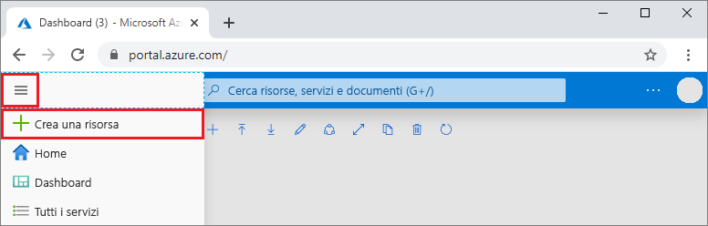

# Creare una pipeline CI/CD per Python con Azure DevOps Projects

Azure DevOps Projects offre un'esperienza semplificata per la creazione di risorse di Azure e la configurazione di una pipeline di integrazione continua (CI, Continuous Integration) e recapito continuo (CD, Continuous Delivery) per l'app Python.  

Se non si ha ancora una sottoscrizione di Azure, è possibile ottenerne una gratuita tramite [Visual Studio Dev Essentials](https://visualstudio.microsoft.com/dev-essentials/).

## Accedere al portale di Azure

 DevOps Projects crea una pipeline CI/CD in Azure Pipelines.  È possibile creare una nuova organizzazione gratuita di Azure DevOps o usare un'organizzazione esistente. DevOps Projects crea anche risorse di Azure nella sottoscrizione di Azure di propria scelta.

1. Accedere al [portale di Microsoft Azure](https://portal.azure.com).

2. Selezionare **Crea una risorsa** nel riquadro a sinistra e quindi cercare **DevOps Projects**.  

3. Selezionare **Create**.

    

## Selezionare un'applicazione di esempio e un servizio di Azure

1. Selezionare l'applicazione di esempio Python. Gli esempi di Python includono diversi framework applicazione.

1. Il framework di esempio predefinito è Django. Lasciare l'impostazione predefinita e quindi selezionare **Avanti**.    
La destinazione della distribuzione predefinita è App Web per contenitori. Il framework applicazione, scelto in precedenza, determina il tipo di destinazione della distribuzione del servizio di Azure disponibile. 

3. Lasciare il servizio predefinito e quindi selezionare **Avanti**.
 
## Configurare Azure DevOps e una sottoscrizione di Azure 

1. Creare una nuova organizzazione di Azure DevOps Services o scegliere un'organizzazione esistente. 

    a. Immettere un nome per il progetto in Azure DevOps.  

    b. Selezionare la sottoscrizione di Azure e la posizione, immettere un nome per l'applicazione, quindi selezionare **Fine**.  
     Dopo pochi minuti, il dashboard del progetto viene visualizzato nel portale di Azure. Viene configurata un'applicazione di esempio in un repository nell'organizzazione Azure DevOps, viene eseguita una compilazione e l'applicazione viene distribuita in Azure. Questo dashboard fornisce visibilità su repository di codice, pipeline CI/CD e applicazione in Azure.  
    
2. Selezionare **Sfoglia** per visualizzare l'applicazione in esecuzione.

     
    
   DevOps Projects configura automaticamente un trigger di compilazione e di versione di integrazione continua. A questo punto, si è pronti per collaborare con un team a un'app Python usando un processo di CI/CD che distribuisce automaticamente il lavoro più recente nel sito Web.

## Eseguire il commit delle modifiche al codice e la pipeline di CI/CD

 DevOps Projects crea un repository Git in Azure Repos o GitHub. Per visualizzare il repository e apportare modifiche al codice nell'applicazione, seguire questa procedura: 

1. Sul lato sinistro del dashboard di DevOps Projects selezionare il collegamento per il ramo master.  
        Questo collegamento apre una visualizzazione del repository Git appena creato.

1. Per visualizzare l'URL clone del repository, selezionare **Clona** in alto a destra nel browser.   
È possibile clonare il repository Git nell'IDE preferito.  Nei passaggi successivi, è possibile usare il Web browser per apportare modifiche al codice ed eseguirne il commit direttamente nel ramo master.

1. A sinistra, passare al file **app/templates/app/index.html**.

1. Selezionare **Modifica** e apportare una modifica al testo. Modificare, ad esempio, una parte del testo per uno dei tag div.

1. Selezionare **Esegui commit** e quindi salvare le modifiche.

1. Nel browser passare al dashboard di DevOps Projects.   
    Verrà visualizzata una compilazione in corso. Le modifiche appena apportate vengono compilate e distribuite automaticamente con una pipeline CI/CD.

## Esaminare la pipeline CI/CD

Nel passaggio precedente, DevOps Projects ha configurato automaticamente una pipeline CI/CD completa. Esplorare e personalizzare la pipeline in base alle esigenze. Per acquisire familiarità con le pipeline di compilazione e di versione eseguire questa procedura:

1. Selezionare **Pipeline di compilazione** nella parte superiore di DevOps Projects.  
In una scheda del browser viene visualizzata la pipeline di compilazione per il nuovo progetto.

1. Puntare al campo **Stato** e quindi selezionare i **puntini di sospensione** (...).  
        Un menu mostra diverse opzioni, ad esempio accodare una nuova compilazione, sospendere una compilazione e modificare la pipeline di compilazione.

1. Selezionare **Modifica**.

1. In questo riquadro è possibile esaminare le diverse attività per la pipeline di compilazione.  
        La compilazione esegue diverse attività, ad esempio il recupero delle origini dal repository Git, il ripristino delle dipendenze e la pubblicazione degli output per le distribuzioni.

1. Nella parte superiore della pipeline di compilazione selezionare il nome della pipeline di compilazione.

1. Modificare il nome della pipeline di compilazione scegliendo un testo più descrittivo, selezionare **Salva e accoda**, quindi selezionare **Salva**.

1. Sotto il nome della pipeline di compilazione selezionare **Cronologia**.  
        Verrà visualizzato un log di controllo delle modifiche recenti per la compilazione.  Azure DevOps tiene traccia di tutte le modifiche apportate alla pipeline di compilazione e consente di confrontare le versioni.

1. Selezionare **Trigger**.  
         DevOps Projects crea automaticamente un trigger di integrazione continua e ogni commit nel repository avvia una nuova compilazione.  Facoltativamente, è possibile scegliere di includere o escludere rami dal processo di integrazione continua.

1. Selezionare **Conservazione**.  
        A seconda dello scenario specifico, è possibile indicare i criteri per conservare o rimuovere un determinato numero di compilazioni.

1. Selezionare **Compilazione e versione** e quindi scegliere **Versioni**.   
 DevOps Projects crea una pipeline di versione per gestire le distribuzioni in Azure.

1. Selezionare i puntini di sospensione accanto alla pipeline di versione e quindi scegliere **Modifica**.  
La pipeline di versione definisce il processo di creazione della versione.  
        
12. In **Artefatti** selezionare **Elimina**.   
La pipeline di compilazione esaminata nei passaggi precedenti produce l'output usato per l'artefatto. 

1. Accanto all'icona **Elimina** selezionare **Trigger di distribuzione continua**.  
        La pipeline di versione ha un trigger di distribuzione continua abilitato, che esegue una distribuzione ogni volta che è disponibile un nuovo artefatto di compilazione. Facoltativamente, è possibile disabilitare il trigger, in modo che le distribuzioni richiedano l'esecuzione manuale. 

1. A sinistra selezionare **Attività**.   
Le attività sono le operazioni eseguite dal processo di distribuzione. In questo esempio è stata creata un'attività per la distribuzione in Servizio app di Azure.

1. A destra, selezionare **Visualizza versioni** per visualizzare una cronologia delle versioni.  
        
1. Selezionare i puntini di sospensione (...) accanto a una delle versioni e quindi selezionare **Apri**.  
        In questa visualizzazione ci sono diversi menu da esplorare, ad esempio un riepilogo delle versioni, gli elementi di lavoro associati e i test.

1. Selezionare **Commit**. 
        Questa visualizzazione mostra i commit di codice associati alla distribuzione specifica. 

1. Selezionare **Log**.   
I log contengono informazioni utili sul processo di distribuzione. È possibile visualizzarli durante e dopo le distribuzioni.

## Pulire le risorse

Quando non servono più, è possibile eliminare il Servizio app di Azure e le risorse correlate. Usare la funzionalità **Elimina** nel dashboard di DevOps Projects.

## Passaggi successivi

Quando è stato configurato il processo di CI/CD, sono state create automaticamente pipeline di compilazione e di versione. È possibile modificare queste pipeline di compilazione e di versione in base alle esigenze del team. Per altre informazioni sulla pipeline CI/CD, vedere:

> [!div class="nextstepaction"]
> [Personalizzare il processo di distribuzione continua](https://docs.microsoft.com/azure/devops/pipelines/release/define-multistage-release-process?view=vsts)
