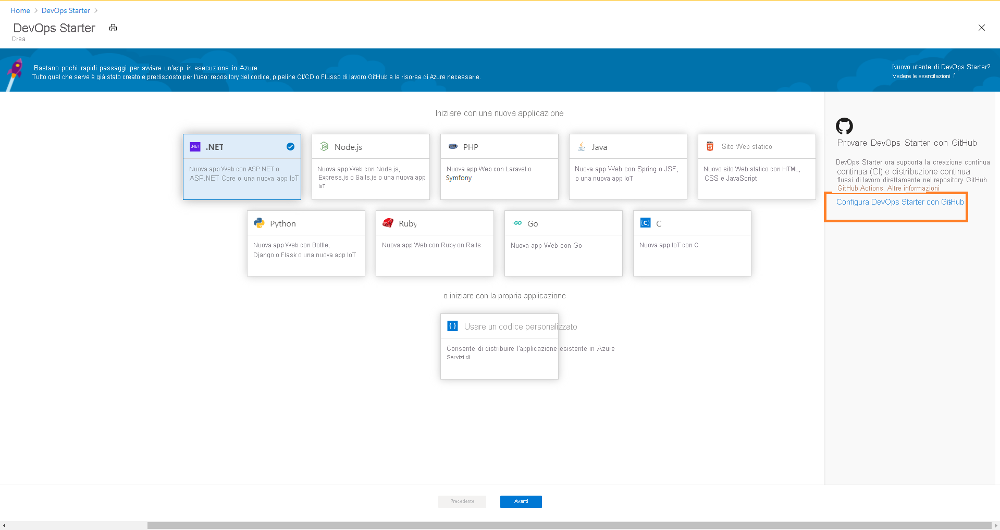

# Configurare CI/CD per un'app Node.js con DevOps Starter tramite GitHub Actions

In questa guida di avvio rapido si usa l'esperienza semplificata di DevOps Starter per configurare un flusso di lavoro di integrazione continua (CI) e distribuzione continua (CD) per un'app Node.js usando GitHub Actions. È possibile usare DevOps Starter per configurare tutti gli elementi necessari per lo sviluppo, la distribuzione e il monitoraggio dell'app. 

## Prerequisiti

- Un account Azure con una sottoscrizione attiva. [Creare un account gratuitamente](https://azure.microsoft.com/free/?ref=microsoft.com&utm_source=microsoft.com&utm_medium=docs&utm_campaign=visualstudio). 
- Un account [GitHub](https://github.com/).

## Accedere al portale di Azure

DevOps Starter crea un flusso di lavoro CI/CD tramite GitHub Actions. DevOps Starter crea anche risorse di Azure nella sottoscrizione di Azure selezionata.

1. Accedere al [portale di Azure](https://portal.azure.com).

1. Nella casella di ricerca digitare **DevOps Starter** e quindi selezionare. Fare clic su **Aggiungi** per crearne una nuova.

    

## Selezionare un'applicazione di esempio e un servizio di Azure

1. Fare clic su **Configura DevOps Starter con GitHub** nel banner sul lato destro.

    

1. Verificare che il provider CI/CD selezionato sia **GitHub Actions** .

    

1. Selezionare l'applicazione di esempio **Node.js** . Gli esempi di Node.js includono diversi framework applicazione.

1. Il framework di esempio predefinito è **Express.js** . Lasciare l'impostazione predefinita e quindi selezionare **Avanti** .   

2. La destinazione predefinita della distribuzione è App Web Windows. Il framework applicazione, scelto in precedenza, determina il tipo di destinazione della distribuzione del servizio di Azure disponibile. Lasciare il servizio predefinito e quindi selezionare **Avanti** .
 
## Configurare un account GitHub e una sottoscrizione di Azure 

1. Eseguire l'autenticazione con GitHub.

   1. Fare clic sul pulsante **Autorizza** . 
   
   1. Accedere a GitHub. Se non si ha un account GitHub, è anche possibile iscriversi qui.

2. Scegliere un' **organizzazione di GitHub** esistente. 
   
   1. Scegliere un nome per il repository GitHub. 
   
   1. Selezionare la sottoscrizione di Azure e la posizione, scegliere un nome per l'applicazione, quindi selezionare **Fine** .
    
       

    Dopo alcuni minuti, il dashboard di DevOps Starter viene visualizzato nel portale di Azure. Viene configurata un'applicazione di esempio in un repository nell'organizzazione di Azure DevOps, viene attivato un flusso di lavoro GitHub, quindi l'applicazione viene distribuita in Azure. Questo dashboard fornisce visibilità sul repository di codice, il flusso di lavoro GitHub e l'applicazione in Azure.
   
3. Selezionare **Sfoglia** per visualizzare l'applicazione in esecuzione.
    
    Il dashboard contiene informazioni dettagliate sul flusso di lavoro GitHub e sulle risorse di Azure. Per visualizzare i dettagli del flusso di lavoro GitHub, come l'ultima esecuzione, i commit e lo stato dei processi, è necessario **autorizzare l'accesso a GitHub** .
   
   

DevOps Starter ha configurato automaticamente un flusso di lavoro GitHub con i processi di compilazione e distribuzione tramite GitHub Actions. A questo punto, si è pronti per collaborare con un team a un'app Node.js con un processo di CI/CD che distribuisce automaticamente il lavoro più recente nel sito Web.

   

## Eseguire il commit delle modifiche al codice e la pipeline di CI/CD

DevOps Starter crea un repository in GitHub. Per visualizzare il repository e apportare modifiche al codice nell'applicazione, seguire questa procedura:

1. Sul lato sinistro del dashboard di DevOps Starter selezionare il collegamento per il ramo master. Questo collegamento apre una visualizzazione del repository GitHub appena creato.

1. Per visualizzare l'URL clone del repository, selezionare **Clona** in alto a destra nel browser. È possibile clonare il repository Git nell'IDE preferito. Nei passaggi successivi, è possibile usare il Web browser per apportare modifiche al codice ed eseguirne il commit direttamente nel ramo master.

1. Sul lato sinistro del browser passare al file **/Application/views/index.pug** .

1. Selezionare **Modifica** e quindi apportare una modifica al testo.
    Cambiare, ad esempio, una parte del testo di uno dei tag.

1. Selezionare **Esegui commit** e quindi salvare le modifiche.

1. Nel browser passare al dashboard di DevOps Starter.   
A questo punto si dovrebbe vedere un processo di compilazione del flusso di lavoro GitHub in corso. Le modifiche apportate vengono compilate e distribuite automaticamente tramite un flusso di lavoro GitHub.

## Visualizzare il flusso di lavoro GitHub

Nel passaggio precedente DevOps Starter ha configurato automaticamente un flusso di lavoro GitHub completo. Esplorare e personalizzare il flusso di lavoro in base alle esigenze. Eseguire questa procedura per acquisire familiarità con il flusso di lavoro.

1. Sul lato sinistro del dashboard di DevOps Starter selezionare **Flusso di lavoro GitHub** . Questo collegamento apre una scheda del browser e il flusso di lavoro GitHub per il nuovo progetto.
    > [!NOTE]
    > Non rinominare il file del flusso di lavoro. Il nome del file deve essere **devops-starter-workflow.yml** affinché le modifiche vengano visualizzate nel dashboard

1. Il file YAML del flusso di lavoro contiene tutte istanze di GitHub Actions necessarie per compilare e distribuire l'applicazione. Fare clic sull'opzione **Modifica file** per personalizzare il file del flusso di lavoro.

1. Nella scheda **Codice** del repository fare clic su **Commit** . Questa visualizzazione mostra i commit di codice associati alla distribuzione specifica.

1. Nella scheda **Azioni** del repository è possibile visualizzare la cronologia di tutte le esecuzioni del flusso di lavoro del repository.

1. Selezionare l' **ultima esecuzione** per visualizzare tutti i processi eseguiti nel flusso di lavoro.

1. Fare clic su **Processi** per visualizzare i log dettagliati dell'esecuzione del flusso di lavoro. I log contengono informazioni utili sul processo di distribuzione. Possono essere visualizzati durante e dopo le distribuzioni.

1. Fare clic sulla scheda **Richiesta pull** per visualizzare tutte le richieste pull nel repository

## Pulire le risorse

Quando non servono più, è possibile eliminare il Servizio app di Azure e altre risorse correlate. Usare la funzionalità **Elimina** del dashboard di DevOps Starter.

## Passaggi successivi

Quando è stato configurato il processo CI/CD, è stato automaticamente creato il flusso di lavoro GitHub. È possibile modificare questo flusso di lavoro in base alle esigenze del team. Per altre informazioni su GitHub Actions e i flussi di lavoro, vedere:

> [!div class="nextstepaction"]
> [Personalizzare un flusso di lavoro GitHub](https://docs.github.com/actions/configuring-and-managing-workflows/configuring-and-managing-workflow-files-and-runs)
