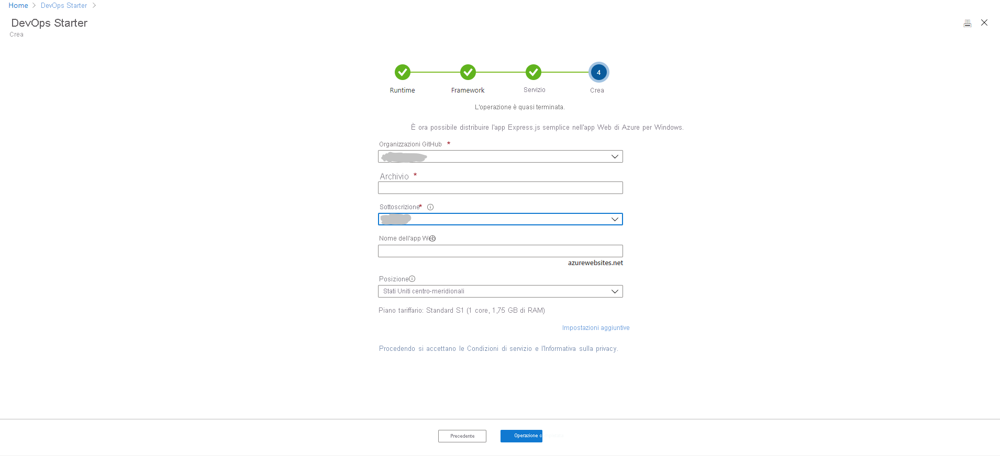

# Esercitazione: Distribuire un'app Node.js in App Web di Azure usando DevOps Starter per GitHub Actions

DevOps Starter per GitHub Actions offre un'esperienza semplificata in cui è possibile scegliere un'applicazione di esempio per creare un flusso di lavoro di integrazione continua (CI, Continuous Integration) e recapito continuo (CD, Continuous Delivery) da distribuire in Azure. 

DevOps Starter consente inoltre di effettuare le seguenti operazioni:
* Creare automaticamente risorse di Azure, ad esempio una nuova app Web di Azure.
* Creare e configurare un flusso di lavoro in GitHub che include un processo di compilazione per l'integrazione continua.
* Il flusso di lavoro contiene anche un processo di distribuzione per la distribuzione continua. 
* Creare una risorsa di Azure Application Insights per il monitoraggio.

In questa esercitazione si apprenderà come:

> [!div class="checklist"]
> * Usare DevOps Starter per distribuire un'app Node.js
> * Configurare GitHub e una sottoscrizione di Azure 
> * Esaminare il flusso di lavoro di GitHub
> * Eseguire il commit delle modifiche in GitHub e la distribuzione automatica in Azure
> * Configurare il monitoraggio di Azure Application Insights
> * Pulire le risorse

## Prerequisiti

* Un account Azure con una sottoscrizione attiva. [Creare un account gratuitamente](https://azure.microsoft.com/free/).

## Usare DevOps Starter per distribuire un'app Node.js

DevOps Starter crea un flusso di lavoro in GitHub. È possibile usare un'organizzazione GitHub esistente. DevOps Starter crea anche risorse di Azure, ad esempio un'app Web, nella sottoscrizione di Azure scelta.

1. Accedere al [portale di Azure](https://portal.azure.com).

1. Nella casella di ricerca digitare **DevOps Starter** e quindi selezionare. Fare clic su **Aggiungi** per crearne una nuova.

    

1. Verificare che il provider CI/CD selezionato sia **GitHub Actions** .

    

1. Selezionare **Node.js** e quindi **Avanti** .

1. In **Scegli un framework applicazione** selezionare **Express.js** e quindi **Avanti** . Il framework applicazione, scelto in un passaggio precedente, determina il tipo di destinazione della distribuzione del servizio di Azure disponibile. 

1. Selezionare **App Web Windows** e quindi **Avanti** .

## Configurare GitHub e una sottoscrizione di Azure

1. **Autorizzare** GitHub e selezionare l'organizzazione GitHub esistente. 

1. Immettere un nome per il **repository GitHub** . 

1. Selezionare i servizi della sottoscrizione di Azure. Facoltativamente, è possibile selezionare **Modifica** e quindi immettere altri dettagli di configurazione, ad esempio la posizione delle risorse di Azure.
 
1. Immettere il nome di un'app Web e quindi selezionare **Chiudi** . L'app Web di Azure sarà pronta dopo alcuni minuti. Viene configurata un'applicazione di esempio Node.js in un repository dell'organizzazione GitHub, viene attivato un flusso di lavoro e l'applicazione viene distribuita nell'app Web di Azure appena creata.

       

   Dopo il completamento, il dashboard di DevOps Starter viene visualizzato nel portale di Azure. È anche possibile passare al dashboard direttamente da **Tutte le risorse** nel portale di Azure. 

   Il dashboard fornisce visibilità sul repository di codice GitHub, sul flusso di lavoro CI/CD e sull'applicazione in esecuzione in Azure.   

   

DevOps Starter configura automaticamente un trigger che distribuisce le modifiche del codice nel repository.
    
## Esaminare il flusso di lavoro di GitHub

Nel passaggio precedente DevOps Starter ha configurato automaticamente un flusso di lavoro GitHub completo. Esplorare il flusso di lavoro e personalizzarlo in base alle esigenze. Eseguire questa procedura per acquisire familiarità con il flusso di lavoro.

1. Sul lato sinistro del dashboard di DevOps Starter selezionare **Flusso di lavoro GitHub** . Questo collegamento apre una scheda del browser e il flusso di lavoro GitHub per il nuovo progetto.
    > [!NOTE]
    > Non rinominare il file del flusso di lavoro. Il nome del file deve essere **devops-starter-workflow.yml** affinché le modifiche vengano visualizzate nel dashboard.

1. Il file YAML del flusso di lavoro contiene tutte le azioni di GitHub necessarie per compilare e distribuire l'applicazione. Fare clic sull'opzione **Modifica file** per personalizzare il file del flusso di lavoro.

1. Nella scheda **Codice** del repository fare clic su **Commit** . Questa visualizzazione mostra i commit di codice associati alla distribuzione specifica.

1. Nella scheda **Azioni** del repository è possibile visualizzare la cronologia di tutte le esecuzioni del flusso di lavoro del repository.

1. Selezionare l' **ultima esecuzione** per visualizzare tutti i processi eseguiti nel flusso di lavoro.

1. Fare clic su **Processi** per visualizzare i log dettagliati dell'esecuzione del flusso di lavoro. I log contengono informazioni utili sul processo di distribuzione. Possono essere visualizzati durante e dopo le distribuzioni.

1. Fare clic sulla scheda **Richiesta pull** per visualizzare tutte le richieste pull nel repository.

## Eseguire il commit delle modifiche al codice e la pipeline di CI/CD

DevOps Starter crea un repository in GitHub. Per visualizzare il repository e apportare modifiche al codice nell'applicazione, seguire questa procedura:

1. Sul lato sinistro del dashboard di DevOps Starter selezionare il collegamento per il ramo master. Questo collegamento apre una visualizzazione del repository GitHub appena creato.

1. Per visualizzare l'URL clone del repository, selezionare **Clona** in alto a destra nel browser. È possibile clonare il repository Git nell'IDE preferito. Nei passaggi successivi, è possibile usare il Web browser per apportare modifiche al codice ed eseguirne il commit direttamente nel ramo master.

1. Sul lato sinistro del browser passare al file **/Application/views/index.pug** .

1. Selezionare **Modifica** e quindi apportare una modifica al testo.
    Modificare, ad esempio, una parte del testo di uno dei tag.

1. Selezionare **Esegui commit** e quindi salvare le modifiche.

1. Nel browser passare al dashboard di DevOps Starter.   
A questo punto si dovrebbe vedere un processo di compilazione del flusso di lavoro GitHub in corso. Le modifiche appena apportate vengono compilate e distribuite automaticamente tramite un flusso di lavoro GitHub.

1. Quando la distribuzione sarà completata, aggiornare l'applicazione per verificare le modifiche.

## Configurare il monitoraggio di Azure Application Insights

Con Azure Application Insights, è possibile monitorare facilmente le prestazioni e l'utilizzo dell'applicazione. DevOps Starter configura automaticamente una risorsa di Application Insights per l'applicazione. È possibile configurare ulteriormente varie funzionalità di avviso e di monitoraggio in base alle esigenze.

1. Nel portale di Azure passare al dashboard di DevOps Starter. 

1. In basso a destra, selezionare il collegamento **Application Insights** per l'app. Viene visualizzato il riquadro di **Application Insights** . Questa visualizzazione contiene informazioni di monitoraggio sull'utilizzo, le prestazioni e la disponibilità per l'app.

    

1. Selezionare **Intervallo di tempo** e quindi selezionare **Ultima ora** . Selezionare **Aggiorna** per filtrare i risultati. È ora possibile visualizzare tutte le attività degli ultimi 60 minuti. 
    
1. Selezionare la **x** per uscire dall'intervallo di tempo.

1. Selezionare **Avvisi** e quindi selezionare **Aggiungi avviso per la metrica** . 

1. Immettere un nome per l'avviso.

1. Nell'elenco a discesa **Metrica** , esaminare le varie metriche di avviso. L'avviso predefinito è per un **tempo di risposta del server superiore a 1 secondo** . È possibile configurare facilmente un'ampia gamma di avvisi per migliorare le funzionalità di monitoraggio dell'app.

1. Selezionare la casella di controllo **Invia messaggio di posta elettronica a proprietari, collaboratori e lettori** . Facoltativamente, è possibile eseguire azioni aggiuntive quando viene visualizzato un avviso tramite l'esecuzione di un'app per la logica di Azure.

1. Fare clic su **OK** per creare l'avviso. Dopo alcuni istanti, l'avviso viene visualizzato come attivo nel dashboard. 

1. Fare clic su **Esci** per uscire dall'area Avvisi e tornare al riquadro di **Application Insights** .

1. Selezionare **Disponibilità** e quindi selezionare **Aggiungi test** . 

1. Immettere il nome di un test e quindi selezionare **Crea** . Viene creato un semplice test ping per verificare la disponibilità dell'applicazione. Dopo alcuni minuti, i risultati dei test sono disponibili e nel dashboard di Application Insights viene visualizzato uno stato di disponibilità.

## Pulire le risorse

Se si stanno eseguendo test, è possibile pulire le risorse per evitare che vengano addebitati costi. Quando non sono più necessarie, è possibile eliminare la macchina virtuale di Azure e le risorse correlate create in questa esercitazione. A tale scopo, usare la funzionalità **Elimina** del dashboard di DevOps Starter. 

> [!IMPORTANT]
> La procedura seguente elimina definitivamente le risorse. La funzionalità *Elimina* cancella definitivamente i dati creati dal progetto in DevOps Starter e in Azure e non sarà più possibile recuperarli. Usare questa procedura solo dopo aver letto attentamente le istruzioni visualizzate.

1. Nel portale di Azure passare al dashboard di DevOps Starter.
1. In alto a destra selezionare **Elimina** . 
1. Al prompt, selezionare **Sì** per *eliminare definitivamente* le risorse.

Se si vuole, è possibile modificare il flusso di lavoro in base alle esigenze del team. È anche possibile usare questo modello di CI/CD come modello per altri repository. 

## Passaggi successivi

In questa esercitazione sono state illustrate le procedure per:

> [!div class="checklist"]
> * Usare DevOps Starter per distribuire un'app Node.js
> * Configurare GitHub e una sottoscrizione di Azure 
> * Esaminare il flusso di lavoro di GitHub
> * Eseguire il commit delle modifiche in GitHub e la distribuzione automatica in Azure
> * Configurare il monitoraggio di Azure Application Insights
> * Pulire le risorse

Per altre informazioni su GitHub Actions e i flussi di lavoro, vedere:

> [!div class="nextstepaction"]
> [Personalizzare un flusso di lavoro GitHub](https://docs.github.com/actions/configuring-and-managing-workflows/configuring-and-managing-workflow-files-and-runs)
