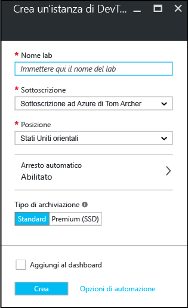

<properties
	pageTitle="Creare un lab in DevTest Labs | Microsoft Azure"
	description="Creare un nuovo lab in DevTest Labs per macchine virtuali"
	services="devtest-lab,virtual-machines"
	documentationCenter="na"
	authors="tomarcher"
	manager="douge"
	editor=""/>

<tags
	ms.service="devtest-lab"
	ms.workload="na"
	ms.tgt_pltfrm="na"
	ms.devlang="na"
	ms.topic="get-started-article"
	ms.date="05/08/2016"
	ms.author="tarcher"/>

# Creare un lab di sviluppo/test di Azure

## Prerequisiti

Per creare un lab sono necessari gli elementi seguenti:

- Una sottoscrizione di Azure. Per altre informazioni sulle opzioni di acquisto di Azure, vedere [come acquistare Azure](https://azure.microsoft.com/pricing/purchase-options/) o [Versione di valutazione gratuita di un mese](https://azure.microsoft.com/pricing/free-trial/). È necessario essere il proprietario della sottoscrizione per creare il lab.
- Gruppo di risorse di Azure per il lab. Vedere [Panoramica di Gestione risorse di Microsoft Azure](../resource-group-overview.md) e [Controllo degli accessi in base al ruolo di Azure](../active-directory/role-based-access-control-configure.md).

## Creare un lab

1. Accedere al [portale di Azure](http://go.microsoft.com/fwlink/p/?LinkID=525040).

1. Fare clic su **Esplora**.

1. Fare clic su **Lab DevTest** dall'elenco.

1. Nel pannello **Lab DevTest** fare clic su **Aggiungi**.

    

1. Nel pannello **Crea lab DevTest**:

    1. Immettere un valore in **Nome lab** per il nuovo lab.
    1. Selezionare la **Sottoscrizione** da associare al lab.
    1. Selezionare un **Percorso ** in cui archiviare il lab.
    1. Fare clic su **Crea**.

    

## Passaggi successivi

Una volta creato il lab, ecco alcuni passaggi successivi da considerare:

- [Proteggere l'accesso a un lab](devtest-lab-add-devtest-user.md).

- [Definire i criteri del lab](devtest-lab-set-lab-policy.md).

- [Creare un modello di lab](devtest-lab-create-template.md).

- [Creare elementi personalizzati per le VM](devtest-lab-artifact-author.md).

- [Aggiungere una VM con elementi a un lab](devtest-lab-add-vm-with-artifacts.md).

<!---HONumber=AcomDC_0511_2016-->